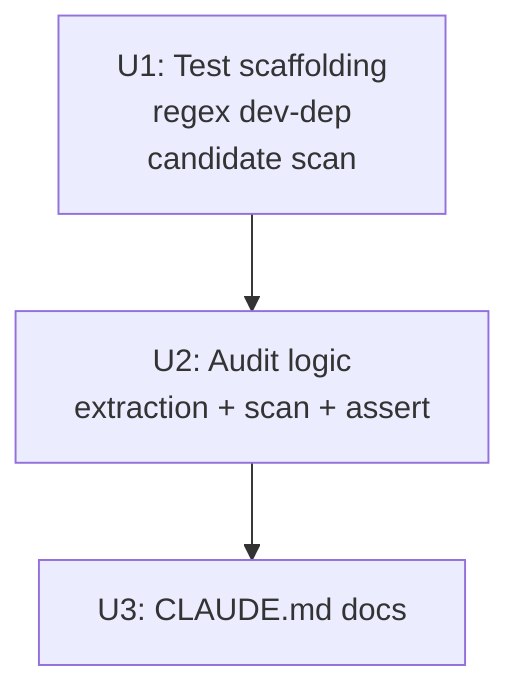

# Combat Registration Audit Test

## Overview

A signature-based `cargo test` audit that walks `src/states/play_match/**/*.rs` for Bevy system functions and asserts each is registered (in `add_core_combat_systems` or `StatesPlugin::build()` or an explicit allowlist). Closes the historical silent-failure bug class structurally — a future contributor cannot add a Bevy system function in `play_match/` without it being registered or explicitly allowlisted, and renaming a registered system without updating its registration is caught.

This plan corresponds to **PR 1 only** from the origin document's Delivery Plan. PR 2 (visual-effect plugin prototype) and PR 3 (migration) were originally scoped as Part B but were deferred during plan review — they re-introduced a previously-rejected idea (R13: macro-driven visual effects) and competed with higher-leverage ideation candidates (idea #2 DamageEvent funnel, idea #3 determinism, idea #7 codegen abilities). Part B is preserved in the origin requirements doc and may return as a separate plan after PR 1 ships and the leverage picture is re-evaluated.

Estimated scope: half a day if the planning-prerequisite candidate scan surfaces zero orphan systems; longer if existing orphans need triage.

## Problem Frame

`add_core_combat_systems()` already provides a single shared entry point for combat systems across graphical and headless modes — but the convention is enforced only by code review, not tooling. Visual effects, separately, are registered by hand with ten documented authoring gotchas and ten fragmented `.add_systems()` blocks in `StatesPlugin::build()`. Both add ongoing carrying cost: every new combat system risks a silent dual-registration bug; every new visual effect re-pays the boilerplate cost from scratch. (See origin: `docs/brainstorms/2026-04-26-system-registration-architecture-requirements.md`.)

This is engine-quality refactor work, not gameplay. Behavior preservation is required.

## Requirements Trace

- **G1 / A1-A6** — Signature-based audit test catches orphan combat systems regardless of name (origin G1).
- **G3 / C1** — All existing `cargo test` passes after the audit lands; no behavioral change from this plan.
- **NG1-NG7** — No `RunMode` tagging, no audit registry, no UI/icon-loader migration, no `.chain()` restructure, no headless-runner changes, no line-count target, no scheduler changes.

Origin G2 (visual-effect plugin), B0-B8a, C2, and B5/B5a are deferred — see "Deferred to Separate Tasks" below.

## Scope Boundaries

- **Non-goals:** RunMode tagging, registration audit registry, UI/icon-loader migration, declarative phase ordering, cross-mode ordering refactor, Bevy version-coupling design, line-count target, scheduler changes (origin NG1-NG7).

### Deferred to Separate Tasks

- **Visual-effect plugin (origin Part B / G2 / B0-B8a / C2)** — preserved in the requirements doc but excluded from this plan. After PR 1 ships, re-evaluate against ideas #2, #3, #7 from the open-ideation doc with a fresh leverage scan. If revisited, a new plan will be drafted; the requirements remain in `docs/brainstorms/2026-04-26-system-registration-architecture-requirements.md`.
- **Seeded determinism** (idea #3 in `docs/ideation/2026-04-26-open-ideation.md`) — prerequisite for statistical regression suite. Independent ideation cycle.
- **Higher-leverage ideation candidates** (idea #2 DamageEvent funnel, idea #4 property tests, idea #5 declarative AI, idea #6 AI trace, idea #7 codegen abilities) — independently motivated, not blocked by this work.

## Context & Research

### Relevant Code and Patterns

- **`src/states/play_match/systems.rs`** (213 lines) — defines `CombatSystemPhase` enum (`#[derive(SystemSet)]`), `configure_combat_system_ordering`, and `add_core_combat_systems<M>(app, run_condition: impl Condition<M> + Clone)`. The single shared core-combat entry point. Sub-phase introduction (B5a) lives here.
- **`src/states/mod.rs::StatesPlugin::build()`** (lines 41-273) — calls `add_core_combat_systems(app, in_state(GameState::PlayMatch))`, then registers ~10 graphical-only visual-effect blocks. Each block follows the same `.after(CombatSystemPhase::CombatResolution).run_if(in_state(GameState::PlayMatch))` shape.
- **`src/states/play_match/rendering/effects.rs`** (1746 lines, ~47 `pub fn`) — visual effect functions paired by lifecycle (spawn / update / cleanup). Reachable from `states/mod.rs` via `pub use rendering::*` chain in `src/states/play_match/mod.rs:53-68` and `src/states/play_match/rendering/mod.rs:10-19`.
- **`src/states/play_match/shadow_sight.rs`** — mixed core/visual: `track_shadow_sight_timer`, `check_orb_pickups`, `cleanup_consumed_orbs` are core combat; `animate_shadow_sight_orbs`, `animate_orb_consumption` are visual-only. The audit must accept both registration paths and the visual-effect migration must NOT pull core systems into the plugin.
- **`PlayMatchEntity` marker** — `src/states/play_match/components/combatant.rs:34`. Cleanup at `src/states/play_match/mod.rs:700` (`cleanup_play_match` runs `Query<Entity, With<PlayMatchEntity>>` → `despawn_recursive` on `OnExit(GameState::PlayMatch)`). Must be attached on every visual-effect spawn — this is what the B1 plugin defaults will encode.
- **Existing Plugin patterns** to mirror: `SettingsPlugin` (`src/settings.rs:180`), `UiPlugin` (`src/ui/mod.rs:19`), `CombatPlugin` (`src/combat/mod.rs:16`), `CameraPlugin` (`src/camera/mod.rs:22`), `AbilityConfigPlugin` (`src/states/play_match/ability_config.rs:389`), `EquipmentPlugin` (`src/states/play_match/equipment.rs:693`), `HeadlessPlugin` (`src/headless/runner.rs:76`). All use `pub struct Foo; impl Plugin for Foo { fn build(&self, app: &mut App) { ... } }`. Generic plugins (`VisualEffectPlugin<T>`) compile cleanly in Bevy 0.15.
- **Test layout convention** — integration tests in `tests/` (e.g., `tests/ability_tests.rs`, `tests/headless_tests.rs`); unit tests in `#[cfg(test)] mod tests` blocks inline in source files. New `tests/registration_audit.rs` follows the integration-test convention.

### Institutional Learnings

- **`docs/solutions/implementation-patterns/adding-visual-effect-bevy.md`** — the canonical 5-step recipe + 10 numbered gotchas (AlphaMode::Add, `Without<T>` filter, `try_insert`, `Res<Time>` not `Time<Real>`, `PlayMatchEntity` marker, headless leak (intentional), shape-named components, emissive 2-4x, chest-height, separate `.add_systems()` blocks). The plugin must encode the **registration-shape** subset of these; body-of-system gotchas remain documented conventions and must be surfaced via rustdoc (B8a).
- **`docs/solutions/implementation-patterns/graphical-mode-missing-system-registration.md`** — names four historical incidents: `process_dispels`, `process_holy_shock_heals`, `process_holy_shock_damage`, `process_divine_shield`. Symptom: `[CAST]` log line present, ability goes on cooldown, but no `[BUFF]/[DMG]/[HEAL]` follow-up entry. Useful as test seeds for Unit 2 (deliberately revert one of these to verify the audit catches it).
- **Headless leak is accepted.** Visual-effect entities accumulate during headless matches because `cleanup_play_match` runs only in graphical mode. Bounded by match duration. Plugin migration must NOT register visual systems in headless — this is the canonical graphical-only set.

### External References

External research skipped — Bevy 0.15 patterns are well-established locally and the work is internal refactor.

## Key Technical Decisions

- **Audit test direction is reversed (signature-based, not name-based).** Walk `play_match/**/*.rs` for `pub fn` items with Bevy system parameter signatures, then assert each appears in a registered set. Catches systems regardless of name (the original `process_*` / `*_system` regex would have missed `update_countdown`, `apply_pending_auras`, `acquire_targets`, `move_projectiles`, `combat_auto_attack`, etc.).
- **`regex` becomes a `[dev-dependencies]` entry**, not a runtime dep. Already in `Cargo.lock` transitively via Bevy, so download cost is nil. Source scanning uses `std::fs::read_to_string` + simple regex parsing — no `syn` AST required.
- **Visual effects are graphical-only by design.** The audit's allowlist (A3) treats them as legitimately registered in `StatesPlugin::build()` only. Distinguishing visual-only systems from "core systems missing from headless" is part of the audit's accepted contract.

## Open Questions

### Resolved During Planning

- **Q1 (Bevy parameter types for system detection):** Detector predicate matches the standard SystemParam set: `Query<>`, `Res<>`, `ResMut<>`, `Commands`, `Local<>`, `EventReader<>`, `EventWriter<>`, `Time` (or `Time<...>`), `Assets<>`, `AssetServer`, `EguiContexts`, `Gizmos`, plus the less-common forms used (or potentially used) by Bevy 0.15: `Trigger<>`, `In<>`, `Single<>`, `Populated<>`, `NonSend<>`, `NonSendMut<>`, `RemovedComponents<>`, `ParamSet<>`. Reference forms `&mut Commands` and `&mut Assets<>` are NOT system params (they appear only in helper signatures). Predicate is documented inline in `tests/registration_audit.rs` so future contributors can extend it when a new SystemParam ships in a Bevy upgrade.
- **Audit candidate scope:** Only `pub fn` items are scanned. Private (`fn`) helpers like `spawn_combatant`, `spawn_pet`, `spawn_gate_bars`, `create_octagon_mesh` — defined in `src/states/play_match/mod.rs` lines 81, 515, 571, 642 — are private and never appear in the candidate set, so they do not need allowlist entries. The allowlist seeds with `pub fn` lifecycle hooks: `setup_play_match`, `cleanup_play_match` (registered via `OnEnter`/`OnExit`, separate from `Update` registrations) and any `pub fn` utilities in `utils.rs`. Final list derived during Unit 2 by running the candidate scan against the current codebase as a planning prerequisite step before PR 1 work begins (see Unit 1 below).

### Deferred to Implementation

- **Whether any orphan systems exist in the current codebase.** Resolved by the planning-prerequisite candidate scan in Unit 1; if orphans surface, they ship as part of PR 1 (with explicit registration fix) or as a separate cleanup PR before PR 1.
- **Exact contents of the allowlist.** Final list derived during Unit 2 from the candidate scan output.

## High-Level Technical Design

> *This illustrates the intended approach and is directional guidance for review, not implementation specification. The implementing agent should treat it as context, not code to reproduce.*

### Part A — Audit Test Shape

```text
For each .rs file under src/states/play_match/**:
    Skip files that are entirely #[cfg(test)] modules
    For each top-level `pub fn IDENT(args) -> ()`:
        If args contain any Bevy-system parameter type AND function is not inside a `mod tests` block:
            Add IDENT to candidate set

For source `src/states/play_match/systems.rs`:
    Locate the body of `pub fn add_core_combat_systems`
    For each identifier passed to `app.add_systems(Update, (...))` calls inside that body:
        Add to core_registered set

For source `src/states/mod.rs`:
    Locate the body of `impl Plugin for StatesPlugin :: fn build`
    For each identifier passed to `app.add_systems(...)` calls inside that body:
        Add to graphical_registered set (note: identifiers may be path-qualified e.g. `play_match::spawn_dispel_visuals`)

Assert each candidate appears in (core_registered ∪ graphical_registered ∪ ALLOWLIST)
For each missing candidate, emit one error line:
    "<function> at <file>:<line> is a system function but is not registered.
     Add to add_core_combat_systems (Both-mode), to StatesPlugin::build (graphical-only),
     or to ALLOWLIST in tests/registration_audit.rs with justification."
```

### Unit Dependency Graph



## Implementation Units

### PR 1 — Part A: Combat Registration Audit Test

- [ ] **Unit 1: Add audit-test scaffolding (regex dev-dep + file skeleton)**

**Goal:** Add `regex` as a dev-dependency and create `tests/registration_audit.rs` with the module skeleton, helper signatures, and an empty test body. No assertion logic yet. **Planning prerequisite:** before this unit begins, run a manual candidate scan over `src/states/play_match/` to enumerate every `pub fn` matching the system-parameter predicate (Q1). Pre-classify each as registered (in `add_core_combat_systems` or `StatesPlugin::build()`) or orphan. If orphans exist, decide whether they ship as part of PR 1 (behavioral change accepted) or as a separate cleanup PR before PR 1. The "half a day" estimate assumes zero orphans; surfaced orphans extend the timeline.

**Requirements:** A1, A6.

**Dependencies:** None.

**Files:**
- Modify: `Cargo.toml` (add `[dev-dependencies]` section with `regex = "1"`).
- Create: `tests/registration_audit.rs` (skeleton with `#[test] fn audit_combat_system_registration()`, helper signatures for `extract_registered_in_function`, `walk_play_match_fns`, `is_system_signature`, plus a placeholder `ALLOWLIST` const).

**Approach:**
- `regex` version pins to `1` (matches Bevy's transitive use; already in `Cargo.lock`).
- Test imports `std::fs`, `std::path::Path`, `regex::Regex`. No imports from the `arenasim` crate itself — test reads source, doesn't link.
- Skeleton compiles with empty body (verifies dev-dep added correctly).

**Patterns to follow:**
- `tests/headless_tests.rs` for the integration-test convention.
- `Cargo.toml` is currently 35 lines, no `[dev-dependencies]` section. Append the new section at the end.

**Test scenarios:**
- Test expectation: none — pure scaffolding. The body is a stub that should compile and exit successfully when run.

**Verification:**
- `cargo test --test registration_audit` compiles and the placeholder test passes.

---

- [ ] **Unit 2: Implement audit logic (extract + scan + assert + allowlist)**

**Goal:** Implement the full signature-based audit. Read `src/states/play_match/systems.rs` and `src/states/mod.rs` to extract registered identifiers; walk `src/states/play_match/**/*.rs` for system-shaped `pub fn` candidates; assert each candidate is registered or allowlisted; emit a precise error message naming each violator and the fix path.

**Requirements:** A1, A2, A3, A4, A6, SC2, SC3.

**Dependencies:** Unit 1.

**Files:**
- Modify: `tests/registration_audit.rs` (full implementation + allowlist + error message).

**Approach:**
- **Core-set extraction:** locate `pub fn add_core_combat_systems` body in `src/states/play_match/systems.rs`. Inside that body, extract all identifiers passed to `app.add_systems(Update, (...))` tuple groups. Strip `play_match::` and module-path prefixes. Result: ~30 system function names.
- **Graphical-set extraction:** locate `impl Plugin for StatesPlugin` → `fn build` body in `src/states/mod.rs`. Inside, extract all identifiers passed to `.add_systems(Update, ...)` (and `.add_systems(OnEnter(...), ...)` / `.add_systems(OnExit(...), ...)` for completeness). Tolerate `play_match::` path qualifiers in the names. Result: ~50+ system function names.
- **Candidate scan:** recursively walk `src/states/play_match/`. For each `.rs` file, strip `#[cfg(test)] mod tests { ... }` blocks before scanning. The scanner must handle multi-line signatures — read entire file content, locate each `pub fn IDENT(` token, then capture the parameter list by scanning balanced parentheses (counting `(` and `)`, accounting for the fact that the `regex` crate does not support balanced-paren matching natively — implement the balancing by hand or use a small character-walking helper). Within the captured parameter list, check for any of the SystemParam tokens listed in Q1 (Open Questions / Resolved): `Query<`, `Res<`, `ResMut<`, `Commands\b` (NOT preceded by `&mut`), `Local<`, `EventReader<`, `EventWriter<`, `Time\b`, `Time<`, `Assets<`, `AssetServer\b`, `EguiContexts\b`, `Gizmos\b`, `Trigger<`, `In<`, `Single<`, `Populated<`, `NonSend<`, `NonSendMut<`, `RemovedComponents<`, `ParamSet<`. Emit candidate as `(name, file_path, line_number)`.
- **Known limitations of regex-based detection:** type aliases that obscure SystemParams (e.g., `type CombatQuery<'w> = Query<'w, ...>;`) and exotic generic lifetime syntax can produce false negatives. These are documented as residual risk; if the codebase adopts such an alias, the predicate is extended.
- **Allowlist:** `const ALLOWLIST: &[(&str, &str)] = &[ ("name", "justification"), ... ]` declared inline. Seeded with `setup_play_match`, `cleanup_play_match`, helper functions discovered during seeding, and any visual-effect functions that are registered indirectly via the future plugin (none yet — the allowlist may grow when Part B lands).
- **Assertion + error message:** for each candidate not in any of the three sets, build a single error message naming the function, the file path with line number, and the fix instructions verbatim from origin A4 wording. Collect all violators, then `panic!` with the full report at end of test (so the user sees every violation in one run, not just the first).

**Patterns to follow:**
- `tests/ability_tests.rs` for assertion error message style — clear, naming the offender, with a path pointer.
- `regex::Regex::new(...).unwrap()` is acceptable in tests (panic on bad regex is a test bug).

**Test scenarios:**
- **Happy path:** Running `cargo test --test registration_audit` against the current codebase passes — every existing system function is in the registered sets or the allowlist.
- **Edge case (allowlist correctness):** A non-system `pub fn` matching the signature predicate but called as a helper (e.g., `spawn_combatant` taking `commands: &mut Commands`) is in the allowlist with a one-line justification.
- **Edge case (test-block exclusion):** A `pub fn` defined inside `#[cfg(test)] mod tests { ... }` is NOT flagged as a candidate. Verified by grepping the candidate set against known test-block contents.
- **Edge case (re-export aware):** A system registered as `play_match::spawn_dispel_visuals` in `states/mod.rs` is correctly identified as registered for `spawn_dispel_visuals` defined in `rendering/effects.rs`.
- **Error path (rename without registration update):** Temporarily rename `process_dispels` to `apply_dispels` in `src/states/play_match/effects/dispels.rs` (without updating `add_core_combat_systems`). Run the audit. Test fails with an error message naming `apply_dispels`, the file path, line number, and the three fix paths. Revert the rename.
- **Error path (orphan after registration removal):** Temporarily comment out `process_divine_shield` from the `add_core_combat_systems` tuple. Run the audit. Test fails naming `process_divine_shield` as an orphan. Revert.
- **Edge case (multiple violators in one run):** Seed two violators simultaneously (rename one + remove one from registration). Verify the error message names BOTH, not just the first.

**Verification:**
- `cargo test --test registration_audit` passes with the current code.
- Deliberately seeding the two error-path scenarios above causes the test to fail with the expected messages.
- The error message contains the three fix instructions verbatim from origin A4.

---

- [ ] **Unit 3: Document the convention in CLAUDE.md**

**Goal:** Add a paragraph (or new "Adding a New Combat System" subsection) to `CLAUDE.md` pointing at `tests/registration_audit.rs` and explaining when each registration path is correct.

**Requirements:** A5.

**Dependencies:** Unit 2.

**Files:**
- Modify: `CLAUDE.md` (add subsection under "Common Tasks" or before the existing "Class Design" section).

**Approach:**
- Document the three registration paths: `add_core_combat_systems` (Both-mode), `StatesPlugin::build()` (graphical-only), allowlist (non-system helpers).
- Brief example showing how to add a new combat system to `add_core_combat_systems`.
- Brief example showing when a function should be allowlisted (helper that takes Bevy params but is called manually, not registered).
- One sentence noting the test runs in CI via `cargo test`.

**Patterns to follow:**
- The "Adding a New Ability" / "Adding a New Item" subsections in `CLAUDE.md` for tone, format, and depth.

**Test scenarios:**
- Test expectation: none — documentation only.

**Verification:**
- `CLAUDE.md` reads cleanly and the registration-audit subsection is locatable from the existing table of contents (or is added there).

---

### Deferred Units (Part B, not in this plan)

The original plan included four additional units (B0 prototype, plugin API + sub-set, migrate all visuals, docs + eyeball check). These are deferred per the Overview decision and preserved in the origin requirements doc for a future plan. The remainder of this section is intentionally not included.

<!-- Original Units 4-7 deferred. The full text remains in plan history (git) and in the origin requirements doc.

- [ ] **Unit 4 (DEFERRED): Prototype three Plugin API shapes against healing light columns**

**Goal:** Implement healing light columns under each of three candidate API shapes — (i) per-effect `impl Plugin for HealingLightPlugin`, (ii) generic `VisualEffectPlugin<T: VisualEffect>` driven by an associated-type trait, (iii) builder helper `register_visual_effect(app, ...)`. Verify each compiles, composes with `IntoSystemConfigs<Marker>`, and produces the same runtime behavior as the current registration. Pick the winning shape and update the requirements doc with the decision.

**Requirements:** B0, Q3 resolution, SC1 enablement.

**Dependencies:** PR 1 merged (so the audit test guards Unit 5+).

**Files:**
- Create (temporary, to be replaced in Unit 5): scratch branches/spike files exploring each shape. Approximate locations:
  - `src/states/play_match/visual_effect/proto_a_per_plugin.rs` (per-effect Plugin)
  - `src/states/play_match/visual_effect/proto_b_generic.rs` (generic `VisualEffectPlugin<T>`)
  - `src/states/play_match/visual_effect/proto_c_builder.rs` (builder helper)
- Modify: `docs/brainstorms/2026-04-26-system-registration-architecture-requirements.md` (record the chosen shape under B1 with a brief rationale; update "Session Log").

**Approach:**
- Each prototype migrates only `spawn_healing_light_visuals` + `update_healing_light_columns` + `cleanup_expired_healing_lights` (the cleanest existing trio in `rendering/effects.rs`).
- Verify each compiles and runs by building and running one graphical match against each prototype branch; confirm healing column visuals appear identically.
- Compare on:
  1. **Caller-side ergonomics** — how short and declarative is the registration site in `StatesPlugin::build()`?
  2. **Override expressiveness** — can the prototype express B5's `SystemSet`-based override (e.g., `CombatSystemSubPhase::ProjectileSpawning`)?
  3. **Compound effect support** — can the prototype handle 2+ spawn systems / 2+ update systems for compound effects like `UA glow + backlash burst`?
  4. **Tuple-size resilience** — when 14+ effects are registered, does the API naturally avoid Bevy's 20-element `IntoSystemConfigs` tuple limit?
- Pick the winning shape. Document the choice and rationale in the requirements doc and below in the plan's Session Log via a follow-up edit. (Discoverability is addressed by B8a's rustdoc requirement during Unit 5, not as a prototype-selection criterion — none of the three prototypes will have full rustdoc at this stage, so it cannot differentiate.)

**Patterns to follow:**
- Existing Plugin patterns (`AbilityConfigPlugin` at `src/states/play_match/ability_config.rs:389`, `EquipmentPlugin` at `src/states/play_match/equipment.rs:693`) for proto-A.
- The repo-research finding that Bevy 0.15 supports `impl<T: VisualEffect> Plugin for VisualEffectPlugin<T>` with `Component`-derived markers as `T` for proto-B.

**Test scenarios:**
- **Happy path:** All three prototypes compile against the current Bevy 0.15 + `IntoSystemConfigs<Marker>` API.
- **Happy path:** All three produce identical visual output for healing light columns in a representative match (manual check).
- **Edge case (override expressiveness):** Each prototype is asked to express a non-default `SystemSet` override. At least one fails or becomes awkward; this is the deciding signal for B5/B5a.
- **Edge case (compound shape):** Each prototype is asked to register the equivalent of "2 spawn + 1 update + 1 cleanup" (a compound-shape sketch). Whichever option requires the least ceremony wins on B1's expanded shape.
- Test expectation for code: this is exploration. Existing tests must continue to pass on whichever branch becomes the winning prototype before merging.

**Verification:**
- The chosen API shape is recorded in the requirements doc under B1 with a 1-2 sentence rationale.
- The two losing prototypes are deleted (`git rm`); the winning one is merged into Unit 5's starting point.
- A graphical run with the winning prototype shows healing light columns rendering correctly.

---

### PR 3 — Part B Migration: Implement and Migrate

- [ ] **Unit 5: Implement chosen VisualEffectPlugin API + ProjectileSpawning sub-set**

**Goal:** Implement the chosen plugin API surface (from Unit 4) as the production module. Introduce `CombatSystemSubPhase::ProjectileSpawning` as a new SystemSet inside `CombatAndMovement`. Encode the registration-shape defaults from origin B1 (default phase, default run condition, `PlayMatchEntity` cleanup marker) and the rustdoc warnings from origin B8a (body-of-system gotchas).

**Requirements:** B1, B2, B5, B5a, B6, B8a, SC1.

**Dependencies:** Unit 4 (chosen API shape).

**Files:**
- Create: `src/states/play_match/visual_effect/mod.rs` (or whatever module name fits the chosen shape — the module replaces the prototype scratch files).
- Modify: `src/states/play_match/systems.rs` (add `CombatSystemSubPhase` enum or extend `CombatSystemPhase`; configure ordering inside `configure_combat_system_ordering` so `ProjectileSpawning` sits between `process_casting` and `move_projectiles`).
- Modify: `src/states/play_match/mod.rs` (add `pub mod visual_effect;` and re-export if needed).
- Test: `tests/visual_effect_plugin_tests.rs` (unit tests for the plugin's defaults — phase placement, run condition, cleanup marker attachment).

**Approach:**
- API takes N spawn / M update / K cleanup systems per effect (B1 expanded shape) — supports compound effects (UA glow + backlash burst, traps with three lifecycle phases) and self-expiring effects (floating combat text with no separate cleanup).
- Override API takes `impl SystemSet` references only, never function symbols (B5).
- Default cleanup-marker behavior: a helper `commands.spawn_visual(...)` (or equivalent on the plugin's chosen API) automatically inserts `PlayMatchEntity`. Spawn systems opt out only via an explicit override.
- Rustdoc on the public API: comprehensive doc-comment listing the body-of-system gotchas (`AlphaMode::Add` not `Blend`, `Res<Time>` not `Time<Real>`, `try_insert` not `insert`, `Without<T>` filter, chest-height) with an explicit "this plugin does NOT enforce these" header and a link to `docs/solutions/implementation-patterns/adding-visual-effect-bevy.md`.

**Patterns to follow:**
- `CombatSystemPhase` definition + `configure_combat_system_ordering` body in `src/states/play_match/systems.rs` for the sub-set introduction.
- Existing Bevy `Plugin::build` pattern from the six existing plugins.
- Rustdoc style from `src/states/play_match/abilities.rs` (canonical doc-comments in the project).

**Test scenarios:**
- **Happy path:** Registering one effect via the new API places its update system after `CombatSystemPhase::CombatResolution` by default. Verification stub: build a minimal `App` with `MinimalPlugins`, a `Local<u64>` counter resource, and three tagged systems (one in `CombatResolution`, one registered via the new plugin, one fixed reference). Run the schedule once. Assert the plugin's system observed the post-`CombatResolution` counter value. (`Schedule::graph()` introspection is not stable public API in Bevy 0.15; the counter-stub approach is the supported verification path.)
- **Happy path:** The default run condition gates execution on `GameState::PlayMatch` (verified by stub-state test where the plugin's spawn system runs only after `NextState::set(GameState::PlayMatch)`).
- **Happy path:** A spawn system that uses the plugin's `spawn_visual` helper produces an entity with `PlayMatchEntity` attached.
- **Edge case (compound shape):** A plugin registered with 2 spawn + 2 update + 0 cleanup systems compiles and registers all four systems with the correct phase placement.
- **Edge case (override):** A plugin registered with `VisualEffectOrdering::CustomSet(CombatSystemSubPhase::ProjectileSpawning)` runs inside `CombatAndMovement`, between `process_casting` and `move_projectiles`. Verified by run-order test in graphical mode.
- **Edge case (rustdoc presence):** Code review during PR validates the plugin API's doc-comment includes the body-of-system gotchas list with the "this plugin does NOT enforce" header and the link. (No automated test — fragile keyword-presence checks couple tests to comment wording; the doc-comment is short enough for review to verify.)

**Verification:**
- New `tests/visual_effect_plugin_tests.rs` passes.
- `tests/registration_audit.rs` continues to pass — see "Audit interaction with plugin-registered systems" in System-Wide Impact for how the audit recognizes plugin-managed functions (resolved before this unit ships).
- If `CombatSystemSubPhase::ProjectileSpawning` is introduced (B0 conditional outcome), it sits between `process_casting` and `move_projectiles` in the schedule. If the chosen API supports inline `.after()/.before()` overrides against existing `CombatSystemPhase` variants, no new sub-phase is added.
- Plugin API doc-comment surfaces the body-of-system gotchas with "this plugin does NOT enforce" framing (verified during code review).

---

- [ ] **Unit 6: Migrate all visual effects to the new plugin**

**Goal:** Produce the effect-to-function mapping table (origin B3 prerequisite), then migrate every graphical-only visual effect currently in `StatesPlugin::build()` to the new `VisualEffectPlugin` API. Replace the ~10 fragmented `.add_systems()` blocks with `app.add_plugins((...))` calls. Game-state systems (`check_match_end`, `trigger_death_animation`, `update_victory_celebration`, `update_speech_bubbles`, `update_stealth_visuals`) stay in their current registration form.

**Requirements:** B3, B4, B7, SC1.

**Dependencies:** Unit 5.

**Files:**
- Create: short mapping table at the top of `src/states/play_match/visual_effect/mod.rs` (or as a comment block in the migration commit message) listing each logical effect → its spawn/update/cleanup functions → their source files. Used as the migration checklist.
- Modify: `src/states/mod.rs` (replace ~10 fragmented `.add_systems()` blocks with `app.add_plugins((...))` calls).
- Create or modify per-effect plugin definitions (count and structure depend on chosen API shape from Unit 4 — likely 14-17 small definition blocks):
  - `HealingLightVisuals`, `DispelBurstVisuals`, `UAGlowVisuals`, `BacklashBurstVisuals`, `DrainLifeVisuals`, `TrapVisuals`, `IceBlockVisuals`, `SlowZoneVisuals`, `DisengageTrailVisuals`, `ChargeTrailVisuals`, `PolymorphVisuals`, `FlameParticleVisuals`, `ShadowSightOrbVisuals`, `ShieldBubbleVisuals`, `SpellImpactVisuals`, `FloatingCombatTextVisuals`, `ProjectileVisuals` (the last using the `ProjectileSpawning` sub-set override).
- Modify: `tests/registration_audit.rs` (update allowlist if needed — the new plugins register systems indirectly, which the audit should accept; verify the audit still names function-level violations correctly).

**Approach:**
- **Step 1: Mapping table** — produce the `pub fn` → effect mapping for all ~50 effect functions in `rendering/effects.rs` and the 2 visual functions in `shadow_sight.rs`. Distinguish from the ~3 core combat functions in `shadow_sight.rs` that stay in `add_core_combat_systems`. Produce this BEFORE touching any registration code.
- **Step 2: Game-state systems carved out** — `check_match_end`, `trigger_death_animation`, `animate_death`, `update_victory_celebration`, `update_speech_bubbles`, `update_stealth_visuals` stay where they are (in `StatesPlugin::build()` as a single `.add_systems()` block — they affect game state, not visuals).
- **Step 3: Migrate effects in increasing complexity order** — start with healing light columns (already done in Unit 4 via the prototype winner), then dispel burst, then UA glow + backlash, then projectile visuals (exercises the override path), then drain life, etc. Each effect is a small independent commit OR all migrated at once depending on Unit 4's API ergonomics.
- **Step 4: Replace registration in `StatesPlugin::build()`** — incrementally remove the ~10 fragmented `.add_systems()` blocks; replace with one or two `app.add_plugins((...))` calls covering all effects. Bevy's `add_plugins` 20-tuple limit may force two grouping calls; that's acceptable.
- **Step 5: Verify with the audit test** — `cargo test --test registration_audit` should continue to pass throughout migration. If a function disappears from `StatesPlugin::build()` but has not yet been added to the new plugin chain, the audit catches it as an orphan.

**Patterns to follow:**
- Per-effect plugin definitions follow the existing six Plugin patterns in the codebase.
- Mapping table follows the `assets/config/abilities.ron` style — a clean structured list, easy to diff.

**Test scenarios:**
- **Happy path:** All existing tests pass after migration (`cargo test`).
- **Integration:** `cargo test --test registration_audit` passes after each per-effect migration (verifies no orphan systems).
- **Integration:** A debug print (or a new lightweight test) shows the order of registered systems for one example effect — confirms the new plugin places spawn before update before cleanup, all after `CombatSystemPhase::CombatResolution`.
- **Edge case (compound effect):** UA glow + backlash burst migrates to a single plugin with 2 spawn + 1 update + 2 cleanup (exact counts depend on existing structure) and continues to render correctly.
- **Edge case (override):** Projectile visuals migrate to use `CombatSystemSubPhase::ProjectileSpawning` and `spawn_projectile_visuals` runs between `process_casting` and `move_projectiles` in graphical mode (verified by inspecting log timing or by manual graphical match — projectile visuals must spawn before the projectile body moves).
- **Edge case (game-state systems carved out):** `check_match_end` and the four other game-state systems remain in their non-plugin registration block in `StatesPlugin::build()`. The audit accepts them. They are NOT migrated to the visual-effect plugin.
- **Edge case (PlayMatchEntity attachment):** Every effect entity spawned via the new plugin's spawn helper has `PlayMatchEntity`. Verified post-migration by a test that runs a full match and asserts that on `OnExit(GameState::PlayMatch)`, all visual-effect entities are despawned.

**Verification:**
- `cargo test` passes (all existing tests).
- `cargo test --test registration_audit` passes.
- `StatesPlugin::build()` now uses `app.add_plugins((...))` for visuals; the ~10 fragmented `.add_systems()` blocks are replaced by 1-2 plugin-grouping calls.
- A representative graphical match runs without visual regression (full check happens in Unit 7).

---

- [ ] **Unit 7: Update visual-effect docs and run manual eyeball verification (C2)**

**Goal:** Update `docs/solutions/implementation-patterns/adding-visual-effect-bevy.md` to make the new plugin API the canonical authoring path, retaining the body-of-system gotchas as conventions and noting which gotchas are now enforced as defaults. Run the C2 manual eyeball check across every migrated visual.

**Requirements:** B8, C1, C2, C3.

**Dependencies:** Unit 6.

**Files:**
- Modify: `docs/solutions/implementation-patterns/adding-visual-effect-bevy.md` (canonical authoring path is now the plugin; retain gotchas as conventions; mark which are now enforced; link to `tests/registration_audit.rs` and to the plugin's rustdoc).
- Modify: `CLAUDE.md` (reference the new plugin under "Adding a New Ability" or a new "Adding a New Visual Effect" subsection).
- Modify: `MEMORY.md` (update the Visual Effects Pattern entry to point at the new plugin as the canonical entry point).

**Approach:**
- Documentation update follows the format already used in `adding-visual-effect-bevy.md` — a 5-step recipe pointing at the new plugin API plus the retained 10-gotchas list with annotations marking which are now structural defaults vs. authoring conventions.
- C2 manual eyeball check covers every visual touched by Unit 6: gate animation, all four resource bars, floating combat text, dispel burst, drain-life beam, hunter trap (placement + arming + trigger + burst), frozen target with ice block, polymorphed cuboid, UA glow + backlash burst, healing light columns, disengage trail, charge trail, slow zone disc, flame particles, shadow sight orbs (pulsing + consumption), shield bubbles, spell impact effects, death animation, victory celebration. Reviewer runs at least three matches covering different class compositions to exercise all visuals.
- Capture the C2 check as a one-paragraph note in the PR description (or as a comment in the plan's Session Log via a follow-up edit) — list "passed" or "regression seen at <visual>" per effect.

**Patterns to follow:**
- Existing structure of `adding-visual-effect-bevy.md`.
- The "Common Tasks" subsection pattern in `CLAUDE.md`.

**Test scenarios:**
- Test expectation: none — documentation + manual verification only. Behavior preservation is verified by `cargo test` (Unit 6) plus C2 eyeball check (this unit).

**Verification:**
- `cargo test` passes.
- Every visual effect listed in C2 has been seen in a representative graphical match and confirmed visually identical to pre-migration behavior.
- `adding-visual-effect-bevy.md` reflects the new canonical authoring path; the body-of-system gotchas list is retained with annotations.

-->

## System-Wide Impact

- **Interaction graph:** The audit test is read-only — it scans source, doesn't touch runtime. No system bodies, registration sites, or runtime behavior change.
- **Error propagation:** No new error paths. Audit test failures are `cargo test` panics with a clear message.
- **State lifecycle risks:** None — no runtime change.
- **API surface parity:** No external API changes. `add_core_combat_systems` signature is unchanged.
- **Integration coverage:** Existing `cargo test` suite + new `tests/registration_audit.rs`.
- **Unchanged invariants:** `add_core_combat_systems` body, `CombatSystemPhase` enum, `HeadlessPlugin`, all class AI files, all combat_core systems, all RON config files, all gameplay behavior. The headless runner's `add_core_combat_systems(app, || true)` call site at `src/headless/runner.rs:102` is unchanged. `StatesPlugin::build()` is unchanged (it does not gain or lose any `.add_systems()` calls).
- **Future-Part-B consideration:** If Part B is later revived as a separate plan, the audit's registered-set extraction will need to walk `impl Plugin for X` bodies for any per-effect plugins introduced. Today (PR 1 only) the two-location extraction is sufficient.

## Risks & Dependencies

| Risk | Mitigation |
|------|-----------|
| Audit regex misclassifies a `pub fn` as a system (false positive) | Allowlist (A3) accepts each false positive with a one-line justification; CI failure is loud and fixable in one line |
| Audit regex misses a system (false negative) — e.g., a system whose only Bevy param is a custom alias type, multi-line edge case the parser doesn't handle, or a SystemParam form not yet in the predicate | Detector predicate covers the standard Bevy 0.15 SystemParam set; planning-prerequisite candidate scan in Unit 1 cross-checks against actual `add_core_combat_systems` registrations to validate coverage; if a new SystemParam shape emerges in a future Bevy upgrade, the predicate is extended |
| Planning-prerequisite candidate scan surfaces existing orphan systems | If found, fix the orphan registrations in PR 1 (accepting that PR 1 ships behavioral changes) or split into a cleanup PR before PR 1; either way the orphans get fixed before the audit lands as the new contract |
| Allowlist grows large over time and dilutes audit signal | Each entry requires a one-line justification; periodic review during code review catches drift |

## Documentation / Operational Notes

- `CLAUDE.md` updated in Unit 3 (audit convention).
- No `MEMORY.md` or `docs/solutions/implementation-patterns/adding-visual-effect-bevy.md` updates this round — those were Part B concerns.
- No deployment/rollout/monitoring changes — internal refactor on a single-player simulator. The audit only adds a `cargo test`; runtime behavior is unchanged.
- No feature flag needed.

## Sources & References

- **Origin document:** [docs/brainstorms/2026-04-26-system-registration-architecture-requirements.md](../brainstorms/2026-04-26-system-registration-architecture-requirements.md)
- **Ideation context:** [docs/ideation/2026-04-26-open-ideation.md](../ideation/2026-04-26-open-ideation.md)
- Related code:
  - `src/states/play_match/systems.rs` (`add_core_combat_systems`, `CombatSystemPhase`)
  - `src/states/mod.rs` (`StatesPlugin::build()`)
  - `src/states/play_match/rendering/effects.rs` (~50 visual effect functions)
  - `src/states/play_match/shadow_sight.rs` (mixed core/visual)
  - `src/states/play_match/components/combatant.rs:34` (`PlayMatchEntity`)
- Related institutional learnings:
  - `docs/solutions/implementation-patterns/adding-visual-effect-bevy.md`
  - `docs/solutions/implementation-patterns/graphical-mode-missing-system-registration.md`
- External docs: none used (Bevy 0.15 patterns are well-established locally)
