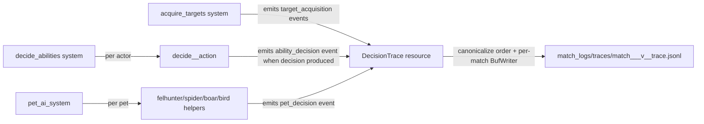
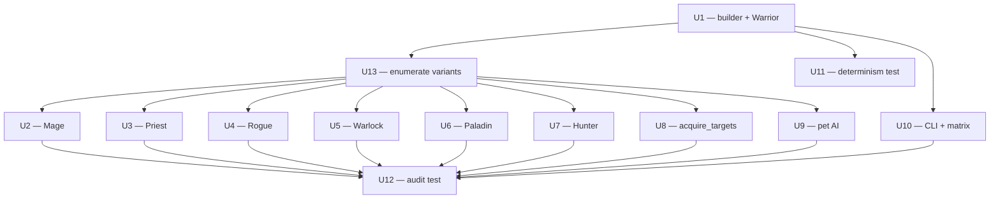

# feat: AI Decision Trace — Phase 1

Phase 1 of the AI decision-trace work from the May 2026 ideation set (item #7). Adds a JSONL decision trace covering ability picks, target acquisition, and pet AI; instruments all 7 class AIs plus the shared dispatch, target-acquisition, and pet-AI systems; integrates with both single-match (`--trace-mode on`) and matrix (default-on) modes.

Phase 2 (F-key egui overlay) is intentionally a separate plan and is not addressed here. See origin for phasing rationale.

---

## Problem Frame

When a matchup looks broken in the matrix baseline (Hunter at 7% true winrate, Paladin > Rogue at 100%/100%, healer mirrors stalling), today's instruments answer *what was cast* but not *what was considered and rejected*. `info!()` logs and `CombatLog` only surface chosen actions; rejection logic is implicit in the if-chains inside `src/states/play_match/class_ai/*.rs`. Diagnosis devolves into adding throwaway `info!()` lines and recompiling.

The fix is a structured per-decision JSONL stream that records, for each AI tick that produces a decision: who decided, what they targeted, what abilities they considered, and a typed rejection reason (with numeric context) for each candidate that lost. Same shape for target picks and for pet AI. Pairs with the matrix runner: the trace for any given seed is on disk after the matrix run completes, with the matchup embedded in the filename, so the diagnostic loop becomes `jq` rather than recompile-and-replay.

---

## Requirements (from origin)

- **R1.** Emit one decision event per actor per AI tick **that produces a decision** inside `decide_<class>_action`, listing all candidates with `Chosen | Rejected { reason }` status. Skip frames where the actor is on GCD with no decision pending, incapacitated, or otherwise short-circuited before predicate evaluation. *(origin: Scope → In scope → Ability decisions; emission gate refined per doc-review D5)*
- **R2.** Emit one decision event per actor per `acquire_targets` tick, scoring each enemy candidate with a `TargetRejectionReason`. *(origin: Scope → Target acquisition)*
- **R3.** Emit one decision event per pet per `pet_ai_system` dispatch (covering Felhunter, Spider, Boar, Bird helpers), same shape as R1 with `owner` and `pet_type` fields. *(origin: Scope → Pet AI decisions; entry point corrected per doc-review D4)*
- **R4.** Closed `RejectionReason` enum with structured variant payloads (`OutOfRange { distance, max }`, `OnCooldown { remaining }`, `InsufficientMana { have, need }`, `WithinDeadZone { distance, min }`, etc.). Variant set locked via a front-loaded predicate enumeration pass (U13) before any class instrumentation lands. Mirror audit test enforces variant coverage. *(origin: Scope → Reason taxonomy; front-load discipline per doc-review D9)*
- **R5.** Three modes via single `--trace-mode <off|on|verbose>` flag. `on` ships minimal payload (actor + target view + reason codes); `verbose` adds full aura lists on actor and target plus all alive enemies with position/hp/aura. *(origin: Scope → Two detail modes; CLI shape simplified per doc-review D1)*
- **R6.** Headless single-match: `--trace-mode on` (or `verbose`) emits to `match_logs/match_<timestamp>_trace.jsonl`. Default: `off`. *(origin: Scope → Trace emission → Headless single match)*
- **R7.** Headless matrix: default `on`; writes one file per match to `match_logs/traces/match_<seed>_<class1>_v_<class2>_trace.jsonl` (matchup embedded so `ls` and tab-completion are useful at large N). `--trace-mode off` opts out. *(origin: Scope → Trace emission → Headless matrix; filename shape per doc-review F3)*
- **R8.** Determinism preserved: a single-match run with `--trace-mode on` must produce byte-identical `MatchResult` AND byte-identical trace file vs. another run at the same seed. Events are sorted by `(frame, actor.entity_id, kind)` before flush to canonicalize order. *(origin: Explicit non-goals + Success criteria #4; trace-file byte-equality added per doc-review F1)*
- **R9.** New ability added per CLAUDE.md's "Adding a New Ability" checklist requires zero trace-specific changes. *(origin: Success criteria #5)*
- **R10.** Matrix mode `--matrix 100` with trace on shows no more than 2× slowdown vs `--trace-mode off`, given R1's emission-gating (events only when a decision is produced, not every frame). *(origin: Success criteria #6; budget tied to emission gate per doc-review D5)*

---

## Scope Boundaries

### In scope (Phase 1)

- `DecisionTrace` builder, `RejectionReason` + `TargetRejectionReason` enums, JSONL writer system.
- Predicate enumeration pass to lock the initial variant set before class instrumentation (U13).
- Instrument all 7 class AIs (`warrior`, `mage`, `priest`, `rogue`, `warlock`, `paladin`, `hunter`).
- Instrument `acquire_targets` in `src/states/play_match/combat_ai.rs` (extracting the inline scoring closure into a named helper).
- Instrument `pet_ai_system` plus its four pet helpers (`felhunter_ai`, `spider_ai`, `boar_ai`, `bird_ai`).
- CLI: single `--trace-mode <off|on|verbose>` flag wired through `src/cli.rs` and `src/headless/{runner,matrix}.rs`.
- Matchup-embedded filename for matrix traces.
- Determinism integration test (extends PR #48's `seeded_matches_are_deterministic`) asserting MatchResult AND trace-file byte-equality.
- Reason-enum coverage audit test exercising all 7 classes and all 4 pet types.

### Out of scope (deferred for later)

- F-key egui overlay — see origin doc, will become Phase 2.
- Movement/positioning decisions (not in `decide_<class>_action`).
- Trace-driven replay (determinism + seed already gives this).
- Cross-frame aggregation tools beyond what `jq` provides.

### Deferred to Follow-Up Work

- Convert ideation #14 (`--matrix --diff baseline.csv`) to consume the trace for per-cell diagnosis hints. *Not from origin — surfaced as adjacent opportunity; do not pick up as scope without separate planning.*
- System-registration architecture refactor (ideation #1) — the trace writer adds one more system to the dual-registration set; we follow the existing convention rather than fold in the refactor.

### Outside this product's identity

(none — observability tooling for a single-developer arena sim is straightforwardly in-bounds.)

---

## Key Technical Decisions

1. **`DecisionTrace` is a Bevy `Resource`, not a threaded mutable reference.** Mirrors how `CombatLog` is plumbed today: `decide_abilities` takes `ResMut<DecisionTrace>` and passes `&mut decision_trace` to each `decide_<class>_action`. Keeps the existing dispatch shape unchanged. *(see origin: Dependencies)*

2. **Per-match files with matchup-embedded filenames in matrix mode.** `match_logs/traces/match_<seed>_<class1>_v_<class2>_trace.jsonl` makes `ls`/tab-completion useful at 4,900 files and turns "find a Hunter v Warrior trace" into a glob rather than a CSV cross-reference. *(plan-time call-out for per-match locked; filename shape per doc-review F3)*

3. **Closed `RejectionReason` enum, audit-tested, variants locked via front-loaded enumeration (U13).** Adding a variant requires both a code change and an `expected_reasons` audit-test pass. Variants carry the relevant numbers (`OutOfRange { distance, max }`, `WithinDeadZone { distance, min }`), so `jq '.candidates[].reason.OnCooldown.remaining > 5.0'` works. The front-load discipline catches Hunter dead-zone, pet-specific, and other class-specific variants before they ship as `OutOfRange` impostors. *(per doc-review D7 + D9)*

4. **JSONL writer flushes per match, driven by an explicit call in `run_headless_match_with` plus a defensive `Drop` impl.** A `BufWriter<File>` accumulates events for the duration of one match. Flush happens explicitly after `match_complete=true` and before `MatchResult` is read; the `Drop` impl on `TraceWriter` is a safety net in case the explicit call is missed. `OnExit(PlayMatch)` is NOT used as the flush trigger — the headless runner never transitions out of that state, so an `OnExit`-gated flush would silently lose every trace in headless mode. *(per doc-review D6)*

5. **Emission is gated on "tick produces a decision," not "tick runs."** A frame where the actor is on GCD, incapacitated, or short-circuited before predicate evaluation does not emit. This bounds matrix-mode event volume to roughly the count of actual decisions (estimated 1.5K-3K per match, not 15K-30K), preserves the 2× R10 budget, and matches the diagnostic question: "what did the AI decide?", not "what did each frame look like?". *(per doc-review D5)*

6. **Single enum-valued `--trace-mode` flag.** `--trace-mode <off|on|verbose>` replaces three boolean flags from the brainstorm wording. Eliminates precedence ambiguity by construction; one help-text line documents behavior; matrix mode defaults to `on`, single-match defaults to `off`. *(per doc-review D1)*

7. **No new RNG draws, no state mutation, canonical event ordering before flush.** Trace builder is read-only against `CombatContext` and the in-flight predicate values. Reason codes carry only what predicates already computed. Events are sorted by `(frame, actor.entity_id, kind)` immediately before serialization to make trace-file output deterministic across runs even if intermediate query iteration order varies. Determinism integration test asserts MatchResult AND trace-file byte-equality. *(per doc-review F1)*

8. **`DecisionTrace` flush system registered in BOTH dual paths.** Per `tests/registration_audit.rs`, the writer flush system lands in both `add_core_combat_systems` (headless) and `StatesPlugin::build` (graphical). The audit test fails the build if we forget.

---

## High-Level Technical Design

*This illustrates the intended approach and is directional guidance for review, not implementation specification. The implementing agent should treat it as context, not code to reproduce.*

### Event shape (directional, snake_case JSON)

```
{
  "frame": 1842,
  "sim_time": 30.7,
  "seed": 42,
  "kind": "ability_decision" | "target_acquisition" | "pet_decision",
  "actor": { "entity_id", "team", "slot", "class", "hp_pct", "mana_pct", "position": [x,y,z] },
  "target": { "entity_id", "class", "hp_pct", "distance" }?,
  "candidates": [
    { "ability": "Frostbolt", "status": "chosen" },
    { "ability": "FrostNova", "status": "rejected", "reason": { "OutOfRange": { "distance": 35.0, "max": 12.0 } } }
  ],
  "outcome": { "action_taken": { "ability": "Frostbolt", "target_id": 47, "was_instant": false } }
}
```

`target_acquisition` swaps `candidates` for a scored enemy list; `pet_decision` adds `owner: entity_id` and `pet_type`.

### Flow (one tick)



### Builder API surface

`DecisionTrace` exposes two builder paths into the writer:

- `start_ability_decision(actor, target)` returns a `DecisionEventBuilder` with `.reject(ability, reason)`, `.choose(ability)`, and `.finish(outcome)` methods. Class AI calls `.reject(...)` at each predicate that gates a cast and `.choose(...)` on the winning branch.
- `start_target_acquisition(actor, previous_target)` returns a builder with `.score(enemy, score)`, `.reject(enemy, reason)`, and `.finish(new_target)`.

Verbose mode is a flag on the builder; when set, `finish` snapshots `CombatContext` state into the event before serializing.

---

## Output Structure

New files (target paths, repo-relative):

```
src/
  states/play_match/
    decision_trace/
      mod.rs                # DecisionTrace Resource, Plugin
      builder.rs            # DecisionEventBuilder, TargetEventBuilder
      events.rs             # DecisionEvent, RejectionReason, TargetRejectionReason enums
      writer.rs             # JSONL BufWriter wiring + flush system
  cli.rs                    # (modified) +trace-mode flag
  headless/
    runner.rs               # (modified) wire trace-mode into MatchState; explicit flush call
    matrix.rs               # (modified) default-on tracing → match_logs/traces/; matchup-embedded filename

tests/
  registration_audit.rs     # (existing — auto-picks up new flush system)
  decision_trace_audit.rs   # NEW — RejectionReason exhaustiveness audit (U12)
  headless_tests.rs         # (existing, extended) trace-on vs trace-off byte-equality (U11)
```

The summary above is illustrative. Per-unit `**Files:**` sections below are authoritative for what each unit creates or modifies.

---

## Implementation Units

### U1. Trace builder, reason enums, writer, and Warrior instrumentation (template)

**Goal:** Stand up the full trace plumbing — `DecisionTrace` Resource, event/reason enums (initial draft), JSONL writer, builder API — and prove the pattern by instrumenting `decide_warrior_action` end-to-end.

**Requirements:** R1 (Warrior subset), R4 (initial draft — finalized in U13), R6, R8.

**Dependencies:** none.

**Files:**

- `src/states/play_match/decision_trace/mod.rs` (new) — `DecisionTrace` Resource, Bevy `Plugin`, public re-exports.
- `src/states/play_match/decision_trace/events.rs` (new) — `DecisionEvent`, `EventKind`, `RejectionReason`, `TargetRejectionReason`, `ActorView`, `TargetView`, `CandidateOutcome` types. All `#[derive(serde::Serialize)]`. Initial `RejectionReason` set includes `WithinDeadZone { distance, min }` from the start.
- `src/states/play_match/decision_trace/builder.rs` (new) — `DecisionEventBuilder` + `TargetEventBuilder` (start/reject/choose/finish API). Builder no-ops when `DecisionTrace.writer` is `None`.
- `src/states/play_match/decision_trace/writer.rs` (new) — `TraceWriter` struct wrapping `BufWriter<File>`; canonicalizes event order by `(frame, actor.entity_id, kind)` before serializing; `Drop` impl ensures flush on world tear-down; `flush_decision_trace_system` for explicit end-of-match flush.
- `src/states/play_match/mod.rs` (modified) — `pub mod decision_trace;` and plugin registration.
- `src/states/play_match/systems.rs` (modified) — register `flush_decision_trace_system` in `add_core_combat_systems`.
- `src/states/mod.rs` (modified) — register the same system in `StatesPlugin::build` (dual-registration per MEMORY.md).
- `src/states/play_match/class_ai/warrior.rs` (modified) — thread `&mut DecisionTrace` through `decide_warrior_action`; add `.reject(...)` at each predicate gate; `.choose(...)` on the winning branch. Skip event emission entirely when the function short-circuits before any candidate is evaluated (R1 emission gate).
- `src/states/play_match/combat_ai.rs` (modified) — add `ResMut<DecisionTrace>` to `decide_abilities` signature; pass `&mut decision_trace` to the Warrior arm of the class AI match.
- `Cargo.toml` — verify `serde_json = "1.0"` is already declared (it is, at `Cargo.toml:12`); no edit needed.
- `tests/decision_trace_builder.rs` (new) — unit tests for the builder API (see scenarios).

**Approach:**

- `RejectionReason` is a closed enum with structured payloads matching origin's taxonomy plus `WithinDeadZone`. U13 will append additional variants discovered during predicate enumeration.
- `DecisionEventBuilder` accumulates candidates as a `Vec` (max ~10 candidates per decision in practice). On `.finish(outcome)`, the event is pushed to `DecisionTrace.pending_events: Vec<DecisionEvent>`.
- `DecisionTrace` Resource holds `pending_events: Vec<DecisionEvent>` plus `Option<TraceWriter>` (None = tracing disabled, builder calls become silent no-ops).
- The writer is initialized when the headless runner sets up its `App` (with the resolved output path inferred from `TraceConfig`); it lives in the world and is dropped when the world is dropped.
- `flush_decision_trace_system` runs every frame in the registered phase; it serializes any new events into the buffer. The explicit `run_headless_match_with`-driven flush after `match_complete=true` ensures the `BufWriter` is drained before the world tears down. `Drop` on `TraceWriter` is the defense-in-depth backstop.
- **Emission gate:** if a class AI function returns before adding any candidate (e.g., still on GCD, incapacitated, no valid target), no event is emitted. The builder is only `.finish()`'d when at least one candidate has been considered.
- Warrior gets the full instrumentation pass: each cooldown check, mana check, range check, school-lockout / silence guard, friendly-CC guard, and the existing if-chain ordering becomes a `.reject(ability, reason)` call. The winning branch calls `.choose(ability)` immediately before the existing cast helper invocation.

**Patterns to follow:**

- `CombatLog` plumbing as `ResMut<CombatLog>` → `&mut CombatLog` (see `src/states/play_match/combat_ai.rs:319`).
- `BTreeMap`-based determinism for any new collections that participate in event ordering (see `class_ai/combat_snapshot.rs`).
- The dual-registration discipline from `docs/solutions/implementation-patterns/graphical-mode-missing-system-registration.md`.

**Test scenarios:**

- Builder happy path: start ability decision → reject 3 abilities → choose 1 → finish → resulting `DecisionEvent` has exactly 4 candidates with the right statuses.
- Builder rejection-with-payload: `.reject(Frostbolt, RejectionReason::OutOfRange { distance: 35.0, max: 12.0 })` → serialized JSON contains `{"reason": {"OutOfRange": {"distance": 35.0, "max": 12.0}}}`.
- Builder emission gate: start ability decision → no candidates added → no `.finish()` call → `pending_events` is empty (validates R1 gating).
- Writer happy path: open writer → push 5 events out of order by frame → flush → file contains exactly 5 newline-separated JSON objects, sorted by `(frame, actor.entity_id, kind)`.
- Writer no-op when disabled: `DecisionTrace` with `writer: None` → all builder calls succeed, nothing is written, no panics.
- Writer Drop safety: build a writer, push events, drop it without explicit flush → file contains all events (Drop flushes BufWriter).
- Warrior integration: build a `CombatContext` with Warrior in range of Mage but on cooldown for Mortal Strike → run `decide_warrior_action` with a trace builder → event lists Mortal Strike as Rejected{OnCooldown}, Heroic Strike as Chosen.
- Warrior integration: Warrior out of melee range of target → event lists every melee ability as Rejected{OutOfRange}, `outcome: NoAction { primary_reason: OutOfRange }`.

**Verification:**

- `cargo build` succeeds; `tests/registration_audit.rs` passes (writer system is registered in both paths).
- New unit tests pass.
- Running a headless Warrior v Mage match with `--trace-mode on` (after U10 wires the flag) produces a `_trace.jsonl` file whose Warrior events show realistic candidate lists.

---

### U13. Predicate enumeration pass — lock RejectionReason variant set

**Goal:** Read every predicate gate in every class AI, `acquire_targets`, and pet AI helper. Enumerate the full `RejectionReason` and `TargetRejectionReason` variant set needed to cover them. Append missing variants to the enums and to the `expected_reasons` audit list. No instrumentation code lands in this unit — it's an enum-definition + audit-list update only. Gates U2-U9 so they start with a stable schema.

**Requirements:** R4.

**Dependencies:** U1.

**Files:**

- `src/states/play_match/decision_trace/events.rs` (modified) — append additional `RejectionReason` variants discovered during the read-through.
- `tests/decision_trace_audit.rs` (touched if it exists yet, otherwise scaffolded with the placeholder array) — update `expected_reasons` array.
- `docs/solutions/implementation-patterns/ai-decision-trace.md` (new, optional) — capture the variant-to-predicate map as a reference for future class additions.

**Approach:**

- Read each of: `class_ai/warrior.rs`, `mage.rs`, `priest.rs`, `rogue.rs`, `warlock.rs`, `paladin.rs`, `hunter.rs`, `combat_ai.rs::acquire_targets`, `class_ai/pet_ai.rs` (all four helpers).
- For each early-return / branch-gate / `can_cast_config`-check, map it to a `RejectionReason` variant. If no existing variant fits, add a new one with structured payload.
- Likely additions beyond U1's seed set: `Stealthed`, `Dead`, `KillTargetOverride` (target reasons); `ResourceMissing` if energy/combo/rage need finer-grained discrimination beyond `InsufficientResource`; `MoveBeforeCast` (Hunter Disengage style), `AlreadyApplied` (DoT layering), `NoValidTarget` (dispel helpers find no candidate).
- Final variant list is locked at U13's conclusion. U2-U9 implementers should not invent new variants without coming back to update U13's audit list — this is the discipline the closed enum buys.

**Patterns to follow:**

- `expected_abilities` array pattern in `src/states/play_match/ability_config.rs:277`.
- The audit-test shape from `tests/registration_audit.rs` (explicit array + helpful error message).

**Test scenarios:**

- `tests/decision_trace_audit.rs` skeleton present: contains the locked `expected_reasons` array; will not pass until U12 runs reference matches, but the array is committed.
- No behavioral tests — this unit only adds enum variants and an array.

**Verification:**

- All variants the implementer enumerated appear in `events.rs`.
- The `expected_reasons` array in `tests/decision_trace_audit.rs` matches the enum.
- A reviewer can read `events.rs` and `expected_reasons` side-by-side and confirm they're 1:1.

---

### U2. Mage AI instrumentation

**Goal:** Instrument `decide_mage_action` following the U1 Warrior template, using only variants locked in U13.

**Requirements:** R1 (Mage subset), R4.

**Dependencies:** U1, U13.

**Files:**

- `src/states/play_match/class_ai/mage.rs` (modified) — thread `&mut DecisionTrace`; reject/choose at each predicate.
- `src/states/play_match/combat_ai.rs` (modified) — pass `&mut decision_trace` into the Mage dispatch arm.

**Approach:** Mirror U1's Warrior instrumentation pattern. Mage's branches (Polymorph priority when out of mana, Frost Nova for self-defense, Frostbolt kite, Ice Barrier defensive) each get reject sites for the typical gates: range, mana, school-lockout, friendly-CC guard on Polymorph, DR immunity for Frost Nova's stun aura. Emission gated per R1.

**Patterns to follow:** U1 Warrior code shape; existing `decide_mage_action` logic (do not change branching order or predicates).

**Test scenarios:**

- Mage at full mana, target in range, Polymorph off CD, target has DR-immunity to Disorient → event shows Polymorph rejected with `DRImmune { category: Disorient }`, Frostbolt chosen.
- Mage silenced (Unstable Affliction backlash) → all spell abilities rejected with `SilencedOrLocked { school: <each school> }`, `outcome: NoAction`.
- Mage with friendly Polymorph already on target → Frostbolt rejected with `FriendlyBreakableCC`.

**Verification:** Mage v Warrior headless run with `--trace-mode on` produces well-formed Mage events; matrix run completes; determinism test (U11) passes.

---

### U3. Priest AI instrumentation

**Goal:** Instrument `decide_priest_action`.

**Requirements:** R1 (Priest subset), R4.

**Dependencies:** U1, U13.

**Files:**

- `src/states/play_match/class_ai/priest.rs` (modified).
- `src/states/play_match/combat_ai.rs` (modified).
- `src/states/play_match/class_ai/mod.rs` (modified) — `try_dispel_ally` helper bypasses `can_cast_config` and owns its reject sites for school-lockout, silence, mana, and "no dispellable target."

**Approach:** Priest reject sites cluster around healer priorities (Flash Heal vs Heal vs Greater Heal vs Power Word: Shield by HP threshold), dispel decisions, and Mind Blast as offensive filler.

**Patterns to follow:** U1; for the dispel helper, wrap each existing early-return with a corresponding `.reject(...)` on a `DispelMagic` candidate.

**Test scenarios:**

- All allies above heal threshold → Flash Heal rejected with `LowerPriorityThanChosen` or `NoValidTarget`.
- Priest sees ally with Polymorph debuff, has mana, in range → Dispel Magic is the Chosen candidate.
- Self-incapacitation short-circuits inside `decide_abilities` before class AI runs; the event (if emitted) carries `outcome: NoAction { primary_reason: SelfIncapacitated }` from the dispatch layer, not the class layer.

**Verification:** Priest v Warrior headless trace; Priest v Mage trace shows offensive (Mind Blast) vs defensive (Shield/Heal) choice clearly.

---

### U4. Rogue AI instrumentation

**Goal:** Instrument `decide_rogue_action`.

**Requirements:** R1 (Rogue subset), R4.

**Dependencies:** U1, U13.

**Files:**

- `src/states/play_match/class_ai/rogue.rs` (modified).
- `src/states/play_match/combat_ai.rs` (modified).

**Approach:** Energy gating, combo points, stealth state, and opener selection. Each energy/combo check becomes `.reject(... InsufficientResource { resource, have, need })`. Stealth-required abilities reject with `PreconditionUnmet { note: "not stealthed" }` (or the locked variant) when out of stealth.

**Patterns to follow:** U1.

**Test scenarios:**

- Rogue at 0 energy → all energy-cost abilities rejected with `InsufficientResource { resource: Energy }`.
- Rogue stealthed in range of Mage → Cheap Shot or Ambush chosen per existing rogue.rs priority order (read at implementation time; do not invent priority).
- Rogue out of stealth, low HP → Sinister Strike vs auto-attack: trace shows expected branch.

**Verification:** Rogue v Paladin trace surfaces the rejection pattern relevant to the matrix baseline's Paladin > Rogue 100%/100% — directly enables the diagnosis use case.

---

### U5. Warlock AI instrumentation

**Goal:** Instrument `decide_warlock_action` (largest class AI file at 829 LOC).

**Requirements:** R1 (Warlock subset), R4.

**Dependencies:** U1, U13.

**Files:**

- `src/states/play_match/class_ai/warlock.rs` (modified).
- `src/states/play_match/combat_ai.rs` (modified).

**Approach:** Densest if-chain: Corruption → Unstable Affliction → Immolate → Curse → Fear → Drain Life → Shadow Bolt. Every DoT-application branch checks for friendly breakable CC; add `.reject(... FriendlyBreakableCC)` at each such gate. Curse selection (Tongues vs Weakness vs Agony) is an internal priority; instrument each curse as a candidate when the outer "should apply a curse" gate opens.

**Patterns to follow:** U1; `docs/solutions/ai-decision-patterns/friendly-cc-break-prevention.md` enumerates the existing guard sites.

**Test scenarios:**

- Warlock with full DoT stack already on target → Shadow Bolt chosen, Corruption / UA / Immolate / Curse rejected with `AlreadyApplied` (or the locked variant).
- Warlock targeting a Polymorphed enemy with friendly Mage source → every damage candidate rejected with `FriendlyBreakableCC`.
- Warlock with Unstable Affliction backlash silence → all spell abilities rejected with `SilencedOrLocked { school: Shadow }`.

**Verification:** Warlock v Priest trace shows DoT layering; Warlock v Mage trace shows friendly-CC respect.

---

### U6. Paladin AI instrumentation

**Goal:** Instrument `decide_paladin_action` (second-largest at 844 LOC).

**Requirements:** R1 (Paladin subset), R4.

**Dependencies:** U1, U13.

**Files:**

- `src/states/play_match/class_ai/paladin.rs` (modified).
- `src/states/play_match/combat_ai.rs` (modified).

**Approach:** Hybrid healer/melee. Branches include Divine Shield (low-HP emergency), Hammer of Justice (CC), Holy Shock (heal or damage), Flash of Light / Holy Light (mana-aware healing), Paladin Cleanse, Devotion / Concentration / Shadow Resistance aura selection. Each aura-selection check becomes a reject site on the aura type the Paladin is NOT picking. The Divine-Shield-while-CC'd helper (`try_divine_shield_while_cc`) runs separately from the main dispatch — it emits its own event when fired; the main `decide_paladin_action` is then skipped this tick (no second event).

**Patterns to follow:** U1; U3 dispel-helper instrumentation as a model for the cleanse helper.

**Test scenarios:**

- Paladin at <20% HP with Divine Shield off CD → Divine Shield chosen, all other abilities rejected with `LowerPriorityThanChosen { chosen: DivineShield }`.
- Paladin stunned with Divine Shield off CD → `try_divine_shield_while_cc` emits 1 event showing Divine Shield chosen; main `decide_paladin_action` is never reached this tick (verify exactly 1 event for this Paladin this frame, not 2).
- Paladin facing Rogue with stealth opener → trace shows whatever target acquisition picked plus the Paladin's first reactive choice (Paladin > Rogue diagnosis hook).

**Verification:** Paladin v Rogue trace is the highest-value diagnosis target. After a matrix run, filter the JSONL to a known seed and confirm the rejection chain explains the 100%/100% result.

---

### U7. Hunter AI instrumentation

**Goal:** Instrument `decide_hunter_action`.

**Requirements:** R1 (Hunter subset), R4.

**Dependencies:** U1, U13.

**Files:**

- `src/states/play_match/class_ai/hunter.rs` (modified).
- `src/states/play_match/combat_ai.rs` (modified).

**Approach:** Hunter has the most distinct range bands of any class (deadzone < 8m, melee abilities, ranged abilities, traps). Dead-zone branches reject with `WithinDeadZone { distance, min }` (locked in U1's initial enum). Range-band branches reject with `OutOfRange { distance, max }`. Trap-laying decisions reject with `AlreadyApplied` (or the locked variant) when an active trap is already laid. Disengage rejects with `WithinDeadZone` / `OutOfRange` when reactive conditions aren't met.

**Patterns to follow:** U1.

**Test scenarios:**

- Hunter in melee deadzone (< 8m from target) → Aimed Shot / Arcane Shot rejected with `WithinDeadZone { distance: 5.0, min: 8.0 }` (variant pre-existed in U1, not introduced here).
- Hunter targeting a low-HP Mage with Freezing Trap off CD → Concussive Shot vs Aimed Shot trade-off visible in trace.
- Hunter pet alive, owner targets new enemy → main `decide_hunter_action` event captured here; pet's reaction is its own event from U9.

**Verification:** Hunter v Warrior trace is the highest-stakes diagnosis target (Hunter at 7% true winrate in baseline). The trace should reveal whether Hunter rejects Concussive Shot in this matchup and why.

---

### U8. Target acquisition instrumentation

**Goal:** Instrument `acquire_targets` so every primary combatant emits a `target_acquisition` event with the full scored enemy list. Refactor the inline scoring closure into a named helper as part of the change.

**Requirements:** R2, R4.

**Dependencies:** U1, U13.

**Files:**

- `src/states/play_match/combat_ai.rs` (modified) — `acquire_targets` takes `ResMut<DecisionTrace>`. Extract the inline scoring closure inside `acquire_targets` (the `let mut scored_targets: Vec<(Entity, i32)>` block, roughly lines 260-296) into a helper function `score_primary_targets` that returns `Vec<(Entity, i32, Option<TargetRejectionReason>)>` — the chosen target has `None` reason; rejected enemies carry the reason they didn't make the cut (out of range, stealthed-no-shadow-sight, immune, lower score than chosen, kill-target override). Also extend `select_cc_target_heuristic` to return `Vec<(Entity, i32)>` and have the caller pick `.first()` — instrument the same way.
- `src/states/play_match/decision_trace/events.rs` (already includes `TargetRejectionReason` from U1+U13).

**Approach:**

- The existing `acquire_targets` walks every primary enemy and either picks the kill_target override or scores remaining candidates. We instrument both paths: when the kill_target override fires, every non-override enemy is rejected with `KillTargetOverride`. When scoring runs, each enemy gets a score in the event payload, and the non-chosen ones get `LowerScoreThanChosen { score, chosen_score }`. Stealth-without-shadow-sight filters become explicit reject sites with `Stealthed`. Immune (Divine Shield) filters become `Immune`.
- The extraction itself touches determinism-sensitive code — preserve the existing tie-break logic exactly (sort by score descending, then by entity index for determinism, per the existing code).

**Patterns to follow:** U1 builder API (use `TargetEventBuilder`); existing `score_enemy_target` *logic preserved verbatim* — only the return shape and call-site change.

**Test scenarios:**

- Two enemies, both visible, no kill_target override → event lists both with scores, higher-score one is chosen, lower with `LowerScoreThanChosen`.
- One enemy stealthed, observer lacks Shadow Sight → event lists stealthed enemy with `Stealthed`, other enemy chosen.
- kill_target set to slot 1, slot 0 still alive → slot 0 rejected with `KillTargetOverride`, slot 1 chosen.
- All enemies dead → event has empty `candidates`, `new_target: None`.
- Only enemy is under Divine Shield → enemy rejected with `Immune`; document whether the existing `acquire_targets` still picks it or returns None (read the existing behavior at implementation time).
- **Determinism spot-check:** before U11 lands, manually run a Warrior v Mage match twice at the same seed with the refactored `score_primary_targets` and confirm `MatchResult` is byte-identical. The extraction must not change tie-break order.

**Verification:** Headless 2v2 match with `--trace-mode on` produces target_acquisition events; Paladin v Rogue trace shows the Rogue's target choice between Paladin primary and any pet/other enemy.

---

### U9. Pet AI instrumentation

**Goal:** Instrument `pet_ai_system` and its four pet helpers (`felhunter_ai`, `spider_ai`, `boar_ai`, `bird_ai`) so each pet emits one `pet_decision` event per AI tick that produces a decision.

**Requirements:** R3, R4.

**Dependencies:** U1, U13.

**Files:**

- `src/states/play_match/class_ai/pet_ai.rs` (modified) — add `ResMut<DecisionTrace>` to `pet_ai_system`'s signature; thread `&mut decision_trace` into each of the four pet helpers (`felhunter_ai`, `spider_ai`, `boar_ai`, `bird_ai`); each helper emits a `pet_decision` event via the builder, using the `Pet.owner` Entity field for the `owner` payload and `Pet.pet_type` for the `pet_type` payload.

**Approach:**

- Pet helpers have non-uniform signatures (`felhunter_ai` takes both casting_targets and channeling_targets; `boar_ai` takes casting_targets; `spider_ai`/`bird_ai` take neither). Each helper grows one new parameter (`&mut DecisionTrace`) — the only shared addition.
- Felhunter's `try_spell_lock` and `try_devour_magic` each become reject sites: Spell Lock rejects for cooldown, range, and "no enemy currently casting"; Devour Magic rejects for cooldown, range, and "no dispellable buff on enemy."
- Hunter pets (Boar Charge / Spider Web / Bird ability) — each reject site mirrors the class-AI pattern: range, cooldown, "no valid target."
- Emission gated per R1 / R3: if a pet helper short-circuits with no candidate evaluated, no event.

**Patterns to follow:** U1 (builder); existing per-helper branch structure in `pet_ai.rs` (`felhunter_ai` at line 154, `spider_ai` at 381, `boar_ai` at 469, `bird_ai` at 550).

**Test scenarios:**

- Felhunter on cooldown for Spell Lock, enemy casting → Spell Lock rejected with `OnCooldown`, auto-attack chosen (or whatever the existing fallback is).
- Felhunter sees enemy with no magical buffs → Devour Magic rejected with `NoValidTarget` (or the locked variant).
- Hunter Boar at 30m from target → Boar Charge rejected with `OutOfRange`, auto-attack chosen.
- Hunter Spider in range → Spider Web chosen, event shape correct.
- Hunter Bird (whichever ability set bird has — read at implementation time) — at least one happy path + one rejection scenario.
- Pet event correctly carries `owner: <hunter_entity>` and `pet_type: Boar` (or appropriate variant).

**Verification:** Hunter v Warrior trace contains both Hunter and pet events for each tick where a pet decision is produced; `jq 'select(.kind == "pet_decision" and .owner == 1)'` returns events ordered by `(frame, actor.entity_id, kind)`.

---

### U10. CLI flag + matrix runner integration

**Goal:** Wire the `--trace-mode <off|on|verbose>` flag through the CLI and headless entry points. Matrix mode defaults to `on`; single-match defaults to `off`. Trace files in matrix mode embed the matchup in the filename.

**Requirements:** R5, R6, R7, R10.

**Dependencies:** U1.

**Files:**

- `src/cli.rs` (modified) — add single flag: `pub trace_mode: TraceMode` where `TraceMode { Off, On, Verbose }` is a clap-parseable enum (use clap's `ValueEnum` derive).
- `src/main.rs` (modified) — propagate the resolved `TraceMode` into matrix and single-match entry points; matrix default = `On`, single-match default = `Off` when the flag is omitted.
- `src/headless/runner.rs` (modified) — `HeadlessMatchState` gains `trace_config: Option<TraceConfig>`; `run_headless_match_with` accepts trace config; opens the `TraceWriter` at match start; **explicit flush call after `match_complete=true` is set, before `MatchResult` is read** (per KTD #4).
- `src/headless/matrix.rs` (modified) — `run_matrix` accepts `TraceMode`; default `On`; writes to `match_logs/traces/match_<seed>_<class1>_v_<class2>_trace.jsonl` (matchup embedded per R7); `Off` opts out.
- `src/headless/mod.rs` (modified) — re-exports if needed.

**Approach:**

- `TraceMode` is a clap enum derived from `clap::ValueEnum`, parsed via `--trace-mode <variant>` with kebab-case mapping (`off`, `on`, `verbose`).
- `TraceConfig { output_path: PathBuf, verbose: bool }` resolves from `TraceMode` and the runner context (single-match vs matrix).
- Matrix per-match output path: `format!("match_logs/traces/match_{}_{}_v_{}_trace.jsonl", seed, c1.name(), c2.name())`. Use `c1.name()` from `CharacterClass::name()` (already used in matrix CSV/MD output, so format is consistent).
- Single-match output path: `match_logs/match_<timestamp>_trace.jsonl` next to the existing `.txt` log.
- `match_logs/traces/` is created on demand (`fs::create_dir_all`) in matrix mode.

**Patterns to follow:** existing clap usage in `src/cli.rs`; `suppress_log` flag plumbing as a model for `trace_config` plumbing; `clap::ValueEnum` for the mode flag.

**Test scenarios:**

- `cargo run -- --headless /tmp/test.json --trace-mode on` produces the `.txt` log AND a `_trace.jsonl` in `match_logs/`.
- `cargo run -- --headless /tmp/test.json` (no flag, default `off`) produces only the `.txt` log.
- `cargo run -- --headless /tmp/test.json --trace-mode verbose` produces a `_trace.jsonl` with full aura payloads.
- `cargo run -- --matrix 1` (default `on`) produces `match_logs/traces/match_0_Warrior_v_Warrior_trace.jsonl` (or however the first matchup falls) plus the matrix CSV/MD.
- `cargo run -- --matrix 1 --trace-mode off` produces the matrix CSV/MD with no `traces/` subdir.
- `cargo run -- --headless /tmp/test.json --trace-mode bogus` exits with a clap parse error listing valid values.

**Verification:** Run `--matrix 100`, confirm `match_logs/traces/` contains 4900 files with self-describing names (`match_<seed>_<class1>_v_<class2>_trace.jsonl`). Run a single match without flags, confirm no trace file is written.

---

### U11. Determinism integration test

**Goal:** Extend the existing `seeded_matches_are_deterministic` test to assert that trace-on vs trace-off produces byte-identical `MatchResult`s AND that two trace-on runs at the same seed produce byte-identical trace files.

**Requirements:** R8.

**Dependencies:** U1.

**Files:**

- `tests/headless_tests.rs` (modified) — add `trace_on_matches_trace_off_outcomes` and `trace_file_is_deterministic_at_same_seed` alongside the existing `seeded_matches_are_deterministic`. Mirror the existing test's 0.01 float tolerance for `MatchResult` comparisons.

**Approach:**

- `trace_on_matches_trace_off_outcomes`: build a config with a fixed seed, run twice — once with `TraceConfig::Some(...)`, once with `None`. Assert `MatchResult` equality across multiple class pairings (Warrior v Mage, Rogue v Paladin, Hunter v Warrior) × 3 seeds.
- `trace_file_is_deterministic_at_same_seed`: run the same seed twice with `TraceConfig::Some(...)` and assert the two output trace files are byte-equal. This is the regression gate for the canonical-ordering guarantee (KTD #7) — if Bevy query iteration introduces a non-deterministic order, this test catches it.

**Patterns to follow:** existing `seeded_matches_are_deterministic` at `tests/headless_tests.rs:105` for the seed/config setup, float-tolerance assertion macros, and per-combatant field comparison.

**Test scenarios:**

(This unit *is* the test scenarios — its deliverable is the test additions.)

- Warrior v Mage seed=42 + 100 + 1000 (3 seeds): run with TraceConfig::Some and None → MatchResult byte-equal.
- Rogue v Paladin seed=42 + 100 + 1000: same.
- Hunter v Warrior seed=42 + 100 + 1000: same.
- Warrior v Mage seed=42 run twice with TraceConfig::Some → trace files byte-equal.

**Verification:**

- `cargo test --test headless_tests` passes including the new tests.
- Manually corrupt event order in the writer (e.g., comment out the canonical-order sort) → `trace_file_is_deterministic_at_same_seed` fails — confirms the gate catches ordering drift.

---

### U12. Reason-enum coverage audit test

**Goal:** Audit test enforcing that every `RejectionReason` and `TargetRejectionReason` variant declared in the enum is actually emitted by at least one trace event in a set of reference matches that exercise all 7 classes and all 4 pet types.

**Requirements:** R4, R9.

**Dependencies:** U1, U13, U2, U3, U4, U5, U6, U7, U8, U9, U10.

**Files:**

- `tests/decision_trace_audit.rs` (new — the skeleton from U13 becomes the full test here) — maintain `expected_reasons` and `expected_target_reasons` arrays mirroring the enum; run reference matches; collect emitted reasons; assert coverage in both directions.

**Approach:**

- Reference matches chosen to cover all 7 classes + all 4 pet types:
  - Warrior v Mage (Warrior, Mage; no pets)
  - Rogue v Paladin (Rogue, Paladin; no pets)
  - Priest v Warlock (Priest, Warlock; Felhunter pet)
  - Hunter v Warrior (Hunter, Warrior; Hunter pet — exercise Spider, Boar, Bird selection via Hunter loadout variation across three sub-runs if necessary)
- Run each reference match headless with `--trace-mode on`, parse the resulting JSONL, collect every `reason` variant emitted.
- Assert: every entry in `expected_reasons` was emitted ≥1 time in at least one reference match; every variant emitted is in `expected_reasons` (no surprises).
- On failure, error message directs the implementer to either emit the missing variant from a class AI or remove it from the enum.

**Patterns to follow:**

- `tests/registration_audit.rs` for audit shape — explicit list + helpful error.
- `src/states/play_match/ability_config.rs::validate` for the `expected_*` array pattern.

**Test scenarios:**

- Happy path: all 4 reference matches run, every enum variant emitted ≥1 time → test passes with "X/X RejectionReason variants emitted, Y/Y TargetRejectionReason variants emitted" summary.
- Failure: simulate by commenting out one variant's emission site → test fails with "variant `X` declared but never emitted; either ensure a reference match exercises it or remove it from the enum."
- Failure: simulate by adding an unused `RejectionReason::Unused` variant → test fails with the same error pointing at the new variant.

**Verification:**

- `cargo test --test decision_trace_audit` passes and reports the variant-coverage summary on success.
- Manually adding a new unused `RejectionReason` variant fails the audit — confirms the gate works.

---

## Unit Dependency Graph



U11 is intentionally pulled forward as an early safety gate (depends only on U1). U2-U9 can run in parallel after U13. U12 is the final coverage gate.

---

## System-Wide Impact

| Surface | Impact | Mitigation |
|---|---|---|
| `decide_abilities` Bevy system signature | Adds `ResMut<DecisionTrace>` | Type-checked; build fails if missed |
| All 7 class AI `decide_*_action` signatures | Adds `&mut DecisionTrace` param | Same — caller-side change in U1, propagates compile errors to each class |
| `acquire_targets` Bevy system signature | Adds `ResMut<DecisionTrace>` | Same |
| Inline scoring closure in `acquire_targets` | Extracted into `score_primary_targets` helper | Determinism-sensitive — U8 includes a manual spot-check before U11 lands |
| `pet_ai_system` + 4 helper signatures | Adds `ResMut<DecisionTrace>` / `&mut DecisionTrace` | Type-checked |
| `HeadlessMatchState` | Adds `trace_config: Option<TraceConfig>` field | Default `None` is backward-compatible |
| `run_headless_match_with` arity | Trace config threaded; explicit flush call added | Internal API; matrix and single-match runners both updated in U10 |
| CLI surface | New `--trace-mode <off\|on\|verbose>` flag | Single enum-valued flag; clap rejects bad values at parse time |
| `match_logs/` directory | New `traces/` subdirectory for matrix mode with matchup-embedded filenames | `.gitignore` already covers `match_logs/`; verify in U10 |
| `tests/registration_audit.rs` | Auto-picks up the new flush system | No change; just confirm the writer flush system signature triggers SystemParam detection |

## Risks and Mitigations

| Risk | Likelihood | Severity | Mitigation |
|---|---|---|---|
| RNG drift introduced by builder calls | Low | Critical | U11 trace-on vs trace-off equality across 3 class pairings × 3 seeds |
| Trace file order drifts across runs (non-deterministic query iteration) | Medium | High | Canonical sort by `(frame, actor.entity_id, kind)` before flush; U11 trace-file byte-equality test catches regressions |
| Writer becomes the matrix bottleneck (>2× slowdown) | Low-Medium | Medium | Emission gated on "tick produces a decision" caps volume at ~3K events/match; per-match `BufWriter` flush; profile matrix N=100 before/after U10 |
| Reason enum thrash during U2-U9 | Low (after front-load) | Low | U13 enumerates all predicates before U2 starts; U12 audit prevents unused-variant drift |
| Reason-enum audit reference matches miss variants | Low | Medium | U12 reference set covers all 7 classes + all 4 pet types |
| Dual-registration miss for flush system | Medium | Medium | `tests/registration_audit.rs` auto-catches |
| Per-match files at large N ergonomic cost | Low | Low | Matchup embedded in filename (`match_<seed>_<class1>_v_<class2>_trace.jsonl`) — `ls`, tab-completion, and `find -name '*Hunter*'` all work without an index |
| Verbose mode bloats files past usability | Low | Low | `--trace-mode verbose` is explicit opt-in; document expected file size in commit message |
| `acquire_targets` refactor changes tie-break order | Low | Critical | U8 preserves existing sort-by-score-then-entity-index logic verbatim; manual determinism spot-check in U8 before U11 lands |

## Verification Strategy

- **Unit:** builder API tests (U1), per-class instrumentation correctness tests (U2-U7), pet AI tests (U9), CLI parse tests (U10).
- **Integration:** determinism + trace-file byte-equality test (U11, lands after U1 — gates every subsequent unit), reason enum audit (U12, lands after U10), registration audit (existing, auto-applies).
- **End-to-end smoke:** after U10 lands, run `--matrix 10 --trace-mode verbose`, confirm 490 trace files with self-describing filenames, run `jq '.kind' match_logs/traces/match_0_*_trace.jsonl | sort -u` to confirm all three event kinds appear.
- **Performance smoke:** time `--matrix 100` with and without `--trace-mode off` after U10; record results in the commit message; if >2× slowdown, revisit the emission gate.

## Deferred Implementation Notes

- JSONL field naming: settled as snake_case at brainstorm time. Flagged here in case implementation reveals `jq` ergonomics that argue otherwise.
- `was_instant` bool on `ActionTaken`: settled in brainstorm; final field name chosen during U1.
- Bird pet ability set: read `bird_ai` at U9 implementation time to enumerate its branches accurately. Plan does not pre-specify because the helper is not yet familiar.
- Hunter pet roster: `pet_ai.rs` has helpers for Felhunter, Spider, Boar, Bird. Loadout/spawn logic determining which Hunter pets are present in a given matchup is not in scope here — U9 instruments all four helpers regardless.

## Documentation Plan

- Update `CLAUDE.md` "Adding a New Ability" checklist: note that new ability AI insertions automatically get traced via existing reject/choose helpers — no trace-specific changes needed (R9).
- Update `CLAUDE.md` "Common Tasks" with the `--trace-mode on` + `jq` recipe for AI diagnosis. Example: `jq 'select(.kind == "ability_decision" and .actor.class == "Hunter") | .candidates' match_logs/traces/match_42_Hunter_v_Warrior_trace.jsonl`.
- Add `docs/solutions/implementation-patterns/ai-decision-trace.md` after U12 lands, documenting the builder pattern + front-load + audit-test discipline as a learning for future observability work. The variant-to-predicate map captured during U13 is the seed for this doc.
- No changes to `design-docs/` needed — trace is implementation detail, not game design.
