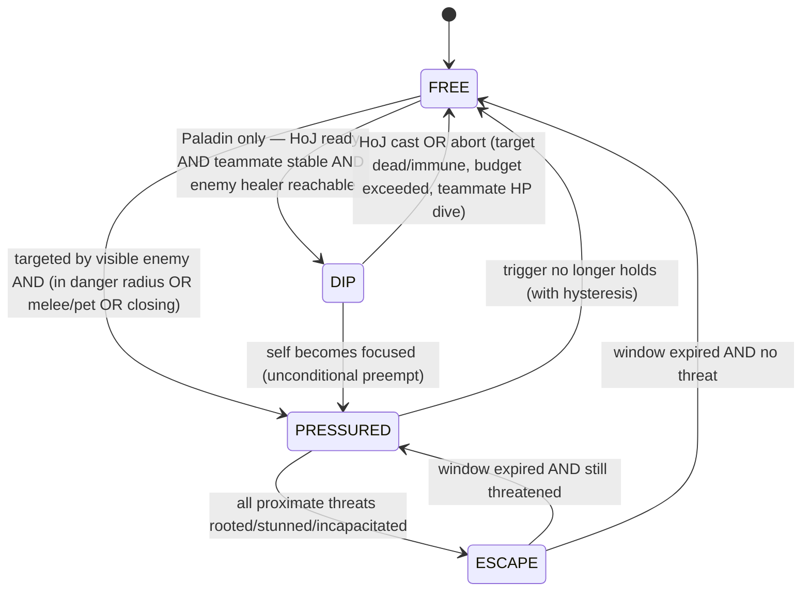
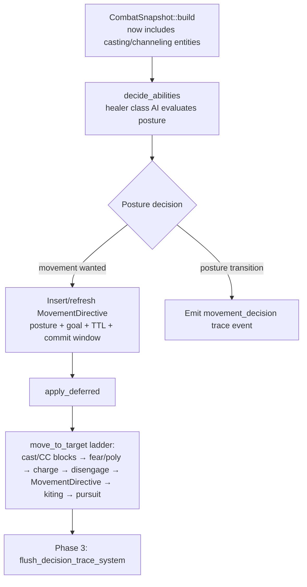

# feat: Healer Posture-Based Movement AI

## Summary

Give the two healer classes (Priest, Paladin) a posture-based movement AI — a small FREE/PRESSURED/ESCAPE/DIP state machine on top of a multi-term position scorer — built harness-first: behavior probes, `movement_decision` trace events, and KPI scripts land before any behavior changes, with all weights and thresholds data-driven in RON. A mirror-asymmetry diagnostic runs first so all subsequent measurement can be corrected for side bias (side-symmetrized cell deltas become the standing protocol if the fix is deferred).

---

## Problem Frame

Healers are positionally inert. Trace analysis of seeded matches shows every Priest moves ~21 units total per match — exactly the initial approach walk — regardless of whether it is being attacked. In a forced-focus match (Rogue training the Priest), the Priest died in ~11s of combat with the Rogue at 0.9–1.9yd the entire time, never taking a step, recasting Flash Heal into interrupts. The Paladin's `preferred_range` of 2.0 hardcodes face-tanking in melee even while focused.

This is both a balance problem and a naturalness problem. The N=100 1v1 baseline (`design-docs/balance/matrix_baseline_2026-05-23_pet_dispatch_1v1_post_n100.md`) shows Priest at 0–1% against everything but Hunter, and any melee comp gets free interrupt/CC value against a stationary healer — meaning heal output is currently balanced around an artificially terrible positional baseline. Visually, "healer statue dies without reacting" is the single biggest bot tell in matches.

The same baseline also shows suspicious mirror-matchup side bias (Rogue mirror 13%/87% by side, Paladin 73%, Priest 61% — expected ~50%), indicating a systematic first-mover or iteration-order advantage that contaminates every matrix cell by several points. That must be quantified before movement tuning is measured against the matrix.

Design philosophy (settled in discussion): we are not authoring an optimal algorithm — we are growing a legible one inside an instrumented harness. Discrete postures with explicit transitions (debuggable), a position scorer with named tunable terms (data-driven), scripted special cases where they are clearer than a unified scorer (escape windows), and an evaluation loop (probes → matrix KPIs → human replay review) that makes wrong behavior detectable and attributable.

---

## Requirements

**Diagnostics and measurement**

- R1. Mirror-matchup side bias is quantified per mirror with the causal mechanism identified and documented; a code fix lands in this slice only if the root cause is small, and any fix that changes seeded outcomes is followed by a full matrix re-baseline.
- R2. Behavior probes run as `cargo test` integration tests: seeded headless matches with per-frame position observation and KPI assertions. Observation must not perturb match outcomes (observed and unobserved runs are identical at the same seed).
- R3. `movement_decision` trace events are emitted on posture transitions and committed direction changes (carrying position and posture), queryable via jq. Trace-on/trace-off outcome equivalence and same-seed byte-determinism are preserved; event volume is bounded (no per-tick emission).
- R4. Movement KPIs are computable from probes and/or traces: post-gate path length, time-within-threat-range, escape-window separation gained, wand-shot count, draw rate.

**Posture behavior**

- R5. Priest FREE: holds an ally-anchored formation point (offset behind the engaged-ally centroid, biased toward arena center) instead of standing at `preferred_range` of its enemy target. With no living non-pet ally (1v1 or last alive), FREE degenerates to legacy hold-at-`preferred_range` behavior.
- R6. PRESSURED: repositions to maximize distance from threats subject to staying within heal range (40yd) of the ally most likely to need healing. Trigger requires being targeted by a visible enemy AND a proximity/intent condition (within danger radius, or threat is melee/pet, or threat is closing) — being targeted by a distant caster alone does not flip the posture. Stealthed enemies are excluded from threat detection (honoring shadow sight), so healers never pre-dodge invisible Rogues.
- R7. ESCAPE: when PRESSURED and all proximate threats are movement-impaired (Root/Stun/Incapacitate — not Fear), convert the window into separation — direction scored with attacker repulsion dominant and the boundary penalty active — for the window duration computed from CC time remaining and the healer's effective (slow-adjusted) speed. During a live window the healer may defer non-critical heals (ally above a configured HP threshold); critical heals always win.
- R8. Paladin: melee identity is preserved in FREE (no backline formation point); PRESSURED (focused, or healing-heavy) pulls it to a configured fallback range; DIP commits to walking to the enemy healer, casting Hammer of Justice, and returning — with entity-tracked target, a duration budget, and abort conditions (teammate HP dive, target dead/immune/DR-immune, self becoming focused, budget exceeded). PRESSURED preempts DIP unconditionally. While a dip is live, non-critical casts are deferred (same urgency threshold as R7) so a mid-dip heal doesn't freeze the walk and burn the budget; the HoJ reservation releases while the Paladin is PRESSURED so self-peel is never starved.
- R9. All scorer weights, radii, thresholds, and commitment windows are data-driven in `assets/config/movement.ron`, loaded identically in headless and graphical modes.
- R10. `CombatSnapshot` includes casting/channeling combatants (currently invisible to all class AI), so PRESSURED detection, formation centroids, and heal-target selection see casting entities. This is a deliberate behavior change measured in isolation against the matrix before posture work builds on it.

**Naturalness**

- R11. Direction choices carry a commitment window so movement does not zigzag; committed direction changes outside posture transitions are bounded.
- R12. The existing casting-locks-movement rule is preserved; posture movement happens in cast gaps and never interrupts an in-progress cast.

**Validation and non-regression**

- R13. Before/after validation via the N=100 1v1 matrix and the 2v2 healer sweep (`scripts/hunter_2v2_matrix.sh`), with draw rate as an explicit watch metric and a documented threshold that triggers the follow-up offensive-punish slice.
- R14. Mage and Hunter kiting behavior (`kiting_timer` mechanism) is untouched; non-healer classes show no movement behavior change.

---

## Key Technical Decisions

- **Posture decisions live in class AI; execution lives in `move_to_target`.** The healer's class AI tick (inside `decide_abilities`) evaluates posture and issues a `MovementDirective` component; `combat_core/movement.rs::move_to_target` executes it. Research confirmed same-tick visibility: `apply_deferred` already sits between `decide_abilities` and downstream Phase 2 systems (`src/states/play_match/systems.rs`), so there is no one-frame Commands lag to design around. This placement gives cast-gap movement for free (casting entities are excluded from `decide_abilities` and blocked in `move_to_target`).
- **`MovementDirective` slots into the movement ladder between Disengage and kiting, with an absolute expiry.** A feared/stunned/casting healer's AI doesn't run, so a directive can outlive the world it was computed against. `expires` is an absolute sim-time deadline checked at the top of `move_to_target` — before the cast/CC early-continues — so a directive issued pre-stun is removed (never executed) on the first post-stun frame instead of surviving the stun frozen at full lifetime. Absent/expired directive falls through the existing ladder unchanged. Posture itself does not live on the directive: a persistent `HealerPosture` component (current posture, transition timestamp, hysteresis state) survives directive expiry, so hysteresis and trace transition events key off real posture changes, never expiry artifacts.
- **PRESSURED is a compound trigger, not "someone targets me".** Kill-target acquisition in `combat_ai.rs` is configured-or-nearest — the healer +100 bias exists only in CC-target selection (`select_cc_target_heuristic`) — so bare targeting would over-fire in 1v1 and forced-focus matches (healer is always the target) and under-fire in team comps (healer is rarely nearest). The compound trigger covers both: targeted AND (danger radius OR melee/pet threat OR closing). "Closing" is derived intent, not velocity history: the threat's kill target is me AND its pursuit movement reduces distance this frame — no new mutable state in the determinism-sensitive hot path. Enemy kill-target reads from `CombatantInfo.target` are by design — the analog of a human seeing who is running at them — and are stealth-filtered to avoid leaking invisible Rogues.
- **Paladin keeps its melee identity; the backline formation point is Priest-only.** Moving the Paladin to a backline would be a class redesign hidden in a movement spec (it deletes autos, seal damage, and rotation HoJ). Paladin FREE stays melee pursuit; the new behavior is the PRESSURED retreat and the DIP. Rotation HoJ and DIP share one cooldown: when the enemy team has a healer, HoJ is reserved for the DIP/enemy-healer use unless a configured emergency condition fires.
- **The position scorer is a pure, public free function over BTree-ordered inputs.** Extends the shape of `find_best_kiting_direction` (16-direction argmax) with named terms — threat repulsion, ally-anchor pull, formation pull, boundary/corner penalty, wand-range pull (weight 0 for Paladin), commitment bonus — taking a weights struct so it is unit-testable without a Bevy world. All iterated collections are `BTreeMap`/`BTreeSet` per the decision-trace determinism learning (HashMap iteration order has caused replay bugs twice) — including converting `move_to_target`'s existing `positions` HashMap snapshot to `BTreeMap` before the scorer iterates it. Commitment has one governor: the hard `committed_until` window decides *when* re-evaluation happens; the commitment-bonus scorer term applies only *at* re-evaluation — the two never stack.
- **Probes observe per-frame in-process; traces stay transition-only.** KPI probes need per-tick positions; emitting those as trace events would balloon the 4900-file matrix traces ~100x. Instead the probe harness exposes a per-frame read-only observer with a deliberately narrow signature — `(sim_time, positions)` snapshots, not `&World` — and `movement_decision` events fire only on posture transitions and committed direction changes (each carrying position, which also enables coarse trace-side KPIs).
- **Probes assert on naturally occurring windows at fixed seeds, not injected events.** `HeadlessMatchConfig` has no scripted-event surface, and adding one is a large harness feature. Escape-window probes instead pick comps/seeds where the window occurs naturally (e.g., a Mage teammate Frost Novas the attacker) and assert conditionally: *whenever* an attacker-impaired window overlapped PRESSURED, separation increased. Deterministic seeds make these stable between code changes — but any change that shifts seeded outcomes can silently empty the window set, so every conditional probe also asserts a minimum occurrence count and fails loudly ("probe went vacuous — re-scan seeds") instead of passing over an empty set.
- **`movement.ron` mirrors the `ability_config.rs` loading pattern exactly**: serde structs with defaults, direct `std::fs::read_to_string` + `ron::from_str` (no asset server — required for headless), `validate()`, a `Resource` newtype, and a plugin that panics on failure, registered in both the headless runner (`src/headless/runner.rs`) and the graphical stack (`src/main.rs`, where `AbilityConfigPlugin` is added — not `states/mod.rs`). The dual-mode registration failure class is the most-burned-by bug in this repo's history.
- **The snapshot casting-visibility fix (R10) ships as its own isolated, matrix-measured unit.** It changes what *every* class AI can see (e.g., healers can finally see a casting ally's HP), so its balance impact must be attributable before posture logic builds on it.
- **`kiting_timer` is untouched.** Mage/Hunter kiting stays on the existing mechanism; only healers adopt directives. Migration is a deferred follow-up.

---

## High-Level Technical Design

### Posture state machine (evaluated each healer AI tick; only when not casting)

- FREE movement goal: Priest = formation point (offset behind engaged-ally centroid, center-biased, wand-range term); Paladin = legacy melee pursuit.
- PRESSURED movement goal: argmax over candidate directions of the multi-term scorer, constrained to heal range of the anchor ally.
- ESCAPE movement goal: direction chosen through the same candidate scorer with attacker repulsion dominant and the boundary/corner penalty active (escape bends along walls instead of pinning into them), held for `min(cc_remaining, distance_needed / effective_speed)`.
- DIP movement goal: pursue target entity to HoJ range; entry/arrival both re-checked via the existing `try_hammer_of_justice` predicate.

### Decision-to-execution pipeline (per frame, Phase 2 `CombatAndMovement`)

### Scorer terms (all weights in `movement.ron`)

| Term | Direction of pull | Applies in |
|---|---|---|
| Threat repulsion | Away from each visible threat, weighted by proximity | PRESSURED |
| Ally-anchor constraint | Hard penalty outside heal range (40yd) of anchor ally | PRESSURED |
| Formation pull | Toward formation point behind engaged-ally centroid | FREE (Priest) |
| Boundary/corner penalty | Away from arena bounds and corners | All |
| Wand-range pull | Toward wand range (30) of kill target, low weight | FREE/PRESSURED (Priest; weight 0 for Paladin) |
| Commitment bonus | Toward previously committed direction within window | All |

---

## Scope Boundaries

**In scope:** healer (Priest, Paladin) movement postures; the probe/trace/KPI harness; the snapshot casting-visibility fix; the mirror-asymmetry diagnostic; `movement.ron`.

**Deferred to Follow-Up Work**

- Offensive punish behaviors (target-swap responsiveness when a kill target kites out of reach; burst-priority during enemy-healer CC windows). Explicitly triggered if the draw-rate watch metric (R13) exceeds its threshold post-ship.
- Line-of-sight / pillar play (the structural counter to Mage dominance; the scorer's term list is where LoS terms later plug in).
- CC danger radii (cooldown-aware avoidance of enemy CC ranges) and cast-juking (stepping out of range of an incoming CC cast) — both are additional scorer terms/triggers on this skeleton.
- Psychic Scream (short-range Priest CC): the DIP predicate is built ability-agnostic so Scream plugs in when it ships; until then Priest has no DIP.
- Migrating Mage/Hunter `kiting_timer` onto `MovementDirective`.
- A parallel in-process matrix runner (already noted in project memory as planned; would cut the ~50min N=100 matrix wall time).
- A mirror-asymmetry *fix* larger than a localized change (e.g., simultaneous-resolution redesign of `decide_abilities`) — the diagnostic documents it as follow-up instead.

---

## Implementation Units

### Phase A — Diagnostics and harness (no behavior change)

### U1. Mirror-asymmetry diagnostic

- **Goal:** Identify and quantify the mechanism behind mirror-matchup side bias (Rogue 13%/87%, Paladin 73%, Priest 61% T1 winrate); fix only if localized; document otherwise.
- **Requirements:** R1.
- **Dependencies:** none (runs first; de-noises all later measurement).
- **Files:** `docs/reports/2026-06-mirror-asymmetry-diagnostic.md` (new); candidate fix sites if small: `src/states/play_match/combat_ai.rs` (`decide_abilities` iteration + `same_frame_cc_queue` first-mover mechanics), `src/states/play_match/combat_core/auto_attack.rs` (iteration order), `src/states/play_match/combat_core/movement.rs` (nearest-enemy `HashMap` tie cases → `BTreeMap`).
- **Approach:** Baseline-first per `docs/solutions/implementation-patterns/dep-upgrade-with-matrix-verification.md`: capture the current matrix CSV with explicit timestamp before touching anything. Then trace-driven investigation at fixed seeds on the worst mirror (Rogue): compare per-side opener timing, same-frame CC resolution order, and first-swing resolution. Ranked suspects from research: (1) `decide_abilities` unsorted iteration + `reflect_instant_cc` making earlier-iterated actors' CC visible to later actors in the same frame (Team 1 spawns first → iterates first); (2) auto-attack iteration order (first lethal swing wins); (3) `move_to_target`'s pre-loop position snapshot (half-frame information asymmetry); (4) `HashMap` nearest-enemy tie-breaks. The `BTreeMap` swap is in-scope as a fix if implicated; an iteration-ordering redesign is out of scope (documented follow-up) because it changes every seeded outcome and forces a full re-baseline.
- **Test scenarios:** Test expectation: none for the diagnostic itself — the deliverable is the report quantifying per-mirror bias and naming the mechanism with trace evidence. If a localized fix lands: (a) the three skewed mirrors move toward 50% at N=100 (document the new values); (b) `cargo test` determinism gates stay green (`seeded_matches_are_deterministic`, `trace_file_is_deterministic_at_same_seed`); (c) a fresh full-matrix baseline CSV is committed to `design-docs/balance/` since seeded outcomes changed.
- **Verification:** Report exists with mechanism, magnitude, and either the fix's before/after mirror table or an explicit follow-up recommendation; if the fix is deferred, the report names side-symmetrized cell deltas as the standing measurement protocol for U4/U9.

### U2. Behavior-probe harness and KPI helpers

- **Goal:** Run seeded headless matches inside cargo tests with per-frame read-only observation and reusable KPI computation.
- **Requirements:** R2, R4.
- **Dependencies:** none.
- **Files:** `src/headless/config.rs` (add a `Default` impl for `HeadlessMatchConfig` — a ~10-line addition reusing the existing per-field serde defaults; the win is collapsing the struct-literal `create_config` helpers in every test file), `src/headless/runner.rs` (observed-run variant: per-frame read-only callback receiving `(sim_time, positions)` snapshots after each update — deliberately not `&World`, to keep the introspection surface minimal), `tests/movement_probes.rs` (new — probe support helpers: position timelines, `path_length`, `time_within_range_of`, `separation_gained_during`, a non-vacuity assertion helper for window-conditional probes, plus harness self-tests), `scripts/movement_kpis.sh` (new — jq/awk KPI extraction from `movement_decision` + `ability_decision` trace positions for matrix-scale runs).
- **Approach:** The observer is read-only and must not perturb the sim — pattern after the trace system's non-perturbation discipline. Mirror the existing `create_config` test idiom but collapse it onto the new `Default`. KPI helpers operate on sampled `(sim_time, entity, position)` timelines so the same functions serve every later probe.
- **Patterns to follow:** `tests/headless_tests.rs` (in-test headless runs, determinism assertions), `tests/decision_trace_audit.rs` (tempfile trace inspection).
- **Test scenarios:** (a) observed run returns a `MatchResult` byte-identical to an unobserved run at the same seed (non-perturbation — the load-bearing one); (b) observer receives monotonically increasing sim time and sees all living combatants each frame; (c) KPI unit tests on hand-built timelines: known path length, known time-in-range, zero-length edge (single sample), entity death mid-timeline.
- **Verification:** Probe harness self-tests green; a demo probe shows the current build failing a statue threshold (post-gate path length under a small bound — the measured pathology is ~21 units), proving the harness detects the problem the feature will fix without pinning the assertion to a historical constant.

### U3. `movement_decision` trace events

- **Goal:** Make movement decisions visible to jq diagnosis alongside ability decisions.
- **Requirements:** R3.
- **Dependencies:** none (event definitions and builder land first; emitters arrive in U6–U8 — the emission gate means no emitters, no events).
- **Files:** `src/states/play_match/decision_trace/events.rs` (new `EventKind::MovementDecision` + payload variant: posture, previous posture, a typed transition `trigger` enum — e.g., PressuredEnter, EscapeWindowOpen, DipEnter, CommitExpired — goal kind, chosen direction, position, optional scorer-term breakdown), `src/states/play_match/decision_trace/writer.rs` (append to `kind_order` — never reorder existing entries), `src/states/play_match/decision_trace/mod.rs` (builder constructor mirroring `start_pet_decision`), `tests/decision_trace_builder.rs`, `tests/decision_trace_audit.rs` (movement `trigger` variants get their own expected list — extend `collect_reasons` to harvest the typed trigger field rather than polluting the ability bucket), `CLAUDE.md` (jq recipes for the new kind), `docs/solutions/implementation-patterns/ai-decision-trace.md` (schema addendum).
- **Approach:** Follow the decision-trace doc as a spec: builders are no-ops until a `TraceWriter` is installed; empty builders emit nothing; the payload must be structurally distinguishable from existing untagged variants (the required `posture` field does this). Emission policy (enforced by emitters in U6+): posture transitions and committed direction changes only.
- **Test scenarios:** (a) builder unit tests: transition event carries old/new posture; no-decision tick emits nothing; (b) `trace_on_matches_trace_off_outcomes` stays green once emitters exist; (c) same-seed trace byte-identity; (d) serialize/deserialize roundtrip of the new payload distinguishes it from `Ability`/`Pet` payloads; (e) volume guard: a reference Paladin+Priest mirror seed that runs to the timeout emits movement events below a duration-normalized ceiling (events per match-second) — the worst-case 300s draw is the bound that matters; a short decisive match would validate nothing.
- **Verification:** `cargo test --test decision_trace_builder --test decision_trace_audit` green; CLAUDE.md recipe returns sensible output on a probe-generated trace.

### U4. Snapshot casting-visibility fix and threat helpers

- **Goal:** `CombatSnapshot` sees casting/channeling combatants; `CombatContext` gains the threat predicates every posture needs.
- **Requirements:** R6 (trigger inputs), R7 (window inputs), R10.
- **Dependencies:** U2 (matrix baseline discipline available for the isolated impact measurement).
- **Files:** `src/states/play_match/class_ai/combat_snapshot.rs` (`build` inserts `CombatantInfo` for entities currently excluded by `Without<CastingState>`/`Without<ChannelingState>` filters), `src/states/play_match/class_ai/mod.rs` (new `CombatContext` helpers: `enemies_targeting(entity)` — stealth-filtered mirroring `combat_ai.rs`'s `can_see`, pets included; `primary_attacker(entity)` — nearest alive visible enemy targeting me; `attacker_escape_window(entity)` — remaining Root/Stun/Incapacitate duration on a given attacker, Fear excluded; `is_closing(threat, me)` — derived intent: threat's kill target is me AND its pursuit reduces distance this frame), `src/states/play_match/combat_ai.rs` (the `casting_auras`/`channeling_auras` query tuples gain `&Combatant`/`&Transform`, and the `CombatSnapshot::build` call site updates accordingly), `tests/combat_snapshot_tests.rs`, `tests/class_ai_decisions.rs`.
- **Approach:** Centralize predicates on `CombatContext` per the `friendly-cc-break-prevention.md` learning (no inline per-class duplicates). This unit changes what all seven class AIs can see (pets are unaffected — `pet_ai_system` builds its own local snapshot and keeps its existing behavior), so it lands as two commits: the snapshot visibility fix alone, matrix-measured before/after so the delta is attributable to it and nothing else; then the helper additions. While the mirror bias from U1 remains unfixed, deltas are reported on side-symmetrized cells (average of the (A,B) and (B,A) cells), which cancels first-mover bias to first order.
- **Test scenarios:** (a) snapshot includes a mid-cast enemy with its `target` readable; (b) a casting *ally*'s HP is visible (today's healer blind spot); (c) `enemies_targeting` excludes a stealthed Rogue targeting me, includes it under shadow sight, includes a Hunter pet targeting me; (d) `primary_attacker` picks the nearest of two attackers and skips dead/invisible ones; (e) `attacker_escape_window` returns remaining duration for Root/Stun/Incapacitate, `None` for Fear or no CC; (f) `is_closing` is true for a melee pursuing me, false for a stationary caster targeting me; (g) hand-built `BTreeMap` snapshot fixtures throughout (no Bevy world).
- **Verification:** Unit tests green; isolated before/after matrix delta captured and documented; existing class AI decision tests unchanged or deltas explained.

### Phase B — Priest postures

### U5. `MovementDirective` component, executor integration, and `movement.ron`

- **Goal:** The directive component, its slot in the movement ladder, the pure position scorer, and the weights config — everything postures need to express movement, with no posture logic yet.
- **Requirements:** R9, R11 (mechanism), R12, R14.
- **Dependencies:** U2 (probe harness for the byte-identity baseline guard in scenario h), U3 (event kind exists for emitters), U4 (helpers).
- **Files:** `src/states/play_match/components/movement.rs` (new — `MovementDirective { goal: Direction|Point|Entity, expires: absolute sim-time, committed_until }` plus the persistent `HealerPosture` component: current posture, transition timestamp, hysteresis state — posture survives directive expiry), `src/states/play_match/components/mod.rs` (re-export), `src/states/play_match/combat_core/movement.rs` (expiry check against the absolute deadline at the top of the per-combatant loop, before the cast/CC early-continues; ladder branch between Disengage and kiting executes unexpired directives with slow-multipliers applied; expired/absent falls through the existing ladder unchanged; the existing `positions` HashMap snapshot converts to `BTreeMap` before the scorer iterates it), new `src/states/play_match/movement_config.rs` + `assets/config/movement.ron` (weights, radii, thresholds, commit window, TTL — loaded via the `ability_config.rs` pattern, plugin registered in both `src/headless/runner.rs` and the graphical stack), scorer as `pub fn` (in `movement.rs` or a sibling `movement/scoring.rs`), `tests/movement_probes.rs` (executor probes), scorer unit tests alongside.
- **Approach:** Goal variants: `Direction` (PRESSURED/ESCAPE), `Point` (FREE formation), `Entity` (DIP pursuit). The scorer is a pure function over BTree-ordered candidate context + weights struct. Gate all directive issuance on `countdown.gates_opened` (mirrors `move_to_target`'s pre-gate early-return) so no spurious pre-match events or stale spawn-position directives. No new registered system — directives are written by class AI and consumed by the existing `move_to_target` — so `tests/registration_audit.rs` is unaffected.
- **Patterns to follow:** `find_best_kiting_direction` (`combat_core/movement.rs`) for the candidate-direction scan; `ChargingState`/`DisengagingState` for movement-state components; `ability_config.rs` for config loading.
- **Test scenarios:** Scorer (pure, no Bevy): (a) lone threat → chosen direction points away; (b) ally-anchor constraint: direction leaving heal range never wins while an in-range candidate exists; (c) corner setup → corner-ward directions lose; (d) commitment bonus: previous direction wins over a marginally better alternative within the window, loses outside it. Executor (probes): (e) directive moves the entity at slow-adjusted speed; (f) expiry removes the directive and movement falls through to legacy — including the stun case: directive issued, healer stunned past the deadline, no movement along the stale vector on the first post-stun frame; (g) casting/root/stun block directive execution (ladder order); (h) a non-healer with no directive behaves byte-identically to baseline at the same seed (R14 guard). Config: (i) missing/malformed `movement.ron` panics at startup with a clear message; (j) headless and graphical both load it (headless probe asserts the resource exists).
- **Verification:** All scorer/executor tests green; same-seed non-healer matches byte-identical to the post-U4 baseline (U4 deliberately shifts seeded outcomes, so the guard compares against the world U5 actually starts from); `positions` snapshot is `BTreeMap` before the scorer lands.

### U6. Priest FREE/PRESSURED postures

- **Goal:** The Priest stops being a statue: formation anchoring when safe, threat-aware repositioning when focused.
- **Requirements:** R5, R6, R11, R12.
- **Dependencies:** U2, U3, U4, U5.
- **Files:** `src/states/play_match/class_ai/priest.rs` (posture evaluation, directive issuance, trace emission at transitions), `assets/config/movement.ron` (Priest weights), `tests/movement_probes.rs` (the probe suite below).
- **Approach:** Posture evaluation runs at the top of the Priest's decide tick (it is mechanical instrumentation territory — emit `movement_decision` via the builder at each transition, mirroring the warrior.rs reject/choose discipline). FREE formation point: offset behind the centroid of living, non-pet, engaged allies (allies with an enemy target); pre-contact fallback = all living allies; no living non-pet ally = legacy behavior (R5 degenerate case). PRESSURED anchor ally = most-injured living ally, falling back to nearest. Hysteresis on the PRESSURED↔FREE boundary so a threat hovering at the danger radius doesn't strobe the posture, and sticky anchor-ally selection (a configured switch margin) so two similarly-injured allies don't flap the heal-range constraint region tick to tick.
- **Test scenarios (probes, fixed seeds):** (a) **Statue probe** — Rogue+Warrior vs Priest+Warrior with the Rogue forced onto the Priest (`team1_kill_target`): post-gate path length materially above the measured ~21-unit baseline AND time-within-10yd-of-attacker below a configured ceiling; (b) **Anchor probe** — while PRESSURED, the Priest never exits 40yd of the injured ally for more than a grace period; (c) **Stealth probe** — vs a stealth-opener Rogue, no posture transition occurs before the opener lands; (d) **Time-in-FREE probe** — Warrior+Priest mirror (unforced targeting): each Priest spends substantial time in FREE — kill-target acquisition is nearest-or-configured, so healers are rarely the formal target in team comps and the trigger must not over-fire; PRESSURED coverage comes from the forced-focus statue probe (a); (e) **Corner probe** — under sustained melee pressure, the Priest is never within corner radius for more than N consecutive seconds; (f) **1v1 degenerate probe** — Priest-vs-X 1v1 behavior matches legacy baseline (no formation logic fires); (g) **Zigzag probe** — committed direction changes per 10s below ceiling (R11); (h) **Wand probe** — unthreatened OOM-ish Priest drifts into wand range and lands wand hits (the formation point must not silently delete wand damage).
- **Verification:** Probe suite green; `decision_trace_audit` reference matchups extended so every new movement reason fires; mini-matrix (healer-relevant cells) draw-rate within the R13 watch band.

### U7. ESCAPE windows and cast-vs-move urgency

- **Goal:** The Priest converts a teammate's CC on its attacker into separation, including deferring non-critical heals during the window.
- **Requirements:** R7, R12.
- **Dependencies:** U5 (directive component and executor for escape movement), U6 (Priest PRESSURED context that ESCAPE transitions from).
- **Files:** `src/states/play_match/class_ai/priest.rs` (ESCAPE transition + urgency rule in the heal-priority ordering), `src/states/play_match/class_ai/mod.rs` (any additional window predicates), `assets/config/movement.ron` (urgency HP threshold, min-window cutoff), `tests/movement_probes.rs`.
- **Approach:** ESCAPE requires *all* threats within the danger radius to be Root/Stun/Incapacitate-impaired (a second free melee voids the window; Fear excluded — it self-solves and `move_to_target` already handles feared movement). Escape direction runs through the candidate scorer with attacker repulsion dominant and the boundary/corner penalty active — the scripted part of ESCAPE is the trigger and window math, not the raw direction, so wall-pinning can't waste the window. Window duration uses effective slow-adjusted speed (R7); windows shorter than a configured cutoff are ignored (not worth deferring a heal for 0.3s). The urgency rule lives in the Priest's decide ordering: while a window is live and the anchor ally is above the configured HP threshold, movement outranks healing; below it, healing wins unconditionally. The escape-window movement must never itself break a friendly CC (the window's CC is on the attacker and movement deals no damage, but the rule is recorded for when Scream/dips interact later).
- **Test scenarios (probes + unit tests):** (a) **Escape probe** — Warrior vs Priest+Mage at seeds where the Mage Novas the closing Warrior: asserts a minimum window count (non-vacuity) AND that in every window where root-on-attacker overlapped PRESSURED, the Priest gained ≥ configured separation; (b) **Defer probe** — same scenario with ally at high HP: during the window the Priest emits movement, not a Flash Heal start; (c) **Critical-heal probe** — ally low: Priest heals despite a live window; (d) **Multi-attacker probe** — two melee on the Priest, one rooted: no ESCAPE transition; (e) **Wall probe** — healer pressed near a boundary when a window fires: separation still increases (the scored direction bends along the wall instead of pinning into it); (f) unit test: window math with a 50% slow on the healer halves the effective window distance; (g) unit test: sub-cutoff window → no ESCAPE.
- **Verification:** Probe suite green; statue/anchor probes from U6 still green (ESCAPE must not regress PRESSURED).

### Phase C — Paladin

### U8. Paladin postures and the HoJ DIP

- **Goal:** Paladin keeps melee identity but stops face-tanking when focused, and deliberately walks to stun the enemy healer when safe.
- **Requirements:** R8, R11, R12.
- **Dependencies:** U5, U6 (shared scorer/directive machinery), U7 (ESCAPE shape).
- **Files:** `src/states/play_match/class_ai/paladin.rs` (posture evaluation: FREE = legacy melee pursuit; PRESSURED on focused-or-healing-heavy; ESCAPE; DIP issuance + aborts; HoJ reservation logic), `assets/config/movement.ron` (Paladin block: fallback range, healing-heavy threshold, dip budget, emergency override), `tests/movement_probes.rs`.
- **Approach:** PRESSURED trigger adds a Paladin-specific condition: healing-heavy (recent heal-cast pressure / team HP state) pulls it to fallback range even before being focused. DIP directive carries the target `Entity` and a duration budget; entry, and re-check at arrival, both reuse the existing `try_hammer_of_justice` predicate (stun-DR immunity, Divine Shield, stealth, pet checks) so the dip never walks toward a guaranteed-rejected cast. Aborts: anchor-teammate HP below threshold, target dead/immune, budget exceeded, self focused (PRESSURED preempts unconditionally). While a dip is live, non-critical casts are deferred (same urgency threshold as the R7 rule) — casting locks movement, so an undeferred Flash of Light mid-dip would stall the walk into a budget abort. HoJ reservation: when the enemy team has a living healer, rotation HoJ is suppressed in favor of DIP usage (prevents the rotation and the dip racing for one 60s cooldown) — but the reservation releases while the Paladin is PRESSURED, so self-peel HoJ on its own attacker is never starved.
- **Test scenarios (probes + unit tests):** (a) **Dip probe** — teammate stable, HoJ ready, enemy healer within dip range: the full dip-cast-return cycle completes (HoJ lands on the enemy healer; Paladin returns toward its team); (b) **Dip abort probe** — teammate HP dives mid-dip: dip aborts and the Paladin returns/heals without casting HoJ; (c) **Preempt probe** — Paladin becomes the kill target mid-dip: PRESSURED takes over immediately; (d) **Retreat probe** — Paladin focused by melee: falls back to configured range and continues healing (path length and range-band KPIs); (e) **Identity probe** — team healthy, no dip opportunity: melee uptime (time within melee range of its target) not materially below pre-change baseline; (f) **Chip-damage probe** — teammate takes light damage mid-dip (above the abort threshold): the dip completes anyway (cast deferral holds); (g) **Self-peel probe** — focused Paladin with the enemy healer alive still casts HoJ on its attacker within a bounded delay of cooldown availability (reservation released under PRESSURED); (h) unit test: dip entry rejected when `try_hammer_of_justice` predicate fails (DR-immune target); (i) unit test: HoJ reservation suppresses rotation HoJ only while a living enemy healer exists and the Paladin is not PRESSURED.
- **Verification:** Probe suite green; Paladin mirror and Paladin+Priest 2v2 cells re-measured (these were the draw-heavy cells — record the movement).

### Phase D — Validation

### U9. Balance validation and report

- **Goal:** Quantify the slice's balance and naturalness impact; decide whether the draw-rate trigger fires the follow-up offense slice.
- **Requirements:** R13, R4.
- **Dependencies:** U1–U8.
- **Files:** `design-docs/balance/matrix_baseline_2026-06-*.csv/.md` (post-change N=100 1v1 matrix + 2v2 sweep outputs), `docs/reports/2026-06-healer-movement.md` (new — before/after winrates, draw rates, KPI deltas, replay-review notes), `scripts/movement_kpis.sh` (final KPI extraction).
- **Approach:** Compare against the baselines captured in U1 (and U4's isolated delta), reporting side-symmetrized cell deltas while the mirror bias remains unfixed. After any tuning change that shifts seeded outcomes, re-verify that window-dependent probes still trigger (non-vacuity) and re-pick seeds where needed before trusting a green suite. KPI deltas: Priest post-gate path length, focused-healer time-within-10yd, healer interrupts/CC eaten, wand counts, escape separations, dip completion rate. Draw-rate watch: compare 1v1 and 2v2 draw rates against baseline; the report states the threshold and whether the offensive-punish follow-up is triggered. Include a human naturalness pass: watch a handful of seeded replays in the graphical client (the outer tuning loop) and record observations — zigzag, indecision, robotic geometry.
- **Test scenarios:** Test expectation: none — this unit produces measurement artifacts; its "tests" are the committed CSVs and the report's KPI tables.
- **Verification:** Report committed with before/after tables, explicit draw-rate verdict, and a tuning changelog of any `movement.ron` weight adjustments made during validation (each justified by a probe or KPI).

---

## Acceptance Examples

- AE1. **Escape window** — Given the Priest is PRESSURED by a Warrior and a teammate roots the Warrior with 4s remaining, when the anchor ally is at 80% HP, then the Priest moves away for the window (deferring heals) and gains the configured separation; when the ally is at 30%, the Priest heals instead.
- AE2. **Stealth fairness** — Given a stealthed Rogue is targeting the Priest pre-opener, when the Priest evaluates postures, then no PRESSURED transition occurs until the Rogue is visible (opener lands or shadow sight).
- AE3. **Dip abort** — Given the Paladin is mid-dip toward the enemy healer, when its anchor teammate drops below the abort threshold, then the dip aborts without casting HoJ and the Paladin returns to support range.
- AE4. **Degenerate 1v1** — Given a Priest in a 1v1 match (no living ally), when postures are evaluated, then FREE produces legacy positioning and PRESSURED/ESCAPE remain available.
- AE5. **Permanent-pressure guard** — Given an enemy caster beyond the configured danger radius has the Priest targeted but is not closing, when postures are evaluated, then the Priest remains FREE (with at most a scoring bias), not PRESSURED.

---

## Risks & Dependencies

- **Draw-rate inflation is the headline risk.** Every behavior in this slice makes healers harder to kill; the Paladin+Priest 2v2 cell already draws 10/10 at the timeout. Mitigation: draw-rate ceiling assertions in probes, the R13 watch metric, and a pre-agreed follow-up trigger for the offensive-punish slice rather than bundling offense in now.
- **The U4 snapshot fix shifts all class AI, not just healers.** Healers seeing casting allies' HP changes heal-target selection match-wide. Mitigation: U4 lands alone with an isolated before/after matrix delta.
- **Any mirror-asymmetry ordering fix invalidates every seeded baseline.** Mitigation: U1 is diagnostic-first; only localized fixes land, followed by a full re-baseline per the dep-upgrade verification workflow.
- **Weight-tuning churn.** Argmax scorers are sensitive; bad weights produce oscillation or corner deaths. Mitigation: RON-externalized weights, scorer unit tests, probe suite as regression net, commitment windows; if hand-tuning stalls, the sim is cheap enough for automated parameter sweeps later.
- **Trace volume on matrix runs.** 4900 trace files already exist per matrix run; per-tick movement events would balloon them ~100x. Mitigation: transition-only emission policy plus the U3 volume-guard test.
- **Determinism regressions.** New iterated collections in the hot path must be BTree-ordered; the rand 0.9 pin and `trace_on_matches_trace_off_outcomes` are load-bearing. Mitigation: determinism gates run per unit (`cargo test` + the `--ignored` all-pairings sweeps before merge).

---

## Sources / Research

- Measured pathology: trace analysis of seeded matches this session (Priest path ~21 units in all matches; focused Priest dead at ~11s with attacker at 0.9–1.9yd; positions read from `ability_decision` actor views).
- Baselines: `design-docs/balance/matrix_baseline_2026-05-23_pet_dispatch_1v1_post_n100.md` (1v1, mirror bias), `design-docs/balance/matrix_baseline_2026-05-22_pet_engage_2v2_post.md` (2v2 draw wall).
- Movement/kiting architecture: `src/states/play_match/combat_core/movement.rs` (`move_to_target` ladder, `find_best_kiting_direction`), `src/states/match_config.rs` (`preferred_range`).
- Snapshot/casting blindness: `src/states/play_match/class_ai/combat_snapshot.rs` (`Without<CastingState>` filters on the combatants map).
- Trace extension spec: `docs/solutions/implementation-patterns/ai-decision-trace.md`; builder/writer in `src/states/play_match/decision_trace/`.
- Config loading pattern: `src/states/play_match/ability_config.rs` (fs-read + ron, panicking plugin, dual-mode registration).
- Registration discipline: `tests/registration_audit.rs`, `docs/solutions/implementation-patterns/graphical-mode-missing-system-registration.md`.
- Baseline/verification workflow: `docs/solutions/implementation-patterns/dep-upgrade-with-matrix-verification.md`.
- Class-AI guard conventions: `docs/solutions/ai-decision-patterns/friendly-cc-break-prevention.md`, `src/states/play_match/class_ai/cast_guard.rs`.
- Iteration-order/spawn suspects for U1: `src/states/play_match/combat_ai.rs` (`decide_abilities`, `same_frame_cc_queue`), spawn sites in `src/headless/runner.rs` and `src/states/play_match/mod.rs`.
