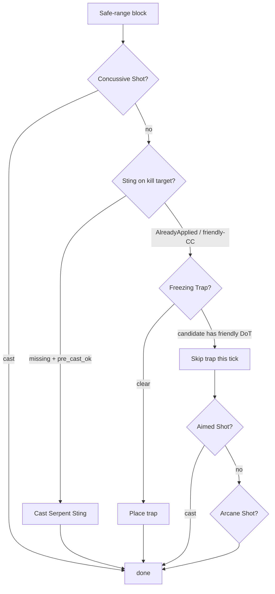
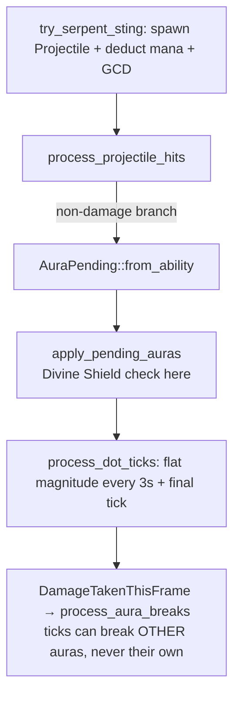

# feat: Add Serpent Sting ability for Hunter

## Summary

Add Serpent Sting to the Hunter kit: an instant, cheap, no-cooldown, pure-DoT Nature projectile modeled on the Corruption aura pattern, applied and maintained by the Hunter AI while kiting. Ships with the full visual surface (icon, arrow projectile, distinct venom body effect, HUD aura icon, combat-log entry), a two-way friendly-CC guard with Freezing Trap, and 2v2 sweep validation tuned as an intentional Hunter buff.

---

## Problem Frame

Hunter has no sustained-damage component beyond Auto Shot, and it regressed in the recent balance patch (see origin and `design-docs/balance/2026-06-04-hunter-mage-balance-findings.md`). Serpent Sting fills the kiting-damage role — damage that keeps ticking while the Hunter repositions — and doubles as a recovery lever. The dangerous interaction (a Hunter DoT breaking the team's own Freezing Trap, which breaks on any damage) is the same bug class documented in `docs/solutions/ai-decision-patterns/friendly-cc-break-prevention.md` and is handled by existing guard infrastructure.

---

## Requirements

Carried from origin (R1–R17 in `docs/brainstorms/2026-06-10-serpent-sting-hunter-requirements.md`), with one amendment (R4) and one plan-added requirement (R16, `view_combatant_ui.rs` — implementation-necessary, not in origin); origin R16/R17 are renumbered to plan R17/R18:

**Ability mechanics**

- R1. `SerpentSting` ability: instant cast, no cooldown, Nature school, 35 yd range with `min_range: 8.0` (Hunter dead zone), data-driven via `assets/config/abilities.ron`.
- R2. Applies a `DamageOverTime` aura (Corruption pattern: `duration` + `tick_interval`); its own aura never breaks on damage (`break_on_damage` left at the `-1.0` default). DoT ticks count toward other auras' `break_on_damage` thresholds — existing engine behavior, unchanged.
- R3. Mana cost cheap relative to Arcane Shot (21), drawn from the fixed 240/0-regen Hunter pool, costed with enemy-Priest dispel pressure in mind.
- R4 (amended). Damage is **flat per-tick magnitude**, matching every DoT in the engine (Corruption, UA, Curse of Agony). The origin asked for AttackPower scaling; the engine has no stat scaling at tick time, and the workaround (nonzero direct-damage fields) would flip `is_damage()` and destroy the pure-DoT guard property. AP/SP snapshot scaling for DoTs is deferred to follow-up work (see Scope Boundaries).
- R5. Pure-DoT projectile: zero direct-damage fields so `is_damage()` is false and `process_projectile_hits` routes through the non-damage aura-application branch; `projectile_speed: 45.0` (must stay ≥ 35 so the flight window stays inside the 1.5 s GCD — see KTD 4).

**AI behavior**

- R6. Hunter AI maintains sting uptime on its kill target (`target_entity`, not nearest enemy): applies when missing, reapplies on expiry, usable mid-kite. Dedup keyed on `effect_type == DamageOverTime && ability_name == "Serpent Sting"` (Corruption idiom — never `AuraType` alone).
- R7. The sting's try-function routes through `pre_cast_ok` with `PreCastOpts { check_friendly_cc: true, ..Default::default() }` — never cast on a friendly-CC'd target. No inline guards.
- R8. Freezing Trap placement skips a candidate carrying any friendly DoT, via the existing `ctx.has_friendly_dots_on_target` helper (a Hunter-applied sting is detected automatically — caster-team matching is built in).
- R9. Guards are reactive and binary: skip-this-tick, no fallthrough to a second trap candidate, no predictive sting suppression, no remaining-duration awareness.
- R10. Decision trace: `builder.reject` with `classify_pre_cast_failure` at the `pre_cast_ok` gate, `RejectionReason::AlreadyApplied` for the dedup gate, `builder.choose` on success. No module-level wiring (builder already threaded through `class_ai/hunter.rs`).

**Visual & UI surface**

- R11. Spell icon at `assets/icons/abilities/ability_hunter_quickshot.jpg` referenced from the RON `icon:` field — the HUD aura icon resolves automatically via `get_aura_icon_key` once set.
- R12. Projectile renders as an arrow (add `SerpentSting` to the hardcoded `is_arrow_projectile` list) with venom-green `projectile_visuals` from config.
- R13. Verify (not assume) the HUD aura icon and over-target aura icon render for the sting in graphical mode.
- R14. A distinct venom body effect on afflicted targets, distinguishable from Unstable Affliction's violet 0.5 Hz pulse (Corruption's "green tendrils" exist only in comments — UA is the only implemented DoT body effect and the actual distinctness target). Follows the spawn/update/cleanup pattern from `docs/solutions/implementation-patterns/adding-visual-effect-bevy.md`.
- R15. Combat log: abbreviation + Nature-green color entry for "Serpent Sting" (avoid the existing `"SS"` = Sinister Strike collision; suggested `"ST"` — verify uniqueness in the map).
- R16. `view_combatant_ui.rs` updated: `get_ability_name()` exhaustive match (compile-enforced) and the Hunter list in `get_class_abilities()` (silent miss — must be checked by hand).

**Validation & balance**

- R17. `cargo test` green: ability validation list, registration audit, existing probes.
- R18. 2v2 healer sweep (`scripts/hunter_2v2_matrix.sh`) judged on **side-symmetrized cells** (per `docs/solutions/implementation-patterns/mirror-asymmetry-side-symmetrized-measurement.md`) against the most recent post-casting-visibility-fix baseline: Hunter gain accepted, no symmetrized cell past ~65%. Pair the winrate read with trace queries: `Serpent Sting` dispel counts (dispel tax can mask a working sting) and `AlreadyApplied` counts (an uptime-loop bug would drain the fixed mana pool).

---

## Key Technical Decisions

1. **Pure DoT, zero direct damage.** Keeps `is_damage()` false → projectile arrival applies the aura through the proven non-damage branch (Spider Web path), and the impact itself can never contribute to a `break_on_damage` threshold. Flavor matches Classic.
2. **Flat per-tick magnitude (R4 amendment).** `magnitude` is the entire damage lever; no engine change. DoT stat scaling is a follow-up issue.
3. **Sting sits above Freezing Trap in the safe-range rotation.** The R8 guard runs at placement time and only sees *applied* auras. Placing the sting decision first means the guard always observes an existing sting before trap placement — closing the trap-placed-then-stung ordering hole for the single-target case. The residual (an armed ground trap proximity-triggered by an already-stung chaser) is accepted and measured (U5).
4. **`projectile_speed: 45.0`** (matches Arcane/Aimed Shot). Worst-case flight (~0.9 s at 35 yd on a fleeing target) lands inside the 1.5 s GCD, so the next decision tick always sees the applied aura — zero self-double-cast exposure and no in-flight hole in the trap guard (sting and trap share one GCD pool). Speeds below ~35 would reopen both.
5. **Dedup by `ability_name`, no caster filter** — Corruption-identical. Consequences accepted: after a target switch the old sting ticks out free (emergent two-target dotting, not spreading logic); in two-Hunter comps Hunter B won't re-sting Hunter A's target.
6. **Trap guard at the call site, not inside `try_place_trap_at`.** The trap helper checks only cooldown/mana today and is shared by Frost Trap (placed at feet/midpoint, not on a target). The friendly-DoT check applies to the Freezing Trap candidate-selection branch only.
7. **Starting numbers tuned relative to Corruption** (60 total / 25 mana / 30 yd): sting at 50 total (10 × 3 s × 15 s), 15 mana, 35 yd. Cheaper and lighter than Corruption, priced for repeated recasts under dispel pressure from the fixed 240 pool. Sweep-tunable; the sweep is the tuning loop, not a one-shot gate.

---

## High-Level Technical Design

Rotation placement and guard gates (decision flow, safe range 20+ yd):

The closing-range block (8–20 yd) inserts the same sting gate before Arcane Shot, targeting `target_entity` (kill target), not the nearest enemy. The dead-zone block (< 8 yd) is unchanged — no sting evaluation inside `min_range`, uptime recovers via Disengage/kiting (same exposure Arcane Shot has today).

Application pipeline (all existing systems — zero new headless systems):

---

## Implementation Units

### U1. Ability registration and config

- **Goal:** `SerpentSting` exists as a fully validated, data-driven ability with its icon.
- **Requirements:** R1–R5, R11, R16.
- **Dependencies:** none.
- **Files:** `src/states/play_match/abilities.rs` (enum, Hunter block), `src/states/play_match/ability_config.rs` (`expected_abilities` in `validate()`), `assets/config/abilities.ron` (Hunter section), `src/states/view_combatant_ui.rs` (`get_ability_name`, `get_class_abilities` Hunter list), `assets/icons/abilities/ability_hunter_quickshot.jpg` (new asset).
- **Approach:** RON entry per KTD 7: instant, 35 yd, `min_range: Some(8.0)`, 15 mana, no cooldown, Nature, no damage fields, `applies_aura: (aura_type: DamageOverTime, duration: 15.0, magnitude: 10.0, tick_interval: 3.0)`, `projectile_speed: Some(45.0)`, venom-green `projectile_visuals` (emissive 2–4× the base color per the visual-effects learning). Icon via `mcp__wowhead-classic__get_spell_icon("Serpent Sting")` if the MCP is connected, else manual download from Wowhead's CDN (icon name `ability_hunter_quickshot`).
- **Patterns to follow:** Corruption entry (`abilities.ron` Warlock section) for the aura shape; ArcaneShot for the projectile/min_range shape; the UA plan (`docs/plans/2026-04-18-001-feat-unstable-affliction-warlock-plan.md`) for the registration triple.
- **Test scenarios:**
  - `cargo test` ability-validation passes with the new entry; deliberately confirm it fails if the RON entry is removed (the triple is test-enforced).
  - Headless 1v1 (Hunter vs Warrior): match log shows Serpent Sting application and periodic Nature ticks of exactly `magnitude` (flat — no crit, no AP variance).
  - RON entry has no direct-damage fields → confirm via trace/log that projectile impact deals zero direct damage (pure-DoT property).
- **Verification:** headless match log shows sting DoT ticks; `cargo test` green.

### U2. Hunter AI: try_serpent_sting and rotation slots

- **Goal:** Hunter maintains sting uptime on its kill target with correct guards and trace events.
- **Requirements:** R6, R7, R10. Covers origin F1.
- **Dependencies:** U1.
- **Files:** `src/states/play_match/class_ai/hunter.rs` (new `try_serpent_sting`; call sites in the closing-range and safe-range blocks).
- **Approach:** Clone `try_arcane_shot`'s shape (def → `pre_cast_ok` with `check_friendly_cc: true` → spawn `Projectile` → mana/GCD bookkeeping → `log_ability_use`), add `try_corruption`'s `AlreadyApplied` dedup before the guard (keyed `ability_name == "Serpent Sting"`), and **never insert a cooldown** (no-CD ability — `pre_cast_ok`'s cooldown check passes on absent key). Slot per KTD 3: safe-range block between Concussive Shot and Freezing Trap; closing-range block before Arcane Shot, targeting `target_entity`.
- **Patterns to follow:** `try_arcane_shot` (`hunter.rs`), `try_corruption` (`class_ai/warlock.rs`) dedup, `classify_pre_cast_failure` (`class_ai/cast_guard.rs`).
- **Test scenarios:**
  - Covers AE1. Kill target under friendly Freezing Trap incapacitate → trace shows `SerpentSting` rejected with `FriendlyBreakableCC`; no projectile spawned.
  - Sting already ticking on target → trace shows `AlreadyApplied` rejection; mana unchanged (uptime loop does not drain the 240 pool).
  - Covers AE3. Kiting scenario (slowed melee chasing through 8–20 yd band): sting applied without the Hunter stopping; trace `movement` unaffected; sting lands on `target_entity` even when a different enemy is nearest.
  - Sting expiry → next decision tick reapplies (uptime maintenance); over a 60 s headless match, sting recast count ≈ duration-driven (~4), not GCD-driven (~40).
  - Insufficient mana (drain pool in a probe/scenario) → `InsufficientMana` rejection, no cast.
- **Verification:** trace queries (`jq` recipes per CLAUDE.md) show the expected reject/choose pattern; headless match shows multi-application over time on the kill target only.

### U3. Freezing Trap friendly-DoT guard

- **Goal:** Freezing Trap placement never targets a candidate the team has DoT'd; rejection is traced.
- **Requirements:** R8, R9, R10. Covers origin F1's trap arm.
- **Dependencies:** U1 (meaningful only once a Hunter DoT exists); independent of U2 at the code level.
- **Files:** `src/states/play_match/class_ai/hunter.rs` (Freezing Trap candidate selection in the safe-range block).
- **Approach:** At the existing call site (candidate = `ctx.enemy_healer().or(Some(target_entity))`), check `ctx.has_friendly_dots_on_target(candidate)`; on hit, emit `builder.reject(FreezingTrap, ...)` with the friendly-DoT-classified reason and skip the trap this tick (binary, no fallthrough — KTD 6, R9). The helper already team-matches DoT casters, so Warlock DoTs in mixed comps are covered for free.
- **Patterns to follow:** `try_polymorph`'s `check_friendly_dots: true` usage (`class_ai/mage.rs`) as the reactive-guard precedent; `docs/solutions/ai-decision-patterns/friendly-cc-break-prevention.md` checklist.
- **Test scenarios:**
  - Covers AE2. Sting ticking on the only enemy, trap off cooldown → trap withheld with traced rejection; after sting expiry, trap placed on a later tick.
  - Healer candidate clean but kill target stung → trap still placed targeting the healer (guard evaluates the actual candidate, not the kill target).
  - No friendly DoTs anywhere → trap behavior byte-identical to today (guard is pure addition; consider a fixed-seed headless comparison of a no-Hunter-sting matchup to confirm no behavioral drift).
- **Verification:** trace shows the new rejection only when the candidate carries a friendly DoT.

### U4. Visual surface

- **Goal:** Sting is fully legible in the graphical client: arrow projectile, venom body effect, aura icons, combat log.
- **Requirements:** R12, R13, R14, R15.
- **Dependencies:** U1.
- **Files:** `src/states/play_match/projectiles.rs` (`is_arrow_projectile`), `src/states/play_match/components/visual.rs` (new marker, e.g. `SerpentStingVenom`), `src/states/play_match/rendering/effects.rs` (detector + spawn/update/cleanup systems), `src/states/mod.rs` (graphical-only registration, own `.add_systems()` block), `src/states/play_match/rendering/combat_log.rs` (`get_ability_abbreviation`, `get_ability_icon_color`).
- **Approach:** Clone the UA glow 4-system shape (detector scans `ActiveAuras` for `ability_name == "Serpent Sting"`; spawn/update/cleanup manage the mesh). Distinctness per R14: venom-green palette with a visibly different rhythm/shape from UA's violet 0.5 Hz pulse (e.g., faster drip-style pulse). Honor the visual-effects checklist verbatim: `AlphaMode::Add`, `unlit: true`, `Without<T>` on the second Transform query, `try_insert`, `Res<Time>`, `PlayMatchEntity`, graphical-only registration. Combat log: abbreviation `"ST"` (verify non-colliding; `"SS"` is taken by Sinister Strike) + Nature-green color arm.
- **Patterns to follow:** UA glow systems (`rendering/effects.rs`) and its registration block (`states/mod.rs`); `docs/solutions/implementation-patterns/adding-visual-effect-bevy.md`.
- **Test scenarios:**
  - `cargo test` registration audit passes (it fails with instructions if the new visual systems are misregistered).
  - Covers AE4 (amended per R14): graphical Hunter+Warlock vs target — sting + UA on one target render two independent, visually distinct effects; HUD shows both aura icons (sting resolves its RON icon, not the generic `aura_dot` fallback).
  - Headless mode runs clean with zero visual systems registered (no panic, no missing-system symptom).
  - Test expectation for visual appearance itself: manual graphical check — automated coverage is the registration audit plus AE4's icon-resolution check.
- **Verification:** screenshot-level check in the graphical client; registration audit green.

### U5. Balance validation and tuning

- **Goal:** R18's sweep gate passes with the intentional-buff framing; numbers adjusted if needed.
- **Requirements:** R17, R18, origin success criteria.
- **Dependencies:** U1–U4 (U4 optional for the sweep itself, required before merge).
- **Files:** none (runs `scripts/hunter_2v2_matrix.sh`; optionally commits the CSV under `design-docs/balance/`).
- **Approach:** Full `cargo test`, then `scripts/hunter_2v2_matrix.sh 100 --seed-base 0` against the latest post-casting-visibility-fix baseline CSV. Judge on side-symmetrized cells. Attach trace queries: sting dispel count per match (dispel tax read), `AlreadyApplied` counts (uptime-loop sanity), Freezing Trap break-by-sting incidents (KTD 3 residual measurement). If the gate fails high (a symmetrized cell > ~65%), step `magnitude` down (10 → 8) before touching mana; if the sting reads inert, check the dispel count before buffing.
- **Test scenarios:** Test expectation: none — this unit is the measurement harness itself; its outputs are the sweep CSV and trace-query numbers reported against R18's gate.
- **Verification:** sweep summary with symmetrized deltas vs baseline, plus the three trace-query counts, reported in the PR description.

---

## Scope Boundaries

**Non-goals (from origin):** multi-target DoT spreading; other Classic stings (Viper, Scorpid) and any one-sting-exclusivity rules; predictive trap/sting sequencing; new dispel mechanics (existing dispel counterplay is accepted).

### Deferred to Follow-Up Work

- **DoT stat scaling engine support** — snapshot AP/SP into aura magnitude at application time so DoTs can scale with caster stats (origin R4's original intent; affects Corruption/UA/CoA tuning too). File as a separate engine issue.
- Remaining-duration-aware trap guard (trap anyway if sting expires within ~1 s) — origin deferred question, kept out of v1 per R9.
- Projectile impact flourish (Concussive-style burst on sting arrival) — non-damage projectiles produce no impact log line or burst today; cosmetic only.

---

## Risks & Dependencies

- **Wowhead MCP not connected** during planning — icon download and Classic value cross-check happen at implementation time (MCP or manual). Starting numbers in KTD 7 are sim-relative, not Classic-converted, by design.
- **Trap self-break residual (KTD 3):** an armed ground trap can still be proximity-triggered by an already-stung chaser walking into it — the sting *introduces* this failure mode to the Hunter's marquee CC. Accepted for v1; U5 measures incidence so the follow-up decision is data-driven.
- **Dispel tax:** every R18 opponent team has a Priest whose dispel is top-priority; a flat sweep result may mean "sting works, gets dispelled" rather than "sting too weak." U5's dispel-count query disambiguates before any retune.
- **Baseline comparability:** use only post-PR#63 / post-casting-visibility-fix baselines (`docs/solutions/ai-decision-patterns/casting-visibility-snapshot-blind-spot.md` was a ±50 pt latent event; older CSVs are not comparable).

---

## Sources

- Origin requirements: `docs/brainstorms/2026-06-10-serpent-sting-hunter-requirements.md`
- Add-a-DoT precedent: `docs/plans/2026-04-18-001-feat-unstable-affliction-warlock-plan.md`
- Guard infrastructure: `src/states/play_match/class_ai/cast_guard.rs`; `ctx.has_friendly_dots_on_target` in `src/states/play_match/class_ai/mod.rs`
- DoT engine behavior: `process_dot_ticks` / `apply_pending_auras` / `process_aura_breaks` in `src/states/play_match/auras.rs`; `AuraPending::from_ability` in `src/states/play_match/components/auras.rs`
- Projectile aura application (non-damage branch): `src/states/play_match/projectiles.rs`
- Institutional learnings applied: `docs/solutions/ai-decision-patterns/friendly-cc-break-prevention.md`, `docs/solutions/implementation-patterns/adding-visual-effect-bevy.md`, `docs/solutions/implementation-patterns/ai-decision-trace.md`, `docs/solutions/implementation-patterns/mirror-asymmetry-side-symmetrized-measurement.md`, `docs/solutions/implementation-patterns/graphical-mode-missing-system-registration.md`
- Hunter resource model: `docs/plans/2026-05-22-001-fix-hunter-mana-economy-plan.md` (fixed 240 pool, zero regen)
