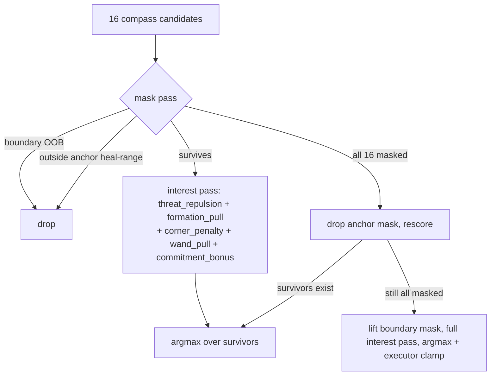
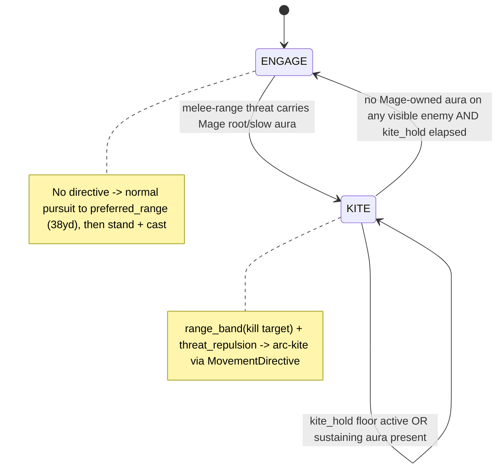

# refactor: Context-Steering Masks + Mage Movement Pilot

## Summary

Restructure the movement direction scorer (`src/states/play_match/combat_core/movement_scoring.rs`) from -1000.0 hard penalties into boolean danger masks plus additive interest terms, deleting the dominance invariant — shipped as a near-identity refactor (Part A). Then put the Mage on the existing posture machinery with a minimal ENGAGE/KITE pair, world-state KITE entry, and a new `range_band` ring term, retiring the Mage's use of `find_best_kiting_direction` and `kiting_timer` (Part B). Part A and Part B land as separate commits; Part A must be near-byte-identical before Part B begins.

---

## Problem Frame

Three movement brains coexist. Healers use the data-driven posture scorer; Mage and Hunter share `find_best_kiting_direction` in `src/states/play_match/combat_core/movement.rs` — a hand-coded sibling with the same 16-compass argmax skeleton but hardcoded weights, no config, no trace events; melee and pets use simple pursuit.

Two structural costs follow. The scorer encodes hard constraints (`ally_anchor`, `boundary_penalty`) as -1000.0 penalties, and `MovementConfig::validate()` (`src/states/play_match/movement_config.rs`) must police that they dominate every soft-term sum — a standing tax on every new term. And Mage kiting is triggered by `kiting_timer`, a raw float on `Combatant` that the ability AI writes directly (`src/states/play_match/class_ai/mage.rs:475` sets it to the Frost Nova aura duration) — an untraced cross-system mutation channel of the kind the posture system replaced for healers. DPS movement is also a diagnosis blind spot: no `movement_decision` events, no probes, no KPI coverage.

The kiting branch already half-implements context steering — out-of-bounds candidates are removed via a `continue` skip (a true mask) while the keep-in-range constraint uses a -1000.0 penalty. Part A unifies these siblings on the masking semantics one of them already uses.

---

## Requirements

Carried from origin (`docs/brainstorms/2026-06-12-context-steering-masks-requirements.md`), grouped by part.

**Part A — mask refactor (near-identity)**
- R1. The scorer evaluates candidates in two passes: a boolean mask pass and an additive interest pass over surviving candidates.
- R2. Boundary (`is_in_arena_bounds`) and ally-anchor (heal-range) become masks; `threat_repulsion`, `formation_pull`, `corner_penalty`, `wand_pull`, `commitment_bonus` remain soft interest terms unchanged.
- R3. When masks eliminate all 16 candidates, a fixed fallback ladder applies: drop the anchor mask and rescore; if still all-masked (boundary), lift the boundary mask, run the full interest pass, return the argmax, and let the executor clamp.
- R4. The `ally_anchor` / `boundary_penalty` weight fields and the soft-vs-hard dominance checks in `validate()` are removed; remaining validation is unchanged. Retired keys are removed from `assets/config/movement.ron`.
- R5. `movement_decision` events gain a masked-candidates field (`u16` bitmask), present when the scorer ran. The trace stays non-perturbing.
- R6. Healer behavior is preserved: all existing movement probes pass unmodified, and a full matrix run is byte-identical to baseline except in frames where masks eliminated all candidates — each divergent cell attributable to that case.

**Part B — Mage pilot (intentional behavior change)**
- R7. The Mage gets a two-posture state machine (ENGAGE, KITE) on the shared posture machinery: typed transition triggers, hysteresis, commit windows, `movement_decision` events.
- R8. KITE entry/exit derive from world-state predicates (aura-only entry — a melee-range threat carrying the Mage's own root/slow aura), not `kiting_timer`. The Mage's writes to `kiting_timer` are removed; the field and legacy branch remain for the Hunter.
- R9. A new `range_band` interest term rewards positions within a configured [min, max] ring of the kill target, replacing the legacy keep-in-shot-range penalty and 0.85x orbit; defined generically for later reuse (Hunter dead-zone, melee).
- R10. Mage weights and posture params live in a `mage` block in `assets/config/movement.ron` with struct defaults and startup validation.
- R11. Arc-kiting emerges from `range_band` + `threat_repulsion`; demonstrated in probes, not special-cased.
- R12. A `mage_postures` probe module pins KITE entry on Nova-root, KITE exit on aura break/expiry, and arc-kiting geometry at fixed seeds via the observed-run harness.

**Diagnosis parity**
- R13. Mage movement decisions are diagnosable with the same tooling as healers: `movement_decision` events with `scorer_terms` and posture transitions appear in traces, and `scripts/movement_kpis.sh` covers the Mage without modification.

---

## Key Technical Decisions

- **Masks, not penalties.** Candidate directions violating a hard constraint are removed before scoring. Deletes the dominance invariant and its `validate()` checks. The kiting branch already uses this for bounds (`continue` skip), so this unifies existing siblings. (see origin: docs/brainstorms/2026-06-12-context-steering-masks-requirements.md)

- **Fixed fallback ladder, anchor drops first.** Reproduces current penalty semantics whenever ≥1 candidate is unmasked (a uniform penalty cancels in the argmax — equivalent to dropping the mask). The boundary fallback lifts the mask and runs the full interest pass so `corner_penalty` still shapes the least-bad choice; the executor clamps. Posture-dependent ladders rejected (config surface, breaks near-identity).

- **Mask the committed direction when it is itself masked.** When the lookahead from `my_pos` along `committed_direction` is out of bounds or outside heal range, the caller passes `committed_direction: None` for that tick. Without this, `commitment_bonus` biases surviving candidates toward a walled-off bearing and produces a behavior delta AE2 would misattribute to an all-masked frame.

- **Separate, simpler Mage posture component.** Reuse `score_directions` / `compass_directions_16` / `MovementWeights` / `MovementDirective` (all generic, no `CharacterClass` gating), but store Mage state in a new minimal component without the healer's anchor/dip/escape/hold fields. Healer postures earn their four-state complexity from the heal-range anchor problem the Mage lacks.

- **Aura-only KITE entry; root OR Mage-owned slow sustains it.** KITE enters when a threat within melee range carries a Mage-owned `Root` or `MovementSpeedSlow` aura, and is sustained while any visible enemy carries such an aura. Closing-threat (pre-Nova) entry is deferred. Exit lags up to one GCD because Mage posture evaluates at ability-decision time, not as a per-frame system — accepted pilot simplification.

- **`kite_hold` hysteresis floor.** A minimum KITE duration after entry (default ~1.0s) prevents KITE→ENGAGE→KITE strobing when Frost Nova's root breaks fast (80-damage threshold, ~1s under two melee). Analogous to the healers' `pressured_hold`.

- **`range_band` minimum = `SAFE_KITING_DISTANCE` (8.0).** A nonzero lower bound is what makes arc-kiting avoid melee range of a kill target that is also a threat (`threat_repulsion` pushes out, `range_band` pulls toward — the band's min keeps the orbit outside melee). Max ≤ `AUTO_SHOT_RANGE`.

- **Mage `directive_ttl` covers a Frostbolt cast (~3.0s).** The Mage posture evaluates mid-cast (GCD clears before `CastingState` ends); a directive shorter than the cast time would expire before the Mage can act on it post-cast. Longer TTL avoids needing the Priest's `directive_refresh_margin` machinery in the pilot.

- **Masked-candidates trace field is a `u16` bitmask.** Simplest addition that keeps the untagged `EventPayload::Movement` variant unambiguous (it is disambiguated by its required `posture` field). Named mask constants for readability; `serde(skip_serializing_if)` keeps it absent when the scorer didn't run.

- **KITE→ENGAGE removes the stale directive.** On exit, explicitly clear the `MovementDirective` (or issue a pursue-target directive) so the Mage closes range instead of coasting on a stale kite vector until TTL expiry.

---

## High-Level Technical Design

Part A scorer flow (per candidate direction):

Part B Mage posture machine:

Movement-ladder slot ordering matters: the Mage's `MovementDirective` executes at the existing directive slot in `move_to_target` (`src/states/play_match/combat_core/movement.rs`), which runs *before* the `kiting_timer > 0.0` branch — so a Mage with a live directive never reaches the legacy kiting branch (now Hunter-only).

---

## Implementation Units

### U1. Mask-pass refactor of the direction scorer

- **Goal:** Convert boundary and ally-anchor from -1000.0 penalties into a boolean mask pass; keep all soft terms in an interest pass over survivors. Behavior near-identical.
- **Requirements:** R1, R2
- **Dependencies:** none
- **Files:** `src/states/play_match/combat_core/movement_scoring.rs` (and its `#[cfg(test)]` module)
- **Approach:** Split `score_direction` into a `is_masked(candidate, inputs) -> Option<MaskKind>` predicate (boundary via `is_in_arena_bounds`; anchor via heal-range distance) and the existing soft-term summation. `score_directions` filters the 16-candidate slice through `is_masked`, then argmaxes the interest pass over survivors. Keep `ScorerInputs` / `AnchorConstraint` shapes; remove the in-line `ally_anchor` / `boundary_penalty` subtractions from the soft sum. Preserve fixed compass index order for deterministic tie-breaks.
- **Patterns to follow:** the existing kiting-branch `continue`-skip masking in `movement.rs:66-70`; the existing test idiom in the `movement_scoring.rs` test module.
- **Test scenarios:**
  - Lone threat → chosen direction points away (port existing `lone_threat_scores_away`).
  - Anchor constraint: a candidate leaving heal range is never chosen when an in-range candidate exists (port `anchor_constraint_keeps_chosen_direction_in_heal_range`, now exercising the mask).
  - Corner: corner-ward directions lose to center-ward (port `corner_ward_directions_lose`).
  - Commitment bonus wins within window only (port `commitment_bonus_wins_within_window_only`).
  - Equivalence: for a sampled set of `ScorerInputs` where ≥1 candidate is unmasked, the mask-pass argmax equals the old penalty-pass argmax (add a temporary penalty-pass helper in the test module as the oracle, deleted with the unit).
- **Verification:** all existing `movement_scoring.rs` unit tests pass with assertions unchanged in meaning; the equivalence test passes across sampled inputs.

### U2. Fixed fallback ladder for all-masked frames

- **Goal:** Define behavior when the mask pass eliminates all 16 candidates: drop anchor → rescore; if still all-masked, lift boundary, full interest pass, argmax (executor clamps).
- **Requirements:** R3
- **Dependencies:** U1
- **Files:** `src/states/play_match/combat_core/movement_scoring.rs`; callers in `src/states/play_match/class_ai/healer_postures.rs` (the `committed_direction`-masking predicate)
- **Approach:** In `score_directions`, when survivors is empty after the mask pass, retry without the anchor mask; if still empty, run the interest pass over all 16 with the boundary mask lifted and return its argmax. Never hand an empty slice to the argmax (which returns `Vec2::ZERO` and silently drops the directive). Add the caller-side guard: before building `ScorerInputs`, if the lookahead along `committed_direction` is out-of-bounds or outside heal range, pass `committed_direction: None`.
- **Patterns to follow:** the existing `if chosen == Vec2::ZERO { return; }` defensive checks in `healer_postures.rs` — this unit makes that path unreachable in normal geometry.
- **Test scenarios:**
  - Covers AE1. Healer cornered such that every in-heal-range direction is out of bounds → anchor mask dropped, an in-bounds direction chosen, fallback recorded.
  - Double-fallback: healer in a zero-in-heal-range corner where post-anchor-drop candidates are still all boundary-masked → boundary lifted, a finite argmax returned (non-`ZERO`), not a dropped directive.
  - Committed-direction masking: committed direction points at a now-OOB bearing → `committed_direction` passed as `None`, chosen direction not biased toward the wall.
  - No-threats / no-anchor frame → unchanged single-pass behavior (fallback not triggered).
- **Verification:** the corner and double-fallback unit tests produce a finite chosen direction; no directive is silently dropped in either fallback path.

### U3. Retire dominance validation and the penalty weight fields

- **Goal:** Remove `ally_anchor` / `boundary_penalty` from `MovementWeights` and the soft-vs-hard dominance checks from `validate()`; remove the retired keys from shipped config.
- **Requirements:** R4
- **Dependencies:** U1, U2
- **Files:** `src/states/play_match/movement_config.rs`, `assets/config/movement.ron`
- **Approach:** Delete the two fields and the `soft_ceiling` dominance loop; keep range/positivity/window/TTL validation. Container-level `#[serde(default)]` means old RON files with the retired keys parse without error (keys silently ignored) — document that `ally_anchor`/`boundary_penalty` are retired so they aren't re-added as dead knobs. Remove the keys from `movement.ron` in this same unit. Also update the in-test `MovementWeights { .. }` struct literal in the `commitment_bonus_wins_within_window_only` test (`movement_scoring.rs`), which names `ally_anchor`/`boundary_penalty` by field and will fail to compile once the fields are removed — drop those two fields from the literal (both were `0.0`, no behavior change).
- **Patterns to follow:** existing `validate()` structure and its `#[serde(default)]` per-block pattern.
- **Test scenarios:**
  - `shipped_movement_ron_loads_and_validates` still passes (pins `heal_range == 40.0`, `wand_range == 30.0`, `commit_window in 0.4..0.8`).
  - `validate()` no longer rejects a config with a soft weight numerically above the old hard penalty (the dominance test `validate_rejects_soft_hard_penalty` is removed, not inverted).
  - A `movement.ron` containing a stray `ally_anchor:` key still parses (forward-compat with un-migrated local configs).
- **Verification:** `cargo test` green; `validate()` contains no reference to `ally_anchor` / `boundary_penalty`.

### U4. Masked-candidates trace field

- **Goal:** Add a `u16` masked-candidates bitmask to `movement_decision` events, present only when the scorer ran; keep the trace non-perturbing.
- **Requirements:** R5
- **Dependencies:** U1, U2
- **Files:** `src/states/play_match/decision_trace/events.rs`, `src/states/play_match/decision_trace/builder.rs`; update jq-recipe docs in `CLAUDE.md`
- **Approach:** Add `masked: Option<u16>` to `EventPayload::Movement` with `serde(skip_serializing_if = "Option::is_none")`; the required `posture` field keeps the untagged variant unambiguous. Thread a `masked` setter through `MovementEventBuilder`, populated from the mask pass (bit i set when compass candidate i was masked). Add named mask-bit constants. Update the `events.rs` doc header listing top-level keys and add a CLAUDE.md jq recipe for masked frames.
- **Patterns to follow:** existing optional `scorer_terms` field and its `skip_serializing_if`; `MovementEventBuilder::scorer_term` accumulation.
- **Test scenarios:**
  - `Test expectation: none` for new event fields beyond what the byte-equality and audit tests below cover — this unit is schema plumbing.
  - Covered by U7's non-perturbation assertion (trace-on == trace-off outcomes) and the closed-enum audit (no new trigger variants here, so `EXPECTED_MOVEMENT_TRIGGERS` is unchanged).
- **Verification:** a trace from an all-masked frame serializes a non-null `masked` value; `observed_run_does_not_perturb_outcomes` stays green; `tests/decision_trace_audit.rs` passes.

### U5. Mage posture state machine (ENGAGE/KITE) + range_band term

- **Goal:** Add the Mage's two-posture machine on the shared machinery, the `range_band` interest term, aura-only KITE entry with `kite_hold` hysteresis, and remove the Mage's `kiting_timer` writes.
- **Requirements:** R7, R8, R9, R11
- **Dependencies:** U1, U2, U3 (shares `events.rs` edits with U4 — coordinate merge order; not a logical dependency, as U5 does not consume the masked bitmask)
- **Files:** new `src/states/play_match/class_ai/mage_postures.rs`; `src/states/play_match/class_ai/mage.rs` (call the evaluator, remove `kiting_timer` write at :475 and the read at :648); `src/states/play_match/combat_core/movement_scoring.rs` (`range_band` term in the interest pass); `src/states/play_match/components/movement.rs` (new `MagePosture` component); `src/states/play_match/decision_trace/events.rs` + `tests/decision_trace_audit.rs` (new `MovementTrigger` variants `KiteEnter`/`KiteExit`; new `Posture` variants `Engage`/`Kite` AND the matching `From<components::Posture>` arm — both the gameplay `Posture` enum in `components/movement.rs` and the trace `Posture` enum in `events.rs` are exhaustive and must gain the variants, or the `From` match fails to compile)
- **Approach:** New minimal `MagePosture { posture, since, hold_until, last_direction }` component, lazily inserted like `HealerPosture`. Evaluate inside `decide_mage_action` before the GCD short-circuit; aura-only entry (melee-range threat with a Mage-owned `Root`/`MovementSpeedSlow`), sustained while any visible enemy carries such an aura, `kite_hold` floor before exit. In KITE, build `ScorerInputs` with `range_band` toward the kill target and issue a `MovementDirective`; on KITE→ENGAGE, clear the directive. `range_band` term: zero when target is `None`/dead; otherwise reward `[min,max]` ring distance to the kill-target position. Add `KiteEnter`/`KiteExit` (and `EngageEnter` if a transition event is warranted) to `MovementTrigger` and `EXPECTED_MOVEMENT_TRIGGERS`. Add a `debug_assert` that a Mage's `kiting_timer` stays 0.
- **Execution note:** Implement the `range_band` term test-first against the arc-kiting geometry (AE4) before wiring the posture machine — the term is the load-bearing new primitive.
- **Patterns to follow:** `evaluate_paladin_posture` transition shape and `healer_pressured_tick_shared` commit-window short-circuit in `healer_postures.rs`; `MovementEventBuilder::transition` / `direction_change`; the existing `score_direction` term structure for `range_band`.
- **Test scenarios:**
  - `range_band` unit: position inside [min,max] scores ~0 pull; outside-far pulls inward; inside-near (below min) pulls outward; `None`/dead target → zero contribution.
  - Covers AE4. KITE with kill target near max cast range and a different pursuer → chosen direction keeps the kill target inside the band (arc), not straight away.
  - KITE entry: melee-range Warrior carrying Mage `Root` → ENGAGE→KITE with a typed trigger.
  - KITE sustained on slow after root breaks: root removed but Mage `MovementSpeedSlow` present → stays KITE.
  - `kite_hold`: sustaining aura breaks immediately after entry → KITE held until `kite_hold` elapses (no strobe).
  - Edge: kill target dies mid-KITE → `range_band` zero, KITE does not exit on target death, Mage flees via `threat_repulsion`.
  - Edge: no Mage-owned aura on any enemy and `kite_hold` elapsed → KITE→ENGAGE, stale directive cleared.
  - `kiting_timer` invariant: a Mage never sets `kiting_timer` (debug-assert holds across a headless match).
- **Verification:** `cargo test` green including new unit tests; trace from a Mage match shows `KiteEnter`/`KiteExit` transitions; the Mage never enters the legacy kiting branch (no kiting decisions outside `movement_decision` events).

### U6. Mage config block + validation

- **Goal:** Add a `mage` block to config with weights (incl. `range_band`), `range_band` min/max, `kite_hold`, `directive_ttl`, and validation rules.
- **Requirements:** R9, R10
- **Dependencies:** U5
- **Files:** `src/states/play_match/movement_config.rs`, `assets/config/movement.ron`
- **Approach:** Add `MageMovementConfig { weights: MovementWeights, range_band_min, range_band_max, kite_hold, directive_ttl, ... }` with `#[serde(default)]`; add `pub mage` to `MovementConfig`. Add a `range_band` field to `MovementWeights`. Validation: `range_band_min < range_band_max`; `range_band_max <= AUTO_SHOT_RANGE`; `range_band_min >= SAFE_KITING_DISTANCE`; `mage.directive_ttl >= mage.commit_window`; `kite_hold > 0`; finite/positive weights. Add the `mage:` block to `movement.ron` with shipped defaults.
- **Patterns to follow:** existing `PriestMovementConfig` / `PaladinMovementConfig` blocks and their `validate()` checks; `#[serde(default)]` partial-override pattern.
- **Test scenarios:**
  - Shipped `movement.ron` with the new `mage` block loads and validates.
  - `validate()` rejects `range_band_min >= range_band_max`.
  - `validate()` rejects `range_band_max > AUTO_SHOT_RANGE`.
  - `validate()` rejects `mage.directive_ttl < mage.commit_window` and `kite_hold <= 0`.
  - Partial `mage` block (one field) overrides only that field via struct defaults.
- **Verification:** `cargo test` green; a deliberately malformed `mage` block fails validation with a clear message.

### U7. Mage posture probes + diagnosis parity

- **Goal:** A `mage_postures` probe module pinning KITE entry/exit and arc-kiting at fixed seeds, plus confirmation that `movement_kpis.sh` covers the Mage.
- **Requirements:** R6, R12, R13
- **Dependencies:** U5, U6
- **Files:** `tests/movement_probes.rs` (new `mod mage_postures`)
- **Approach:** Mirror `priest_postures` idioms: `run_observed_traced` for dense per-frame timelines + trace, fixed seeds, `assert_min_occurrences` to keep window-conditional probes non-vacuous. Pin: KITE entry on Nova-root, KITE exit on aura break/expiry after `kite_hold`, arc-kiting geometry (kill-target-in-band while a pursuer is repelled), and time-in-melee no worse than a captured baseline. Confirm `scripts/movement_kpis.sh` produces Mage rows from `movement_decision` positions (coarse validation; dense assertions use the observed harness).
- **Patterns to follow:** `priest_postures::run_observed_traced`, `pressured_windows`, `min_distance_series`, `max_consecutive_secs`; `time_within_range_of` / `separation_gained_during` KPI helpers; the existing `observed_run_does_not_perturb_outcomes` self-test (extended to cover Mage-directive matches).
- **Test scenarios:**
  - KITE entry fires after Frost Nova lands on a melee threat (fixed seed; `assert_min_occurrences` ≥ 1).
  - KITE exits within ~`kite_hold` of the sustaining aura ending.
  - Arc-kiting: kill-target-in-shot-range uptime during KITE windows ≥ baseline; time-within-melee ≤ baseline.
  - Non-perturbation: an observed Mage-directive match is bit-identical to its unobserved run at the same seed.
  - `movement_kpis.sh` emits a Mage row with non-zero samples for a traced Mage match.
- **Verification:** new probes green and non-vacuous; `movement_kpis.sh` output includes the Mage; the non-perturbation self-test covers Mage directives.

---

## System-Wide Impact

- **Determinism:** the mask pass filters a fixed-index compass slice — no new hashed iteration. `range_band` reads BTree-ordered snapshot inputs like every other term. Trace writes are I/O, not PRNG consumers, so byte-identity holds across U4.
- **Dual registration:** the Mage posture evaluator runs inside `decide_mage_action` (already registered via `decide_abilities` in `add_core_combat_systems`), so it needs no new system registration. If any standalone `pub fn` system is introduced, `tests/registration_audit.rs` requires it in both `add_core_combat_systems` and `StatesPlugin::build()`.
- **Pets:** unaffected — they keep their separate snapshot and pursuit. Out of scope per origin.
- **Hunter:** untouched — `kiting_timer`, its six writers in `hunter.rs`, the decay in `casting.rs`, and the legacy kiting branch all remain. Only the Mage's use of them is retired.

---

## Risks & Dependencies

- **Part A non-identity risk.** The equivalence argument holds only when ≥1 candidate is unmasked; all-masked frames legitimately diverge. Mitigation: U1's equivalence unit test against a penalty-pass oracle, plus R6's matrix check — for each divergent cell, assert the trace contains an all-masked frame for the entity that moved (`jq` over the new `masked` field). A divergence with no all-masked frame signals an unintended float-order change and blocks the merge.
- **Sequencing.** Part A (U1–U4) must land and prove near-identity before Part B (U5–U7) begins; `range_band` as a soft term under the old penalty scheme would re-trip the dominance invariant U3 deletes. Never co-mingle the two in one commit (origin U4 lesson: a ±50-winrate-point latent event hid in an un-isolated AI-visibility change).
- **One-GCD KITE-exit lag.** Mage posture evaluates at ability-decision time, not per-frame; KITE can persist up to one GCD after the sustaining aura expires. Accepted pilot simplification; revisit if probes show it matters.
- **Lookahead vs arena edge.** If a Mage-specific lookahead larger than the healer's 2.0 is ever configured, a Mage more than `ARENA_HALF_X - lookahead` from center could mask still-valid one-step directions. Keep the Mage on the shared lookahead for the pilot; flag per-class lookahead as future work if needed.

---

## Scope Boundaries

**Deferred to Follow-Up Work**
- Hunter migration (dead-zone via `range_band`) and melee pursuit migration — separate efforts after the pilot; the legacy kiting branch cannot be deleted until then.
- Folding `wand_pull` into `range_band` for healers — kept separate so the Mage work carries no healer-config risk.

**Outside this product's identity (per origin)**
- Pets riding the new scorer — wait for snapshot unification.
- LoS / cover masks for pillar play — separate effort; Part A creates the danger-mask slot they will plug into.
- Closing-threat (pre-Nova) KITE entry — aura-only for the pilot.
- Posture-dependent fallback ladders — revisit only if the fixed ladder proves limiting.

---

## Sources / Research

- Origin: `docs/brainstorms/2026-06-12-context-steering-masks-requirements.md`; ideation `docs/ideation/2026-06-12-combatant-ai-ideation.md` (idea 2).
- Scorer + tests: `src/states/play_match/combat_core/movement_scoring.rs`. Kiting branch + ladder order: `src/states/play_match/combat_core/movement.rs` (`find_best_kiting_direction`, directive slot before the `kiting_timer` branch). Config + `validate()`: `src/states/play_match/movement_config.rs`. Mage `kiting_timer` writes: `src/states/play_match/class_ai/mage.rs:475,648`; `kiting_timer` decay (all classes): `src/states/play_match/combat_core/casting.rs:58-61`.
- Posture machinery to reuse: `src/states/play_match/class_ai/healer_postures.rs`, `paladin_postures.rs`; `HealerPosture` / `MovementDirective` in `src/states/play_match/components/movement.rs`.
- Trace: `src/states/play_match/decision_trace/events.rs` (`EventPayload::Movement`), `builder.rs` (`MovementEventBuilder`); closed-enum audit `tests/decision_trace_audit.rs` (`EXPECTED_MOVEMENT_TRIGGERS`).
- Probe harness: `tests/movement_probes.rs` (`run_headless_match_observed`, `observed_run_does_not_perturb_outcomes`, `priest_postures` idioms). Matrix/KPIs: `src/headless/matrix.rs`, `scripts/hunter_2v2_matrix.sh`, `scripts/movement_kpis.sh`.
- External: context steering (Andrew Fray, *Game AI Pro 2*, ch. 18) — danger-map-as-mask separation.
