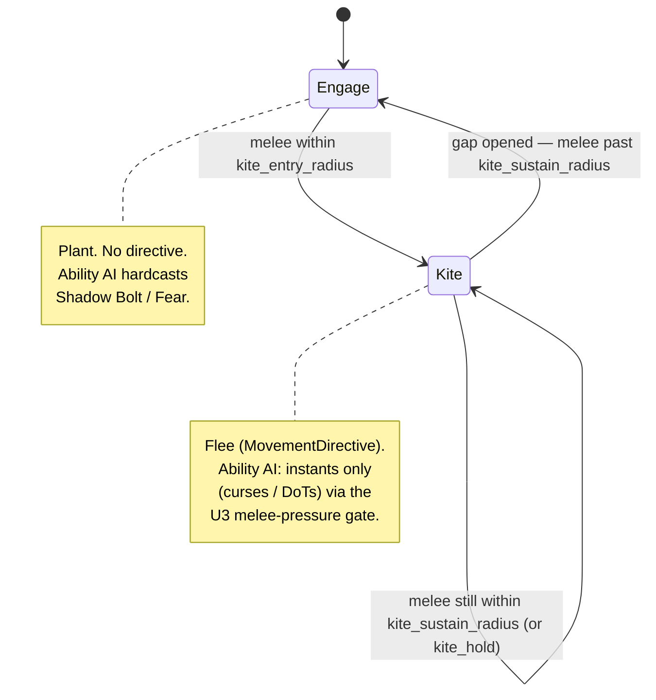

# feat: Warlock on the ENGAGE/KITE Movement Posture Machine

> **Outcome: implemented, measured, and reverted.** The feature was built per
> this plan and passed all tests, but a 2v2 balance sweep showed it regressed
> the Warlock by ~4–7 points (concentrated in the matchups it was meant to
> help). A DoT caster with Drain Life sustain and a Fear peel is better
> standing and casting than kiting in this combat model. The Warlock stays on
> legacy pursuit. See
> [`design-docs/balance/2026-06-14-warlock-movement-findings.md`](../../design-docs/balance/2026-06-14-warlock-movement-findings.md)
> for the data and mechanism. This plan is retained as the migration recipe in
> case the conclusion is revisited (re-measure first — balance will have
> drifted).

## Summary

Put the Warlock on the existing shared ENGAGE/KITE DPS-kiter machine as a
*planted caster that kites under duress* — it plants to hardcast Shadow Bolt
and Fear by default, and creates distance (instant curses/DoTs only) when a
melee focuses it. The work is a config block, a dispatch branch, and one
ability-AI alignment fix; the posture machine, scorer, trace, and KPI tooling
are reused unchanged.

---

## Problem Frame

The Warlock is one of three classes still on legacy target-pursuit in
`move_to_target` (`src/states/play_match/combat_core/movement.rs`): with a
target it walks to `preferred_range` (20 yards) and face-tanks. It is the one
ranged class whose damage is range-agnostic — Corruption, Unstable Affliction,
Immolate, and curses tick at any distance, and Shadow Bolt has no minimum range
— so it has no firing ring to orbit. Its movement need is "survive the melee
train while keeping DoTs ticking," which maps onto ENGAGE/KITE: plant and
hardcast when safe, flee and instant-cast when focused.

The ability AI already half-understands this: `is_being_kited()`
(`src/states/play_match/class_ai/warlock.rs:41`) suppresses interruptible casts
when slowed-and-out-of-range. What is missing is (a) the movement half — nothing
makes the Warlock create distance — and (b) alignment between that suppression
gate and the *proximity*-gated KITE posture (see U3 / KTD-2).

See origin: `docs/brainstorms/2026-06-13-warlock-movement-ai-requirements.md`.

---

## Requirements

Traceability back to the origin requirements doc.

- R1. The Warlock runs the shared two-posture machine (ENGAGE, KITE) on the
  existing DPS posture machinery via `evaluate_dps_posture`, with typed
  transitions, hysteresis, commit window, and `movement_decision` trace events.
  (origin R1)
- R2. KITE entry/exit is proximity-gated on a qualifying melee threat
  (Warrior/Rogue; ranged, healers, pets, stealthed excluded) using the existing
  `melee_within` predicate. No legacy `kiting_timer` writes. (origin R2)
- R3. In ENGAGE the Warlock plants (no posture directive) so it can hardcast
  Shadow Bolt and Fear; in KITE it moves to create distance and casts instants
  only. The hardcast/instant split must track the KITE posture, not just
  slow-detection. (origin R3; see KTD-2)
- R4. The Warlock's `range_band` has no *effective* inner dead zone: ENGAGE
  issues no directive (so the band never pulls a planted Warlock off its
  target), and the validator-mandated `range_band_min` only ever nudges
  outward during KITE, which aids the flee. The outer bound is Shadow Bolt
  cast range. (origin R4; see KTD-3)
- R5. When the chasing threat is the kill target, entry/sustain hysteresis
  produces a plant-once-gap-opened cycle: KITE until the threat is past the
  sustain radius, then ENGAGE and hardcast. The plant window at shipped tuning
  is long enough to land one Shadow Bolt. (origin R5)
- R6. When the chaser and kill target are different entities, the Warlock flees
  the threat (`flee`) while the `range_band` outer bound keeps the kill target
  in cast range, so DoT/instant pressure continues. (origin R6)
- R7. Warlock movement weights and posture params live in a `warlock` block in
  `assets/config/movement.ron` with struct defaults and startup validation,
  following the `mage`/`hunter` pattern. (origin R7)
- R8. Warlock movement is diagnosable with the same tooling as the other
  posture classes (`movement_decision` events, `scorer_terms`,
  `scripts/movement_kpis.sh`) without tooling changes. (origin R8)
- R9. A `warlock_postures` probe module pins KITE entry, the plant-once-gap
  cycle, the split-case flee geometry, and non-perturbation at fixed seeds.
  (origin R9)

---

## Key Technical Decisions

- KTD-1. **Reuse `evaluate_dps_posture` unchanged; the Warlock is a config +
  dispatch addition, not new machinery.** Research confirmed the function is
  parameterized by a `&DpsMovementConfig` plus two caller-supplied `bool`
  predicates (`entry`, `sustain`) with no class branch inside
  (`src/states/play_match/class_ai/dps_postures.rs:157`). Trace emission
  (KiteEnter/KiteExit/CommitExpired) and KPI/probe parity therefore come for
  free — no class-specific wiring (origin R8 satisfied mechanically).

- KTD-2. **The ability AI's hardcast suppression must consult the KITE posture,
  not just `is_being_kited()`.** The Warlock's KITE is proximity-gated (a melee
  is close), but `is_being_kited()` keys on `is_slowed && out_of_range`. A
  Warlock kiting an *un-slowed* melee would otherwise still attempt Shadow Bolt /
  Immolate / Drain Life, stand still to cast (the cast beats movement in the
  `move_to_target` ladder), and eat the hit — defeating the kite. U3 threads a
  melee-pressure signal into `decide_warlock_action` and folds it into the
  interruptible-cast gates. This is the one correctness seam the brainstorm did
  not surface.

- KTD-3. **Set `range_band_min = SAFE_KITING_DISTANCE (8.0)` and honor R4's
  "no dead zone" through ENGAGE-plants-with-no-directive, not a sub-8 minimum.**
  The validator requires `range_band_min >= SAFE_KITING_DISTANCE`
  (`movement_config.rs` DPS-kiter validation loop). This does not conflict with
  R4 in practice: in ENGAGE the machine removes the `MovementDirective` (the
  Warlock plants, so `range_band` never acts on a planted Warlock), and during
  KITE an outward nudge when very close to the kill target only reinforces the
  flee. No validation change is required — lower risk than relaxing the
  invariant.

- KTD-4. **Weights mirror the Hunter's flee-dominant profile, not the Mage's
  orbit profile.** `flee` high, `range_band` low (gentle outer leash, not an
  orbit), `corner_penalty` strictly greater than `flee` (the documented
  corner-stuck guard), `threat_repulsion` low. Concrete values are seeds for the
  matrix sweep, not load-bearing here (see Verification).

---

## High-Level Technical Design

The load-bearing behavior is the plant-once-gap-opened cycle (R5/F1). The
posture machine already implements it via entry/sustain hysteresis; the Warlock
just supplies the predicates and tuning.

Dispatch flow (mirrors Hunter at `src/states/play_match/combat_ai.rs:810`):
when gates are open, fetch `(_, kite_posture, directive)` from the existing
`posture_movement` query, select `&movement_config.warlock`, compute
`entry = melee_within(.., kite_entry_radius)` and
`sustain = melee_within(.., kite_sustain_radius)`, call `evaluate_dps_posture`,
then run `decide_warlock_action` with the melee-pressure signal (U3).

---

## Implementation Units

### U1. Add the `warlock` DPS config block

- **Goal:** A validated `warlock` movement config selectable as
  `movement_config.warlock`, tunable from RON, inheriting struct defaults.
- **Requirements:** R7 (and the substrate for R1–R6).
- **Dependencies:** none.
- **Files:**
  - `src/states/play_match/movement_config.rs` — add `pub warlock:
    DpsMovementConfig` to `MovementConfig`; add `("warlock",
    &self.warlock.weights)` to the per-class weights validation loop; add
    `("warlock", &self.warlock)` to the DPS-kiter (`mage`/`hunter`) validation
    loop.
  - `assets/config/movement.ron` — add a `warlock:` block after `hunter:`,
    templated from the `hunter` block.
- **Approach:** Reuse `DpsMovementConfig` as-is (no new struct). Seed tuning
  (KTD-4): `flee` high (~6.0), `range_band` low (~0.5), `corner_penalty` >
  `flee` (~8.0), `threat_repulsion` low (~1.0), `formation_pull`/`wand_pull`
  0.0. `range_band_min: 8.0` (KTD-3). `range_band_max:` Shadow Bolt cast range
  — verify in `assets/config/abilities.ron`; the validator caps it at
  `AUTO_SHOT_RANGE`, so use `min(shadow_bolt_range, AUTO_SHOT_RANGE)`.
  `directive_ttl: 3.0`, `commit_window: 0.6`. `kite_entry_radius` /
  `kite_sustain_radius`: start tighter than Hunter's 20/24 (the Warlock wants
  more plant time to hardcast) — e.g. ~12/14 — and settle in the sweep, keeping
  `kite_sustain_radius >= kite_entry_radius`.
- **Patterns to follow:** the existing `mage:` and `hunter:` RON blocks
  (`assets/config/movement.ron:88`); the validation loops in
  `movement_config.rs`.
- **Test scenarios:**
  - Default-construction: `MovementConfig::default().warlock` passes
    `validate()` with no issues.
  - Partial-RON inheritance: a `(warlock: (weights: (flee: 6.0)))` fragment
    parses and unspecified fields equal `DpsMovementConfig::default()` (mirror
    the existing `partial_ron_uses_defaults` test).
  - Validation catches a bad block: `range_band_min` below
    `SAFE_KITING_DISTANCE`, `kite_sustain_radius < kite_entry_radius`, and
    `directive_ttl < commit_window` each produce a `validate()` issue naming
    `warlock`.
  - The shipped `movement.ron` `warlock` block passes `validate()` (the
    existing config-load test should now exercise the warlock field).

### U2. Wire the Warlock dispatch branch

- **Goal:** The Warlock runs `evaluate_dps_posture` each AI tick before its
  ability decision, producing ENGAGE/KITE transitions and directives.
- **Requirements:** R1, R2, R5, R6.
- **Dependencies:** U1.
- **Files:** `src/states/play_match/combat_ai.rs` — expand the
  `CharacterClass::Warlock` match arm (~line 754) to run the posture eval, then
  call `decide_warlock_action`.
- **Approach:** Copy the Hunter block (`combat_ai.rs:810`): gate on
  `countdown.gates_opened`; `if let Ok((_healer, kite_posture, directive)) =
  posture_movement.get_mut(entity)`; `let cfg = &movement_config.warlock`;
  `entry = melee_within(&ctx, entity, my_pos, cfg.kite_entry_radius)`;
  `sustain = melee_within(&ctx, entity, my_pos, cfg.kite_sustain_radius)`;
  call `evaluate_dps_posture(.., kite_posture.map(Mut::into_inner), directive,
  cfg, entry, sustain, time.elapsed_secs(), &mut decision_trace)`. The
  `posture_movement` query and `KitePosture`/`MovementDirective` insertion are
  already in place — no new query or component registration.
- **Patterns to follow:** the Hunter dispatch arm verbatim, substituting
  `movement_config.warlock` and the Warlock decision call.
- **Test scenarios:** behavioral coverage lives in U4 (probes). No isolated
  unit test for the dispatch wiring; the registration audit and a green build
  confirm structural correctness.
- **Execution note:** none.

### U3. Align hardcast suppression with the KITE posture

- **Goal:** While in KITE (melee pressure), the Warlock defers interruptible
  casts (Shadow Bolt, Immolate, Drain Life) to instants — even when not slowed.
- **Requirements:** R3 (and makes R5's plant window meaningful — hardcasts only
  fire in ENGAGE).
- **Dependencies:** U2.
- **Files:** `src/states/play_match/class_ai/warlock.rs` — thread a
  `melee_pressured: bool` parameter into `decide_warlock_action`; fold it into
  the `being_kited` value (`let being_kited = is_being_kited(..) ||
  melee_pressured;`) used by the Immolate, Drain Life, and Shadow Bolt gates.
  `src/states/play_match/combat_ai.rs` — pass the signal from the dispatch arm.
- **Approach:** The dispatch already computes `sustain = melee_within(..,
  kite_sustain_radius)` for U2; reuse it as the `melee_pressured` argument
  (a melee within sustain radius is exactly "the Warlock is/should-be kiting").
  This keeps a single source of truth and avoids re-reading the posture
  component after `into_inner`. Instants (Corruption, UA, curses) and the
  existing kited-rejection traces are unchanged; only the interruptible-cast
  branches gain the broadened guard. Confirm Fear's handling: Fear is a cast —
  decide whether it is deferred under melee pressure too (recommend yes, treat
  it like the other casts) so a kiting Warlock does not root itself mid-flee;
  capture the choice in the trace rejection note.
- **Patterns to follow:** the existing `being_kited` gates in
  `warlock.rs:150/192/213`.
- **Test scenarios:**
  - Covers R3. With a melee within sustain radius and no slow on the Warlock,
    `decide_warlock_action` rejects Shadow Bolt / Immolate / Drain Life with the
    being-kited precondition note and chooses an instant (Corruption/curse) or
    nothing — asserted via the decision trace in a focused headless match.
  - With no melee nearby (ENGAGE) and a valid target, the Warlock chooses
    Shadow Bolt (hardcast not suppressed).
  - Slow-only path still works: a slowed, out-of-range Warlock with no melee
    within sustain radius still reads as kited (existing `is_being_kited`
    behavior preserved — no regression).
- **Execution note:** none.

### U4. `warlock_postures` probe module

- **Goal:** Pin the Warlock posture behavior at fixed seeds and prove the
  observer is non-perturbing.
- **Requirements:** R9 (verifies R5, R6, R3, R4); R8 (trace parity exercised).
- **Dependencies:** U1, U2, U3.
- **Files:** `tests/movement_probes.rs` — add a `warlock_postures` module.
- **Approach:** Copy the `hunter_postures` idiom (`tests/movement_probes.rs`
  ~3035): `run_traced` helper, `warlock_events` filter on
  `movement_decision` + `actor.class == "Warlock"`, `kite_windows` from
  KiteEnter/KiteExit. Use a fixed Warlock seed. Reuse the KPI helpers
  (`path_length`, `time_within_range_of`, `separation_gained_during`,
  `assert_min_occurrences`).
- **Patterns to follow:** `mage_postures` / `hunter_postures` modules; the
  `observed_run_does_not_perturb_outcomes` self-test.
- **Test scenarios:**
  - Covers R5 / AE1. Warlock vs Warrior (chaser == kill target): assert ≥1
    KiteEnter and that ENGAGE windows exist between kites long enough for a
    Shadow Bolt cast (assert at least one Shadow Bolt `ability_decision` choose
    event lands inside an ENGAGE window). Use `assert_min_occurrences` so a seed
    shift fails loudly rather than passing vacuously.
  - Covers R6 / AE2. Warlock + (different kill target) vs a melee chaser:
    `time_within_range_of(warlock, kill_target, cast_range)` stays high across
    the chase window while `separation_gained_during(warlock, chaser, window)`
    is positive — fleeing the chaser without dropping the target out of range.
  - Covers R4 / AE3. In ENGAGE (no melee within entry radius) the Warlock holds
    position — assert no `MovementDirective`-driven displacement toward/away
    from the kill target for range reasons (path length near zero across an
    ENGAGE-only window).
  - Non-perturbation: a Warlock-containing match observed vs unobserved at the
    same seed returns identical `MatchResult` (mirror
    `observed_run_does_not_perturb_outcomes`).
- **Execution note:** none.

---

## Scope Boundaries

### Deferred to Follow-Up Work

- Matrix-tuning the Warlock block (kite radii, `directive_ttl`, weights) and
  regenerating any affected canonical baselines — a balance pass after the
  behavior lands, not a code unit. (See Verification.)

### Deferred for later (from origin)

- The "kite when a teammate CCs my chaser" opening trigger — a new
  KITE-entry predicate, deferred to a fast-follow. Base behavior degrades
  gracefully: a CC'd chaser stops following, so proximity-gated KITE relaxes
  on its own.
- Fear-aware pathing (don't kite into where a feared target flees).
- Low-HP Drain Life planting (deliberately creating a channel window).

### Outside this work (from origin)

- Enemy melee-pet kiting (threat set excludes pets, consistent with Hunter's
  known limitation).
- Line-of-sight / pillar play (whole-system gap, every posture class).
- Warrior / Rogue migration (separate; Rogue needs new stealth scorer
  vocabulary).

---

## Verification

- **Build + audit:** `cargo build --release` and `cargo test` green, including
  `tests/registration_audit.rs` (no new systems are added, but the dispatch
  edit must not break it) and the new U1/U3/U4 tests.
- **Config:** `cargo test` exercises `validate()` on the shipped
  `movement.ron` `warlock` block.
- **Probes:** the `warlock_postures` module passes at its fixed seeds.
- **Trace/KPI parity (manual spot-check):** run a Warlock match with
  `--trace-mode on`, confirm `movement_decision` events with
  `actor.class == "Warlock"` and KiteEnter/KiteExit triggers appear, and that
  `scripts/movement_kpis.sh` emits a Warlock row unmodified.
- **Behavioral KPIs vs baseline:** with a focused-Warlock config, confirm
  `pct_within_4yd` / `min_nearest_enemy` improve (less face-tanking) and
  post-gate path length rises versus the legacy-pursuit baseline, while the
  Warlock still lands Shadow Bolts in plant windows.
- **Balance sweep:** `scripts/hunter_2v2_matrix.sh 100` (adapt teams to include
  Warlock comps) shows Mage/Hunter/Priest/Paladin unchanged (shared machinery,
  separate config) and Warlock matchup shifts explainable by the new movement.

---

## Sources & Research

- `src/states/play_match/class_ai/dps_postures.rs:157` — `evaluate_dps_posture`
  signature, the entry/sustain `bool` contract, `melee_within` (`:128`),
  `is_kite_threat` (`:143`), and trace emission (`:203`, `:298`).
- `src/states/play_match/combat_ai.rs` — Mage dispatch (`:637`), Hunter
  dispatch (`:810`), current Warlock arm (`:754`), and the `posture_movement`
  query (`:500`).
- `src/states/play_match/movement_config.rs` — `DpsMovementConfig` (`:247`),
  `MovementConfig` (`:305`), weights validation loop (`:412`), DPS-kiter
  validation loop (`:437`), and the `partial_ron_uses_defaults` test (`:713`).
- `assets/config/movement.ron:88` — `mage` / `hunter` block templates.
- `src/states/play_match/class_ai/warlock.rs:41` — `is_being_kited` and the
  interruptible-cast gates (`:150`, `:192`, `:213`).
- `tests/movement_probes.rs` — `mage_postures` (~2877), `hunter_postures`
  (~3035), `observed_run_does_not_perturb_outcomes` (~280), and the KPI helpers.
- `scripts/movement_kpis.sh` — class-agnostic position/KPI extraction.
- Origin: `docs/brainstorms/2026-06-13-warlock-movement-ai-requirements.md`.
