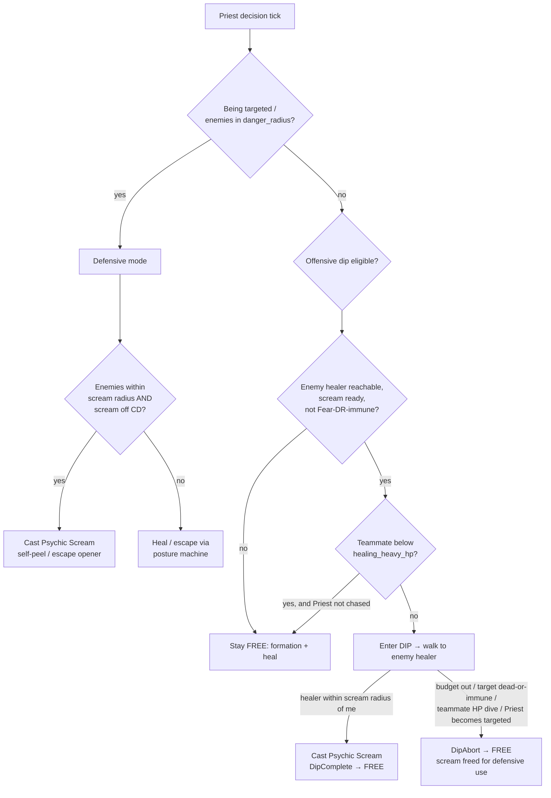

# feat: Add Psychic Scream to Priest

## Summary

Add Psychic Scream to the Priest: an instant, self-centered AoE fear that
applies the existing `Fear` aura to all enemies within a short radius of the
caster, with full visual/UI scope and dual-mode movement AI. When the Priest
is being focused, the scream is a defensive self-peel / escape opener; when it
is not, the Priest performs an aggressive offensive "dip" toward the enemy
healer to fear them, deferring only when a teammate needs healing.

---

## Problem Frame

The Priest is currently underpowered — no hard CC, no panic button — and its
movement AI is built to flee from danger, which makes it easy to train. It
also has no offensive lever to disrupt an enemy healer. Psychic Scream is the
canonical Classic answer: a short-range AoE fear. Its limited radius is the
design tension — it only matters when enemies are close, which fights the
healer's instinct to maximize distance. The useful property is that fear sends
enemies running *away* from the caster, so the separation the ability creates
is the same separation a fleeing healer already wants, and the same lever can
be turned outward to shut off an enemy healer.

The mechanics already exist in the codebase, so this is primarily a
composition-and-AI task: the `Fear` aura (Warlock), self-centered AoE
application (Mage Frost Nova), and a dip-to-CC-the-enemy-healer movement
behavior (Paladin DIP) are all present and directly reusable.

---

## Key Technical Decisions

- **Reuse the Frost Nova cast shape, drop the damage half.** The cast body
  clones `try_frost_nova` (`src/states/play_match/class_ai/mage.rs:371`):
  gather enemies within radius of `my_pos`, per-target immune check, queue the
  aura via `AuraPending::from_ability` + `same_frame_cc_queue` + `commands.spawn`,
  `builder.choose(ability, None, true)`. The `Root` aura becomes `Fear`, the
  `QueuedAoeDamage` / damage-roll half is omitted, and a `DRCategory::Fears`
  guard is added per target (Frost Nova's Root has no DR; Fear does). Because
  application rides existing aura plumbing, **no new combat system is added** —
  this sidesteps the dual-registration silent-failure class entirely.

- **Fear aura semantics match the live Warlock Fear.** `break_on_damage: 100.0`
  (verified live at `assets/config/abilities.ron:392`), `duration: 8.0`,
  `magnitude: 0.0`. Not `0.0` (Polymorph-style instant break) and not `-1.0`
  (immunity/never-break). Consequence carried from origin: a focused, feared
  enemy healer breaks free after ~100 cumulative damage, so the offensive
  payoff is "fear the healer while the team kills a *different* target."

- **Defensive mode is owned by the posture machine; only the offensive dip is
  new movement.** Per the Frost Nova precedent, post-cast repositioning belongs
  to the FREE/PRESSURED/ESCAPE machine reacting to the new state, not to the
  ability. The defensive scream is a `try_*` predicate that fires from the
  pressured/escape context. Only the offensive dip introduces new movement
  logic. (see origin: `docs/brainstorms/2026-06-14-psychic-scream-priest-requirements.md`)

- **The offensive dip is a Priest-specific clone of the Paladin DIP, not a
  refactor of it.** The Paladin dip (`src/states/play_match/class_ai/paladin_postures.rs`)
  is hardcoded to Hammer of Justice (`HojPlan`, `dip_target_candidate`,
  `hoj_target_eligible`, `def.range`). Rather than extract a generic dip core —
  which risks regressing the validated Paladin behavior — the Priest gets an
  analogous scream-dip keyed to `PsychicScream` + `DRCategory::Fears`, with a
  self-AoE arrival condition ("enemy healer within scream radius of *me*"
  rather than single-target range). Generic extraction is deferred to
  follow-up. This requires a new `PriestMovementPlan`-style return type because
  the Priest currently passes only `escape_defer: Option<f32>`.

- **Mode arbitration is by targeting status, defensive-first.** The
  `compound_pressure_trigger` signal (`src/states/play_match/class_ai/healer_postures.rs:113`,
  already consumed at `priest.rs:591`) decides the mode: being targeted /
  enemies in `danger_radius` → defensive; otherwise → offensive dip eligible.
  The defensive self-peel always preempts the offensive-dip reservation the
  moment the Priest becomes the target.

- **Determinism preserved.** The AoE target gather iterates `ctx.combatants`
  (already a `BTreeMap`) into a `Vec`; no `HashMap`/`HashSet` introduced in the
  hot path. Trace byte-identity and seeded determinism are pinned by the
  existing audits.

- **Starting tuning values are on this game's scale, finalized by sweep.**
  radius `~8.0`, cooldown `~30.0`, fear duration `8.0`, mana `~50–60` (game
  costs run 18–30, not Classic's 210). These are starting points; the balance
  sweep sets finals.

---

## High-Level Technical Design

Dual-mode arbitration evaluated each Priest decision tick (defensive-first),
and the offensive dip lifecycle (mirroring the Paladin DIP states/triggers):

Posture states reuse the existing shared `Posture { Free, Pressured, Escape, Dip }`
(`src/states/play_match/components/movement.rs:66`); trace triggers reuse
`DipEnter` / `DipComplete` / `DipAbort`
(`src/states/play_match/decision_trace/events.rs:250`). No new posture or
trigger variants are required.

---

## Implementation Units

### U1. Ability definition and data wiring

- **Goal:** Psychic Scream exists as a loadable, validated ability with an
  icon — castable in principle, no AI yet.
- **Requirements:** R1, R2, R3, R4, R6 (icon half).
- **Dependencies:** none.
- **Files:**
  - `src/states/play_match/abilities.rs` — add `PsychicScream` to `AbilityType` (near the Priest abilities, ~line 81–88).
  - `src/states/play_match/ability_config.rs` — add `AbilityType::PsychicScream` to the `expected_abilities` array in `validate()` (~line 278).
  - `assets/config/abilities.ron` — add the `PsychicScream` definition in the Priest block.
  - `assets/icons/abilities/<psychic_scream_icon>.jpg` — source and save the icon (Wowhead MCP unavailable this session; download separately, e.g. Shadow Word: Death / Psychic Scream icon).
- **Approach:** Model the RON entry on Warlock `Fear` (aura shape) and Frost
  Nova (instant self-AoE: `cast_time: 0.0`, short `range`). Aura block:
  `applies_aura: Some(( aura_type: Fear, duration: 8.0, magnitude: 0.0, break_on_damage: 100.0 ))`.
  Start values: `range: 8.0`, `cooldown: 30.0`, `mana_cost: 55.0`,
  `spell_school: Shadow`. No `combat_core/casting.rs` change — instant CC-only
  abilities apply via the class AI, not a `CastingState` insert.
- **Patterns to follow:** `Fear` (`abilities.ron:380`), `FrostNova`
  (`abilities.ron:39`); the new-ability checklist in
  `docs/solutions/implementation-patterns/adding-new-class-paladin.md`.
- **Test scenarios:**
  - Covers R4. Ability config loads without panic and `validate()` passes with `PsychicScream` present in `expected_abilities`.
  - Covers R4. Removing `PsychicScream` from the RON (or the icon field) fails the loader / `all_abilities_have_icons` test — confirms wiring is enforced.
  - The loaded definition has `break_on_damage == 100.0`, `cast_time == 0.0`, and `aura_type == Fear`.
- **Verification:** `cargo test` passes (config validation + icon test); a
  headless match with a Priest loads and the ability is present in the ability
  set.

### U2. Defensive mode — self-centered AoE fear cast + predicate

- **Goal:** The Priest casts Psychic Scream as a self-peel / escape opener when
  it is being focused with enemies inside scream radius.
- **Requirements:** R1, R2, R5, R9, R10, R15 (ability-trace half).
- **Dependencies:** U1.
- **Files:**
  - `src/states/play_match/class_ai/priest.rs` — add `try_psychic_scream` (pure predicate + cast body); slot it into `decide_priest_action` (~line 77–131) high in the chain (after urgent dispel, before Flash Heal). `decide_priest_action`'s signature must gain `same_frame_cc_queue: &mut Vec<(Entity, Aura)>` (the cloned cast body pushes to it for same-frame CC visibility) — the Mage and Paladin dispatch already pass this; the Priest does not.
  - `src/states/play_match/combat_ai.rs` — pass `&mut same_frame_cc_queue` into the Priest `decide_priest_action` call (~line 712–725), mirroring the Mage/Paladin call sites (`combat_ai.rs:677–678` / `:805`).
  - `src/states/play_match/class_ai/priest.rs` (tests) or a sibling unit-test module — predicate unit tests over a `CombatContext`.
- **Approach:** Clone the `try_frost_nova` body
  (`src/states/play_match/class_ai/mage.rs:371`): `pre_cast_ok(ability, def,
  combatant, my_pos, auras, None, ctx, opts)` (target `None` for self-AoE);
  gather alive enemies within `def.range` of `my_pos` from `ctx.combatants`
  into a `Vec`; per target, skip `ctx.entity_is_immune(target)` and
  `ctx.is_dr_immune(target, DRCategory::Fears)`, then
  `AuraPending::from_ability` + `same_frame_cc_queue.push` + `commands.spawn`;
  `spawn_speech_bubble`; `combat_log.log_crowd_control(...)`;
  `builder.choose(ability, None, true)`. Omit all `QueuedAoeDamage` / damage
  code. Fire condition (R9/R10): the Priest is PRESSURED or entering an ESCAPE
  window AND ≥1 fear-eligible enemy is within scream radius — preferred over
  committing to flee movement, so the fear-driven separation compounds the
  escape. AoE target filtering is the caller's responsibility (`pre_cast_ok`
  guards only a single target).
- **Execution note:** Write `try_psychic_scream` as a pure function over
  `CombatContext` (like `escape_window` math and `rotation_hoj_allowed`) so the
  predicate is unit-testable without a full match.
- **Patterns to follow:** `try_frost_nova` (cast shape), Warlock `try_fear`
  (Fear-DR guard), warrior trace usage (`class_ai/warrior.rs`),
  `docs/solutions/ai-decision-patterns/friendly-cc-break-prevention.md`
  (AoE filtering is manual).
- **Test scenarios:**
  - Covers AE1, R9. Priest PRESSURED with a melee enemy inside scream radius, scream off CD → `builder.choose(PsychicScream, None, true)`; the enemy receives a `Fear` aura.
  - Covers R8. When the scream lands, a speech bubble spawns (`spawn_speech_bubble`) and a `[CC] ... Fear` entry is written via `combat_log.log_crowd_control` — assert the feedback fires, not just the aura.
  - Covers R10. Priest entering an escape window with a chaser inside scream radius → scream is chosen before flee movement commits (predicate fires in the escape-entry context).
  - Covers R5. An immune enemy and a Fear-DR-immune enemy inside radius are filtered out of the applied set; non-immune enemies are still feared.
  - Edge: no fear-eligible enemy within radius → predicate rejects with `NoValidTarget`; on cooldown → `OnCooldown`; insufficient mana → `InsufficientMana` (decision-trace reasons present, existing variants).
  - Edge: empty enemy set / all enemies dead → no cast, no panic.
- **Verification:** Unit tests pass; a headless match (Priest + ally vs. a
  melee-heavy enemy team) shows `[CC] ... Fear` log entries from the Priest and
  the trace records a `PsychicScream` `choose` event when pressured.

### U3. Priest dip scaffolding (behavior-preserving)

- **Goal:** Introduce the return-type and config plumbing for a Priest dip,
  with no behavior change yet (the dip never triggers).
- **Requirements:** Enables R11–R14 (no behavior on its own).
- **Dependencies:** U1.
- **Files:**
  - `src/states/play_match/class_ai/priest.rs` — add a `PriestMovementPlan`-style return type (mirror `PaladinMovementPlan` / `HojPlan` at `paladin.rs:44/65`) carrying a scream-dip-cast signal; thread it from `evaluate_priest_posture` (~line 565) into `decide_priest_action` (replacing/extending the `escape_defer: Option<f32>` param at ~line 65). `evaluate_priest_posture` must also gain `abilities: &AbilityDefinitions` and `auras: Option<&ActiveAuras>` params (the U4 dip-entry predicate needs the `PsychicScream` def for reach/eligibility and auras for `pre_cast_ok`) — `evaluate_paladin_posture` already takes both; the Priest does not. Add them here so they are inert until U4.
  - `src/states/play_match/movement_config.rs` — `PriestMovementConfig` already exists (~line 148–173, weights/formation fields only); add dip fields to it (`dip_budget`, `healing_heavy_hp`; reuse shared params where possible), with struct defaults and `validate()` coverage (mirror `PaladinMovementConfig`'s dip fields at ~line 178–204 and validation at ~line 330–356).
  - `assets/config/movement.ron` — add the `priest:` dip fields (defaults so a partial file still validates).
  - `src/states/play_match/combat_ai.rs` — thread the new `PriestMovementPlan` return type and the new `evaluate_priest_posture` args through the existing Priest dispatch call (~line 695–725). Scope here is the type/arg handshake only — no new dip routing branches (those land in U4).
- **Approach:** Pure scaffolding. The new plan always resolves to the existing
  behavior (no dip, no cast-defer change) and the new posture params stay
  unused, so this unit is behavior-preserving.
  Default config values: `dip_budget: 6.0`, `healing_heavy_hp: 0.6` (match the
  Paladin starting points; tuned later).
- **Patterns to follow:** `PaladinMovementConfig` + its `validate()` and
  `mod tests` (`movement_config.rs:539`); `PaladinMovementPlan` / `HojPlan`.
- **Test scenarios:**
  - Covers R4-analog. `movement.ron` with the new `priest:` fields validates; a partial file (omitting one field) still validates via struct defaults.
  - `validate()` rejects a non-positive `dip_budget` and a `healing_heavy_hp` outside `[0,1]`.
  - Behavior-preserving check: existing `priest_postures` / `escape_windows` probes remain byte-identical to pre-change (the dip is inert).
- **Verification:** `cargo test` green including existing movement probes;
  a matrix spot-check shows Priest cells unchanged vs. pre-U3.

### U4. Offensive scream-dip behavior

- **Goal:** When the Priest is safe, it dips toward the enemy healer and fears
  them, deferring when a teammate needs healing, and aborting safely.
- **Requirements:** R11, R12, R13, R14, R15 (dip-trace half).
- **Dependencies:** U2, U3.
- **Files:**
  - `src/states/play_match/class_ai/priest.rs` — dip target selection (nearest Fear-eligible enemy *healer* within reach), FREE→DIP entry predicate, reservation logic, abort logic, and the dip-cast branch in `decide_priest_action`; emit `DipEnter` / `DipComplete` / `DipAbort` via the existing builders.
  - `src/states/play_match/class_ai/priest.rs` (`evaluate_priest_posture`) — add the DIP arm the Priest currently lacks (see the `priest.rs:627` note "DIP is Paladin-only").
  - `src/states/play_match/combat_ai.rs` — add the live dip-cast routing branch in the Priest dispatch (consuming the `PriestMovementPlan` dip-cast arm scaffolded in U3).
- **Approach:** Clone the Paladin dip structure
  (`src/states/play_match/class_ai/paladin_postures.rs`:
  `evaluate_dip_entry:265`, `dip_should_abort:315`, `paladin_dip_tick:419`)
  keyed to `PsychicScream` + `DRCategory::Fears`. Differences from the Paladin:
  (1) **arrival condition is self-AoE** — "enemy healer within scream radius of
  *me*", not single-target `def.range`; the dip target drives only the walk
  goal (`MovementGoal::Entity(healer)`), and the cast lands on every enemy in
  radius (reuse U2's cast body). (2) **Aggressive default + deferral** — enter
  DIP whenever an enemy healer is reachable, scream is ready, and the Priest is
  not the target (`!compound_pressure_trigger`); defer only when any living
  teammate is below `healing_heavy_hp` AND the Priest is not chased (matches
  R12's "a teammate"; the eligibility check inspects the most-injured ally). (3)
  **Reservation** — suppress the defensive self-peel from spending the scream
  while a living enemy healer exists and the Priest is not pressured (mirror
  `rotation_hoj_allowed` at `paladin.rs:88` and the reservation note at
  `paladin.rs:238–253`); the defensive predicate preempts the moment the Priest
  becomes the target. (4) **Dip-cast handshake** — the walk hands off to the
  cast via a `PriestMovementPlan` dip-cast arm (analogous to
  `HojPlan::DipCast { target, completed_state }`) consumed in
  `decide_priest_action`: on a successful scream, insert the completed FREE
  posture, remove the `MovementDirective`, and emit `DipComplete` exactly once
  via `start_movement_event_with_target` — mirroring `paladin.rs:192–215`.
- **Technical design (directional, not implementation spec):** abort when any of
  — dip budget expires, dip target dead/immune (incl. Fear-DR), most-injured
  ally HP dives below threshold, or the Priest becomes targeted — matching the
  Paladin `dip_should_abort` set; on abort, the scream is freed for immediate
  defensive use that same tick.
- **Patterns to follow:** Paladin DIP (`paladin_postures.rs`, `HojPlan` cast
  branch at `paladin.rs:192–215`), `dip_target_candidate` / `hoj_target_eligible`
  (`paladin.rs:97–113`), DIP trace emission sites (`paladin_postures.rs:447–457`,
  `paladin.rs:202–212`, `paladin_postures.rs:400–409`).
- **Test scenarios:**
  - Covers AE2, R11. Priest safe, enemy = DPS + healer, team healthy, scream off CD → Priest enters DIP, walks to the enemy healer, and on arrival casts Psychic Scream; the enemy healer (and any enemy in radius) receives `Fear`; trace shows `DipEnter` then `DipComplete`.
  - Covers AE3, R12. Priest safe and enemy healer reachable, but a living teammate is below `healing_heavy_hp` → no `DipEnter`; the Priest heals; the scream is preserved.
  - Covers AE5, R3. Priest dips with both an enemy healer and an enemy DPS inside scream radius → a single Psychic Scream cast applies `Fear` to both (two CC-log entries from one cast event); if the Priest's team then focuses the feared healer, the healer's fear breaks after ~100 cumulative damage (validates the AoE-scatter + break-economics line).
  - Covers AE4, R13, R14. Mid-dip, a melee switches onto the Priest → `DipAbort`, and the scream becomes available for a defensive self-peel the same/next tick.
  - Covers R13. Mid-dip the enemy healer dies or becomes Fear-DR-immune, or the dip budget expires → `DipAbort` with the appropriate trigger; no cast.
  - Covers R14. While a living enemy healer exists and the Priest is not pressured, the defensive self-peel does not spend the scream (reservation holds); becoming targeted releases the reservation.
- **Verification:** Headless 2v2 (Priest + DPS vs. DPS + Priest) trace shows
  `DipEnter`→`DipComplete` with the dip target = enemy healer entity, and the
  scream's `Fear` landing on that healer; the deferral and abort scenarios
  reproduce at fixed seeds.

### U5. Visual effect — self-centered scream burst

- **Goal:** Casting Psychic Scream renders an expanding AoE burst around the
  Priest in graphical mode.
- **Requirements:** R7 (R8 already satisfied by U2's `spawn_speech_bubble` +
  CC-log reuse).
- **Dependencies:** U2.
- **Files:**
  - `src/states/play_match/components/visual.rs` — add a `ScreamBurst` marker component (mirror `DispelBurst` at ~line 145).
  - `src/states/play_match/rendering/effects.rs` — add `spawn_scream_burst` / `update_scream_bursts` / `cleanup_expired_scream_bursts` (clone the dispel-burst trio at ~line 960/993/1029; larger radius, `AlphaMode::Add`, `Res<Time>`, `try_insert`, `Without<T>` on the second Transform query).
  - `src/states/play_match/class_ai/priest.rs` — spawn the `ScreamBurst` marker at the cast site (graphical mode).
  - `src/states/mod.rs` — register the three systems in `StatesPlugin::build()` (graphical-only, `.after(CombatSystemPhase::CombatResolution)`; mirror the dispel registration at ~line 200–204).
- **Approach:** Pure presentation; no gameplay coupling. Per the visual-effect
  pattern, register in `states/mod.rs` only (not `systems.rs`) so headless is
  unaffected. The `registration_audit` test will confirm the new systems are
  registered.
- **Patterns to follow:** `spawn_dispel_visuals` trio;
  `docs/solutions/implementation-patterns/adding-visual-effect-bevy.md`;
  MEMORY visual-effects conventions.
- **Test scenarios:**
  - Test expectation: none (visual-only presentation) — except the
    `registration_audit` test must pass (the three new `pub fn` systems are
    registered in `StatesPlugin::build()`).
  - Headless mode runs unchanged (no visual systems registered there).
- **Verification:** `cargo test` (registration audit) passes; graphical client
  shows the burst on cast; a headless match is byte-identical to pre-U5.

### U6. Behavioral probes and balance validation

- **Goal:** Pin both movement modes at fixed seeds and validate the balance
  impact with the correct measurement protocol.
- **Requirements:** Success criteria from origin (Priest win-rate up, both
  modes fire, no unintended regressions).
- **Dependencies:** U2, U4.
- **Files:**
  - `tests/movement_probes.rs` — add a `psychic_scream` module mirroring the `priest_postures` idiom (`run_observed_traced`, `movement_events`).
- **Approach:** Use the read-only observed/traced harness to assert: (a)
  defensive — separation gained during the scream-peel window when the Priest
  is trained; (b) offensive — `DipEnter`→`DipComplete` against the enemy healer
  in a safe scenario; (c) deferral — no `DipEnter` when a teammate is below the
  heal threshold. Guard window-conditional probes with `assert_min_occurrences`
  so a seed shift can't make them vacuously pass. Then run the balance sweep
  and apply the side-symmetrized protocol (every cell symmetrized, raw mirrors
  reported and excluded from tuning) to set final tuning values.
- **Patterns to follow:** `tests/movement_probes.rs` `priest_postures` /
  `escape_windows` modules; `docs/solutions/implementation-patterns/mirror-asymmetry-side-symmetrized-measurement.md`;
  the `balance-sweep` skill and `scripts/hunter_2v2_matrix.sh` (adapt teams).
- **Test scenarios:**
  - Covers AE1. Defensive: in a Priest-trained scenario, `separation_gained_during` the scream window is positive; `assert_min_occurrences` confirms the window set is non-empty.
  - Covers AE2. Offensive: trace contains a `DipEnter` carrying a `target` (the enemy healer entity) followed by `DipComplete`.
  - Covers AE3. Deferral: in a teammate-low scenario, zero `DipEnter` events for the Priest.
  - Self-test: an observed run remains bit-identical to an unobserved run at the same seed (existing harness guarantee still holds).
- **Verification:** `cargo test` green (probes + full suite); a side-symmetrized
  2v2/3v3 sweep (N=100, 300s cap) shows a measurable Priest win-rate
  improvement with no significant unintended regressions; final tuning values
  committed to `abilities.ron` / `movement.ron`.

---

## Scope Boundaries

- Psychic Scream as a damage or rotational ability — out (CC-only).
- Diminishing-returns / CC-stacking system changes — out; uses the existing
  Fear aura, `DRCategory::Fears`, and break-on-damage economics as-is.
- Changes to the Warlock's existing single-target Fear — out.
- Constraining the offensive dip's AoE to never catch a friendly kill target —
  out for v1 (acceptable full-peel side effect; revisit if sweeps show it
  scattering kills net-negatively).

### Deferred to Follow-Up Work

- Extracting a generic, ability-parameterized dip core shared by Paladin and
  Priest (this plan clones rather than refactors to protect the validated
  Paladin dip).
- A generalized AoE-ability framework (the Frost Nova pattern is reused
  directly, not abstracted).

---

## Risks & Dependencies

- **Regressing the Priest movement baseline.** U3 is explicitly
  behavior-preserving and gated by byte-identity against existing probes;
  behavior changes land only in U4. Mitigation: keep U3 inert and verify
  matrix cells unchanged before U4.
- **Dip feeds a cloth healer to the enemy.** The aggressive default is bounded
  by the deferral guard (teammate-low) and the defensive-first preemption
  (becoming targeted aborts the dip). Final aggressiveness is a tuning outcome
  of U6's sweep, not a fixed value.
- **Measurement error.** Same-frame action races create up to ~18% side bias;
  all sweep cells must be side-symmetrized and mirrors excluded from tuning
  (see Key Technical Decisions and the mirror-asymmetry doc).
- **Icon asset.** The Wowhead MCP was unavailable this session; the icon must
  be sourced and saved (U1). The icon-field test enforces a non-empty path;
  the timeline UI needs the file to exist.
- **Dependency:** the recent casting-visibility fix (commit `b14b577`,
  2026-06-07) ensures a mid-cast enemy healer is visible to the dip's target
  lookup — if the dip "does nothing while the healer casts," re-check this
  first.

---

## Open Questions (Deferred to Implementation)

- **Reservation reachability gate.** R14 reserves the scream while a living
  enemy healer merely *exists*, but R11 enters the dip only when the healer is
  *reachable*. If the healer is alive but unreachable (large map, kiting), the
  reservation could starve the Priest's defensive panic button during a brief
  pressure dip. Decide during U4 whether the reservation predicate should also
  require dip-reachability; the U6 sweep will show whether it matters.
- **Dip-abort cooldown semantics.** On `DipAbort`, the scream is "freed for
  defensive use." Confirm the cooldown is consumed once by the eventual cast
  (not reset by the abort) so an abort-then-defensive-cast in the same tick
  isn't a free double-use. Resolve when wiring U4's abort path.
- **Dip-target-in-radius at cast time.** The self-AoE arrival condition fires
  when the dip target is within scream radius, but a kiting healer could sit at
  the radius edge. Decide whether `DipComplete` requires the dip *target*
  specifically in radius at cast time, or any eligible enemy in radius
  suffices. Resolve in U4.

---

## Sources & Research

- Origin requirements: `docs/brainstorms/2026-06-14-psychic-scream-priest-requirements.md`.
- Cast-shape analog: `src/states/play_match/class_ai/mage.rs:371` (`try_frost_nova`); `QueuedAoeDamage` at `src/states/play_match/class_ai/mod.rs:81`; queue processing at `src/states/play_match/combat_ai.rs:565` / `:1031`.
- Fear aura: `assets/config/abilities.ron:380`/`:392`; feared movement `src/states/play_match/combat_core/movement.rs`; aura wiring `src/states/play_match/components/auras.rs:207`/`:226`.
- Paladin DIP: `src/states/play_match/class_ai/paladin.rs` (`HojPlan:65`, `rotation_hoj_allowed:88`, `hoj_target_eligible:97`, `dip_target_candidate:113`, dip cast `:192`), `src/states/play_match/class_ai/paladin_postures.rs` (`evaluate_dip_entry:265`, `dip_should_abort:315`, `paladin_dip_tick:419`); config `src/states/play_match/movement_config.rs:178`; `assets/config/movement.ron` `paladin:` block.
- Priest AI: `src/states/play_match/class_ai/priest.rs` (`decide_priest_action:54`, `evaluate_priest_posture:565`, DIP-gap note `:627`); shared posture helpers `src/states/play_match/class_ai/healer_postures.rs`.
- Trace: `src/states/play_match/decision_trace/events.rs` (`MovementTrigger:238`, `RejectionReason:365`); builder `src/states/play_match/decision_trace/builder.rs`; audits `tests/decision_trace_audit.rs`.
- Visuals: `src/states/play_match/rendering/effects.rs:960` (dispel-burst trio), `src/states/play_match/components/visual.rs:145`; registration `src/states/mod.rs:200`; `tests/registration_audit.rs`.
- Test harness: `tests/movement_probes.rs` (`run_observed_traced:527`, KPI helpers `:136–200`).
- Learnings: `docs/solutions/ai-decision-patterns/friendly-cc-break-prevention.md`, `docs/solutions/implementation-patterns/graphical-mode-missing-system-registration.md`, `docs/solutions/implementation-patterns/adding-new-class-paladin.md`, `docs/solutions/implementation-patterns/ai-decision-trace.md`, `docs/solutions/implementation-patterns/mirror-asymmetry-side-symmetrized-measurement.md`, `docs/solutions/ai-decision-patterns/casting-visibility-snapshot-blind-spot.md`.
