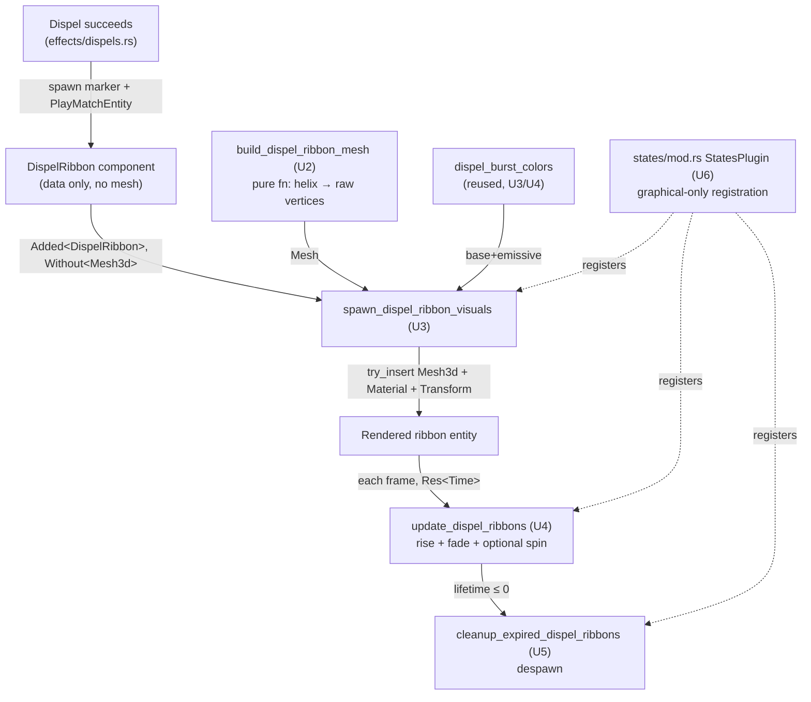

# feat: Dispel Ribbon Animation

## Summary

Replace the dispel's expanding-sphere burst with a twisting ribbon of procedural geometry that spirals up off the dispelled combatant's head and fades over ~0.8–1.0s. The goal is a distinct silhouette that reads instantly as "this combatant just got cleansed" — solving the two confirmed problems: the current sphere looks like every other glow burst, and it's hard to tell *who* got dispelled.

---

## Problem Frame

When a dispel lands today, the effect is a 0.3-radius sphere that expands to ~3× and fades over **0.5s**, 1 yard above the target, tinted by caster class (`src/states/play_match/rendering/effects.rs:960`, `DispelBurst`). Players can't reliably catch it because:

1. **It looks like everything else.** A small glowing sphere reads the same as heals, impacts, and the other sphere/particle bursts — it doesn't say "dispel."
2. **It's hard to attribute.** The effect doesn't draw the eye to the specific combatant who lost a buff.

A spiraling ribbon that rises off the head fixes both: a silhouette nothing else uses (distinctiveness), plus upward travel that no other in-place burst has (motion + head-anchor solve attribution). This is a pure visual change — no combat logic, headless-safe.

See origin: `docs/brainstorms/2026-06-26-dispel-ribbon-animation-requirements.md`.

---

## Requirements Traceability

| Origin req | Addressed by |
|---|---|
| R1 — spiraling ribbon shape, distinct from sphere/particle bursts | U2 (mesh), U3 (spawn) |
| R2 — head anchor, follows the combatant | U3 (spawn), U4 (update) |
| R3 — upward rise over lifetime | U4 (update) |
| R4 — longer readable lifetime (~0.8–1.0s) | U3 (component init) |
| R5 — class-tinted color (reuse `dispel_burst_colors`) | U3, U4 |
| R6 — fade-out + despawn on expiry | U4 (update), U5 (cleanup) |
| R7 — pure visual, headless-safe, registered graphical-only | U1 (component), U6 (registration) |

---

## Key Technical Decisions

- **Add `DispelRibbon` alongside `DispelBurst`; do NOT remove the burst.** `DispelBurst` is spawned at three sites, only one of which is a dispel: `effects/dispels.rs:88` (the dispel — switches to `DispelRibbon`), **`projectiles.rs:385` (Concussive Shot impact, Hunter gold) and `pet_ai.rs:695` (Master's Call, Hunter gold) — neither is a dispel and both must keep the expanding-sphere visual.** Therefore the `DispelBurst` component, its spawn/update/cleanup trio, and its `states/mod.rs:196` registration block all **stay**. The ribbon is a new, parallel effect: a new component, a new system trio, and a new graphical-only registration group. Only the marker spawned at `effects/dispels.rs:88` changes from `DispelBurst` to `DispelRibbon`. (Revised after doc review — the original "replace outright" decision would have broken compilation at the two Hunter reuse sites and, if only the systems were removed, silently regressed those effects into bare leaking entities.)

- **Build the ribbon as a procedural raw-vertex mesh, modeled on `create_octagon_mesh`.** No effect in the codebase builds a custom `Mesh` today — all use primitives (`Sphere`, `Cylinder`). The arena floor builder (`src/states/play_match/mod.rs:185`) is the working precedent for the Bevy 0.16 idiom: `Mesh::new(PrimitiveTopology::TriangleList, RenderAssetUsages::default())` + `with_inserted_attribute(POSITION/NORMAL/UV_0)` + `with_inserted_indices(Indices::U32(..))`. The ribbon is a flat strip of quads whose centerline follows a helix (angle and height both advancing along the strip length). This is the one genuinely new capability in the plan and gets its own unit (U2).

- **Double-sided material.** A thin ribbon viewed from behind backface-culls to nothing. The material must set `cull_mode: None` (double-sided) in addition to the existing dispel conventions. This is new relative to the sphere, which is closed geometry.

- **Keep the established effect conventions verbatim.** `AlphaMode::Add` (the spiral self-overlaps as it twists — additive avoids the Z-fighting `AlphaMode::Blend` would cause), emissive at 2–4× (HDR + bloom makes it glow), `Res<Time>` for animation (never `Time<Real>`), `try_insert()` in the spawn system, `Without<DispelRibbon>` on the read-only target-Transform query, and the `PlayMatchEntity` marker on the spawned entity. Reuse `dispel_burst_colors` unchanged — it already covers Priest/Paladin/fallback.

- **Animate via accumulated phase, baked geometry.** Two viable motion models: (a) bake the full static helix into the mesh once and animate by translating upward + scaling/fading; (b) bake a baseline strip and spin/extend it each frame. Decision: **bake the static helix once in U2 and animate transform + material only in U4** (rise via `Vec3::Y` translation, fade via alpha/emissive × `progress`, optional slow spin via `Transform` rotation around Y). This keeps per-frame work cheap (no mesh rebuilds) and mirrors how every existing effect animates transform/material rather than regenerating geometry. A `spin`/`phase` field on the component (mirroring `UnstableAfflictionGlow.phase`) carries the optional rotation. Final motion feel (spin rate, rise speed, turn count) is tuning, settled in the client.

- **No automated visual test.** The egui snapshot harness (`tests/results_screen_snapshot.rs`) renders 2D egui only — it has no Bevy world/textures, so a world-space 3D ribbon cannot be snapshot-tested. The only unit-testable surface is the mesh-geometry builder (deterministic vertex/index counts and helix bounds), covered in U2. Visual fidelity is verified by running the client. (Confirmed scope decision — see synthesis.)

---

## High-Level Technical Design

The ribbon reuses the canonical spawn/update/cleanup effect lifecycle; the only structural novelty is a pure mesh-builder function feeding the spawn system.



Directional guidance, not implementation specification.

---

## Implementation Units

### U1. Add the `DispelRibbon` component (alongside `DispelBurst`)

**Goal:** Define the new data component that carries the ribbon's animation state. `DispelBurst` is left intact — it is still used by Concussive Shot and Master's Call.

**Requirements:** R7 (pure visual data), R4 (lifetime fields).

**Dependencies:** none.

**Files:**
- `src/states/play_match/components/visual.rs` — add `DispelRibbon` (do not touch `DispelBurst`).

**Approach:** Mirror the `DispelBurst` field set (`target: Entity`, `caster_class: CharacterClass`, `lifetime: f32`, `initial_lifetime: f32`) and add a `spin: f32` phase accumulator for the optional Y-rotation (modeled on `UnstableAfflictionGlow.phase` at `visual.rs:179`). Bare `#[derive(Component)]` struct; `CharacterClass` is already imported. Name it for the shape per convention (`DispelRibbon`, not `DispelEffect`).

**Patterns to follow:** `DispelBurst` (`components/visual.rs:144`), `UnstableAfflictionGlow` phase field (`components/visual.rs:179`).

**Test scenarios:** `Test expectation: none -- pure data component, no behavior. Compilation + downstream unit tests cover it.`

**Verification:** Code compiles; `DispelBurst` and its three render systems remain present and registered (still needed by `projectiles.rs:385` and `pet_ai.rs:695`).

---

### U2. Procedural helical ribbon mesh builder

**Goal:** A pure function that builds the twisting-ribbon `Mesh` from raw vertices — the one new capability in the plan.

**Requirements:** R1 (spiraling shape), R3 (the helix encodes the upward rise as baked geometry).

**Dependencies:** none (pure geometry).

**Files:**
- `src/states/play_match/rendering/effects.rs` — add `build_dispel_ribbon_mesh(...) -> Mesh` plus new imports (`PrimitiveTopology`, `Indices`, `RenderAssetUsages`).
- `src/states/play_match/rendering/effects.rs` — `#[cfg(test)]` module for the geometry assertions (or a sibling test file if effects.rs has no existing test module; prefer inline `#[cfg(test)] mod`).

**Approach:** Build a flat strip of quads whose centerline follows a helix: for each of N segments along the strip, advance the angle (`segment / N × turns × TAU`) and the height (`segment / N × total_rise`), with the centerline orbiting a vertical axis at horizontal `radius`, placing two vertices offset left/right of the centerline by `width/2` to give the ribbon its band. Emit `POSITION`, `NORMAL` (per-segment outward/facing normal), and `UV_0` (V running 0→1 along length for any future texture/gradient), then `Indices::U32` triangulating each quad as two triangles. Parameters: `turns`, `height`/rise, `width`, `radius`, `segments` — accept as fn args or module constants so tuning is a one-line change. **`radius` must be > 0** so the ribbon visibly coils laterally; `radius = 0` degenerates to a twisted vertical column (a flat strip rotating in place), which does NOT read as a spiral and would fail R1's "clearly different silhouette" goal. Use `RenderAssetUsages::default()` like the floor mesh (fire-and-forget). Model the construction idiom directly on `create_octagon_mesh` (`src/states/play_match/mod.rs:185`).

**Technical design (directional, not spec):**
```text
build_dispel_ribbon_mesh(turns, height, width, radius, segments) -> Mesh:
  # radius > 0 (lateral coil); radius = 0 would be a twisted column, not a spiral
  for i in 0..=segments:
    t      = i / segments              # 0..1 along the strip
    angle  = t * turns * TAU
    y      = t * height
    center = (cos(angle)*radius, y, sin(angle)*radius)   # orbits the vertical axis
    tangent_perp = horizontal vector ⟂ to the helix tangent
    push center - tangent_perp*width/2   # left edge vertex
    push center + tangent_perp*width/2   # right edge vertex
  indices: for each segment, two triangles over the 4 edge vertices (i, i+1)
  normals: face the ribbon outward/up; UV V = t, U = 0|1 per edge
```

**Patterns to follow:** `create_octagon_mesh` (`src/states/play_match/mod.rs:185`) — exact `Mesh::new` + `with_inserted_attribute` + `with_inserted_indices` template.

**Test scenarios:**
- Happy path: `build_dispel_ribbon_mesh` with known `segments` returns the expected vertex count (`2 × (segments + 1)`) and index count (`6 × segments`).
- Edge: all vertex Y-coordinates lie within `[0, height]`; min Y ≈ 0 and max Y ≈ `height` (the baked rise spans the full range).
- Edge: the angular span of the centerline covers `turns × TAU` (first vs last segment angle delta), confirming the spiral actually twists the requested number of turns.
- Edge: with `radius > 0`, the maximum horizontal distance of any vertex from the vertical axis is ≈ `radius + width/2` (and well above zero), confirming a lateral coil rather than a degenerate vertical column.
- Edge: `POSITION`, `NORMAL`, and `UV_0` attributes are all present and equal length; indices reference only valid vertex indices (max index < vertex count).

**Verification:** The geometry unit tests pass under `cargo test` (CPU-only, no GPU needed).

---

### U3. Spawn system — attach ribbon mesh + material

**Goal:** When a `DispelRibbon` marker appears, attach the procedural mesh, double-sided additive material, and an initial transform at head height.

**Requirements:** R1, R2 (head anchor), R4 (init lifetime ~0.8–1.0s), R5 (class color), R7.

**Dependencies:** U1, U2.

**Files:**
- `src/states/play_match/rendering/effects.rs` — `spawn_dispel_ribbon_visuals`.

**Approach:** Mirror `spawn_dispel_visuals` (`effects.rs:960`): `Query<(Entity, &DispelRibbon), (Added<DispelRibbon>, Without<Mesh3d>)>`, `let Ok(target_transform) = transforms.get(ribbon.target) else { continue }`. Pull `(base_color, emissive)` from the reused `dispel_burst_colors(ribbon.caster_class)`. Build the mesh via `build_dispel_ribbon_mesh(..)` (U2) and `meshes.add(..)`. Material = `StandardMaterial { base_color, emissive, alpha_mode: AlphaMode::Add, cull_mode: None, ..default() }` — `cull_mode: None` is the new, load-bearing addition for the thin ribbon. Anchor the transform above the head: `target_transform.translation + Vec3::Y * HEAD_OFFSET` (taller than the sphere's `Vec3::Y * 1.0` chest height — start ~1.8–2.0 yd, tune in client). `try_insert` the `(Mesh3d, MeshMaterial3d, Transform)` tuple.

**Patterns to follow:** `spawn_dispel_visuals` (`effects.rs:960`); `spawn_charge_trail` (`effects.rs:1561`) for the `Quat::from_rotation_arc(Vec3::Y, ..)` orientation idiom if the ribbon needs an explicit up-axis alignment.

**Test scenarios:** `Test expectation: none -- Bevy system requiring a running App/GPU; not unit-testable with the current harness. Covered by manual client verification (U7) and registration_audit (U6).`

**Verification:** Running a graphical match, a dispel spawns a visible ribbon at the dispelled combatant's head with the dispeller's class color.

---

### U4. Update system — rise, fade, optional spin

**Goal:** Animate the ribbon each frame: follow the target, rise upward, fade out, optionally spin around Y.

**Requirements:** R2 (keep following target), R3 (upward rise), R5/R6 (fade), R7.

**Dependencies:** U1, U3.

**Files:**
- `src/states/play_match/rendering/effects.rs` — `update_dispel_ribbons`.

**Approach:** Mirror `update_dispel_bursts` (`effects.rs:993`): decrement `lifetime -= time.delta_secs()` (via `Res<Time>`), compute `progress = (lifetime / initial_lifetime).max(0.0)`. Re-anchor to `target_transform.translation + Vec3::Y * HEAD_OFFSET` and add an *additional* upward offset that grows as the effect ages (`(1.0 - progress) * RISE_DISTANCE`) so the ribbon visibly lifts off the head — this rise is a primary distinctiveness lever (R3), not decoration. Accumulate `ribbon.spin += time.delta_secs() * SPIN_RATE` and apply as a Y-axis `Quat` rotation on the transform. Fade by scaling `base_color` alpha and emissive RGB by `progress`, recomputing the canonical color from `dispel_burst_colors` each frame (same approach as the burst). The read-only target query **must** be `Query<&Transform, Without<DispelRibbon>>` to avoid Bevy's mutable/immutable aliasing panic.

**Patterns to follow:** `update_dispel_bursts` (`effects.rs:993`) for lifetime/fade/follow; `UnstableAfflictionGlow` phase accumulation for `spin`.

**Test scenarios:** `Test expectation: none -- per-frame Bevy system, not unit-testable with the current harness. Covered by manual client verification (U7).`

**Verification:** In the client, the ribbon rises off the head over its lifetime, optionally spins, and smoothly fades to nothing before despawn — no flicker (confirms `AlphaMode::Add` + `cull_mode: None` are correct).

---

### U5. Cleanup system — despawn expired ribbons

**Goal:** Despawn ribbons once their lifetime expires.

**Requirements:** R6.

**Dependencies:** U1.

**Files:**
- `src/states/play_match/rendering/effects.rs` — `cleanup_expired_dispel_ribbons`.

**Approach:** Mirror `cleanup_expired_dispel_bursts` (`effects.rs:1029`): `Query<(Entity, &DispelRibbon)>`, `if ribbon.lifetime <= 0.0 { commands.entity(entity).despawn(); }`.

**Patterns to follow:** `cleanup_expired_dispel_bursts` (`effects.rs:1029`).

**Test scenarios:** `Test expectation: none -- trivial despawn-on-expiry system; covered by manual verification (ribbons disappear, no accumulation over a long match).`

**Verification:** Over a multi-dispel match, ribbon entity count returns to zero between dispels (no leak); `PlayMatchEntity` marker still cleans up any in-flight ribbon on match exit.

---

### U6. Register the ribbon systems (graphical-only) and switch the dispel spawn site

**Goal:** Wire the three new ribbon systems into graphical-mode registration as a new group, and point the dispel spawn site at `DispelRibbon`. The existing `DispelBurst` group is left untouched (Concussive Shot / Master's Call still need it).

**Requirements:** R7 (headless-safe).

**Dependencies:** U3, U4, U5.

**Files:**
- `src/states/mod.rs` — add a NEW `.add_systems()` group for the three ribbon systems, next to the existing dispel-burst block (`mod.rs:196`). Do not modify or remove the burst block.
- `src/states/play_match/effects/dispels.rs` — update the marker spawn at `dispels.rs:88` to spawn `DispelRibbon` instead of `DispelBurst` (same `PlayMatchEntity` bundling, set `lifetime`/`initial_lifetime` to the ~0.8–1.0s target, `spin: 0.0`). This is the ONLY `DispelBurst` spawn site that changes — `projectiles.rs:385` and `pet_ai.rs:695` keep spawning `DispelBurst`.

**Approach:** In `StatesPlugin::build()`, add a new group registering `spawn_dispel_ribbon_visuals`, `update_dispel_ribbons`, `cleanup_expired_dispel_ribbons` with the same `.after(CombatSystemPhase::CombatResolution).run_if(in_state(GameState::PlayMatch))` gates and a "separate group to avoid tuple size limits" comment, mirroring the burst block. Do **not** add anything to `systems.rs::add_core_combat_systems` — visual effects are graphical-only. The `pub use rendering::*` chain auto-exports the new `pub fn`s. Update only the `dispels.rs` spawn site so the marker that fires on a successful dispel is `DispelRibbon`.

**Patterns to follow:** dispel registration block (`src/states/mod.rs:196`); the dual-registration rule in `docs/solutions/implementation-patterns/graphical-mode-missing-system-registration.md`.

**Test scenarios:**
- `tests/registration_audit.rs` passes: all three new ribbon `pub fn`s are detected and satisfied by the `StatesPlugin::build()` registration, AND the three `DispelBurst` systems remain registered (no orphaned/deregistered burst systems, since `projectiles.rs`/`pet_ai.rs` still spawn the component).
- Headless smoke: a headless match with a dispel (e.g. Priest vs a buffed target) runs to completion without panic — the `DispelRibbon` marker spawns and leaks harmlessly (no mesh/cleanup in headless, bounded by match duration, per the accepted trade-off).
- Regression guard: a headless match with a Hunter (Concussive Shot / Master's Call) still completes normally — confirms the retained `DispelBurst` path is intact.

**Verification:** `cargo test` green (including `registration_audit`); `cargo run --release -- --headless <dispel config>` completes normally; `grep "DispelBurst" src/` still shows the `projectiles.rs` and `pet_ai.rs` spawn sites (intentionally retained).

---

### U7. Client verification and tuning pass

**Goal:** Confirm the ribbon reads as a clear, distinct dispel indicator and dial in the tuning values.

**Requirements:** R1–R6 (the qualitative success criteria), origin Success Criteria.

**Dependencies:** U1–U6.

**Files:** none (tuning touches constants in `effects.rs` / the component init in `dispels.rs`).

**Approach:** Run `cargo run --release` and verify against the origin Success Criteria across two required scenarios:
1. **Isolation** — a comp that produces clean, sparse dispels (e.g. Priest dispelling a Warlock's Corruption, or a Paladin cleansing). Confirm you can tell a dispel happened and on *which* combatant without knowing where to look.
2. **Busy fight (the distinctiveness test)** — a comp where heal spheres and impact bursts fire concurrently with dispels, e.g. Priest+Paladin vs Warlock+Priest (simultaneous Flash Heal orbs, Shadow Bolt impacts, Corruption ticks during the dispel windows). The "not confusable with heal/impact bursts" criterion can ONLY be judged here — sign-off requires the ribbon to remain identifiable as a dispel amid this visual noise, not just when it appears alone.

Tune `turns`, `width`, `radius`, `HEAD_OFFSET`, `RISE_DISTANCE`, `SPIN_RATE`, lifetime, and emissive intensity until it reads cleanly. Check both Priest (silver-blue) and Paladin (gold) colors, a from-behind camera angle (validates `cull_mode: None`), and a dispel on a target that dies mid-ribbon (confirm the detached fading ribbon at the last position isn't distractingly prominent — the ribbon is larger than the old sphere, so re-judge this inherited behavior).

**Execution note:** This is the manual verification loop that substitutes for an automated visual test — the effect cannot be snapshot-tested (no 3D harness). Budget real iteration time here.

**Test scenarios:** `Test expectation: none -- manual qualitative verification; this unit IS the visual test.`

**Verification:** A neutral observer watching a match can identify dispels and their targets; the maintainer signs off on the look for both dispelling classes.

---

## Scope Boundaries

**In scope:** Everything in U1–U7 — the ribbon effect replacing the dispel sphere, pure visual, WHO-attribution via head-anchor + rise.

**Not in scope (from origin):**
- Surfacing *what* aura was removed (icon/floating text) — pure VFX only.
- Any dispel mechanics, success rules, or dispellable-aura changes.
- Reworking other burst effects (heals, impacts, Psychic Scream) to deduplicate visual language.

### Deferred to Follow-Up Work
- **Particle-helix fallback** — if the ribbon mesh's feel can't be dialed in acceptably in U7, the brainstorm's documented fallback (a particle helix on the existing particle machinery) is the alternative. Not built unless U7 fails; tracked here so the decision point is explicit.
- **A `docs/solutions/` learning for procedural mesh generation in Bevy** — the learnings search confirmed this is an undocumented gap (every existing effect uses primitives). Strong `/ce-compound` candidate after U2 lands; not part of this plan's deliverable.

---

## Risks & Dependencies

- **Backface culling (medium).** A thin ribbon vanishes from behind without `cull_mode: None`. Mitigated by making it an explicit material requirement in U3 and a from-behind check in U7.
- **Helix mesh feel (medium — the novel part).** Procedural ribbon geometry is new to the effects module; the math may need iteration to look like a ribbon rather than a flat coiled band (normals, width, turn count). Mitigated by the pure-function unit tests in U2 (correctness of counts/bounds) plus the U7 tuning budget (feel). The `create_octagon_mesh` precedent de-risks the Bevy API mechanics.
- **No regression guard (low, accepted).** No automated visual test exists or is feasible; future changes to the effect won't be caught by CI. Accepted per the synthesis — the mesh-math unit test is the only automatable coverage.
- **Headless marker leak (low, accepted).** The `DispelRibbon` marker spawns in headless mode but never gets a mesh or cleanup, leaking a bare entity until process exit. Bounded by match duration; the existing `DispelBurst` already had this trade-off. Do not "fix."

---

## Sources & Research

- Origin requirements: `docs/brainstorms/2026-06-26-dispel-ribbon-animation-requirements.md`
- Visual-effect pattern: `docs/solutions/implementation-patterns/adding-visual-effect-bevy.md` (three-system lifecycle, `AlphaMode::Add`, `Without<T>` query, `try_insert`, `Res<Time>`, `PlayMatchEntity`, emissive 2–4×)
- Dual-registration rule: `docs/solutions/implementation-patterns/graphical-mode-missing-system-registration.md` (`tests/registration_audit.rs` enforcement)
- Dispel effect template: `src/states/play_match/rendering/effects.rs:935` (`dispel_burst_colors`), `:960`–`:1038` (spawn/update/cleanup trio)
- Procedural mesh precedent: `src/states/play_match/mod.rs:185` (`create_octagon_mesh`), `:85` (`RenderAssetUsages` import), `:273`–`:287` (HDR + bloom camera)
- Marker spawn site: `src/states/play_match/effects/dispels.rs:88`
- Registration block: `src/states/mod.rs:196`
- Component conventions: `src/states/play_match/components/visual.rs:144` (`DispelBurst`), `:179` (`UnstableAfflictionGlow.phase`)
- Bevy version: `Cargo.toml:9` (0.16)
- Test harness note: `tests/results_screen_snapshot.rs` is egui-2D only — no 3D-effect snapshot path exists.
