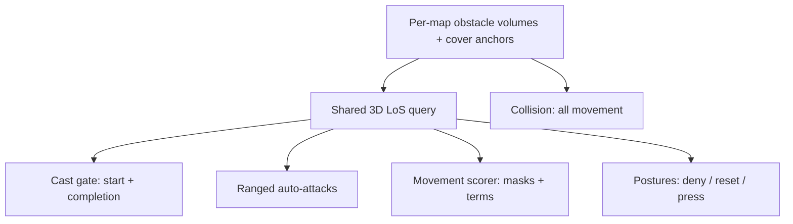
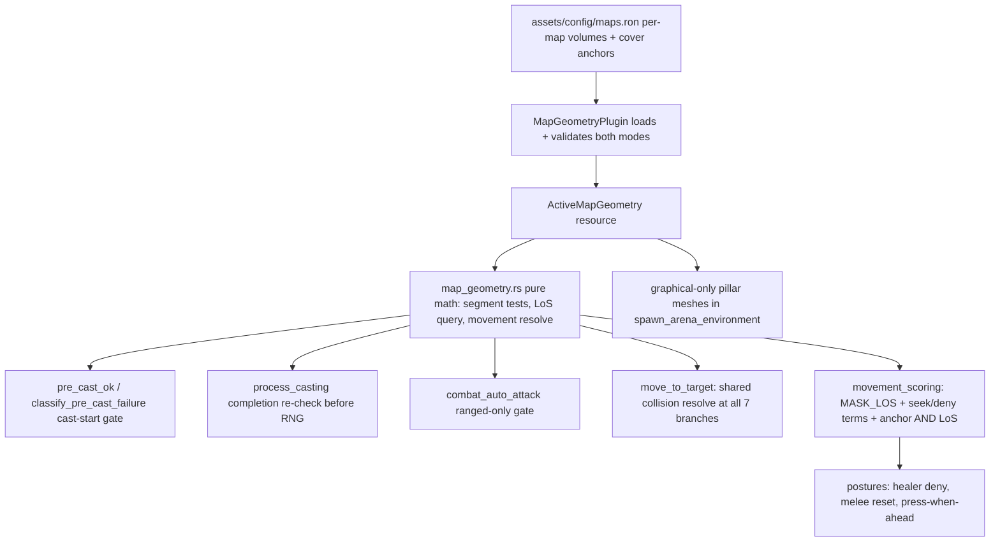

# Line of Sight Mechanics - Plan

## Goal Capsule

- **Objective:** Make line of sight a real mechanic — obstacles block sight and movement, and the AI both seeks and denies LoS — proven on PillaredArena and a verticality stub map.
- **Product authority:** The Product Contract below (R1-R22, F1-F4, AE1-AE6). Labeled Key Technical Decisions in the Planning Contract are settled; do not re-litigate them during implementation.
- **Execution profile:** Rust/Bevy, single crate, headless + graphical parity required. Work the units in dependency order (see Unit Index). Determinism (R20) is a hard gate on every unit.
- **Stop conditions:** Surface a blocker instead of guessing if (a) a labeled KTD proves infeasible, (b) determinism tests fail in a way a unit's design cannot absorb, or (c) a change would alter product behavior outside R1-R22.
- **Open blockers:** None. All planning questions are resolved in the Planning Contract.

---

## Product Contract

Product Contract preservation: changed — added R21-R22 (behavior clarifications surfaced by flow analysis: target acquisition stays LoS-blind; ground-placed/AoE sources exempt). R1-R20, F1-F4, AE1-AE6 unchanged.

### Summary

Add line of sight to ArenaSim: maps declare obstacle volumes that block hostile casts, friendly heals/buffs, ranged auto-attacks, and movement. The AI is extended to seek LoS when attacking and deny it when defending — tempo-aware enough to reset behind cover when a "go" is stopped and to press when ahead. The sight math is 3D from day one, validated on PillaredArena (which gains real pillars) and a verticality stub map.

### Problem Frame

The sim has zero line-of-sight logic anywhere. Range checks are pure Euclidean distance (`src/states/play_match/class_ai/cast_guard.rs:182`), projectiles fly straight with distance-only hit detection, and the `ArenaMap` choice is never read by any gameplay system — PillaredArena spawns no pillars at all, not even visually. Both maps play identically.

This leaves three costs. Mage is the clear #1 in 2v2/3v3 with no structural counterplay; the roadmap (`design-docs/roadmap.md:78`) names LoS as the counter. The ESCAPE posture has no outcome class beyond fleeing in the open. And the map pool cannot differentiate gameplay, blocking the ambition of maps with distinct tactical character — including vertical ones (Blade's Edge, Dalaran Sewers, Ruins of Lordaeron analogues).

### Key Decisions

- **Analytic occlusion over a physics engine or a baked visibility grid.** Obstacles are simple analytic volumes (cylinders, boxes) declared per map in data; LoS is an in-house 3D segment-vs-volume intersection test; the same volumes drive movement collision. A physics crate (Avian/Rapier) was rejected for determinism risk — the probe harness proves observed runs bit-identical (`tests/movement_probes.rs:281`), and that guarantee is non-negotiable. A baked visibility grid was rejected as tooling ahead of proven gameplay.

- **Cover anchors grafted in as optional map data.** Maps may annotate named cover positions ("behind NE pillar, hidden from center"). The deny-posture AI gets a cheap nearest-cover query, and the deferred luring milestone inherits its substrate. No grid bake, no new tooling.

- **v1 AI tier is seek-and-deny; luring is deferred.** All attackers reposition to regain sight; defenders (healers, kiters, melee resetting tempo) deliberately break it. Deliberately baiting enemies into bad positions is opponent-modeling — a separate milestone once this foundation is measurable.

- **WoW-faithful cast-time semantics.** LoS is checked when a cast starts and when it completes; a projectile that has already launched lands regardless of later obstruction. Impact-time fizzle (juking a launched Frostbolt) is explicitly out.

- **3D-native sight math, proven by a stub map; vertical navigation deferred.** The LoS query handles elevation from day one, and a stub map with a raised platform and ramp proves it. The AI is not expected to navigate verticality intelligently yet — the stub is a test asset excluded from balance sweeps.

- **Press-when-ahead AI is the anti-stall backstop.** LoS denial plus arena dampening would otherwise let a team with an HP lead run out the 300s cap for a draw. The advantaged team seeks engagement; defensive denial is reserved for the disadvantaged side and cooldown windows. Sweep draw rate is the tripwire that this rule works. No mechanical backstop unless the tripwire fires.

- **Collision is universal.** Everything that moves respects obstacle volumes: combatants, pets, feared units, and movement abilities (Charge cannot pass through a pillar).

One shared LoS query feeds every consumer, so mechanics can never disagree about sight:

### Requirements

**Sight and occlusion mechanics**

- R1. Maps declare obstacles as analytic volumes in per-map data; PillaredArena gains real pillar geometry, shipping visuals and gameplay volumes together (today it spawns neither).
- R2. A shared, deterministic LoS query answers "can A see B" via 3D segment-vs-volume intersection, returning identical results in headless and graphical modes.
- R3. Hostile targeted casts require LoS at cast start; denial is a typed rejection reason in the decision trace.
- R4. A cast in progress whose target is out of LoS at completion fails and deals no effect — breaking LoS mid-cast denies the cast (this is what makes juking meaningful).
- R5. Friendly targeted heals and buffs require LoS, so hiding cuts a combatant off from their own healer too.
- R6. Ranged auto-attacks (Auto Shot, wand) require LoS.
- R7. A projectile launched with valid LoS lands regardless of obstruction after launch.

**Collision and movement**

- R8. Obstacle volumes block movement for all movers: combatants, pets, feared units, and movement abilities such as Charge.
- R9. Movement steering paths around obstacles without navmesh pathfinding; a unit wedged motionless against an obstacle is a defect.

**AI behavior (seek and deny)**

- R10. An attacker denied LoS repositions to regain sight of its target; matches never stall because an AI won't walk around a pillar.
- R11. Pressured healers and kiters use obstacles to deny LoS, extending the posture machine; the deny decision weighs LoS to teammates, because hiding while a teammate needs healing is the named "looks dumb" defect.
- R12. Melee AI is tempo-aware: a stopped "go" (CC'd, tools spent) triggers a reset toward cover and the healer until re-engage tools return; an unstopped go presses the advantage.
- R13. A team with an HP/tempo advantage seeks engagement rather than LoS-stalling (press-when-ahead).
- R14. Maps may declare optional cover-anchor annotations; deny-postures may consume them for nearest-cover decisions.

**Maps and verticality**

- R15. Elevation participates in sight: standing below a ledge denies LoS to a unit on top; a clear ramp line grants it.
- R16. A verticality stub map (raised platform + ramp) exists as a test asset, excluded from balance sweeps, proving R15.
- R17. Obstacle and anchor definitions are data-driven, so a new map is content work, not code.

**Observability and parity**

- R18. All new systems register for both headless and graphical modes per the existing core-systems registration contract and audit.
- R19. Decision traces expose LoS: cast rejections, and movement decisions showing LoS-driven masks/terms, so mechanical behavior is verifiable by trace query without a code read.
- R20. The observed-run bit-identity guarantee and seeded reproducibility are preserved.

**Boundary clarifications**

- R21. Target acquisition stays LoS-blind: an enemy behind cover remains selectable as a target (stealth semantics unchanged); LoS is enforced at the action gates (casts, autos), never as a target-selection filter — otherwise hidden enemies would be dropped and reselected instead of sought (breaking R10).
- R22. Ground-placed and AoE-source abilities (Hunter traps, Shaman totem pulses) are exempt from LoS gating this slice; only targeted casts, heals/buffs, and ranged autos are gated.

### Key Flows

- F1. **Healer denies under pressure.** **Trigger:** melee threat closes on the healer. **Steps:** healer's pressured posture picks a direction (or cover anchor) that breaks the attacker's LoS while keeping heal range and LoS on the anchor teammate; attacker's AI repositions to regain sight; healer re-emerges to cast when the window is safe. **Covers R5, R10, R11, R14.**
- F2. **Cast juked at completion.** **Trigger:** enemy begins a hostile cast; the target reaches cover before it completes. **Steps:** cast completes, LoS re-check fails, cast is denied with a trace event; caster repositions. **Covers R3, R4, R10, R19.**
- F3. **Melee tempo reset.** **Trigger:** Warrior's opener is stopped (nova, CC) with gap-closers down. **Steps:** Warrior retreats toward pillar and healer instead of face-tanking in the open; re-engages when Charge returns; if the opener is not stopped, he stays on target and presses. **Covers R8, R12.**
- F4. **Endgame press, not stall.** **Trigger:** dampening fully ramped, one team holds an HP lead. **Steps:** the leading team seeks engagement; defensive LoS play remains available to the trailing team; the match resolves by elimination rather than timeout. **Covers R13.**

### Acceptance Examples

- AE1. **Covers R3.** Given a pillar between a Mage and its target, when the Mage's AI considers Frostbolt, then the cast is rejected pre-cast with an LoS rejection reason in the trace.
- AE2. **Covers R4.** Given a Frostbolt mid-cast, when the target breaks LoS before the cast completes, then the cast fails and no projectile spawns.
- AE3. **Covers R7.** Given a Frostbolt projectile already in flight, when the target breaks LoS before impact, then the projectile still hits.
- AE4. **Covers R11.** Given a healer in cover and a teammate below the urgency HP threshold in the open, when the healer decides its next action, then it repositions to regain LoS and heal rather than staying hidden.
- AE5. **Covers R15, R16.** Given the stub map, when an attacker stands below the platform edge, then it cannot target a unit on top; when it stands on the ramp with a clear line, it can.
- AE6. **Covers R8.** Given a feared unit whose flee path meets a pillar, when it moves, then it slides around the pillar and never passes through it.

### Success Criteria

Evaluation is two-layered, and the layers are judged separately: mechanical correctness first, AI quality second — an AI complaint is only actionable once the mechanics beneath it are proven.

- **Mechanical layer (automated):** occlusion math covered by deterministic unit tests; denial and collision behavior verifiable by trace queries and movement probes; the bit-identity self-test still passes.
- **AI layer (directional + manual):** in 2v2 sweeps on PillaredArena, melee+healer comps improve somewhat and cast-dependent ranged+healer comps (Mage most, Warlock least) decline somewhat; average match duration may rise, but draw rate must not materially rise — that is the stall tripwire. Manual observation of traces and graphical runs for "looks dumb" incidents, with healer-hides-while-teammate-dies as the canonical defect. Balance measurement uses the side-symmetrized protocol (average mirrored cells), never raw mirror cells.

### Scope Boundaries

Deferred for later:

- Luring and bait AI (deliberately drawing enemies into bad positions) — the follow-up milestone.
- New playable maps — an explicit named fast-follow, targeting layouts with distinct LoS character including verticality (Blade's Edge, Dalaran Sewers, Ruins of Lordaeron analogues).
- Vertical AI navigation (pathing up ramps and fighting across elevations).
- Impact-time projectile LoS (juking a launched projectile).
- Any mechanical anti-stall backstop — only reconsidered if the draw-rate tripwire fires.
- LoS gating for ground-placed abilities (trap placement arcs, totem pulses) — revisit if exemption proves exploitable.
- Unit-vs-unit body-blocking collision — this slice is units-vs-obstacles only.
- Occlusion-aware projectile visuals (fading a projectile that passes through a pillar) — cosmetic polish.
- Pincer coordination — splitting two attackers to opposite pillar sides to corner a denying healer; the human counter-play to pillar-hugging, deferred with the luring milestone (inter-agent coordination).

### Dependencies / Assumptions

- Analytic primitives (cylinders, axis-aligned boxes) suffice for every planned map, including the vertical ones; no mesh-based occlusion is anticipated. The stub map's ramp is represented by stepped boxes for occlusion purposes.
- LoS segment endpoints use each entity's transform origin (roughly center-mass; combatants at y≈1.0). Pets' spawn Y differs slightly between headless (0.75) and graphical (0.3) modes today — a pre-existing inconsistency; LoS math must not be sensitive enough for that delta to flip results on the shipped maps (pillars are full-height).
- The existing scorer mask architecture, decision-trace infrastructure, and probe harness are the integration surfaces; all were verified present and shaped as expected.
- Longer average matches are an accepted consequence, bounded by the existing dampening design and the 300s cap.

### Sources / Research

- `design-docs/roadmap.md:78` — LoS named as the structural counter to Mage dominance; "LoS terms plug into the existing scorer term list."
- `src/states/play_match/class_ai/cast_guard.rs` — `pre_cast_ok` (~68-109) and `classify_pre_cast_failure` must stay in predicate lockstep (file's own warning: the trace "can lie" if they drift).
- `src/states/play_match/combat_core/casting.rs` — completion resolution: projectile spawn ~277-293, instant-effect target re-fetch and `is_alive()` fizzle ~299-307; the only existing completion re-validation.
- `src/states/play_match/combat_core/auto_attack.rs` — melee/ranged share one function; range gates ~210-236 (incl. Hunter dead-zone pattern to mirror).
- `src/states/play_match/combat_core/movement.rs` — all position mutation in `move_to_target` across 8 branches (fear, polymorph, charge, disengage, directive, pet-follow, no-target center-seek, pursuit; `clamp_to_arena` sites at ~106, 128, 178, 195, 264, 295, 346, 395), each ending in `clamp_to_arena`.
- `src/states/play_match/combat_core/movement_scoring.rs` — pure Bevy-free scorer; `MASK_BOUNDARY`/`MASK_ANCHOR` bits (~58-60), `candidate_mask` (~147), 2-rung all-masked fallback ladder (~299-315), in-file test module (~317+).
- `src/states/play_match/movement_config.rs` — the RON config template (serde defaults, `validate()`, panic-on-invalid, registered in both `src/main.rs` and `src/headless/runner.rs`).
- `src/headless/matrix.rs:181-185` — matrix hardcodes `BasicArena`; stub map auto-excluded, but PillaredArena sweeps need a map lever.
- `docs/solutions/implementation-patterns/ai-decision-trace.md` — closed-enum audits, append-only `kind_order`, BTree determinism discipline for iterated hot-path collections.
- `docs/solutions/implementation-patterns/mirror-asymmetry-side-symmetrized-measurement.md` — side-symmetrized measurement protocol.
- `docs/solutions/ai-decision-patterns/casting-visibility-snapshot-blind-spot.md` — snapshot entity-set parity; a filtered view silently blinds AI.
- All repo claims above were independently verified against source on 2026-07-18.

---

## Planning Contract

### Key Technical Decisions

- KTD1. **In-house analytic occlusion; no physics crate; no baked grid.** (session-settled: user-directed — chosen over Avian/Rapier and a baked visibility grid: physics crates risk the bit-identity determinism guarantee; a grid bake is tooling before gameplay is proven.) A pure, Bevy-free geometry module (mirroring `movement_scoring.rs`) provides segment-vs-cylinder and segment-vs-AABB tests and a collision slide helper.

- KTD2. **Obstacle data is a RON-loaded core resource; meshes are graphical-only.** Headless spawns no arena geometry, so gameplay volumes cannot derive from spawned meshes. A `maps.ron` config (keyed by `ArenaMap`) loads via the `MovementConfigPlugin` template — serde defaults, `validate()`, panic-on-invalid — registered in both `src/main.rs` and `src/headless/runner.rs`. Pillar meshes render from the same data in graphical mode only.

- KTD3. **Cast LoS checks at start and completion; completion fizzle mirrors the dead-target fizzle.** (session-settled: start-check user-directed; completion-check user-approved — chosen over start-only semantics: without a completion check, ducking behind a pillar mid-cast denies nothing and deny-postures are hollow.) The completion check has two placements in `process_casting`, because the projectile-spawn branch (~`casting.rs:277`) runs and `continue`s before the `is_alive()` short-circuit: for projectile abilities, check before the spawn branch using a read-only target-position fetch ahead of the mutable borrow; for instant effects, check immediately after the existing `target.is_alive()` short-circuit (~`casting.rs:303`). The fizzle path itself draws no RNG; neutrality is proven by U12's requirement that default-map (BasicArena) matrix output stays byte-compatible with existing baselines — on an obstacle-free map the check can never fire, so any baseline divergence indicts it. Resource semantics identical to today's dead-target fizzle (no special refund path this slice).

- KTD4. **Projectiles keep homing; launched projectiles land regardless.** (session-settled: user-directed — chosen over impact-time fizzle: WoW-faithful and halves the check surface.) Flow analysis surfaced that `move_projectiles` re-aims at the live target each frame, so a hit behind cover means the projectile visually clips the obstacle. Freezing trajectory at launch was considered and rejected: it introduces whiff mechanics against moving targets (hit detection is proximity-to-entity), a far larger behavior change than the cosmetic clip-through, which WoW itself exhibits. Do not "fix" the homing.

- KTD5. **Target acquisition stays LoS-blind (R21).** `acquire_targets`' `can_see()` closure remains stealth-only. Folding physical LoS into it would make hidden targets vanish and reselect instead of being sought, breaking R10.

- KTD6. **LoS gate placement: unconditional for targeted abilities inside the shared guard.** The start-check lands as a distinct predicate immediately after the `can_cast_config()` call in `pre_cast_ok`, and after the inlined stealth check in `classify_pre_cast_failure` — the same relative position in both, preserving predicate lockstep without changing `can_cast_config`'s signature (which interrupt and Warrior callers share). LoS-after-stealth is harmless: the stealth-gated abilities are melee-range, where LoS is trivially satisfied. A new `RejectionReason::LosBlocked` variant goes through the closed-enum audit with a PillaredArena reference matchup that reliably emits it. Traps and totems keep their bespoke pipelines untouched (R22).

- KTD7. **Collision is units-vs-static-obstacles only, applied through one shared helper.** A pure `resolve_movement(pos, desired_delta, obstacles) -> Vec3` (slide-along-tangent, then `clamp_to_arena`) replaces the bare clamp at all eight mutation branches in `move_to_target` — including the easy-to-miss no-target center-seek branch. Because obstacles are static, resolution is order-independent by construction — the same-frame iteration-order fairness hazard documented for unit-vs-unit races does not arise. No unit-vs-unit collision this slice.

- KTD8. **Charge validates its path once at trigger; blocked Charge is rejected.** (Obstacles are static, so a single segment check at trigger suffices; the collision helper still guards the dash per-frame as a safety net.) A blocked Charge surfaces as a typed rejection so the melee AI can pick a different action rather than dash into a pillar.

- KTD9. **Scorer integration: a `MASK_LOS` collision mask plus additive seek/deny interest terms; anchor constraint becomes distance AND LoS.** Masks stay boolean (the penalty scheme was deliberately retired — never regress to penalties). `MASK_LOS` masks candidate directions whose step enters an obstacle, with its own rung in the all-masked fallback ladder. New `MovementWeights` terms drive seek-LoS (attackers) and cover-pull (defenders); the healer `AnchorConstraint` check extends to require LoS to the anchor ally. New weight fields must be added to `validate()`'s terms array. Plumbing: the obstacle slice reaches the scorer via `CombatContext` (populated in `class_ai/combat_snapshot.rs` from the `ActiveMapGeometry` resource) and is consumed at the three `ScorerInputs` construction sites in the shared `class_ai/healer_postures.rs` and `class_ai/dps_postures.rs` — those literals name every field, so adding the field is a compile-enforced update at exactly those sites.

- KTD10. **Trace visibility for LoS is additive and separate from the existing `masked` semantics.** `masked` already conflates boundary+anchor; LoS elimination is carried distinguishably (new optional field or scorer-term entries — implementer's call), and movement events keep the transition-only volume contract. New enum variants are append-only in `kind_order`.

- KTD11. **Press-when-ahead requires a new comparative advantage signal.** (session-settled: user-directed — chosen over a mechanical anti-stall backstop or accept-draws: the AI rule is the backstop; sweep draw rate is the tripwire.) No team-vs-team HP comparison exists today (all thresholds are self/ally-referential), so a deterministic team-HP-differential signal is computed once per frame in the shared snapshot and consumed by postures to suppress defensive denial when clearly ahead.

- KTD12. **v1 AI tier is seek-and-deny; luring deferred.** (session-settled: user-directed — chosen over the full package including luring and over physics-only minimal AI: luring is opponent-modeling, its own milestone; minimal AI leaves pillar play hollow.)

- KTD13. **Coverage: heals/buffs and ranged autos gated; collision universal.** (session-settled: user-directed — chosen over hostile-casts-only coverage: hiding must cost something, and units walking through pillars is spatially hollow.) The auto-attack gate applies only to non-melee attack paths.

- KTD14. **3D-native sight math; verticality stub map as a test asset; vertical navigation deferred.** (session-settled: user-directed — chosen over architecture-only and over a full vertical slice: prove elevation cheaply without navmesh work.) A new `ArenaMap::TestVerticality` variant is parseable in headless config but excluded from the graphical map-select list and from `--matrix` (which hardcodes its map).

- KTD15. **PillaredArena is the only playable map this slice; layout is two mirrored pillars.** (session-settled: user-directed — chosen over shipping new maps now: validate AI on a known map first.) Initial layout: two full-height cylinders on the long axis, mirrored under team-side swap (e.g. centers (±9, 0), radius ≈2.5, height ≈5), all values RON-tunable — exact placement is a balance knob, not code.

- KTD16. **Determinism discipline for new hot-path code.** Any iterated per-tick collection of obstacle/blocker candidates uses `Vec`/`BTree` orderings, never `HashMap`/`HashSet` iteration (two prior determinism regressions came from exactly this). The LoS query reads positions from the same entity set the AI snapshot already exposes — no second, differently-filtered view (the mid-cast snapshot blind spot must not be reproduced in LoS form).

### High-Level Technical Design

Sequencing: geometry math and map data land first (U1-U2); action gates next (U3-U5); collision and scorer integration (U6-U7); AI behaviors on top (U8-U10); visuals and measurement tooling close it out (U11-U12).

---

## Implementation Units

Unit Index:

| U-ID | Title | Key files | Depends on |
|---|---|---|---|
| U1 | Analytic geometry module | `src/states/play_match/map_geometry.rs` | — |
| U2 | Map geometry config + resource | `assets/config/maps.ron`, `src/states/play_match/map_config.rs` | U1 |
| U3 | Cast-start LoS gate + trace variant | `class_ai/cast_guard.rs`, `decision_trace/events.rs` | U2 |
| U4 | Cast-completion LoS re-check | `combat_core/casting.rs` | U2 |
| U5 | Ranged auto-attack LoS gate | `combat_core/auto_attack.rs` | U2 |
| U6 | Universal movement collision | `combat_core/movement.rs`, `class_ai/warrior.rs` | U1, U2 |
| U7 | Scorer LoS mask + terms | `combat_core/movement_scoring.rs`, `class_ai/combat_snapshot.rs`, `class_ai/{healer,dps}_postures.rs`, `movement_config.rs`, `assets/config/movement.ron` | U2 |
| U8 | Healer deny-posture | `class_ai/priest.rs`, `class_ai/paladin.rs`, `class_ai/shaman.rs` (healer postures) | U7 |
| U9 | Attacker seek-LoS + melee tempo reset | class AI + posture files | U7 |
| U10 | Advantage signal + press-when-ahead | `class_ai/combat_snapshot.rs`, posture files | U8, U9 |
| U11 | PillaredArena + stub map visuals | `src/states/play_match/mod.rs`, `match_config.rs` | U2 |
| U12 | Matrix map lever, probes, determinism sweep | `src/headless/matrix.rs`, `tests/movement_probes.rs`, `tests/decision_trace_audit.rs` | U3-U10 |

### U1. Analytic geometry module

- **Goal:** A pure, Bevy-free math module answering segment-vs-volume intersection, point-in-volume, LoS between two points, and collision-resolved movement.
- **Requirements:** R2, R9, R15, R20.
- **Dependencies:** None.
- **Files:** `src/states/play_match/map_geometry.rs` (new; unit tests in-file per `movement_scoring.rs` convention).
- **Approach:** `ObstacleVolume` enum: `Cylinder { center_xz, radius, base_y, height }` and `Aabb { min, max }`. Functions: `segment_intersects(&ObstacleVolume, a: Vec3, b: Vec3) -> bool`; `has_line_of_sight(&[ObstacleVolume], from: Vec3, to: Vec3) -> bool`; `resolve_movement(&[ObstacleVolume], pos: Vec3, desired: Vec3) -> Vec3` implementing tangent-slide (project the blocked component along the obstacle surface; never return a position inside a volume; degrade to no-move rather than wedge oscillation). Obstacle lists are `Vec` in RON declaration order — fixed iteration order, no hashing (KTD16). True 3D: cylinder checks are finite in Y; boxes are closed intervals.
- **Patterns to follow:** `movement_scoring.rs` — pure module, doc-comment contracts, exhaustive in-file `#[cfg(test)]` tests.
- **Test scenarios:** segment clearly over a pillar top passes (elevation grants sight); segment through a cylinder side fails; segment grazing tangent to a cylinder edge is deterministic and documented (pick and pin: touching = blocked); segment ending inside a volume; vertical segment vs box (below platform → blocked, atop platform → clear); `resolve_movement` head-on into a cylinder slides tangentially and gains lateral progress; movement fully enclosed by geometry returns the original position (no NaN, no escape through the volume); zero-length segment.
- **Verification:** `cargo test map_geometry` green; no Bevy imports in the module.

### U2. Map geometry config + resource

- **Goal:** Per-map obstacle volumes and cover anchors load from RON identically in both modes, exposed as a resource keyed by the active `ArenaMap`.
- **Requirements:** R1, R14, R17, R18.
- **Dependencies:** U1.
- **Files:** `assets/config/maps.ron` (new), `src/states/play_match/map_config.rs` (new plugin), `src/states/match_config.rs` (add `ArenaMap::TestVerticality`), `src/headless/config.rs` (parse it), `src/headless/runner.rs` + `src/main.rs` (register plugin), `src/states/mod.rs` if map-select UI needs the exclusion.
- **Approach:** Copy the `MovementConfigPlugin` template verbatim in structure: serde structs with `#[serde(default)]`, `validate()` collecting all violations (pillars inside arena bounds, positive radii/heights, cover anchors outside obstacle volumes), `std::fs::read_to_string` + `ron::from_str` (no AssetServer), panic on load/validate failure. `BasicArena` maps to an empty volume list; `PillaredArena` gets the KTD15 layout; `TestVerticality` gets a platform box + stepped ramp boxes + one pillar. An `ActiveMapGeometry` resource (volumes + anchors for `MatchConfig.map`) is inserted at match setup in both modes. `TestVerticality` is excluded from `ArenaMap::all()` (keeps it out of the graphical map-select list) but parseable by headless config; document the exclusion at the enum.
- **Patterns to follow:** `src/states/play_match/movement_config.rs` end-to-end; dual registration warning in its doc comment.
- **Test scenarios:** valid file loads with defaults for omitted maps; malformed RON panics with the file path in the message; validation rejects a pillar centered outside arena bounds; partial file overrides one map without restating others; `TestVerticality` parses from headless JSON config; `ArenaMap::all()` does not contain `TestVerticality`.
- **Verification:** `cargo test` green including `tests/registration_audit.rs`; a headless match on each map runs without panic.

### U3. Cast-start LoS gate + trace variant

- **Goal:** Targeted casts (hostile and friendly) fail fast at cast start when LoS is blocked, with a typed trace rejection.
- **Requirements:** R3, R5, R19. **Covers AE1.**
- **Dependencies:** U2.
- **Files:** `src/states/play_match/class_ai/cast_guard.rs`, `src/states/play_match/decision_trace/events.rs`, `tests/decision_trace_audit.rs`.
- **Approach:** Per KTD6: unconditional check for any cast with a target entity, placed as a distinct predicate immediately after the `can_cast_config()` call in `pre_cast_ok` and after the inlined stealth check in `classify_pre_cast_failure` — the same relative position in both (predicate lockstep — matching ordering comments in both functions; `can_cast_config`'s signature stays untouched so its interrupt and Warrior callers are unaffected). Add `RejectionReason::LosBlocked`; extend `EXPECTED_REJECTION_REASONS` and add/adjust a reference matchup on PillaredArena that reliably emits it. Self-cast and ground-placed paths (traps, totems) untouched (R22).
- **Patterns to follow:** the existing spell-school-lockout check (unconditional, ordered) in the same functions; `docs/solutions/implementation-patterns/ai-decision-trace.md` closed-enum audit workflow.
- **Test scenarios:** Covers AE1: Mage vs target behind pillar rejects Frostbolt with `LosBlocked` in the trace; friendly heal to an ally behind a pillar rejects; same-position and adjacent (melee-range) targets always pass; audit test sees `LosBlocked` emitted by the reference matchup; rejection order — target both out of range AND out of LoS reports out-of-range (range checked first).
- **Verification:** `cargo test --test decision_trace_audit` green; jq recipe over a PillaredArena trace shows `LosBlocked` rejections.

### U4. Cast-completion LoS re-check

- **Goal:** A cast whose target left LoS during the cast fizzles at completion — before projectile spawn or instant-effect application — without perturbing RNG draw order.
- **Requirements:** R4, R7, R19, R20. **Covers AE2, AE3.**
- **Dependencies:** U2.
- **Files:** `src/states/play_match/combat_core/casting.rs`.
- **Approach:** Per KTD3, two placements in `process_casting`'s completion pass: projectile abilities re-check `has_line_of_sight(caster_pos, target_pos)` before the projectile-spawn branch (~line 277; caster position is already in the completed-cast tuple — fetch target position read-only before the mutable borrow), because that branch `continue`s before the `is_alive()` short-circuit; instant effects re-check immediately after the existing `is_alive()` short-circuit (~line 303) where the target is already re-fetched. On failure `continue` (fizzle) exactly like the dead-target path, emitting a combat-log line (`[EVENT] ... line of sight` shape) for observability. Once a projectile spawns there is no further LoS involvement (KTD4 — homing retained, lands regardless).
- **Execution note:** RNG-neutrality is guarded by U12's BasicArena byte-compatibility baseline (the check can never fire on an obstacle-free map, so any divergence indicts it), plus a pinned-seed PillaredArena probe that shows the fizzle occurring. Write the fizzle probe first.
- **Test scenarios:** Covers AE2: target breaks LoS mid-cast → no projectile spawns, no damage, fizzle logged; Covers AE3: LoS breaks after launch → projectile still hits; instant (zero cast time) abilities are start-gated only and unaffected here; completion with dead target still fizzles as today (regression guard); fizzle consumes the cast (no refund) matching dead-target semantics.
- **Verification:** `cargo test` green; `observed_run_does_not_perturb_outcomes` green; pinned-seed probe shows the fizzle.

### U5. Ranged auto-attack LoS gate

- **Goal:** Auto Shot and wand attacks require LoS; melee autos are untouched.
- **Requirements:** R6, R19.
- **Dependencies:** U2.
- **Files:** `src/states/play_match/combat_core/auto_attack.rs`.
- **Approach:** In the range-check block (~210-236), after the distance gates and only on the non-melee paths (mirror the Hunter dead-zone gate's shape), skip the swing when LoS fails — the attack simply doesn't fire this tick, like an out-of-range tick; no new trace event kind (auto-attacks are not traced today).
- **Patterns to follow:** `HUNTER_DEAD_ZONE` minimum-range check in the same function.
- **Test scenarios:** Hunter behind pillar deals zero Auto Shot damage over a pinned window; wand user likewise; melee pair fighting adjacent to a pillar edge is unaffected; LoS regained → autos resume without re-acquisition.
- **Verification:** probe or headless log grep shows no `[DMG]` auto entries while occluded at a pinned seed.

### U6. Universal movement collision

- **Goal:** No mover ever passes through or stops inside an obstacle: fear, polymorph wander, Charge, Disengage, directives, pursuit, and pet-follow all resolve through the shared helper.
- **Requirements:** R8, R9. **Covers AE6.**
- **Dependencies:** U1, U2.
- **Files:** `src/states/play_match/combat_core/movement.rs`, `src/states/play_match/class_ai/warrior.rs`.
- **Approach:** Replace the bare `clamp_to_arena` at all eight mutation branches with `resolve_movement(...)` from U1 followed by the arena clamp (KTD7) — fear, polymorph, charge, disengage, directive, pet-follow, the no-target center-seek branch (~`movement.rs:346`), and pursuit. Fear/polymorph wander deflects along the tangent immediately on block (no wedge-until-reroll). Charge: add a trigger-time segment check in the Warrior AI (KTD8) — blocked path rejects the cast (reuse `LosBlocked` or a `PathBlocked` note via the existing precondition-note mechanism, implementer's call, audit-consistent); the per-frame helper still guards mid-dash. Disengage (a scripted burst) resolves per-frame like Charge.
- **Test scenarios:** Covers AE6: feared unit at a pillar slides around, never intersects, never freezes for its full fear duration; charging Warrior with a pillar mid-path does not Charge (trace shows the rejection) and never clips; pet-follow path around a pillar reaches the owner's flank; polymorphed unit wandering into a pillar keeps moving; a targetless unit drifting toward arena center resolves around an intervening pillar (the eighth branch); pursuit around a pillar closes distance monotonically-enough to reach melee within a bounded time at a pinned seed (no orbit-lock).
- **Verification:** new probes green; a full 7-class round-robin on PillaredArena finishes without any unit position inside a volume (assertable from per-frame observer samples).

### U7. Scorer LoS mask + terms

- **Goal:** The context-steering scorer knows about obstacles: blocked directions are masked, seek/deny interest terms exist, and the healer anchor constraint requires LoS.
- **Requirements:** R9, R10, R11 (substrate), R19.
- **Dependencies:** U2.
- **Files:** `src/states/play_match/combat_core/movement_scoring.rs`, `src/states/play_match/class_ai/combat_snapshot.rs`, `src/states/play_match/class_ai/healer_postures.rs`, `src/states/play_match/class_ai/dps_postures.rs`, `src/states/play_match/movement_config.rs`, `assets/config/movement.ron`, `src/states/play_match/decision_trace/{events.rs,builder.rs}` as needed.
- **Approach:** Per KTD9: add obstacle slice (and target/threat LoS probe points) to `ScorerInputs`; `MASK_LOS` bit set when the candidate step lands in or crosses a volume; give it its own rung in the fallback ladder (lift order: anchor, LoS, boundary — never strand a unit). Extend `candidate_mask`'s anchor branch to distance AND LoS-to-anchor. Plumbing per KTD9: thread `ActiveMapGeometry` into `CombatContext` via `combat_snapshot.rs`, and populate the new `ScorerInputs` field at its three construction sites in the shared `healer_postures.rs` (~218, ~373) and `dps_postures.rs` (~298) — full struct literals, so the compiler enforces the update. New `MovementWeights` fields: `los_seek` (pull toward candidate directions that have/approach LoS to the kill target — attackers) and `cover_pull` (pull toward directions that break threat LoS / toward nearest cover anchor — defenders); add both to `validate()`'s terms array with shipped defaults of 0.0 except where U8/U9 set them. Trace: carry LoS elimination distinguishably per KTD10 (do not fold into `masked` semantics silently); scorer terms already flow via `.scorer_term(name, value)`. Sequencing note: U6-before-U7 is a verification preference (collision behavior observable in probes), not a hard dependency — U7 compiles and unit-tests against U1/U2 alone.
- **Patterns to follow:** `MASK_ANCHOR` end-to-end (bit, candidate_mask, fallback, trace); `wand_pull`/`range_band` as term templates; the in-file mask-equivalence test sweep (~480-800).
- **Test scenarios:** unit tests in-file: a direction into a pillar is masked while open directions survive; all-16-masked triggers the ladder in the documented lift order; anchor satisfied by distance but occluded → masked; `cover_pull` scores a hiding direction above an exposed one given a threat; determinism of mask bits across repeated evaluation.
- **Verification:** `cargo test` green including the scorer's in-file suite and `movement.ron` validation.

### U8. Healer deny-posture

- **Goal:** Pressured healers use cover deliberately — breaking attacker LoS while keeping heal range and LoS on the team — and never hide while a teammate is in danger.
- **Requirements:** R11, R14. **Covers AE4.**
- **Dependencies:** U7.
- **Files:** `src/states/play_match/class_ai/healer_postures.rs` (where `score_directions` runs and `ScorerInputs` is built), per-class posture entry points in `src/states/play_match/class_ai/{priest.rs,paladin.rs,shaman.rs}` as needed, `assets/config/movement.ron`.
- **Approach:** Wire `cover_pull` (and cover-anchor nearest-cover selection when the map declares anchors) into the PRESSURED/ESCAPE direction goals as an additive interest, not a new posture state — the posture machine's states stay as-is this slice. The existing `urgency_hp_threshold` guard already defers non-critical behavior when an ally is low; extend its use so cover-seeking is suppressed (weight zeroed) when any teammate is below the threshold and healable — that is the AE4 counter. Tune shipped weights for Priest/Paladin/Shaman conservatively (cover_pull below threat_repulsion so denial shapes retreat direction rather than overriding escape).
- **Test scenarios:** Covers AE4 as a pinned-seed probe: low-HP exposed teammate → healer leaves cover and heals within a bounded window (`assert_min_occurrences` guard against vacuous windows); pressured healer with healthy team gains separation AND breaks LoS from the melee threat more than the pre-change baseline at the same seed; healer never leaves heal range of anchor while denying.
- **Verification:** probes green; trace review shows `cover_pull` in `scorer_terms` on PRESSURED frames.

### U9. Attacker seek-LoS + melee tempo reset

- **Goal:** Attackers denied LoS reposition to regain it (no stall), and melee resets to cover/healer when its go is stopped.
- **Requirements:** R10, R12.
- **Dependencies:** U7.
- **Files:** `src/states/play_match/class_ai/dps_postures.rs` (shared scorer consumption), class AI decision files (`mage.rs`, `warlock.rs`, `hunter.rs`, `warrior.rs`, `rogue.rs` as applicable), `assets/config/movement.ron`.
- **Approach:** Seek: when the chosen ability was rejected `LosBlocked` this tick (or the kill target is occluded), enable the `los_seek` term so movement biases toward sight-restoring directions — casters keep their range band (orbit to an angle with LoS) rather than tunneling to melee. Melee reset (R12): a bounded, condition-driven behavior — when CC'd-or-rooted recently AND gap closers (Charge/Intercept-equivalents) on cooldown AND not in melee range, bias movement toward own healer/cover (`cover_pull`) instead of face-chasing; resume normal pursuit when the gap closer is ready (the "go"). Keep it weight/predicate-driven inside existing melee movement — no new posture enum this slice.
- **Test scenarios:** Mage vs target behind pillar regains LoS and lands a cast within a bounded sim window at a pinned seed (no perpetual `LosBlocked` loop — the R10 anti-stall probe); Warrior with Charge down and rooted-recently moves toward its healer rather than the target (position-track assertion), then re-engages when Charge is ready; ranged seek path keeps distance ≥ its range-band minimum while restoring sight.
- **Verification:** probes green; trace shows `LosBlocked` rejections followed by movement decisions with `los_seek` active and a subsequent successful cast.

### U10. Advantage signal + press-when-ahead

- **Goal:** A team clearly ahead seeks engagement instead of LoS-stalling, closing the dampening-endgame draw loophole.
- **Requirements:** R13. **Covers F4.**
- **Dependencies:** U8, U9.
- **Files:** `src/states/play_match/class_ai/combat_snapshot.rs` (or `class_ai/mod.rs` context), posture/weight consumption sites from U8/U9.
- **Approach:** Per KTD11: compute a deterministic team-HP-fraction differential (sum of alive members' HP fractions per team, pets excluded, mirroring `is_team_healthy`'s conventions) once per frame in the shared snapshot; expose via `CombatContext`. Consumption: when own team leads by a tunable margin (RON knob, e.g. 0.2), zero the `cover_pull`/deny weights and melee-reset bias for that team's members — press is simply "denial off," not a new aggressive behavior. Hysteresis via the existing commit-window machinery to avoid strobing at the margin.
- **Test scenarios:** unit test: differential math (equal teams → 0; dead members count 0; pets excluded); pinned-seed endgame probe: post-dampening leading team's healer does NOT enter cover-denial (trace: `cover_pull` absent/zero) while the trailing team's does; margin hysteresis — oscillating HP near the margin doesn't flip the signal every frame.
- **Verification:** probes green; a healer-vs-healer PillaredArena match at pinned seed still resolves before the 300s cap.

### U11. PillaredArena + stub map visuals

- **Goal:** Pillars exist visually where they exist mechanically; the stub map renders enough to be inspectable.
- **Requirements:** R1, R16 (visual half).
- **Dependencies:** U2.
- **Files:** `src/states/play_match/mod.rs` (`spawn_arena_environment` + call site threading `config.map`), `src/states/match_config.rs`.
- **Approach:** Thread the selected `ArenaMap` into `spawn_arena_environment`; spawn a `Cylinder` mesh per RON volume (and boxes for the stub map) with wall-consistent materials. Graphical-only; geometry truth stays in the RON resource (KTD2). No new visual-effect systems needed (static meshes, no lifecycle).
- **Test expectation: none — static cosmetic meshes; correctness is covered by U2's data tests and manual inspection.** Verify via the graphical client on PillaredArena (pillars visible, positions match RON) using the established background-run + log-grep loop (no panics, no camera ambiguity).
- **Verification:** graphical run shows pillars; headless unaffected (`registration_audit` green).

### U12. Matrix map lever, probes, determinism sweep

- **Goal:** The measurement story works end-to-end: sweeps can target PillaredArena, AE probes pin behavior, and the determinism suite passes with LoS active.
- **Requirements:** R16, R19, R20; Success Criteria measurement substrate. **Covers AE5.**
- **Dependencies:** U3-U10.
- **Files:** `src/headless/matrix.rs` (+ CLI plumbing in `src/cli.rs`/`main.rs`), `tests/movement_probes.rs` (new `mod los_probes`), `tests/decision_trace_audit.rs`, `scripts/hunter_2v2_matrix.sh` (only if it needs the map flag passed through).
- **Approach:** Add a `--matrix-map <name>` option (default `BasicArena`, preserving byte-compatible CSV baselines); `TestVerticality` stays excluded by never being a default and by config-parse gating if needed. Consolidate the AE probe set: AE1-AE6 each pinned as a probe or unit test where U3-U10 haven't already (AE5 lands here: stub-map probe — below-platform attacker gets `LosBlocked`, ramp position with clear line casts successfully). Run the full determinism battery: `observed_run_does_not_perturb_outcomes`, `trace_on_matches_trace_off_outcomes`, and the `#[ignore]`'d all-pairings sweeps, now including a PillaredArena pairing.
- **Test scenarios:** Covers AE5 (above); matrix run with `--matrix-map PillaredArena` produces the standard CSV columns; default matrix output remains byte-compatible with existing baselines at the same seeds; all-pairings determinism sweep green on PillaredArena.
- **Verification:** `cargo test` green; `cargo test -- --ignored` determinism battery green; a smoke `--matrix 2 --matrix-map PillaredArena` completes.

---

## Verification Contract

| Gate | Command | Applies to | Done signal |
|---|---|---|---|
| Unit + audit tests | `cargo test --release` | all units | green, including `registration_audit`, `decision_trace_audit`, `maps.ron`/`movement.ron` validation |
| Geometry math | `cargo test map_geometry` | U1 | in-file suite green |
| Bit-identity | `cargo test --release --test movement_probes` | U4, U6-U10, U12 | `observed_run_does_not_perturb_outcomes` + `los_probes` green |
| Determinism battery | `cargo test --release -- --ignored` (all-pairings + trace byte-identity) | U12 | green incl. a PillaredArena pairing |
| Headless smoke | `cargo run --release -- --headless <cfg> --trace-mode on` with `"map": "PillaredArena"` (Mage+Priest vs Warrior+Priest) | U3-U10 | match resolves; trace shows `LosBlocked` rejections, LoS movement terms, no wedged units |
| Build hygiene | `cargo build --release` | all | zero warnings (repo convention post-#85) |
| Balance direction (post-merge, informational) | `scripts/hunter_2v2_matrix.sh` adapted / `--matrix N --matrix-map PillaredArena`, side-symmetrized | Success Criteria | draw rate not materially above baseline; directional winrate movement per Success Criteria |

## Definition of Done

- All twelve units implemented and individually verified; every R1-R22 is traced to at least one unit or an explicit scope boundary.
- AE1-AE6 each enforced by a pinned test or probe (`Covers AE<N>` markers present).
- Full `cargo test --release` and the determinism battery (including `--ignored` all-pairings with a PillaredArena pairing) pass.
- Zero build warnings; no dead experiments or abandoned-approach code left in the diff.
- Decision-trace docs updated where recipes change (CLAUDE.md jq recipes gain an `LosBlocked` example) — small, targeted edits only.
- The plan's labeled KTDs were honored, or a conflict was surfaced rather than silently overridden.
