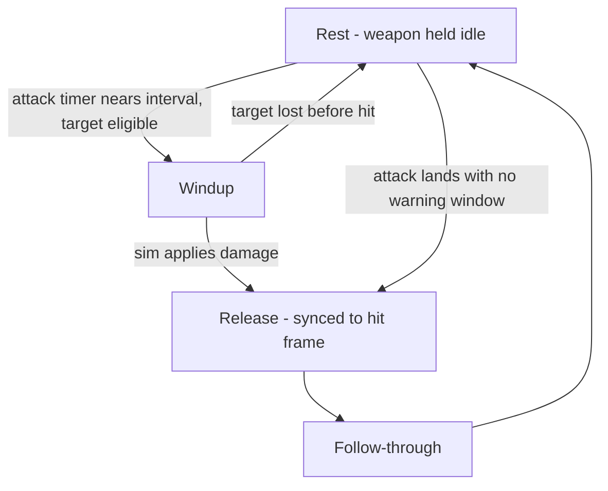
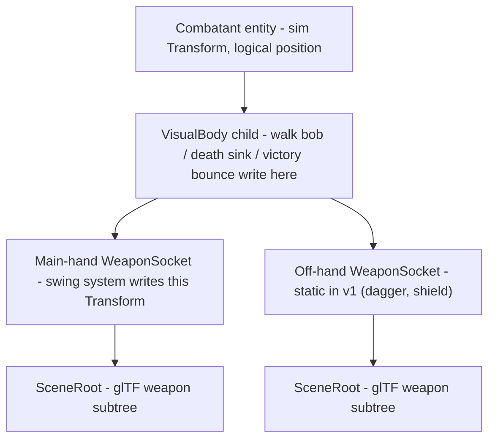
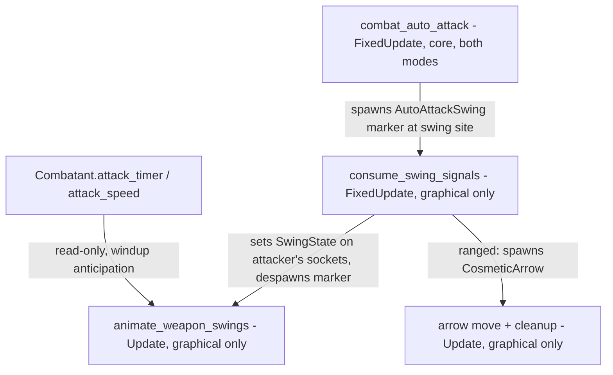

# Attack Animations - Plan

## Goal Capsule

- **Objective:** Combatants visibly hold class-default weapons and play auto-attack animations synced to the sim's actual hits, starting with Warrior, Rogue, Hunter, and Paladin.
- **Product authority:** This document's Product Contract (confirmed 2026-08-04). The Planning Contract below governs how it is built.
- **Execution profile:** Graphical-only rendering feature; the simulation is read, never driven. Standard depth, five units, dependency-ordered U1 → U5.
- **Stop conditions:** Any headless divergence at a pinned seed (match log diff vs. main non-empty, or a determinism test failure) stops work until the cause is removed — byte-identity is non-negotiable. A KayKit asset that cannot be made to read cleanly at arena camera distance stops U1 for a source swap, not a fidelity escalation.
- **Open blockers:** None.

---

## Product Contract

### Summary

Add auto-attack animations to the existing capsule combatant bodies for four classes: Warrior (two-handed axe), Rogue (twin daggers), Hunter (bow), and Paladin (mace and shield). Weapons are sourced CC0 low-poly glTF models held visibly at all times, selected by a class-default mapping. Swings use an anticipatory windup whose release lands exactly on the sim's damage frame, and Hunter auto-shot fires a purely cosmetic arrow. Everything is graphical-mode only; headless output stays byte-identical.

### Problem Frame

Combat is currently legible only through floating combat text and the log. Bodies are static class-colored capsules whose only motion is the walk bob, so a spectator cannot tell who is attacking, with what, or when a hit lands by watching the arena. Melee pressure — the core of several matchups — is visually indistinguishable from two units standing near each other.

### Key Decisions

- **Readable flavor on current bodies.** Keep the capsule bodies; add weapons and procedural motion rather than character models. (session-settled: user-directed — chosen over a full rigged-model upgrade and a minimal-with-upgrade-path variant: matches the hand-built aesthetic, and the trigger layer built here still serves a future skeletal path.)
- **Sourced CC0 glTF weapon models.** Pull weapon meshes from CC0 low-poly packs instead of hand-building primitives. (session-settled: user-approved — chosen over house-built primitive weapons: the bow is uneconomical from primitives, and this opens the 3D asset pipeline the equipment brainstorm deferred, at zero dependency cost since Bevy's default features already load glTF.)
- **Class-default weapon mapping for v1.** Each class hardcodes its weapon visuals; selection by equipped item is deferred. (session-settled: user-directed — chosen over equipment-keyed selection at confirmation: this is a foundational piece, and class defaults decouple v1 from loadout contents.)
- **Anticipatory windup swing motion.** The weapon winds up before the hit and releases on the damage frame. (session-settled: user-approved via visual sketch — chosen over reactive swing-after-hit and continuous cadence: telegraphs the incoming hit and frame-syncs the release, feasible because the attack timer counts up toward a known interval.)
- **Cosmetic arrow on auto-shot.** (session-settled: user-approved — chosen over bow-draw-only: a release that visibly fires nothing undercuts the readability goal; the arrow changes no sim behavior.)
- **Weapon-per-class flavor set** (Warrior 2H axe, Rogue twin daggers, Hunter bow, Paladin mace + shield) came with the request and matches both WoW class identity and the current default loadouts, except that the Rogue's second dagger is visual-only flair — its `OffHand` slot is empty today (see Scope Boundaries).

### Requirements

**Weapon display**

- R1. From match spawn, each of the four classes' combatants visibly holds its class-default weapon set: Warrior a two-handed axe, Rogue a dagger in each hand position, Hunter a bow, Paladin a one-handed mace plus shield.
- R2. Weapon meshes are CC0-licensed low-poly glTF assets stored under `assets/models/`, with the license and source recorded alongside them.
- R3. Weapons attach to the combatant's `VisualBody` child so existing body animations (walk bob, death sink, victory bounce, match-exit cleanup) carry the weapons along without per-animation special-casing.
- R4. Weapon materials read as part of the existing flat-color aesthetic; if a sourced model's materials clash, they are overridden rather than shipped as-is.

**Swing animation**

- R5. Melee swings play an anticipatory windup that begins before the auto-attack lands and a release stroke synced to the frame the sim applies damage, followed by a return to rest.
- R6. A swing animation plays only when an attack actually lands; a completed timer with no eligible target (out of range, no target) produces no phantom swing.
- R7. When an attack lands without an anticipation window (attack was ready and the target just entered range), the animation degrades to release-plus-follow-through rather than desyncing or skipping.
- R8. Windup pacing follows the live attack interval, including mid-fight attack-speed changes from `AttackSpeedSlow` auras.
- R9. The Rogue's daggers alternate hands cosmetically — each landed auto swings the other dagger (the sim keeps its single attack timer); the Paladin's shield is held statically (no block animation).

**Hunter auto-shot**

- R10. The bow plays a draw as its windup analog and a release synced to the damage frame.
- R11. Each auto-shot release spawns a cosmetic arrow that travels to the target, reusing the existing arrow-projectile visual idiom; damage remains instant hit-scan and the combat log is unchanged.

**Sim integrity**

- R12. All weapon and animation systems are graphical-mode only. A headless run of any seed produces byte-identical output before and after this feature.
- R13. Animation systems read sim state (timers, attack speed, target) but never write it; the damage/crit RNG draw order is untouched.

### Key Flows

- F1. Melee swing cycle
  - **Trigger:** A combatant's attack timer approaches its attack interval with an eligible target in range.
  - **Steps:** Weapon eases from rest into windup; the sim applies auto-attack damage; the release stroke plays on that frame; follow-through returns the weapon to rest until the next cycle.
  - **Covers:** R5, R6, R8.
- F2. Auto-shot cycle
  - **Trigger:** Hunter's ranged auto-attack timer approaches its interval with a sighted, in-range target.
  - **Steps:** Bow draws; the sim applies hit-scan damage; on that frame the bow releases and a cosmetic arrow flies to the target; the arrow despawns on arrival.
  - **Covers:** R10, R11.

### Acceptance Examples

- AE1. **Covers R5.** Given a Warrior in melee range of its target, when an auto-attack applies damage, then the axe's release stroke and the damage floating-combat-text appear on the same frame, with a visible windup preceding it.
- AE2. **Covers R7.** Given a Warrior whose attack timer is already past its interval while chasing, when it reaches melee range and the sim lands the attack that frame, then a release-plus-follow-through plays with no windup and no desync of the following cycle.
- AE3. **Covers R8.** Given a combatant under an `AttackSpeedSlow` aura, when its attack interval lengthens, then the swing cadence stretches to match and the release stays hit-synced.
- AE4. **Covers R11, R13.** Given a Hunter auto-shotting, when the arrow is in flight, then the target's damage has already been applied at release time — the combat log and match result for the seed are identical to a build without arrows.
- AE5. **Covers R12.** Given any headless config and seed, when run before and after this feature, then the match logs are byte-identical.

### Success Criteria

- A spectator watching a match at default camera distance can tell which units are attacking, with what weapon, and roughly when hits land — without reading floating combat text.
- Weapon silhouettes make the four classes distinguishable at a glance even with class colors ignored.

### Scope Boundaries

Deferred for later:

- Equipment-keyed weapon selection (model chosen by the equipped item's `WeaponType`), including adding an off-hand dagger to the Rogue loadout so its visual survives the switch.
- Caster auto-attacks (wand shots for Mage, Priest, Warlock, Shaman) and pet attack animations — the swing-trigger layer should not preclude them.
- Ability and cast animations (this feature is auto-attacks only).
- Swing trails and target hit-reactions — evaluate after seeing plain swings in a real 3v3.
- Stealth weapon fading — no 3D stealth transparency system exists at all today (the material is alpha-ready but nothing drives it), so weapons neither regress nor fix stealth visuals; handle both together when a stealth fade is built.

### Dependencies / Assumptions

- Primary asset source: KayKit Fantasy Weapons Bits (CC0, glTF; covers axe, daggers, bow, shield, and maces). Fallbacks: Quaternius Fantasy Props MegaKit (CC0), Poly Pizza (license-filtered aggregator). Assumed available at implementation time.
- Bevy 0.16 with the repo's current `Cargo.toml` (default features intact) loads glTF scenes without new dependencies — verified.
- `Combatant.attack_timer` and `attack_speed` are public component fields readable from graphical systems; the interval is `1.0 / attack_speed` modified by `AttackSpeedSlow` — verified in `src/states/play_match/combat_core/auto_attack.rs`.
- Capsule bodies have no hands; weapon placement is a floating attachment at a plausible hold position, tuned by eye during implementation.

### Sources / Research

- `src/states/play_match/mod.rs:1016` — combatant spawn: capsule mesh, class color, `VisualBody` child attachment point.
- `src/states/play_match/combat_core/auto_attack.rs` — attack timer mechanics, interval formula, swing-time reset; ranged autos are hit-scan with no projectile today.
- `src/states/play_match/projectiles.rs:17` — `is_arrow_projectile`, the elongated-cuboid arrow idiom to reuse for the cosmetic arrow.
- `src/states/play_match/rendering/effects.rs:2837` — `update_walk_animation`, the existing procedural-animation precedent (distance-driven, graphical-only, writes `VisualBody` only).
- `assets/config/loadouts.ron` / `assets/config/items.ron` — default weapons per class: Warrior `ArcaniteReaper` (Axe, two-handed), Rogue `SerpentFangDagger` (Dagger, no off-hand), Hunter `AshwoodBow` (Bow), Paladin `HammerOfTheRighteous` (Mace) + `AegisOfTheBloodGod` (Shield, `OffHand` slot).
- `docs/brainstorms/2026-03-22-equipment-system-brainstorm.md` — the V1 decision that deferred all 3D weapon visuals; this plan un-defers the weapon-in-hand piece.
- KayKit Fantasy Weapons Bits: https://kaylousberg.itch.io/fantasy-weapons-bits — Quaternius Fantasy Props MegaKit: https://quaternius.com/packs/fantasypropsmegakit.html — Poly Pizza: https://poly.pizza
- `docs/solutions/implementation-patterns/adding-visual-effect-bevy.md` — the three-system visual-effect lifecycle and registration rules new animation systems must follow. Caveat: its code examples predate the `VisualBody` refactor and write the parent `Transform` directly; the current rule is that graphical writes target the `VisualBody` child (`src/states/play_match/components/visual.rs`).

---

## Planning Contract

**Product Contract preservation:** unchanged, with two exceptions. Outstanding Questions — its four deferred-to-planning items are resolved by KTD1, KTD4, and KTD5 below and the tuning notes in U2/U3, so the section is removed rather than left stale. R9 — originally "off-hand held statically"; revised during implementation review (user-directed) to alternate the Rogue's daggers cosmetically, since a static off-hand read as unanimated.

### Key Technical Decisions

- **KTD1. Swing release is signaled by an inert marker spawned in core, not inferred by timer-diffing.** `combat_auto_attack` spawns a bare `AutoAttackSwing` marker entity (attacker, target, ranged flag, `PlayMatchEntity` tag) at the exact swing site; all consumption is graphical-only. This mirrors the repo's documented `WindfuryTornado` precedent (`src/states/play_match/combat_core/auto_attack.rs:290-305`, spawned in core with meshes built only in graphical mode). Rejected: pure timer observation — `FixedUpdate` ticks zero-or-more times per rendered frame (`src/states/mod.rs:130-155`), so an `Update`-schedule diff silently drops swings, and the timer carries no target for the arrow. Rejected: a Bevy event — no repo precedent, and event plumbing would touch both modes. Headless spawns the same inert markers (entity count differs, observable output does not); the determinism suite proves it. (session-settled: user-approved — chosen over zero-core-diff timer-diffing: surfaced in the scoping synthesis and confirmed.)
- **KTD2. Weapons attach inline in `spawn_combatant`, parented under the `VisualBody` child.** `spawn_combatant` is a private graphical-setup helper; headless uses a separate mesh-free spawn path in `src/headless/runner.rs`, so inline attachment carries zero headless risk and needs no new system registration. The `VisualBody` entity id must be captured explicitly — the existing `.with_child()` chain returns the parent id. Rejected: a reactive `Added<VisualBody>` system (registration-audit friction, async ordering, no benefit).
- **KTD3. glTF models spawn as `SceneRoot` children of per-weapon socket entities, with a `SceneInstanceReady` observer for material overrides.** Scene instantiation is async — descendants do not exist on the spawn frame; the observer is the 0.16-idiomatic reaction point (Bevy's `edit_material_on_gltf` example). Overrides must clone the material and insert a new `MeshMaterial3d` per descendant — glTF material assets are shared across instances, and in-place mutation recolors every copy. Fallback if scene overhead annoys: extract the single mesh primitive from `Assets<Gltf>` (requires load polling). No Cargo change — default features include `bevy_gltf` (`Cargo.toml:9`).
- **KTD4. The cosmetic arrow is a new graphical-only effect, never the sim `Projectile`.** `move_projectiles`/`process_projectile_hits` are core-registered gameplay (they gate when damage lands); reusing them would alter the sim. The arrow gets its own marker with a spawn/move/cleanup trio in `rendering/effects.rs`, registered solely in `StatesPlugin::build()`, mirroring the arrow cuboid look from `src/states/play_match/projectiles.rs`.
- **KTD5. Windup is driven by reading the live attack timer; pose math is a pure function.** The animation layer reads `Combatant.attack_timer` / `attack_speed` (public fields) each frame to anticipate the release, and a pure `fn` maps (timer, interval, swing state, weapon kind) to a socket pose — unit-testable without Bevy. Instantiates the Product Contract's anticipatory-windup decision (session-settled: user-approved via visual sketch — chosen over reactive swing-after-hit and continuous cadence).
- **KTD6. Weapon selection is a class-keyed constant in the rendering layer.** `Combatant.class` is a plain field already queried by graphical systems; the mapping lives beside the spawn code, positioned so the deferred equipment-keyed lookup can replace it without touching the animation layer. Instantiates the Product Contract's class-default decision (session-settled: user-directed — chosen over equipment-keyed selection for v1: foundational piece first).

### High-Level Technical Design

Entity hierarchy — sim owns the parent; each layer down is purely visual:

Signal flow across schedules — detection must live in `FixedUpdate` (it ticks zero-or-more times per rendered frame); smooth animation lives in `Update`:

Directional pose sketch (not implementation): windup begins when `timer >= interval - windup_window` with a cosmetic-grade eligibility check (target alive, roughly in range); release plays when a swing signal arrives, whether or not a windup preceded it; follow-through eases back to rest. The pose function stays continuous under mid-swing interval changes.

---

## Implementation Units

### U1. Weapon assets and glTF pipeline bring-up

- **Goal:** The five weapon models (2H axe, dagger, bow, mace, shield) live in-repo as license-clean glTF files.
- **Requirements:** R2, R4.
- **Dependencies:** None.
- **Files:** `assets/models/weapons/` (five `.glb` files), `assets/models/weapons/LICENSE.md`.
- **Approach:** Download from KayKit Fantasy Weapons Bits (fallbacks: Quaternius Fantasy Props MegaKit, Poly Pizza with license filter). Prefer single-file `.glb` with one mesh per weapon. Record source URL and CC0 status per file in the license note. No `Cargo.toml` change — glTF loading is in Bevy's default features.
- **Test scenarios:** Test expectation: none — asset files only; loading is proven by U2's smoke.
- **Verification:** Files exist and load without warnings when U2 spawns them.

### U2. Class-default weapon attachment at spawn

- **Goal:** All four classes visibly hold their weapon set from match spawn, surviving every existing body animation and cleanup path.
- **Requirements:** R1, R2, R3, R4; the static-hold half of R9.
- **Dependencies:** U1.
- **Files:** `src/states/play_match/mod.rs` (`spawn_combatant`), `src/states/play_match/components/visual.rs` (`WeaponSocket`, weapon-kind enum), `src/states/play_match/rendering/effects.rs` (material-override observer), `src/states/mod.rs` (observer registration).
- **Approach:** Capture the `VisualBody` child's entity id explicitly in `spawn_combatant` (KTD2 wrinkle), then spawn one socket child per held item — main-hand for all four, off-hand for Rogue's second dagger and Paladin's shield — each carrying a mount `Transform`, `SceneRoot`, `WeaponSocket`, and `PlayMatchEntity`. Class → weapon-kind mapping per KTD6. `spawn_pet` is untouched, so pets never get weapons. Material override per KTD3 only where a model clashes with the flat-color look.
- **Patterns to follow:** `spawn_pet`'s `.with_child((Mesh3d, ..., Transform::from_xyz(...)))` mount idiom (`src/states/play_match/mod.rs:1101-1145`); Bevy's `edit_material_on_gltf` example for the observer.
- **Execution note:** Expect first-run glTF debugging (scale, axis, pivot). Iterate mounts by eye against the graphical client; there is no snapshot loop for the 3D scene.
- **Test scenarios:** `cargo test` stays green (registration audit sees any new `pub fn` registered in `StatesPlugin::build()`; headless suites are structurally unreachable since headless never calls `spawn_combatant`). Smoke: each of the four classes shows its correct silhouette; Paladin shows mace and shield; Rogue shows two daggers; two duplicates of one class both get weapons; weapons follow the walk bob, sink with death, and despawn at match exit.
- **Verification:** A 2v2 graphical match shows all four silhouettes correctly; `cargo test` green.

### U3. Swing signal and melee swing animation

- **Goal:** Warrior, Rogue, and Paladin swings telegraph with a windup and release on the exact damage frame.
- **Requirements:** R5, R6, R7, R8, R9, R12, R13.
- **Dependencies:** U2.
- **Files:** `src/states/play_match/combat_core/auto_attack.rs` (marker spawn at the swing site), `src/states/play_match/components/visual.rs` (`AutoAttackSwing`, `SwingState`), `src/states/play_match/rendering/effects.rs` (consumer system, animation system, pure pose function with unit tests), `src/states/mod.rs` (registration).
- **Approach:** Marker spawn per KTD1 with a justification comment mirroring `WindfuryTornado`'s. The consumer runs in `FixedUpdate` after `CombatSystemPhase::CombatResolution`, transfers each marker into `SwingState` on the attacker's sockets, and despawns it the same tick. The animation system runs in `Update`, computing poses per KTD5: windup from the live timer, release on signal even with no prior windup (R7), interval read live so attack-speed slows stretch cadence (R8), no signal → no release stroke (R6). Arcs per weapon kind: two-handed overhead, one-hand side arc, main-hand dagger jab; off-hand stays static (R9).
- **Execution note:** Register the consumer in `FixedUpdate` with a real phase constraint — an `Update`-schedule constraint naming a `CombatSystemPhase` is silently void (`src/states/mod.rs:130-155`). Start with the pose function's unit tests before wiring systems.
- **Patterns to follow:** `update_walk_animation`'s two-query shape (`Children` outer join, `Without<VisualBody>` on the outer query) at `src/states/play_match/rendering/effects.rs:2836-2865`; `try_insert` and `Res<Time>` conventions from the visual-effect pattern doc.
- **Test scenarios:** Pose function units — windup ramps to the release pose exactly at phase end; the no-windup release path (Covers AE2) produces release-plus-follow-through with a continuous next cycle; a mid-windup interval change keeps the pose continuous (Covers AE3); degenerate interval (zero/negative attack speed) is guarded. Integration — `seeded_matches_are_deterministic` green; the ignored trace-determinism tests green at one seed; a pinned-seed headless match log diffs empty against main (Covers AE5).
- **Verification:** Smoke — axe windup visibly precedes each hit's floating combat text, and the release lands on the same frame the text appears (Covers AE1).

### U4. Bow draw and cosmetic auto-shot arrow

- **Goal:** Hunter auto-shots draw the bow and loose a visible arrow, with zero sim impact.
- **Requirements:** R10, R11, R12, R13.
- **Dependencies:** U3.
- **Files:** `src/states/play_match/rendering/effects.rs` (`CosmeticArrow` spawn/move/cleanup trio, bow-draw pose branch), `src/states/play_match/components/visual.rs` (`CosmeticArrow`), `src/states/mod.rs` (registration).
- **Approach:** The U3 consumer, on a ranged-flagged signal, spawns a `CosmeticArrow` from the Hunter's position toward the marker's target; the arrow flies to the target's live position and despawns on arrival or a short timeout (target may die mid-flight — damage was already applied at release). Mesh and orientation mirror the sim arrow's elongated cuboid and `Quat::from_rotation_arc` idiom from `src/states/play_match/projectiles.rs`, but per KTD4 nothing touches the `Projectile` component or its core-registered systems. Bow pose: draw as windup, release on signal.
- **Patterns to follow:** The three-system effect lifecycle in `rendering/effects.rs`; `AlphaMode::Add` if the arrow gets any translucency.
- **Test scenarios:** Determinism — headless match log for a Hunter comp diffs empty against main at a pinned seed, proving the arrow is invisible to the sim (Covers AE4, AE5). Smoke — an arrow flies bow-to-target on every auto-shot; melee swings spawn no arrow; arrows despawn at match end via `PlayMatchEntity`.
- **Verification:** Smoke plus the determinism checks above.

### U5. Sim-integrity verification and visual polish pass

- **Goal:** Byte-identity proven end-to-end and mounts/arcs tuned to read well at arena camera distance.
- **Requirements:** R12, R13; both Success Criteria.
- **Dependencies:** U2, U3, U4.
- **Files:** Tuning constants in `src/states/play_match/rendering/effects.rs`; no new modules.
- **Approach:** Run pinned-seed headless configs (a melee 1v1, a Hunter+Priest 2v2, one PillaredArena match) on main and on the branch; diff the match logs byte-for-byte. Run the full test suite plus the ignored trace-determinism tests. Graphical soak: launch the client with a temporary state-cycler, run a match in the background, grep logs for panics, despawn warnings, and asset errors — then remove the cycler. Tune mount transforms and swing arcs by eye across all four classes in 2v2.
- **Test scenarios:** Test expectation: none — this unit runs existing suites and manual verification; it adds no behavior.
- **Verification:** Empty log diffs at all pinned seeds; `cargo test` and ignored determinism tests green; soak log clean; a spectator can tell who is attacking, with what, at default camera distance.

---

## Verification Contract

| Gate | Command / procedure | Proves |
|---|---|---|
| Build | `cargo build --release` | Compiles with glTF assets in place |
| Test suite | `cargo test` | Registration audit, pose-function units, movement probes, item budgets, headless determinism |
| Trace determinism | `cargo test --release --test headless_tests -- --ignored` | Trace JSONL byte-identical across runs at a seed |
| Headless A/B | Same seed + config via `--headless` on main vs. branch; `diff` the match logs | R12: byte-identical headless output (AE5) |
| Graphical smoke | `cargo run --release`, watch a 2v2 with all four classes; background soak with log grep for panics/warnings | AE1, AE2 sync behavior; silhouettes; no runtime errors |

The headless A/B gate applies after U3 and again after U4; the others apply per-unit as listed in each unit's Verification.

---

## Definition of Done

- Warrior, Rogue, Hunter, and Paladin each hold their class-default weapons from spawn; swings telegraph and release on the damage frame; Hunter auto-shots loose a visible arrow.
- Every requirement R1–R13 is satisfied; acceptance examples AE1–AE5 verified as written.
- `cargo test` green, including the registration audit and pose-function units; ignored trace-determinism tests green; headless match-log diffs against main are empty at the pinned seeds.
- Weapon assets are committed under `assets/models/weapons/` with their license note.
- No abandoned experimental code remains — including removal of the temporary graphical-soak state cycler.
- The Product Contract sections of this document are unchanged by implementation (or any change is called out for review).
