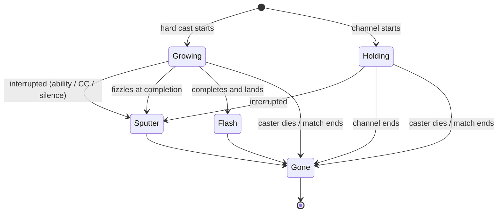
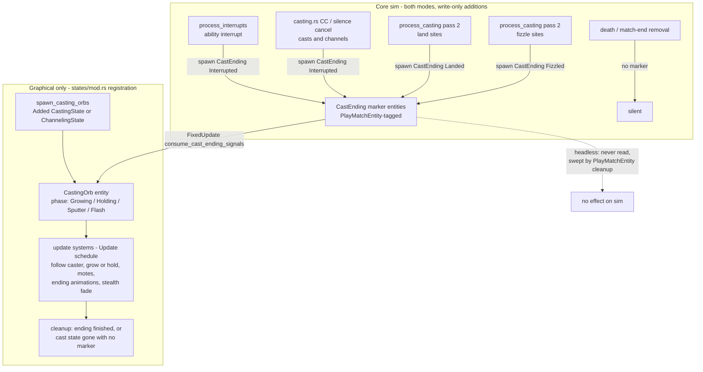

# Casting Animations - Plan

## Goal Capsule

- **Objective:** Give combatants a spell-colored gathering-orb animation while they cast or channel, with a sputter on interrupt/fizzle and a flash on landed completion.
- **Product authority:** The Product Contract below.
- **Execution profile:** One feature branch. The work is graphical-layer rendering plus a handful of write-only cosmetic signal lines in core combat files; no gameplay behavior changes.
- **Stop conditions:** Stop and re-architect the signal design if the headless byte-identity check (Verification Contract) diverges after adding the ending markers, or if a required registration cannot satisfy `tests/registration_audit.rs` within the established graphical-only path.
- **Open blockers:** None.

---

## Product Contract

**Product Contract preservation:** unchanged from the brainstorm except one addition confirmed during planning — F1 and AE7 now record the fourth ending (caster death or match end → silent vanish, no sputter or flash). All R-IDs are untouched.

### Summary

A gathering orb of in-streaming motes appears on any combatant that is casting or channeling: it grows over a hard cast, holds at full intensity through a channel, sputters out when the cast is interrupted or fizzles, and flashes on completion. The orb's color comes from the spell's existing projectile color when one is defined, otherwise from a per-school palette.

### Problem Frame

Matches are watched, not played. The HUD cast bar already says who is casting and what, but the combatant's body is completely static while it happens — the only class of combat activity with no world-space visual. Auto-attacks just gained windup-and-release animations, which makes the stillness of a hard cast more conspicuous, and interrupts (a centerpiece of arena play) land with no visible payoff on the target.

### Key Decisions

- **Gathering orb as the casting shape.** Chosen over a body aura, a ground rune circle, and a weapon-raise pose after side-by-side animated sketches. It has the strongest "power building" read and gives the cast a natural release point.
- **Per-spell color with school fallback, from day one.** The shared-color prototype was dropped once the scan showed the color data already exists: every ability carries a `spell_school`, and projectile spells define exact colors in `assets/config/abilities.ron`. Shared was not actually cheaper.
- **Both endings polished.** Interrupt sputter plus completion flash, chosen over the minimal vanish-on-end. Interrupts are constant in arena play and deserve a satisfying visual.
- **Fizzle counts as a sputter, not a flash.** A cast that reaches its completion point but fizzles (target dead or out of line of sight — the no-mana-charged path) is a failure and reads like one.
- **Channels hold at full intensity.** A channel is already releasing, so the orb appears at full size for its duration and coexists with channel-specific visuals such as the Drain Life beam. One visual language for all casting. A channel's natural completion is a silent vanish by design — a channel has no discrete "lands" moment, so the release flash (R7) is reserved for landed hard casts.
- **Coverage is keyed on casting state, not class.** Anything with an active cast or channel gets the orb. Warrior and Rogue have zero abilities with a cast time, so the requested exclusion falls out naturally, and future casting classes inherit the animation for free.
- **Orb-only slice; casting pose deferred.** A weapon-raise pose layered on top was considered as a higher-upside composite and declined for this slice — it is the natural per-class follow-up, and it requires resolving how a casting pose and the melee swing animation share the Paladin's weapon.

### Requirements

**Orb lifecycle**

- R1. While a combatant has an active hard cast, a gathering orb with in-streaming motes renders in front of its body, growing in size and intensity with cast progress.
- R2. While a combatant channels, the orb renders at full intensity for the channel's duration, alongside any existing channel visuals.
- R3. The orb appears for any combatant in a casting or channeling state, with no per-class allowlist.

**Color**

- R4. The orb uses the ability's projectile color when the ability defines one, otherwise a fixed color for its spell school (Fire, Frost, Shadow, Arcane, Holy, Nature).
- R5. A spell must be able to override its color later without reworking the system.

**Endings**

- R6. An interrupted cast ends the orb with a brief sputter/dissipate rather than an instant vanish.
- R7. A cast that completes and lands ends the orb with a brief release flash.
- R8. A cast that reaches completion but fizzles ends with the sputter, not the flash.

**Rendering constraints**

- R9. Purely graphical in behavior: headless simulation results stay byte-identical, and nothing reads the new visuals from gameplay code.
- R10. The orb follows existing attached-visual conventions: animation never writes the combatant parent entity's transform. (A stealth-fade clause was dropped as vacuous: `stealthed` is Rogue-only and set at spawn, and no Rogue ability has a cast time, so no orb-bearing combatant can be stealthed.)
- R11. The orb animates smoothly at render frame rate with no strobing when render fps exceeds the sim tick rate.

### Key Flows

- F1. Cast lifecycle
  - **Trigger:** A combatant begins a hard cast or channel.
  - **Steps:** Orb spawns and motes stream in; the orb grows with cast progress (hard cast) or holds at full intensity (channel); the cast ends by one of four doors — interrupt (ability interrupt, stun, fear, polymorph, or silence), fizzle-at-completion, landed completion, or caster death / match end.
  - **Outcome:** Sputter for interrupt and fizzle; release flash for a landed completion; silent instant vanish for caster death or match end (the death/celebration animation owns that moment); orb gone in all cases.
  - **Covers:** R1, R2, R6, R7, R8.

### Acceptance Examples

- AE1. **Covers R1, R4, R7.** A Mage hard-casts Frostbolt to completion: the orb grows over the cast in Frostbolt's light-blue projectile color, then flashes as the projectile launches.
- AE2. **Covers R6.** A Warrior Pummels that Mage mid-cast: the orb sputters out; no flash.
- AE3. **Covers R8.** The Mage's target breaks line of sight just before completion (the fizzle that charges no mana): sputter, no flash.
- AE4. **Covers R2.** A Warlock channels Drain Life: the orb holds at full size beside the existing beam for the whole channel.
- AE5. **Covers R4.** A Priest casts Flash Heal, which has no projectile color: the orb renders in the Holy school color.
- AE6. **Covers R3.** Warriors and Rogues never display an orb in any match, with no special-case code.
- AE7. **Covers F1.** A caster dies mid-cast (or the match ends mid-cast): the orb vanishes instantly with no sputter or flash.

### Success Criteria

- A spectator at the default camera distance can tell a combatant is casting — and roughly what school of spell — without reading the cast bar.
- The orb reads as part of the game's flat-color aesthetic rather than a foreign particle effect.

### Scope Boundaries

Deferred for later:

- Weapon-raise casting pose — the per-class flavor layer; blocked on resolving casting pose vs melee swing on the same weapon (Paladin casts while meleeing).
- Instant-cast flourishes (Holy Shock, Frost Nova, and other zero-cast-time abilities).
- Per-spell color overrides beyond projectile colors — e.g. a white Polymorph. Until then Polymorph renders in its Arcane school color, accepted during scoping.
- Per-spell bespoke shapes (anything beyond color differentiating one spell's orb from another's).

### Dependencies / Assumptions

All load-bearing assumptions were verified against the code by independent research passes:

- `CastingState` (`src/states/play_match/components/combatant.rs`) is removed in `process_casting` pass 1 before pass 2 decides landed-vs-fizzled — the graphical layer cannot distinguish those endings from component state alone.
- CC (stun/fear/polymorph) and silence cancellations remove `CastingState`/`ChannelingState` directly with no flag; only ability interrupts set `interrupted` + `interrupted_display_time` (0.5s) today.
- `ChannelingState` is a separate component (Drain Life only); channels share the interrupt fields and semantics with hard casts.
- All 70 abilities define `spell_school`; 9 define `projectile_visuals` colors; no Physical- or None-school ability has a nonzero cast time.
- Pets never receive `CastingState`/`ChannelingState`; all pre-match buffs are instant, so no orb is reachable before gates open.
- Cosmetic marker entities spawned in core are the established cross-mode-safe signal pattern (`AutoAttackSwing`), provided they spawn identically in both modes.

### Sources / Research

- `src/states/play_match/combat_core/casting.rs` — `process_casting` pass 1 removal (~line 296), pass 2 land/fizzle branches (~lines 335-400), CC/silence cancel branches (~lines 171-218 casts, ~855-899 channels), death cancellation (~lines 566-568).
- `src/states/play_match/combat_core/damage.rs` — `process_interrupts` sets `interrupted` + 0.5s display window for casts (~line 218) and channels (~line 257).
- `src/states/play_match/combat_core/auto_attack.rs` (~line 454) + `src/states/play_match/rendering/effects.rs` `consume_swing_signals` (~line 3179) — the marker-spawn / FixedUpdate-consume signal pattern this plan mirrors.
- `src/states/play_match/rendering/effects.rs` — Drain Life beam (~lines 621-706) and drain particles (~lines 709-805): the follow-a-combatant and mote-stream precedents; weapon stealth fade (~line 3569).
- `src/states/view_combatant_ui.rs` (~lines 1211-1223) — exhaustive `SpellSchool` → color match to promote into a shared table.
- `src/states/play_match/match_flow.rs` `check_match_end` (~lines 295-311) — cancels `CastingState` at match end but not `ChannelingState` (the pre-existing freeze bug fixed by U2).
- `assets/config/abilities.ron` — `spell_school` on every ability; `projectile_visuals` colors on projectile spells.
- `docs/plans/2026-08-04-001-feat-attack-animations-plan.md` — the adjacent attack-animation slice whose signal pattern this extends.
- `docs/solutions/implementation-patterns/adding-visual-effect-bevy.md` — the 3-system effect pattern, emissive scaling, `PlayMatchEntity` cleanup.
- `docs/solutions/implementation-patterns/graphical-mode-missing-system-registration.md` — the dual-registration rule and audit.

---

## Planning Contract

### Key Technical Decisions

- **Cast endings are signaled by cosmetic marker entities spawned in core, not inferred from component state.** (session-settled: user-approved — chosen over extending `interrupted` fields to CC/silence paths: lingering sim-visible state risks headless byte-identity, while write-only markers follow the proven `AutoAttackSwing` pattern.) A `CastEnding { caster, kind }` entity (kind: `Landed` / `Fizzled` / `Interrupted`) is spawned at the existing resolution sites in `casting.rs` and `damage.rs`. Markers spawn unconditionally in both modes (cross-mode spawn parity, per the attack-animations lesson); headless never reads them and match-exit cleanup sweeps them via `PlayMatchEntity`.
- **All interrupt flavors sputter through the same marker.** (session-settled: user-approved — chosen over sputtering only on ability interrupts: stun/fear/polymorph/silence cancellations are the most common interrupts in arena play, and R6 is unqualified.) The ability-interrupt site in `damage.rs` and the CC/silence cancel branches in `casting.rs` (casts and channels) all spawn `Interrupted` markers. The orb keys its sputter solely off markers; the lingering `interrupted` `CastingState` window remains HUD-only.
- **Caster death and match end are silent vanish — no marker.** (session-settled: user-approved — chosen over sputtering those endings: the death/celebration animation owns the moment, matching the cast bar's instant removal.) Those removal sites spawn nothing; the orb's cleanup system handles state-gone-without-marker by despawning immediately.
- **The orb is a free-standing world-space entity following the caster, not a `VisualBody` child.** Chosen over child attachment: the Drain Life beam sets the follow precedent, avoids the weapon-socket mount semantics, and sidesteps polymorph mesh-swap interactions. No stealth-fade system is needed: `stealthed` is Rogue-only and set at spawn (`components/combatant.rs:231-232`), and no Rogue ability has a cast time, so an orb-bearing combatant is never stealthed.
- **Signal consumption in `FixedUpdate`, animation in `Update`.** `FixedUpdate` can tick multiple times per rendered frame; a marker consumed in `Update` could be missed or read stale. This mirrors `consume_swing_signals` / `animate_weapon_swings` exactly.
- **One shared `SpellSchool` → color table.** The exhaustive match in `view_combatant_ui.rs` is promoted to a shared function; the orb resolves color as `projectile_visuals.color` when `Some`, else the school table. This satisfies R5 (later per-spell overrides slot into the same resolution function) without triplicating the palette.
- **The `ChannelingState` match-end cleanup gap is fixed in this slice.** (session-settled: user-approved — chosen over deferring: without it the channel orb and the existing Drain Life beam freeze through the 5-second victory celebration, so R2 cannot ship correctly.) One removal added beside the existing `CastingState` cancellation in `check_match_end`.
- **Motes are timer-spawned mesh entities, not a particle system.** The drain-particles idiom (small spheres on a spawn timer, lerped along a path, despawned at arrival) is reused with the path aimed at the orb's focus point. Keeps the effect inside the established pattern; no new dependencies.

### High-Level Technical Design

Prose summary (authoritative): core combat code gains only marker spawns at existing ending sites. The graphical layer owns everything else: an orb entity per casting combatant, driven by live `CastingState`/`ChannelingState` reads for growth/hold, by consumed `CastEnding` markers for its three animated endings, and by state-disappearance-without-marker for silent vanish.

### Assumptions

- Marker spawning in both modes does not perturb headless results (matches `AutoAttackSwing` precedent); the Verification Contract's seed-compare gate proves it rather than assuming it.
- Orb anchor at the projectile spawn point (caster position + 1.5y height) plus a small forward offset toward the caster's facing reads as "in front of the body" from the game camera; exact offset is tuned during implementation.

---

## Implementation Units

### U1. Cast-ending signal markers in core

- **Goal:** Core combat spawns a `CastEnding` marker entity at every animated ending site so the graphical layer can distinguish landed / fizzled / interrupted.
- **Requirements:** R6, R7, R8 (signal source); implements KTD "Cast endings are signaled by cosmetic marker entities" and KTD "All interrupt flavors sputter".
- **Dependencies:** None.
- **Files:** `src/states/play_match/components/visual.rs` (component + kind enum), `src/states/play_match/combat_core/casting.rs` (land ×2; all four no-mana-charged fizzle exits in pass 2 — the projectile-path LoS gate (~line 336), the target-lookup failure (~line 370), the dead-target short-circuit (~line 374), and the instant-path LoS gate (~line 390); CC/silence cancel for casts and channels), `src/states/play_match/combat_core/damage.rs` (ability-interrupt sites for casts and channels).
- **Approach:** `CastEnding { caster: Entity, kind: CastEndingKind }` with `PlayMatchEntity` tag, spawned via `commands.spawn` inline at each existing branch — no new systems in core, so `tests/registration_audit.rs` is unaffected. Death and match-end removal sites spawn nothing. Spawns are unconditional (both modes) for cross-mode parity.
- **Test scenarios:**
  - Covers AE1-AE3 at the signal level: a completed-and-landed Frostbolt spawns exactly one `Landed` marker; a LoS fizzle spawns `Fizzled`; a Pummel interrupt spawns `Interrupted`.
  - A cast whose target dies before completion (the dead-target short-circuit, the most common fizzle in arena play) spawns `Fizzled`.
  - A stun landing mid-cast spawns `Interrupted` (CC-cancel branch), as does a silence.
  - A channel interrupt spawns `Interrupted`; a channel completing naturally spawns nothing (channels have no landed flash).
  - Caster death mid-cast spawns no marker.
  - Headless determinism: two identical-seed headless runs of a Mage-vs-Warrior config and a Warlock-comp config produce byte-identical match logs before vs after this unit.
- **Verification:** `cargo test` green; the seed-compare gate in the Verification Contract passes.

### U2. Channel cleanup at match end

- **Goal:** `check_match_end` cancels `ChannelingState` the same way it already cancels `CastingState`, fixing the pre-existing Drain Life freeze through victory celebration.
- **Requirements:** R2; implements KTD "ChannelingState match-end cleanup gap is fixed in this slice".
- **Dependencies:** None.
- **Files:** `src/states/play_match/match_flow.rs`.
- **Approach:** Add `ChannelingState` removal beside the existing `CastingState` cancellation loop; match outcome is already decided at that point, so nothing downstream reads it.
- **Test scenarios:**
  - A match ending while a Warlock channels Drain Life leaves no `ChannelingState` on any combatant after `check_match_end` runs.
  - Headless matrix output for a fixed seed is unchanged (the removal happens post-outcome).
- **Verification:** `cargo test` green; seed-compare gate passes.

### U3. Shared spell-color resolution

- **Goal:** One function answers "what color is this cast?" — projectile color when defined, school color otherwise — shared by the orb and the existing UI.
- **Requirements:** R4, R5.
- **Dependencies:** None.
- **Files:** `src/states/play_match/abilities.rs` (school → color table as an exhaustive match), `src/states/view_combatant_ui.rs` (refactor `get_spell_school_color` to consume the shared table), `src/states/play_match/rendering/effects.rs` or a small helper module (cast-color resolution returning base color + emissive).
- **Approach:** Port the exhaustive 8-variant match from `view_combatant_ui.rs` into a shared function returning normalized RGB; the UI converts to `egui::Color32`, the renderer to `Color`/`LinearRgba` with the 2-4x emissive scaling convention. Resolution: `projectile_visuals` when `Some`, else school table. The compiler's exhaustive-match check keeps future schools covered.
- **Test scenarios:**
  - Covers AE1: Frostbolt resolves to its `projectile_visuals` color, not the Frost school color.
  - Covers AE5: Flash Heal (no projectile visuals) resolves to the Holy school color.
  - All 8 `SpellSchool` variants return a color (exhaustive match compiles).
- **Verification:** New unit tests pass in `cargo test`; View Combatant screen colors unchanged by eyeball or existing snapshots.

### U4. Orb spawn and sustain visuals

- **Goal:** A colored gathering orb with in-streaming motes appears for the duration of any hard cast (growing) or channel (holding), following the caster.
- **Requirements:** R1, R2, R3, R10, R11; AE4, AE6.
- **Dependencies:** U3.
- **Files:** `src/states/play_match/components/visual.rs` (`CastingOrb` component — name avoids the existing unrelated `ShadowSightOrb`), `src/states/play_match/rendering/effects.rs` (spawn / update / mote systems), `src/states/mod.rs` (registration).
- **Approach:** Spawn keyed on `Added<CastingState>` or `Added<ChannelingState>` with no ability filter (mirrors `spawn_drain_life_beams` minus the filter), carrying the precedent's per-caster duplicate guard (its `existing_beams` check) and skipping any cast state already flagged `interrupted` (a same-frame interrupt can otherwise spawn an orb after its marker was consumed). Free-standing world-space entity re-reading the caster's `Transform` each frame; anchored at caster position + 1.5y (the projectile spawn height) with a small forward offset along facing. Growth eased from `1 - time_remaining / cast_time`; channels hold at 1.0. Motes: drain-particles idiom aimed at the orb focus, spawn timer ~0.08-0.15s. Materials: `Color::srgba` base + `LinearRgba` emissive at 2-4x, `AlphaMode::Add` per `docs/solutions/implementation-patterns/adding-visual-effect-bevy.md` — the Drain Life beam's `Blend` is the single-non-overlapping-mesh exception, and the orb-plus-motes stack is exactly the overlapping-translucent case Add exists for. All entities `PlayMatchEntity`-tagged. Animation time from `Res<Time>` accumulation — never gated on per-frame sim movement (fixed-timestep strobe lesson). Query conflicts: `Without<CastingOrb>` on the caster transform query.
- **Execution note:** Verify smoothness against a moving caster early — a kiting Mage casting Frostbolt is the strobe-sensitive case.
- **Test scenarios:**
  - Covers AE6: a Warrior-vs-Rogue headless config never inserts cast state, so no orb spawn path fires (assert no `CastingOrb` entities in an observed graphical-logic run, or by code-path reasoning + registration audit).
  - Covers AE4: a channeling Warlock has an orb at full intensity alongside the beam.
  - Orb follows a moving caster without lag or strobe (graphical smoke, per the verification loop below).
  - `tests/registration_audit.rs` passes with the new systems registered only in `states/mod.rs`.
- **Verification:** `cargo test` green; graphical smoke run shows the orb on casts for all five caster classes.

### U5. Ending animations, stealth fade, and cleanup

- **Goal:** The orb ends correctly by all four doors: sputter (interrupt or fizzle), release flash (landed), silent vanish (death / match end), plus match-exit cleanup.
- **Requirements:** R6, R7, R8, R9, R10; AE1-AE3, AE7.
- **Dependencies:** U1, U4.
- **Files:** `src/states/play_match/rendering/effects.rs` (marker consumer, ending animation, cleanup systems), `src/states/mod.rs` (registration: consumer in `FixedUpdate` after `CombatSystemPhase::CombatResolution`, animators in `Update`).
- **Approach:** `consume_cast_ending_signals` (FixedUpdate) despawns each `CastEnding` marker and transitions the matching caster's orb into `Sputter` (shrink + motes scatter outward + fade, 0.5s, matching the HUD's interrupted-display window) or `Flash` (brief scale pulse + emissive spike, ~0.25s, at the projectile spawn anchor). Once in an ending phase the orb ignores cast-state reads (the lingering interrupted `CastingState` stays HUD-only). Cleanup despawns orbs whose ending animation finished, and immediately despawns orbs whose caster lost its cast state with no marker consumed and no ending in progress (death / match end / natural channel end). Ordering guarantees the consumer sees markers before cleanup judges absence. `PlayMatchEntity` covers match-exit sweeps.
- **Test scenarios:**
  - Covers AE1: landed Frostbolt → flash at the launch point as the projectile spawns.
  - Covers AE2: Pummel mid-cast → sputter; no flash.
  - Covers AE3: LoS fizzle at completion → sputter; no flash.
  - Covers AE7: caster death mid-cast → orb gone next frame, no ending animation.
  - Natural channel end → orb vanishes without sputter or flash.
  - Match ends mid-cast → no orb, mote, or marker entities survive into the Results screen.
  - Registration audit passes; the FixedUpdate consumer follows the `consume_swing_signals` placement.
- **Verification:** `cargo test` green; graphical smoke run demonstrates all three animated endings; seed-compare gate passes end-to-end.

---

## Verification Contract

| Gate | Command / method | Proves |
|---|---|---|
| Test suite | `cargo test` | Registration audit, color-resolution unit tests, existing probes and item budgets all green |
| Release build | `cargo build --release` | No warnings introduced in touched files |
| Headless byte-identity | Run `cargo run --release -- --headless <config>` at a fixed seed for a Mage-vs-Warrior config and a Warlock+Priest-vs-Warrior+Priest config, before and after the change; diff the match logs | R9 — marker spawns and the U2 cleanup change nothing sim-observable |
| Graphical smoke | `cargo run --release -- --replay <config>` in the background; grep logs for panics, camera ambiguity, and despawn warnings (per the established graphical verification loop); visually confirm orb, endings, and colors | AE1-AE7 in the real client |

---

## Definition of Done

- All five units complete in dependency order (U1/U2/U3 in any order, then U4, then U5).
- Every Verification Contract gate passes; the byte-identity diff is empty.
- AE1-AE7 each demonstrable in the graphical client.
- No abandoned experimental code, dead marker kinds, or unused color paths remain in the diff.
- The pre-existing Drain Life match-end freeze is gone (U2 observable with the existing beam even without the orb).
