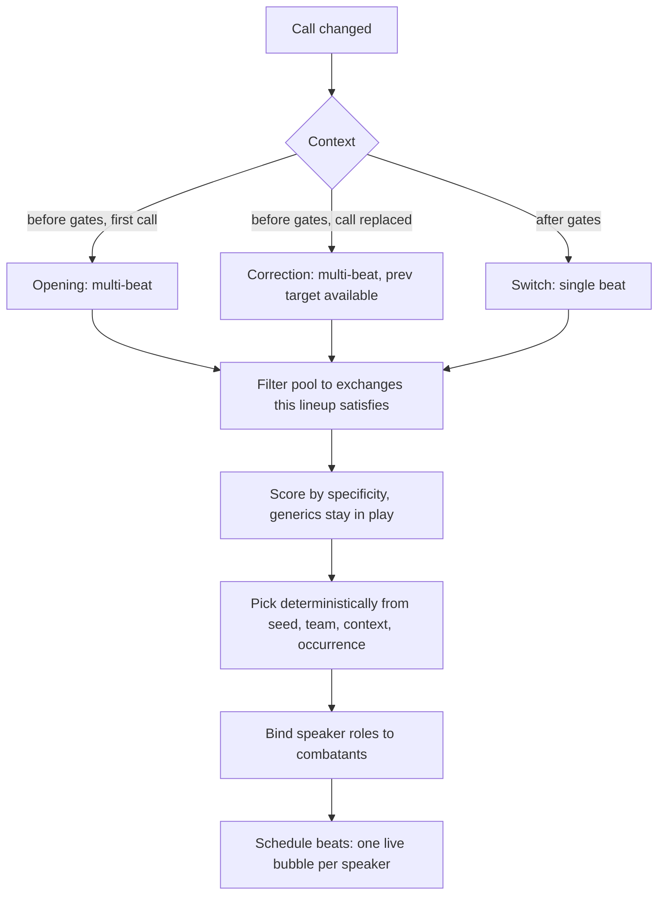
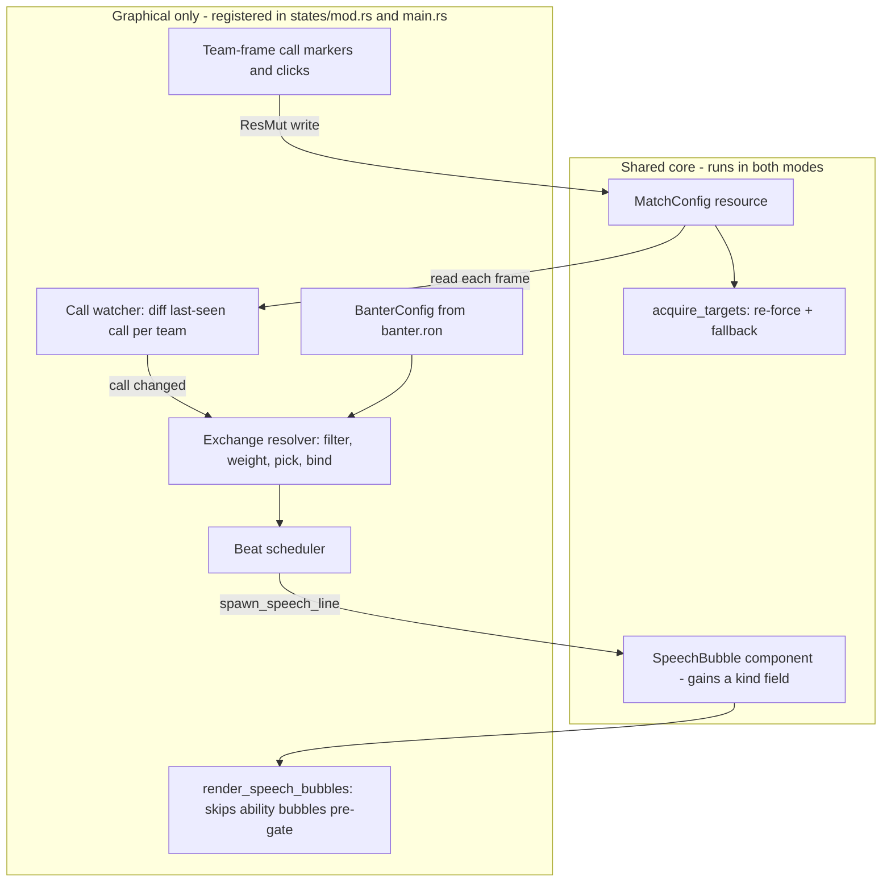

# In-Match Kill Call and Team Banter - Plan

## Goal Capsule

- **Objective.** Make the kill-target call a live, mid-match control in the graphical client, and give each team a voice that reacts whenever its call changes.
- **Product authority.** The user, as the sole operator of this simulator. The control is a debugging and experimentation lever first and a character feature second.
- **Execution profile.** Graphical-client work with a hard determinism boundary: no sim behavior may change. Every new system registers in the graphical-only path, and the byte-identity gate is the arbiter, not inspection.
- **Stop conditions.** Stop and re-architect if the headless byte-identity diff is non-empty after the speech-bubble field change, or if a required registration cannot satisfy `tests/registration_audit.rs` within the graphical-only path.
- **Tail ownership.** Standard: the implementer runs the Verification Contract gates and lands the work; no rollout or migration tail.
- **Open blockers.** None.

---

## Product Contract

**Product Contract preservation:** changed — R2 and R3. The call display moves from two new bottom-corner panels onto the existing broadcast team frames, confirmed during planning after research found those frames already are the per-team, per-combatant column the call belongs on. The underlying product decision (a per-team display, both calls readable at a glance, toggleable) is unchanged. All other R-IDs are untouched.

### Summary

Add a live kill-target call to each team's broadcast frames, changeable mid-match and toggleable, plus a banter system that makes the team speak whenever its call changes — an exchange during the countdown, a corrective beat if the call changes before the gates, and a shout when it changes mid-fight. Suppress the ability-name speech bubbles that currently fire during the countdown so the starting area reads as a scene.

### Problem Frame

The kill-target call can only be given before the gates open. Step 5 of the team-positioning work measured every static held call and found each one net-harmful for at least one side of a matchup: +25 to +65pt when set well, -48 to -69pt when set badly, at n=100 per cell. Each comp wants a different target called, and a call held constant for the whole match cannot adapt the way per-unit re-acquisition does. That result promoted mid-match switching from a deferred enhancement to the prerequisite for the AI ever consuming its own `plan.kill_target`, which stays producer-only today.

The hard, unsolved part of that work is the switch-*decision* rule — when to switch, with what commitment and hysteresis. Everything downstream of that decision is unbuilt and undebugged. A human-driven control exercises all of it on a code path where a person decides when, which defers the unsolved question without blocking the work that depends on its answer.

Separately, the countdown is currently dead air punctuated by combatants announcing their own buffs to an empty room. The Mage shouts "Frost Armor!" at nobody. Once the starting area carries dialogue, those announcements read as noise stepping on it.

### Key Decisions

- **The call is absolute; the user order beats any AI opinion.** (session-settled: user-directed — chosen over advisory semantics the AI could override: predictability is what makes it useful as a debugging lever.) This holds when the AI switch eventually lands.

- **Changing the call re-forces through the existing target-acquisition path.** (session-settled: user-directed — chosen over a second forcing path: `acquire_targets` in `src/states/play_match/combat_ai.rs` already handles visibility, immunity, and the melee sticky-swap hysteresis gate.) The control mutates `MatchConfig::teamN_kill_target` and lets the per-tick re-force do the rest.

- **Banter is visual-only and graphical-only.** (session-settled: user-directed — chosen over any sim-side wiring: no headless baseline may move.) Line selection and beat timing draw from a `drip_jitter`-style hash, never `GameRng`. Systems register in `src/states/mod.rs`, never in `add_core_combat_systems`.

- **One mechanism, three contexts.** The countdown exchange, the mid-countdown correction, and the in-fight switch shout are not three features. They are one "the call changed, so the team reacts" mechanism, differing only in beat count and lifetime. This dissolves the question of whether the in-fight switch deserves a bubble — it is the same system with one beat.

- **The authored unit is a whole exchange, not a line.** A pool of independent lines lets the resolver staple a reply onto an opener it was not written for, producing non-sequiturs. Setup and punchline are authored together.

- **Exchanges declare requirements; the resolver filters.** Rather than keying exchanges into a speaker × responder × target grid, each exchange states what it needs and the resolver keeps those the lineup satisfies. Adding content means appending one entry, never filling a matrix. Coverage is guaranteed by requiring at least one fully-generic exchange per context.

- **Banter fires every match, with a pool deep enough to carry it.** (session-settled: user-directed — chosen over firing only on non-default calls: the countdown should always read as a scene.) This supersedes the seeding note that asked for a small, dry pool. Because both teams default to a kill target of slot 0, "a call is set" is true in essentially every match, so the trigger cannot carry selectivity on its own.

- **Per-match variety comes from the RNG seed, read without drawing.** `GameRng` exposes `seed: Option<u64>` as a public field while the generator itself is private, so reading the seed cannot advance draw order. Hashing the seed into line selection means the same replay always shows the same banter while different matches vary — which hashing the lineup alone would not achieve.

### Actors

- A1. **The operator** — the human running the client. Sets and changes each team's call, and is the audience for the banter.
- A2. **A called team** — the combatants on one side, who re-target on a call change and speak about it.
- A3. **The target-acquisition system** — consumes the call every tick and resolves it against visibility, immunity, and melee swap hysteresis.

### Requirements

**The in-match call control**

- R1. Each team has a control, usable during a live match, that sets that team's kill target by enemy slot index, with semantics identical to the pre-match Kill Target Priority control.
- R2. Each team's current call is marked on the called combatant's frame in the existing broadcast team-frame columns, readable at a glance for both teams simultaneously. A team's call therefore marks a frame in the *opposing* column — a mark in the Team 2 column is Team 1's call.
- R3. The call markers and their click affordance are hidden or shown by a keybinding toggle, following the existing combat-log panel precedent (a persisted display setting plus a `GameAction`).
- R4. Setting a call mutates the team's kill-target config value; no second target-forcing path is introduced.
- R5. The control carries no guardrails against a bad call. Showing the current call clearly is the only affordance.
- R6. When the called target dies, the config value holds until changed and target resolution falls back to nearest, matching existing pre-match behavior.

**Banter**

- R7. A team speaks when its call changes, including at match start, where the change is from nothing to the initial call.
- R8. Three contexts are supported: an opening exchange during the countdown, a corrective exchange when the call changes before the gates open, and a single-beat shout when it changes after.
- R9. Banter content lives in a data file under `assets/config/`, loaded and validated at startup in the same manner as `movement.ron`.
- R10. The authored unit is an exchange: an ordered list of beats, each naming a speaker role, together with the requirements the lineup must satisfy for that exchange to be offered.
- R11. Exchange requirements may constrain the class of each speaker role and the class of the called target. An unconstrained value means any.
- R12. The resolver filters the pool to exchanges the current lineup satisfies, prefers more specific exchanges without excluding generic ones, and picks deterministically.
- R13. Line text supports substitution of the called target's class. The corrective context additionally supports the previous target's class.
- R14. Timing values — first-beat delay, gap between beats, bubble lifetime, and the latest permitted beat start — are data, not constants.
- R15. Banter never draws from the sim RNG.

**Starting-room cleanup**

- R16. Ability-name speech bubbles are suppressed while the gates are closed. The combat log and ability timeline continue to record pre-match buffs.
- R17. The existing ability speech-bubble helper is left behaviorally unchanged; banter uses a sibling entry point that accepts arbitrary text and lifetime.

**Determinism and mode isolation**

- R18. No headless behavior changes. Match outcomes and baselines are byte-identical before and after this work.
- R19. All new systems register in the graphical-only path.

### Key Flows

- F1. Opening banter
  - **Trigger:** A match enters the countdown with a kill target set for a team.
  - **Actors:** A2
  - **Steps:** The resolver filters the pool to `Opening` exchanges this team's lineup satisfies; picks one; binds speaker roles to combatants; schedules each beat at its computed start time; each beat spawns a bubble on its speaker.
  - **Outcome:** The team holds a short conversation about the called target during the countdown.
  - **Covered by:** R7, R8, R10, R11, R12, R14

- F2. Mid-countdown correction
  - **Trigger:** The operator changes a team's call before the gates open, after that team's opening exchange has begun.
  - **Actors:** A1, A2
  - **Steps:** The call change is detected; any unplayed beats of the opening exchange are cancelled; a `Correction` exchange is resolved and scheduled with the previous target available for substitution.
  - **Outcome:** The team acknowledges the change on the way to the gates.
  - **Covered by:** R7, R8, R13

- F3. Mid-fight switch
  - **Trigger:** The operator changes a team's call after the gates open.
  - **Actors:** A1, A2, A3
  - **Steps:** The config value changes; the next target-acquisition tick re-forces every team member onto the new target subject to visibility, immunity, and melee swap hysteresis; a single-beat `Switch` exchange fires.
  - **Outcome:** The team visibly and audibly commits to the new target.
  - **Covered by:** R1, R4, R7, R8

- F4. Toggling the call affordance
  - **Trigger:** The operator presses the call-display keybinding.
  - **Actors:** A1
  - **Steps:** The display flag flips; the call markers and click targets appear or disappear on the team frames. Call state itself is unaffected.
  - **Outcome:** The operator can return to a clean spectator view without losing the call.
  - **Covered by:** R2, R3

### Acceptance Examples

- AE1. Solo team, no exchange
  - **Covers R10, R12.**
  - **Given:** A 1v1 match.
  - **When:** The countdown begins with a call set.
  - **Then:** No exchange requiring two distinct speakers is satisfiable, so nobody speaks. This falls out of the filter and needs no special case.

- AE2. Specific exchange available but not mandatory
  - **Covers R12.**
  - **Given:** A pool with one exchange requiring a Priest responder and a Warrior target, plus several fully-generic exchanges, and a lineup that satisfies the specific one.
  - **When:** Opening banter resolves across repeated matches with differing seeds.
  - **Then:** The specific exchange is favored but does not crowd out the generics entirely.

- AE3. Same replay, same banter
  - **Covers R12, R15, R18.**
  - **Given:** A match run twice at the same seed.
  - **When:** Both runs are observed.
  - **Then:** Both show the same exchanges, and both produce byte-identical match outcomes.

- AE4. Two beats never collide on one speaker
  - **Covers R14.**
  - **Given:** An exchange whose consecutive beats share a speaker role at a gap shorter than the bubble lifetime.
  - **When:** The config loads.
  - **Then:** Validation rejects it. Bubble rendering applies no per-owner offset, so overlapping bubbles on one speaker would draw on top of each other.

- AE5. Called target dies
  - **Covers R6.**
  - **Given:** A team's call is on an enemy who then dies.
  - **When:** Target acquisition next runs.
  - **Then:** The team falls back to nearest visible enemy, and the stored call is unchanged until the operator changes it.

- AE6. Coverage floor
  - **Covers R9, R12.**
  - **Given:** A config whose `Opening` entries all carry class constraints.
  - **When:** The config loads.
  - **Then:** Validation rejects it — every context needs at least one fully-generic exchange so the pool can never fail to resolve.

### Success Criteria

- Changing a call mid-fight visibly re-focuses the team within a tick or two, including switching off a bad call.
- The countdown reads as a scene: dialogue, no buff shouting.
- Headless match outcomes and existing balance baselines are unchanged.
- Adding a new joke means appending one entry to a data file, with no rebuild and no grid to fill.

### Scope Boundaries

**Deferred for later**

- The headless scripted-call timeline (for example, "at t=30, team 1 calls slot 1"). This is what makes switching *measurable* rather than watchable, and it is the A/B harness the AI-switching work will need — but it is a separate body of work from the graphical bundle.
- The AI switch-decision rule itself: when to switch, with what commitment and hysteresis. This remains the unsolved problem the manual control exists to defer.
- An in-match control for the CC target, which has the same pre-match-only limitation as the kill target.
- Deepening the banter pool beyond a seed set with complete generic coverage.

**Outside this feature's identity**

- Guardrails, warnings, or any form of protection against a bad call. The control is an experimentation lever; its predictability is the product.
- Per-combatant names or personalities. Character definitions carry class-level names only, so banter is class-voiced and combatants have no way to address each other by name.

### Dependencies / Assumptions

- Both teams default to a kill target of slot 0, so a call is set in essentially every match. Any behavior conditioned on "a call exists" is effectively unconditional.
- Speech-bubble rendering projects every bubble to a fixed offset above its owner with no per-owner offset or deduplication, making one-live-bubble-per-speaker a scheduling constraint rather than a preference.
- `GameRng::seed` is public while the generator is private, so reading the seed cannot perturb draw order.
- The graphical client always records a seed — `GameRng::default()` routes through `from_os_rng()`, which draws a seed and stores it — so seed-derived banter varies per match in the only mode that shows it. KTD7's `None` fallback is defensive only.
- The in-match call writes to the same resource the pre-match configure screen reads, so returning to that screen shows the last in-match call. Accepted as a consequence of keeping one forcing path.

### Outstanding Questions

All questions the brainstorm deferred to planning are resolved in Key Technical Decisions. None block implementation.

### Sources / Research

- `design-docs/2026-08-06-in-match-kill-target-and-banter.md` — the seeding note this plan supersedes.
- `design-docs/team-level-positioning-ai.md` — the step-5 amendment carrying the measured call table and the reasoning that made mid-match switching a prerequisite.
- `src/states/play_match/combat_ai.rs` — target acquisition, the per-tick kill-target re-force, and the melee sticky-swap gate.
- `src/states/match_config.rs` — the kill-target config fields and their slot-0 defaults.
- `src/states/play_match/rendering/hud.rs` — the combat-log panel toggle precedent the call display follows, spanning `src/settings.rs` (persisted flag), `src/keybindings.rs` (action + default binding), and the copy into `DisplaySettings` at match setup.
- `src/states/play_match/rendering/team_frames.rs` — the broadcast per-team columns that host the call, and the pure-`draw_*` split that makes `tests/team_frames_snapshot.rs` an offscreen iteration loop.
- `src/states/play_match/rendering/effects.rs` — speech-bubble rendering and lifetime, and the `drip_jitter` visual-only hash.
- `src/states/play_match/utils.rs` — the existing ability speech-bubble helper.
- `src/states/play_match/movement_config.rs` and `assets/config/movement.ron` — the load-and-validate pattern the banter config follows.
- `docs/solutions/implementation-patterns/cosmetic-marker-cross-mode-spawn-parity.md` — why a shared component gains a field rather than the spawn path forking by mode.
- `docs/solutions/implementation-patterns/graphical-mode-missing-system-registration.md` — the registration split `tests/registration_audit.rs` enforces.

---

## Planning Contract

### Key Technical Decisions

- KTD1. **The control mutates `MatchConfig::teamN_kill_target`; `acquire_targets` stays the only forcing path.** (session-settled: user-directed — chosen over a second forcing path: the existing re-force already handles visibility, immunity, and melee swap hysteresis; instantiates the Product Contract decision of the same name.) `acquire_targets` takes `Res<MatchConfig>` and re-reads it every tick, so a `ResMut` write from a graphical system lands on the next tick with no plumbing.

- KTD2. **The call lives on the existing broadcast team frames, not new panels.** (session-settled: user-approved — chosen over two new bottom-corner panels: those frames are already per-team columns with a row per combatant and are documented as the stable home for per-combatant information.) Clicking a combatant's frame sets the *opposing* team's call on that combatant.

- KTD3. **`draw_team_frames` gains a return-value action rather than mutating state inline.** The frames are painter-drawn with no interaction today, so hit-testing is new either way. Returning an action keeps the pure-function/kittest split that `tests/team_frames_snapshot.rs` depends on, and matches the `draw_results_screen` convention.

- KTD4. **Call changes are detected by a graphical-only watcher that diffs the last-seen call per team.** Chosen over Bevy change detection on `MatchConfig`: `ResMut` deref marks the resource changed whether or not a field actually moved, and `is_changed()` is true on the first run after insert. An explicit diff has no false positives and makes match start fall out naturally as a change from nothing.

- KTD5. **`BanterConfigPlugin` registers in `src/main.rs` only.** This deviates from `MovementConfigPlugin`, which registers in both modes — deliberately. Headless never reads `assets/config/banter.ron`, so a malformed pool cannot stop a sweep and the config cannot become a sim input by accident.

- KTD6. **Speech bubbles carry a kind, and the pre-gate cleanup is a filter in the graphical renderer.** Chosen over gating the twelve ability call sites: the renderer is already graphical-only, so no sim code is touched at all. The shared `SpeechBubble` component gains a field, which preserves cross-mode spawn parity — headless still spawns identical bubbles and still never reads them.

- KTD7. **Line selection hashes the RNG seed, read without drawing.** (session-settled: user-directed — chosen over hashing the lineup alone: the same comp would otherwise tell the same joke forever; instantiates the Product Contract decision of the same name.) `GameRng::seed` is a public `Option<u64>` while the generator is private, so reading it cannot advance draw order. When it is `None`, selection falls back to a fixed constant and banter is simply the same every run.

- KTD8. **Specificity is a weight, not a filter.** Satisfiable exchanges all stay in the pool; each non-`Any` constraint multiplies an exchange's selection weight by a configurable factor. Strict most-specific-wins would let one bespoke joke crowd out every generic for a given comp.

- KTD9. **A correction cancels the opening exchange's unplayed beats.** Letting both run would talk over the correction with a stale exchange, which is the confusion the correction exists to resolve.

- KTD10. **Exchange resolution is a pure function over plain data.** Filter, weight, pick, and role-bind take a lineup description and return a bound exchange, with no Bevy access — so the interesting logic is unit-testable without a `World`.

### High-Level Technical Design

The load-bearing shape is the mode boundary. Everything new sits on the graphical side of it except one additive field on a shared component, which is what the byte-identity gate exists to police.

Role binding resolves constrained roles first, then fills unconstrained roles from the remaining teammates in slot order. An exchange whose roles cannot all bind to distinct living combatants is unsatisfiable and never reaches the weighting step — which is what makes 1v1 silence fall out with no special case.

### Sequencing

U1, U2, U4, and U8 are independent and can land in any order. U3 needs U8's display flag. U5 needs U1's types. U6 needs U2, U4, and U5. U7 comes last, once there is something to hear.

Units appear below in build order, so the IDs are not sequential — U8 was split out of U3 during planning and keeps the next unused number rather than renumbering the units after it.

---

## Implementation Units

### U1. Banter config schema, loader, and validation

- **Goal:** `assets/config/banter.ron` loads and validates at graphical startup, with a typed resource exposing timing and the exchange pool.
- **Requirements:** R9, R11, R14; implements KTD5.
- **Dependencies:** None.
- **Files:** `src/states/play_match/banter_config.rs` (new), `assets/config/banter.ron` (new), `src/main.rs` (plugin registration).
- **Approach:** Mirror `movement_config.rs` exactly — serde structs with `#[serde(default)]`, `std::fs::read_to_string` plus `ron::from_str` (no asset server), a `validate()` returning a violation list, a `Resource`, and a plugin that panics on failure. Deviate on one point per KTD5: register in `src/main.rs` only, and say so in the module doc comment, because the file's closest sibling registers in both modes and the asymmetry will otherwise read as a bug.
- **Patterns to follow:** `src/states/play_match/movement_config.rs` end to end, including its parse/load/validate function split and its test module shape.
- **Test scenarios:**
  - The shipped `banter.ron` loads, parses, and validates.
  - A missing file yields an error naming the missing path.
  - Malformed RON yields a parse error naming the source.
  - Covers AE6. A config whose `Opening` entries all carry class constraints fails validation with an issue naming the missing generic coverage — every context needs at least one fully-generic exchange.
  - Covers AE4. An exchange with two beats on the same role closer together than `line_lifetime` fails validation with an issue naming the colliding role.
  - An exchange referencing a role absent from its `speakers` list fails validation.
  - A beat scheduled after `latest_beat` fails validation.
  - A partial RON file fills unspecified fields from struct defaults.
- **Verification:** `cargo test` green, including the new validation tests; the graphical client starts and logs the load.

### U2. Speech-bubble kinds and the starting-room cleanup

- **Goal:** Ability bubbles stop rendering before the gates open, and an entry point exists for arbitrary banter text with a configurable lifetime.
- **Requirements:** R16, R17, R18; implements KTD6.
- **Dependencies:** None.
- **Files:** `src/states/play_match/components/combatant.rs` (`SpeechBubble` gains a kind), `src/states/play_match/utils.rs` (`spawn_speech_line` sibling), `src/states/play_match/rendering/effects.rs` (`render_speech_bubbles` pre-gate filter).
- **Approach:** Add a kind enum to `SpeechBubble` defaulting to the ability variant, so all twelve existing call sites keep their exact behavior and spawn parity is preserved. `spawn_speech_line` takes owner, text, and lifetime and sets the banter variant. The filter goes in the renderer, which is already graphical-only — no sim file is edited, so R18 holds by construction rather than by measurement.
- **Execution note:** Land this unit and run the byte-identity gate before building on it. It is the only unit that touches a shared component, so proving it inert early keeps a later divergence from having several candidate causes.
- **Patterns to follow:** `docs/solutions/implementation-patterns/cosmetic-marker-cross-mode-spawn-parity.md` for why the field is additive rather than the spawn path forking by mode.
- **Test scenarios:**
  - `spawn_speech_bubble` still produces the `"{name}!"` text and 2.0s lifetime it produces today.
  - `spawn_speech_line` preserves arbitrary text verbatim and honors its lifetime argument.
  - The renderer's filter predicate rejects an ability bubble when the gates are closed and accepts it when open.
  - The filter accepts a banter bubble in both gate states.
- **Verification:** The byte-identity gate is empty; in the client, no buff shouting during the countdown while the combat log still records the buffs.

### U8. Call-display toggle plumbing

- **Goal:** A persisted display setting and a keybinding action exist for the call display, wired end to end, before anything reads them.
- **Requirements:** R3.
- **Dependencies:** None.
- **Files:** `src/settings.rs` (persisted flag + default), `src/states/play_match/components/resources.rs` (`DisplaySettings` field), `src/states/play_match/mod.rs` (copy the setting at match setup), `src/keybindings.rs` (action, description, category, `all()`, default binding), `src/states/play_match/rendering/hud.rs` (toggle handling).
- **Approach:** Follow the combat-log toggle chain exactly — the same five touch points in the same order. One hazard worth knowing: `description()` and `category()` are exhaustive matches the compiler enforces, but `all()` and the default-binding map are plain collections, so an action missing from either still compiles and silently has no key.
- **Patterns to follow:** `show_combat_panel` across `src/settings.rs`, `src/keybindings.rs`, `src/states/play_match/components/resources.rs`, `src/states/play_match/mod.rs`, and `src/states/play_match/rendering/hud.rs`.
- **Test scenarios:**
  - The new action appears in `GameAction::all()` and has a default binding.
  - Pressing the bound key flips the display flag.
  - The flag round-trips through settings serialization, including from a settings file written before the field existed.
- **Verification:** `cargo test` green; pressing the key in the client logs the toggle.

### U3. In-match call control on the team frames

- **Goal:** Clicking a combatant's team frame sets the opposing team's call on that combatant, with the current call marked on both columns.
- **Requirements:** R1, R2, R4, R5, R6; implements KTD1, KTD2, KTD3.
- **Dependencies:** U8.
- **Files:** `src/states/play_match/rendering/team_frames.rs` (call marker in the frame data, hit-testing, action return), `tests/team_frames_snapshot.rs`.
- **Approach:** Extend `TeamFramesData` with each frame's called-by state and the visibility flag, then have `draw_team_frames` return an action describing which combatant was clicked. The Bevy wrapper applies it to `MatchConfig` via `ResMut`, mapping the clicked combatant to its enemy-slot index the same way the pre-match control does. Clicking the already-called combatant clears the call, matching the pre-match toggle-off behavior. The frames are painter-drawn today, so hit-testing means allocating interactable rects per frame rather than reading an existing response.
- **Patterns to follow:** the pre-match Kill Target Priority control in `src/states/configure_match_ui.rs` for slot-index mapping and clear-on-reclick; the pure-`draw_*`-returns-an-action split in `src/states/results_ui.rs`.
- **Test scenarios:**
  - Covers AE5. When the called combatant dies, the stored call is unchanged and target acquisition falls back to nearest visible enemy.
  - Clicking an unmarked enemy frame sets that team's call to its slot index.
  - Clicking the currently-called frame clears the call to `None`.
  - Clicking a pet sub-frame is a no-op — calls address primary combatant slots only.
  - Clicks are ignored while the affordance is toggled off, and the stored calls are untouched.
  - Snapshot: frames render with a call marked on one combatant per column, and again with the affordance hidden.
- **Verification:** `cargo test` green including the refreshed snapshot; in the client, calling a target mid-fight visibly re-focuses that team within a tick or two.

### U4. Call-change detection

- **Goal:** A graphical-only watcher emits a typed change whenever either team's call differs from what it last saw, including the transition from nothing at match start.
- **Requirements:** R7, R8; implements KTD4.
- **Dependencies:** None.
- **Files:** `src/states/play_match/banter.rs` (new — watcher resource, change type, detection system), `src/states/mod.rs` (registration).
- **Approach:** Hold the last-seen call per team in a graphical-only resource initialized to a sentinel meaning "never seen", so the initial config value reads as a change and drives the opening exchange with no separate match-start path. Each change carries the team, the new call, the previous call, and whether the gates are open — which is what selects the context downstream.
- **Patterns to follow:** graphical-only registration in `StatesPlugin::build()` per `docs/solutions/implementation-patterns/graphical-mode-missing-system-registration.md`.
- **Test scenarios:**
  - The first observation after match setup reports a change from nothing for each team.
  - An unchanged call across frames reports nothing.
  - A changed call reports both the new and previous values.
  - Both teams changing on the same frame report two independent changes.
  - The reported gate state matches the countdown at observation time.
- **Verification:** `cargo test` green; `tests/registration_audit.rs` accepts the new system.

### U5. Exchange resolver

- **Goal:** Given a lineup, a call, and a context, return a bound exchange — or nothing when the pool has no satisfiable entry.
- **Requirements:** R10, R11, R12, R13, R15; implements KTD7, KTD8, KTD10.
- **Dependencies:** U1.
- **Files:** `src/states/play_match/banter.rs` (resolver functions and their tests).
- **Approach:** A pure function over plain data — no `World`, no `Commands`. Filter the pool to entries whose context matches and whose speaker and target constraints the lineup satisfies; weight each survivor by its non-`Any` constraint count; pick by hashing the seed with the team, context, and an occurrence counter; bind constrained roles before unconstrained ones. Substitution resolves the called and previous targets to class names, with the previous target available only in the correction context.
- **Patterns to follow:** `drip_jitter` in `src/states/play_match/rendering/effects.rs` for the `GameRng`-free hash.
- **Test scenarios:**
  - Covers AE1. A single-combatant lineup satisfies no two-speaker exchange and resolves to nothing.
  - Covers AE2. With one Priest-responder exchange and several generics all satisfiable, varying the seed produces both the specific exchange and generics across runs.
  - Covers AE3. The same seed, team, context, and occurrence resolve to the same exchange every time.
  - A class-constrained role binds to the combatant of that class, not to slot order.
  - An exchange requiring two roles that could only bind to the same combatant is unsatisfiable.
  - Target substitution renders the called combatant's class.
  - Previous-target substitution renders in the correction context and is unavailable in the others.
  - A `None` seed still resolves deterministically rather than panicking.
- **Verification:** `cargo test` green.

### U6. Beat scheduler and bubble emission

- **Goal:** A resolved exchange plays out over the countdown or the fight as timed bubbles, one live bubble per speaker, with a correction cancelling the opening exchange's unplayed beats.
- **Requirements:** R7, R8, R14; implements KTD9.
- **Dependencies:** U2, U4, U5.
- **Files:** `src/states/play_match/banter.rs` (scheduler state and system), `src/states/mod.rs` (registration).
- **Approach:** On a change, resolve an exchange and queue its beats at absolute times from the config's timing block, then emit each through `spawn_speech_line` as its time arrives. A new change for the same team drops that team's unplayed beats before queuing the replacement. The two teams schedule independently.
- **Test scenarios:**
  - Beats emit in order at their configured offsets.
  - A correction mid-exchange drops the unplayed beats and queues the correction's.
  - A correction after the last beat has already played queues normally.
  - A team whose resolver returned nothing queues no beats and does not error.
  - A post-gate change emits a single-beat shout.
  - A speaker who dies before a queued beat emits nothing for that beat.
  - Queued beats do not survive into a new match.
- **Verification:** `cargo test` green; in the client, an opening exchange during the countdown, a corrective beat when the call is changed before the gates, and a shout when it is changed after.

### U7. Seed exchange pool

- **Goal:** A pool with complete generic coverage plus enough bespoke entries that repetition is not immediately obvious.
- **Requirements:** R9, R10, R11, R13.
- **Dependencies:** U1, U6.
- **Files:** `assets/config/banter.ron`.
- **Approach:** Write the generic tier first — enough fully-unconstrained entries per context that validation's coverage floor is satisfied and any lineup has variety. Then add target-class entries, then speaker-class entries, then a small number of full pairs where a joke actually exists. Keep single-speaker entries out: 1v1 is silent by decision.
- **Test scenarios:** `Test expectation: none — content only; U1's validation covers structural correctness and the coverage floor.`
- **Verification:** Watch several countdowns across differing comps and seeds; the exchanges vary and every line reads in the voice of the class speaking it.

---

## Verification Contract

| Gate | Command / method | Proves |
|---|---|---|
| Test suite | `cargo test` | Config validation, resolver, watcher, scheduler, team-frame snapshot, registration audit, and all existing probes green |
| Release build | `cargo build --release` | No new warnings in touched files |
| Headless byte-identity | Run `cargo run --release -- --headless <config>` at a fixed seed before and after the change for a 2v2 (`Mage`+`Priest` vs `Warrior`+`Priest`) and a 1v1 (`Mage` vs `Warrior`); diff the match logs | R18 — the `SpeechBubble` field and every new graphical system are sim-inert |
| Headless config isolation | Temporarily rename `assets/config/banter.ron`, then run a headless match | KTD5 — headless never reads the banter config |
| Graphical smoke | `cargo run --release -- --replay <config>` in the background; grep logs for panics, camera ambiguity, and despawn warnings per the established graphical verification loop | The client runs clean with the new systems registered |
| Behavior in the client | Drive a match: watch the countdown exchange, change the call before the gates, change it again mid-fight | AE1–AE6 and the four flows |

---

## Definition of Done

- All eight units complete in dependency order — U1, U2, U4, U8 in any order, then U3, then U5, then U6, then U7.
- Every Verification Contract gate passes, and the byte-identity diff is empty.
- The four flows and all six acceptance examples are demonstrable in the graphical client.
- The banter config's coverage floor holds: every context has at least one fully-generic exchange, enforced by validation rather than convention.
- No abandoned experimental code, unused exchange fields, or dead resolver branches remain in the diff.
