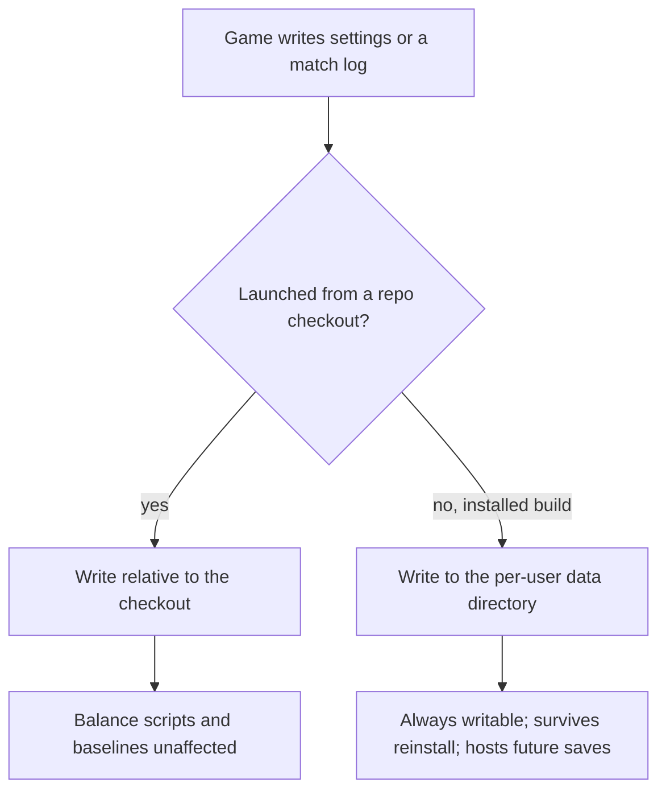
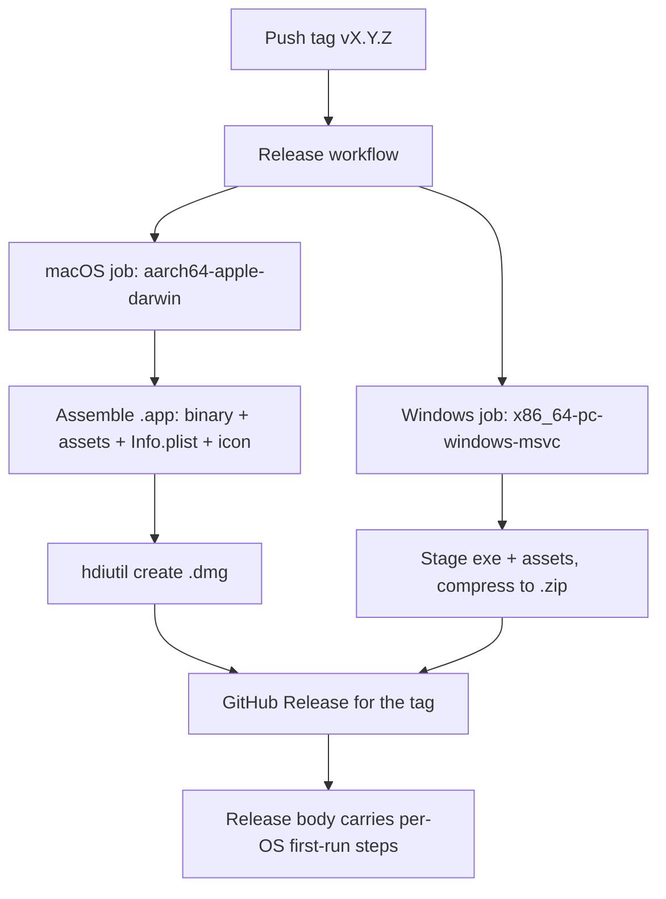

# Desktop Release Distribution - Plan

## Goal Capsule

- **Objective:** Let someone who has never installed Rust go from a link to a running arena match on macOS or Windows.
- **Authority:** The Product Contract below is the contract for *what* ships; the Planning Contract is the contract for *how*. Where they disagree, the Product Contract wins and the conflict is an Open Question, not an implementer's judgment call.
- **Execution profile:** One code seam with unit tests, then packaging and CI that only integration-testing on a real artifact can prove. Expect to iterate on the workflow by pushing throwaway tags.
- **Stop conditions:** Stop and ask if the persistence seam would change where a repo checkout writes (R9 is the constraint the balance tooling depends on), or if satisfying the icon requirement would mean shipping third-party art as the application icon.
- **Tail ownership:** This plan ends at a published release whose artifacts have each been launched once. It does not own announcing the release.
- **Product Contract preservation:** Changed — added R13 and R14 (open-source license file and art provenance) at the user's direction during planning. R1–R12 unchanged.

---

## Product Contract

### Summary

Tag-triggered CI builds arm64 macOS and x64 Windows releases and attaches them to a GitHub Release. The macOS artifact is a `.dmg` containing a double-clickable app bundle; the Windows artifact is a plain `.zip`. Shipping requires relocating the game's file writes to a per-user directory for installed builds, without disturbing where a repo checkout writes them.

### Problem Frame

The only way to play ArenaSim today is to install a Rust toolchain, clone the repository, and wait out a cold Bevy build. That is a ten-minute-plus barrier that no friend will cross to watch a two-minute match, and it means the project has never been seen by anyone who is not willing to become a Rust developer first.

The repository has no CI at all — no `.github/` directory exists — so nothing is built anywhere but on the author's machine. There is also no Windows build path: the author develops on macOS and has never compiled the Windows target.

Two file-write sites make a packaged build subtly wrong even once it is built. `src/settings.rs:134` writes `settings.ron` relative to the working directory, and `src/states/play_match/match_flow.rs:361` saves a combat log through `CombatLog::save_to_file`, which does `fs::create_dir_all("match_logs")` at `src/combat/log.rs:591`. A double-clicked macOS app runs with a working directory of `/`, so both writes fail. Neither crashes — the log failure is caught and logged through `error!` — but the visible result is that window mode and keybindings silently revert on every launch, and no match is ever recorded. Both sites predate any thought of distribution; the settings module's own comment says "In production, you'd use `directories::ProjectDirs`".

### Key Decisions

- **Asymmetric packaging: `.dmg` on macOS, `.zip` on Windows.** (session-settled: user-approved — chosen over symmetric `.dmg`/`.msi`: an unsigned `.msi` fires SmartScreen *and* a UAC elevation prompt, so it adds a scary dialog without adding ease.) The two platforms have different friction profiles. On macOS the app bundle is load-bearing: a bare Unix executable double-clicked from Finder opens a Terminal window rather than the game, so the bundle is what makes "double-click the thing I sent you" work at all. On Windows a zip containing an `.exe` and an assets folder is already the idiom players expect from indie builds, and it costs a fraction of what a WiX installer does.

- **Native downloads now; a web build is deferred.** (session-settled: user-directed — chosen over a hosted WASM build: once saved games and unlockables exist, a web build forks persistence permanently.) The `wasm32-unknown-unknown` scaffolding already in `build.rs` and `.cargo/config.toml` makes a web build tempting, and a URL is the lowest-friction thing to share. The cost is not the storage shim; it is that a second persistence world becomes permanent maintenance the moment user-owned progress exists, along with an expectation that progress follows the player across devices. That is a product decision, not a build target.

- **Unsigned distribution.** (session-settled: user-directed — chosen over paid code signing: the audience is a handful of friends who can be told the exact click path.) Signing costs an Apple Developer membership plus a Windows certificate and buys a warning-free first launch. For a private audience that trade is not worth making, so the first-run friction is absorbed by documentation instead. This sets a floor on how easy "easy" can be, and R11 exists to make that floor as low as documentation can make it.

- **macOS builds target Apple Silicon only.** (session-settled: user-directed — chosen over a universal binary.) An Intel-Mac friend gets nothing that runs. Adding `x86_64-apple-darwin` and merging the two into a universal binary stays available later at the cost of build minutes and artifact size.

- **Persistence relocation applies to installed builds only.** (session-settled: user-approved — chosen over relocating all writes unconditionally.) Every balance script reads `match_logs/` relative to the checkout — `scripts/hunter_2v2_matrix.sh:86`, `scripts/mage_2v2_matrix.sh:86`, `scripts/shaman_2v2_matrix.sh:86`, `scripts/run_combat_tests.sh:131`, and `scripts/behaviour_baseline.sh:69` all do. A global relocation would break the entire measurement workflow described in `CLAUDE.md`. The write location therefore depends on how the binary was launched, not on which build it is.

- **Ship the bundled Wowhead-sourced art in published binaries.** (session-settled: user-directed — chosen over stripping or replacing it before release: the art is publicly available, the project is non-commercial, and it ships under an open-source license.) The consequence handled by R14 is disclosure, not removal: the project's own license covers the code, and the third-party provenance of the ability, class, and item icons is stated rather than implied.

### Requirements

**Release pipeline**

- R1. Pushing a version tag produces downloadable macOS and Windows artifacts attached to a GitHub Release, with no step performed on a local machine.
- R2. The pipeline builds from a clean checkout of the tag, so any published artifact can be reproduced from the tag alone.
- R3. Adding a platform target later is adding a build target, not restructuring the pipeline.

**Packaging**

- R4. The macOS artifact is a `.dmg` containing an application bundle that launches the game on double-click from Finder, with the game's assets carried inside the bundle.
- R5. The Windows artifact is a `.zip` containing the executable and its assets, playable after unpacking with no installer step.
- R6. Both artifacts carry an original application icon, so the game is identifiable in the Dock, in Finder, and in the Windows taskbar.

**Persistence**

- R7. An installed build persists user settings across launches, writing to a per-user location it can always write to.
- R8. An installed build writes its match logs to a per-user location rather than failing.
- R9. A build launched from a repository checkout continues to write `match_logs/` relative to that checkout, leaving the balance and baseline scripts unaffected.
- R10. The per-user location is chosen once and can host future user-owned data — saved games, unlockables — without a second relocation.

**First-run experience and licensing**

- R11. Every release carries per-OS instructions for opening unsigned software, written for someone who has never seen the warning before and naming the exact click path.
- R12. A friend who reads only the release page reaches a running match without opening the repository README or installing a toolchain.
- R13. The repository carries a `LICENSE` file matching the MIT license `Cargo.toml` already declares.
- R14. The README and each release state that the bundled ability, class, and item icon art is third-party Wowhead material outside the project's own license grant.

### Key Flows

- F1. Publishing a release
  - **Trigger:** A version tag is pushed to `origin`.
  - **Steps:** CI builds the arm64 macOS target and the x64 Windows target from the tagged checkout; each job packages its platform's artifact; both artifacts are attached to a GitHub Release carrying the first-run instructions.
  - **Outcome:** A public URL that anyone can download from without a GitHub account.
  - **Covered by:** R1, R2, R4, R5, R11

- F2. A friend's first launch on macOS
  - **Trigger:** The friend downloads the `.dmg` from the release page.
  - **Steps:** They open the `.dmg` and drag the app to Applications; the first launch is refused because the app is unsigned and quarantined; they follow the release instructions to approve it; the game opens.
  - **Outcome:** A running match, and every subsequent launch opens directly.
  - **Covered by:** R4, R11, R12

### Acceptance Examples

- AE1. Settings survive a relaunch of an installed build
  - **Covers R7.**
  - **Given** the app has been installed from the `.dmg` and launched from Applications,
  - **When** the player sets borderless fullscreen, quits, and relaunches,
  - **Then** the game opens borderless fullscreen.

- AE2. Balance tooling is unaffected
  - **Covers R9.**
  - **Given** a repository checkout,
  - **When** `scripts/hunter_2v2_matrix.sh` runs,
  - **Then** its CSV lands under `match_logs/` in the checkout exactly as it does today.

- AE3. An installed build records its matches
  - **Covers R8.**
  - **Given** the installed app,
  - **When** a match finishes,
  - **Then** a combat log is written to the per-user location and no save failure is logged.

- AE4. The Windows artifact needs no installer
  - **Covers R5, R12.**
  - **Given** a friend on Windows who has never installed Rust,
  - **When** they unpack the `.zip` and double-click the executable,
  - **Then** the game runs after approving one SmartScreen prompt.

### Success Criteria

- A friend on a normal connection goes from the release link to a running match in under five minutes, counting the unsigned-software approval.
- Cutting a release is a tag push with no manual packaging, upload, or per-platform intervention.

### Scope Boundaries

Deferred for later:

- A web or WASM build, and the second persistence world it implies.
- Code signing and notarization on either platform.
- Intel Mac support and universal binaries.
- Linux builds and the SteamDeck work already tracked in `design-docs/roadmap.md`.
- Auto-update or any patcher.
- Distribution through itch.io, Steam, or any storefront.

#### Deferred to follow-up work

- Migrating a player's existing checkout-local `settings.ron` into the per-user location. No installed build has ever run, so no player has settings to migrate.
- Pruning old match logs in the per-user location. An installed build writes one log per match with no cap, which is the same behavior a checkout has today.

### Dependencies / Assumptions

- The repository is public (`dwalker-va/arenasim-prototype`), so GitHub Actions minutes are free and release asset URLs are reachable without a GitHub account. Both would change if it went private.
- Bevy resolves its asset directory relative to the executable when neither `BEVY_ASSET_ROOT` nor `CARGO_MANIFEST_DIR` is set (`bevy_asset-0.16.1/src/io/file/mod.rs:19`), so `assets/` sits beside the binary inside the app bundle.
- `assets/` is 2.1 MB, so bundling it whole costs nothing worth optimizing.
- Cold Bevy builds are slow enough that the release jobs need dependency caching to be tolerable.
- The repository's Actions setting must allow workflows read-and-write permissions, or the release-upload step cannot attach artifacts. This is a one-time manual repo setting, not something the workflow can grant itself.
- The first release is tagged `v0.1.0`, matching the version `Cargo.toml` already declares. The workflow reads the version from the tag rather than parsing the manifest.

---

## Planning Contract

### Key Technical Decisions

- **Detect a development build by finding a Cargo manifest above the executable, not by reading `CARGO_MANIFEST_DIR`.** Bevy's own asset resolution keys on that environment variable, which makes it the tempting discriminator — and it is wrong here. `scripts/hunter_2v2_matrix.sh:90`, `scripts/mage_2v2_matrix.sh:90`, `scripts/shaman_2v2_matrix.sh:90`, and `scripts/run_combat_tests.sh:126` all invoke `target/release/arenasim` directly rather than through `cargo run`, so the variable is unset in exactly the workflows R9 protects. Walking up from the executable's own directory for a `Cargo.toml` classifies both `cargo run` and a direct `target/release` invocation as development, and classifies an installed bundle or an unpacked zip as installed. It needs no build-time flag and no marker file that packaging could forget to ship.

- **Assemble the macOS bundle and disk image in the workflow rather than adding a bundler crate.** The official `bevyengine/bevy_github_ci_template` release workflow builds `<name>.app/Contents/MacOS/`, copies the binary and `assets/` into it, and makes the image with `hdiutil create -fs HFS+ -volname`. That is the well-trodden path for Bevy specifically, uses only tooling already present on the runner, and adds nothing to `Cargo.toml`. `cargo-packager` and `cargo-bundle` both work but buy features this plan does not need — neither signs or notarizes, which is the one thing that would have justified them.

- **Commit `Info.plist` as a file rather than generating it in the workflow.** The reference template ships no `Info.plist` at all, which is why its bundles get a generic icon and no bundle identifier. R6 needs `CFBundleIconFile`, and a stable `CFBundleIdentifier` is what lets macOS keep per-app state coherent across launches. A committed file is reviewable and diffable; a heredoc inside a YAML step is neither.

- **Relocate match logs in installed builds rather than disabling them.** R8 already fixes the behavior, and a log the player never looks at still costs nothing while making a bug report possible. Disabling would also mean two code paths where one suffices.

- **Use `directories::ProjectDirs` for the per-user location.** `src/settings.rs:100` already names it as the intended production answer. It resolves `~/Library/Application Support/<app>` on macOS and `%APPDATA%\<app>` on Windows, which is what R10 needs for future saves.

### High-Level Technical Design

The release pipeline is a fan-out from one tag to two independently-packaged artifacts converging on a single release:

The persistence seam is a single module both write sites call. It resolves two directories — one for settings, one for match logs — and every caller asks it rather than building a path itself. The decision boundary it encodes is the one already diagrammed under Key Decisions.

### Assumptions

- Running the packaged binary with a headless flag (`--headless`, `--matrix`, `--batch`) is not a supported player path, but the seam treats it uniformly: defaulted output lands in the per-user location. Explicitly-passed output paths (`--out`, `-o`, `--output`) bypass the seam entirely and keep working unchanged, which is what the balance scripts rely on.
- The Windows runner's `Compress-Archive` produces an archive that unpacks correctly on consumer Windows without a third-party tool.

---

## Implementation Units

### U1. Path seam with development-vs-installed detection

- **Goal:** One module that answers where settings and match logs belong, classifying the running binary as a development checkout or an installed build.
- **Requirements:** R7, R8, R9, R10
- **Dependencies:** None
- **Files:**
  - `src/paths.rs` (new)
  - `src/lib.rs` (register the module)
  - `Cargo.toml` (add `directories`)
- **Approach:** Expose a resolver with two entry points — the settings file path and the match-log directory — plus the classification behind them. Split the classification into a pure function that takes an executable path and returns whether a `Cargo.toml` exists in any ancestor directory, so it is testable without touching the real filesystem layout. The public entry points call `std::env::current_exe()` and feed it in. When classified as a development build, return the same checkout-relative paths in use today so behavior is byte-identical; when classified as installed, return paths under `ProjectDirs`. Failure to resolve a per-user directory falls back to today's behavior rather than panicking — the game must still start.
- **Patterns to follow:** `src/settings.rs` for the module's error posture — read and write failures degrade with a log line rather than propagating.
- **Test scenarios:**
  - An executable path nested under a directory containing `Cargo.toml` classifies as a development build.
  - An executable path with no `Cargo.toml` in any ancestor classifies as installed.
  - An executable path directly inside a directory containing `Cargo.toml` classifies as a development build (the `target/release` case is nested, but a manifest-adjacent binary must not be misread).
  - A development classification yields exactly the paths used today — `settings.ron` and `match_logs` relative to the working directory.
  - An installed classification yields paths under the per-user data directory, and the two differ from each other.
- **Verification:** `cargo test` passes with the new unit tests; no other test's behavior changes.

### U2. Route settings and match logs through the seam

- **Goal:** Both existing write sites ask the seam for their path instead of hardcoding one.
- **Requirements:** R7, R8, R9
- **Dependencies:** U1
- **Files:**
  - `src/settings.rs`
  - `src/combat/log.rs`
  - `tests/` — a new integration test asserting the defaulted log directory in a development run
- **Approach:** Replace the literal in `GameSettings::settings_path` with the seam's settings path. In `CombatLog::save_to_file`, change only the `None` branch that currently hardcodes `match_logs`; the explicit-path branch above it must stay untouched, because that is what `--out`, `-o`, and `--output` flow through and what the balance scripts pass. Create the parent directory before writing in the installed case, since a fresh per-user directory will not exist. Remove the now-stale comment at `src/settings.rs:100` rather than leaving it describing work that has been done.
- **Patterns to follow:** The existing `error!`-and-continue handling at `src/states/play_match/match_flow.rs:361` — a failed log write must stay non-fatal.
- **Test scenarios:**
  - Covers AE2. A defaulted headless run from the checkout writes its log under `match_logs/` in the checkout.
  - An explicitly-passed output path is written verbatim and is unaffected by the seam.
  - Saving settings creates the parent directory when it does not exist.
  - A settings write to an unwritable location logs a failure and does not panic.
- **Verification:** `cargo test` passes; `scripts/behaviour_baseline.sh` still finds its log via `ls -t match_logs/match_*.txt`; a matrix run still writes `match_logs/matrix_<timestamp>.csv`.

### U3. Original application icon

- **Goal:** An original icon exists in the repository in both platform formats.
- **Requirements:** R6
- **Dependencies:** None
- **Files:**
  - `packaging/icon.svg` (new — the source of truth)
  - `packaging/macos/AppIcon.icns` (new)
  - `packaging/windows/icon.ico` (new)
- **Approach:** Draw an original mark as vector art, then render it to the two platform container formats at the sizes each expects. It must be original work — nothing under `assets/icons/` is eligible, since that art is third-party. Keep the vector source committed so the raster outputs can be regenerated rather than hand-edited. Favor a silhouette that stays legible at 16px, since that is the size the Windows taskbar and macOS Finder list view actually use.
- **Test scenarios:** `Test expectation: none -- asset-only unit; correctness is visual and is proven by the U6 and U7 launch checks.`
- **Verification:** Both container files open in their platform's preview tooling and render the mark at small sizes without turning to mud.

### U4. Bundle metadata and Windows icon embedding

- **Goal:** Each platform's binary or bundle is wired to the icon and carries an identity.
- **Requirements:** R6
- **Dependencies:** U3
- **Files:**
  - `packaging/macos/Info.plist` (new)
  - `build.rs`
  - `Cargo.toml` (add a Windows-only build dependency for resource embedding)
- **Approach:** Write an `Info.plist` naming the executable, the bundle name, a reverse-DNS bundle identifier, the icon file, and the version. On Windows the icon has to be compiled into the executable as a resource, so extend `build.rs` with a target-gated branch that embeds it. Gate that branch so non-Windows builds — including the existing `wasm32` branch — are untouched, and so a Linux or macOS build never needs the Windows-only dependency.
- **Patterns to follow:** The existing target-arch conditional in `build.rs`, which already demonstrates the gating shape this needs.
- **Test scenarios:**
  - `Test expectation: none -- build-time wiring; proven by the U6 and U7 launch checks.`
- **Verification:** `cargo build --release` succeeds unchanged on macOS; the plist is valid and parses.

### U5. Release workflow with the Windows job

- **Goal:** Pushing a version tag publishes a Windows zip to a GitHub Release.
- **Requirements:** R1, R2, R3, R5
- **Dependencies:** U2, U4
- **Files:**
  - `.github/workflows/release.yaml` (new)
- **Approach:** Trigger on version tags only. Build the Windows target on a Windows runner from the tagged checkout, stage the executable next to a copy of `assets/`, compress the staging directory, and attach the archive to the release for that tag. Add dependency caching, since a cold Bevy build is the dominant cost. Structure the job so a second platform is a sibling job rather than an edit to this one — that is what R3 asks for and what U6 will rely on.
- **Execution note:** This is CI, so the proof is a real run. Push a throwaway prerelease tag, confirm the artifact publishes, then delete the tag and its release before the real one.
- **Test scenarios:**
  - A pushed version tag triggers the workflow; a non-version tag does not.
  - The published archive contains the executable and a populated `assets/` directory.
  - Covers AE4. The archive unpacks and the executable launches on Windows without an installer.
- **Verification:** A throwaway tag produces a release with the Windows archive attached, and the artifact runs.

### U6. macOS bundle and disk image job

- **Goal:** The same tag also publishes a `.dmg` containing a double-clickable app bundle.
- **Requirements:** R1, R2, R4, R6
- **Dependencies:** U5
- **Files:**
  - `.github/workflows/release.yaml`
- **Approach:** Add a sibling job on a macOS runner targeting Apple Silicon. Assemble the bundle directory, place the binary and a copy of `assets/` beside each other inside it so Bevy's executable-relative asset resolution finds them, put the icon and the committed plist in their expected places, then make the disk image with the stock macOS image tool. Attach it to the same release as the Windows job.
- **Execution note:** Verify on a real download, not on the runner. Fetch the published `.dmg` through a browser so it carries the quarantine attribute, then walk the approval path a friend would — that is the only way AE-level first-run behavior is actually proven.
- **Test scenarios:**
  - The bundle contains the binary, a populated `assets/` directory beside it, the plist, and the icon.
  - Mounting the image and dragging the app to Applications yields an app that launches from Finder.
  - Covers AE1. Setting borderless fullscreen, quitting, and relaunching preserves the setting.
  - Covers AE3. Finishing a match writes a log to the per-user location with no save failure logged.
  - The app quits cleanly from both the in-game exit control and the window close button, with no panic — the failure mode documented in `docs/solutions/implementation-patterns/bevy-macos-exit-deadlock-egui-teardown.md` has no automated coverage and must be re-checked on any packaging change.
- **Verification:** A throwaway tag produces a release carrying both artifacts; the downloaded `.dmg` installs and runs through the scenarios above.

### U7. License, provenance, and first-run instructions

- **Goal:** The repository states its license, discloses the third-party art, and tells a first-time player exactly which buttons to press.
- **Requirements:** R11, R12, R13, R14
- **Dependencies:** U6
- **Files:**
  - `LICENSE` (new)
  - `README.md`
  - `.github/workflows/release.yaml` (release body)
- **Approach:** Add the MIT license text `Cargo.toml` already claims. State in the README that the bundled ability, class, and item icons are third-party Wowhead material and are not covered by that grant — one short paragraph, adjacent to the license mention rather than buried. Write the per-OS first-run steps once and have the workflow use them as the release body, so the instructions ship with every release instead of living only in the repository. Write them for someone who has never seen the warning: name the dialog text they will actually see, and the exact menu path to approve the app. Add a download-and-play path to the README's Quick Start ahead of the build-from-source instructions, since a reader who wants to play is currently sent to `rustup`.
- **Test scenarios:**
  - `Test expectation: none -- documentation; correctness is proven by the U6 first-run walkthrough and by R12's read-only-the-release-page check.`
- **Verification:** A reader who opens only the release page can install and launch on both platforms without opening the repository.

---

## Verification Contract

| Gate | Command or check | Applies to |
|---|---|---|
| Unit and integration tests | `cargo test` | U1, U2 |
| Release build unchanged | `cargo build --release` | U4 |
| Balance tooling regression | `scripts/behaviour_baseline.sh` finds its log; a matrix run writes `match_logs/matrix_<timestamp>.csv` | U2 |
| Windows artifact | Throwaway tag publishes the zip; it unpacks and launches | U5 |
| macOS artifact | Throwaway tag publishes the `.dmg`; it installs, launches, and quits cleanly | U6 |
| First-run path | Browser-downloaded artifact walked end to end on each OS | U6, U7 |

The registration audit (`tests/registration_audit.rs`) is unaffected — the seam adds no Bevy systems, only plain functions.

## Definition of Done

- R1–R14 are each satisfied or explicitly deferred in Scope Boundaries.
- `cargo test` and `cargo build --release` pass.
- A repo checkout writes settings and match logs exactly where it does today, verified by running the balance tooling rather than by inspection.
- Both artifacts have been downloaded through a browser and launched, and the macOS app has been quit through both exit paths without a panic.
- Throwaway prerelease tags and their releases are deleted; no experimental workflow files, stub icons, or abandoned packaging approaches remain in the diff.
- The `LICENSE` file exists and the README states the art provenance.

## Open Questions

Deferred — none block implementation:

- Whether later releases should also attach a Linux artifact for the SteamDeck work in `design-docs/roadmap.md`. R3 keeps this to adding a sibling job.
- Whether the per-user match-log directory should eventually be pruned or capped. Recorded under deferred follow-up work.

## Sources / Research

- `bevy_asset-0.16.1/src/io/file/mod.rs:19` — asset base path resolves `BEVY_ASSET_ROOT`, then `CARGO_MANIFEST_DIR`, then the executable's parent directory. This confirms the bundle layout and is the source of the discarded discriminator.
- `bevyengine/bevy_github_ci_template` release workflow — builds `<name>.app/Contents/MacOS/` with the binary and `assets/` inside, images it with `hdiutil create -fs HFS+ -volname`, and zips the Windows build with `Compress-Archive`. Ships no `Info.plist`, which is the gap U4 fills.
- `src/settings.rs:102` and `src/settings.rs:134` — the working-directory-relative settings path and its write.
- `src/combat/log.rs:591` — `fs::create_dir_all("match_logs")` in the defaulted branch of `save_to_file`.
- `src/states/play_match/match_flow.rs:361` — the graphical caller, which catches save failures and logs them.
- `scripts/hunter_2v2_matrix.sh:90`, `scripts/mage_2v2_matrix.sh:90`, `scripts/shaman_2v2_matrix.sh:90`, `scripts/run_combat_tests.sh:126` — invoke `target/release/arenasim` directly, bypassing cargo.
- `scripts/behaviour_baseline.sh:69` — reads the defaulted log path, so it depends on the development classification being correct.
- `docs/solutions/implementation-patterns/bevy-macos-exit-deadlock-egui-teardown.md` — the macOS exit path has no automated coverage and is re-verified by hand on packaging changes.
- `build.rs` and `.cargo/config.toml` — the existing `wasm32` target gating, and the pattern U4's Windows branch follows.
- `design-docs/roadmap.md:228` — "SteamDeck testing and optimization", the tracked reason R3 asks the pipeline to stay extensible.
