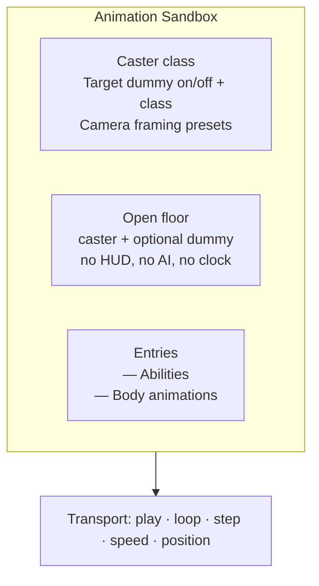
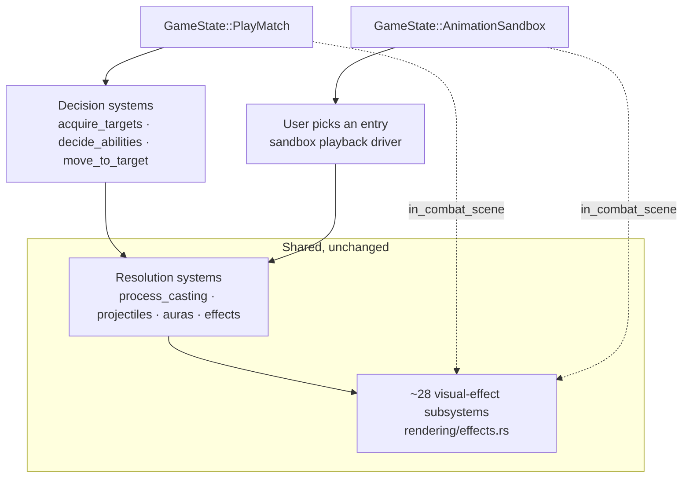
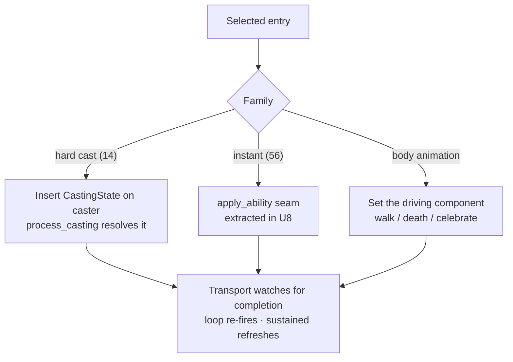

# Animation Sandbox - Plan

## Goal Capsule

- **Objective:** Give the client a dedicated screen where any ability's animation can be played on demand, on an inert caster, under playback and camera controls good enough to actually judge it.
- **Product authority:** The Product Contract below. The Planning Contract governs how it is built.
- **Execution profile:** Deep, nine units, two phases. Phase A (U1-U7) delivers the sandbox for the 14 hard-cast abilities and the body animations. Phase B (U8-U9) extracts a shared ability-application seam so the 56 instant abilities become playable. Phase A is graphical-only; Phase B touches simulation code and is gated on byte-identity at every step.
- **Delivery:** Phase A and Phase B ship as **separate branches and separate PRs**. Phase A touches no simulation code and is byte-identity safe by construction; Phase B is a balance-sensitive refactor across eight class-AI files and earns its own review. Do not combine them. Until Phase B lands, R4, R17 and R18 are satisfied for the hard-cast family only, and the selection panel shows instant entries as not-yet-playable (U4) so coverage is visible rather than hidden.
- **Stop conditions:** Any `tests/determinism_pin.rs` failure, or any diff in a pinned-seed headless match log, stops work until the cause is removed — byte-identity is non-negotiable (R20). In U8, a class whose instant-application body cannot be extracted without behavior change stops that class's extraction for redesign rather than being forced.
- **Open blockers:** None.

---

## Product Contract

**Product Contract preservation:** unchanged. All R/F/AE IDs are untouched. Planning discovered that R4 and R16 together are far more expensive than the brainstorm assumed (see KTD3) and answered it with phasing, not by narrowing product scope.

### Summary

A new Animation Sandbox screen, reachable from the main menu alongside Armory. The user picks a caster class, picks an ability (or a body animation), and plays it on an empty floor against an optional target dummy — with loop, frame-step, slow motion below the in-match minimum, and camera framing presets. No AI, no match clock, no HUD.

### Problem Frame

Seeing a combat animation today means engineering a match that produces it. The class has to be in the comp, the AI has to choose the ability, and the game state has to satisfy its preconditions — so picking a match config is trial and error. `--replay` removed the menu-hopping half of that cost, but not the "will this even fire" half.

The second half is worse and less obvious. When the animation does fire, it is frequently unjudgeable: it plays at match speed, from whatever angle the camera happens to hold, on a unit that may be moving, occluded, or crowded by HUD elements — and then it is over. The two halves compound. Iterating on one effect's timing means repeatedly re-rolling a match and hoping for a clean look at a moment that lasts a fraction of a second.

The cost is rising. The animation layer is now two dozen-plus effect subsystems in `src/states/play_match/rendering/effects.rs`, plus body motion in `src/states/play_match/combat_core/death.rs` and `src/states/play_match/match_flow.rs`, and three animation features shipped in the last three months. Every one of them was tuned through this loop.

Both existing fast-iteration surfaces — the arena layout snapshot and the Results screen kittest harness — are egui-only. Neither reaches a world-space 3D visual.

### Key Decisions

- **A dedicated screen, not a debug panel inside a live match.** (session-settled: user-approved via visual sketch — chosen over an in-match dev panel, a contact-sheet gallery, and a CLI-only flag: the cheap in-match option adds on-demand triggering but leaves the harder half unsolved, because a match running underneath is itself a reason animations are hard to see.)

- **Abilities are the entry the user picks, not animations.** (session-settled: user-approved — chosen over per-subsystem isolation and a two-tab hybrid: it matches how the game is thought about, the ability set is already enumerated in data, and playing a whole ability shows how its effects compose rather than one subsystem in isolation.)

- **Body animations get their own category rather than being dropped.** Walk bob, death sink and victory bounce are not abilities and would have no home under an ability-only list, so they are listed separately.

- **What the sandbox shows is what a match shows.** An entry plays through the same path a match uses rather than a hand-authored approximation. This costs more than faking each effect, and it is the point: a preview that can drift from real behavior is worse than no preview, because it produces confident wrong conclusions.

- **Human viewing only.** (session-settled: user-directed — chosen over an agent-viewable frame-capture path and a snapshot regression guard: the user judges animations by eye, and capture on this machine is blocked at the OS permission layer.)

- **Coverage is the whole ability set from day one.** Because entries are driven by the ability data rather than a curated list, a partial rollout would cost more than full coverage, not less — it would need an allowlist that full coverage does not.

### Requirements

**Entry and selection**

- R1. The sandbox is reachable from the main menu as its own screen.
- R2. The user selects a caster class independently of the entry to play.
- R3. Entries are presented in two categories: Abilities, and Body animations.
- R4. Every ability the game defines is a playable entry, across all seven classes.
- R5. Walk bob, death sink and victory bounce are playable entries under Body animations.
- R6. A target dummy can be toggled on or off, and its class chosen when on.

**Playback control**

- R7. Playing an entry runs it from its start.
- R8. An entry can be set to loop, replaying continuously without further input.
- R9. Playback speed can be set slower than the in-match minimum of 0.5x, into a range where individual phases of an animation are legible.
- R10. Playback can be paused and then advanced one step at a time.
- R11. Elapsed position and total duration of the current entry are displayed during playback.

**Viewing environment**

- R12. The sandbox renders on an open floor with no arena obstacles.
- R13. No HUD, team frames, combat log, or speech bubbles render in the sandbox.
- R14. No AI runs and no match clock advances; nothing moves unless the user asks for it.
- R15. Camera framing presets place the camera at a known good angle in a single action, and free camera control remains available alongside them.

**Fidelity and coverage**

- R16. An entry plays through the same path a match uses, so its appearance cannot drift from its in-match appearance.
- R17. Abilities whose visuals depend on sustained state — an aura on the target, an active cast — play correctly, not only one-shot bursts.
- R18. Abilities whose visuals depend on a second unit — beams, projectiles, launch arcs, a swing landing on a target — play correctly when the dummy is on.
- R19. The dummy survives anything played at it, so an entry can be replayed without resetting the scene.
- R20. The sandbox changes no simulation output; headless results stay byte-identical.

### Screen composition

### Key Flows

- F1. Iterating on one ability's look
  - **Trigger:** The user has changed an ability's visual and wants to judge it.
  - **Steps:** Open the sandbox; pick the caster class; pick the ability; set loop on and speed to slow motion; pick a framing preset; watch it repeat until judged.
  - **Outcome:** The animation is seen repeatedly, at a chosen speed and angle, without a match being run.
  - **Covered by:** R1, R2, R4, R8, R9, R15, R16

- F2. Judging an ability that needs a target
  - **Trigger:** The ability's visual travels between units or attaches to a second unit.
  - **Steps:** Turn the dummy on and choose its class; play the ability; replay it as often as needed without the dummy dying or the scene needing a reset.
  - **Outcome:** The relational part of the visual is seen end to end and can be replayed immediately.
  - **Covered by:** R6, R18, R19

### Acceptance Examples

- AE1. Sustained-state ability
  - **Covers R17.**
  - **Given** the caster is a Priest and the dummy is on,
  - **When** the user plays Power Word: Shield,
  - **Then** the cast visual runs and the resulting shield bubble appears on the dummy and persists as it would in a match.

- AE2. Relational ability
  - **Covers R18.**
  - **Given** the caster is a Warlock and the dummy is on,
  - **When** the user plays Drain Life,
  - **Then** the beam connects caster to dummy and its particles travel along it for the channel's duration.

- AE3. Relational ability with no dummy
  - **Covers R6, R18.**
  - **Given** the dummy is toggled off,
  - **When** the user plays an ability whose visual requires a second unit,
  - **Then** the sandbox makes the dependency evident rather than playing a silently incomplete visual.

- AE4. Body animation
  - **Covers R5.**
  - **Given** any caster class,
  - **When** the user plays death sink,
  - **Then** the caster plays its death animation and the scene returns to a state where the entry can be played again.

- AE5. Replay without reset
  - **Covers R19.**
  - **Given** the user has played a damaging ability at the dummy several times,
  - **When** the user plays it again,
  - **Then** it plays identically — the dummy has not died, and no reset action was required.

- AE6. Slow motion below match minimum
  - **Covers R9, R10.**
  - **Given** an entry is playing,
  - **When** the user selects the slowest speed and then pauses and steps,
  - **Then** the animation advances in increments small enough to see distinct phases of the effect.

### Scope Boundaries

Deferred for later:

- A contact-sheet gallery showing every animation looping at once. Useful for breadth ("did anything break?") and for comparing two effects' timing, but it is the opposite of the close-inspection problem this solves. It can layer onto the same entry set later.
- A `--preview <entry>` CLI flag that boots straight into one looping entry. Same entry set, no new screen; worth having once the sandbox exists, not before.
- Frame capture, recording, or export of any kind.
- Snapshot regression baselines that fail a test on visual diff.
- Tuning animation parameters from inside the sandbox (hot-reloading timing or color values without a rebuild).
- Equipment-driven weapon selection on the caster; class defaults are what the sandbox shows, matching current in-match behavior.

### Dependencies / Assumptions

- Playback speed control extends existing machinery rather than introducing a new clock: `SimSpeed` already drives `Time<Virtual>` at pause / 0.5x / 1x / 2x / 3x (`src/states/play_match/match_flow.rs`). R9 and R10 add a slower range and a step, both new.
- Camera modes, zoom, rotation and drag already exist (`src/states/play_match/camera.rs`); R15 adds named framing presets over that, not a new camera.
- Adding a state to `GameState` and a main-menu entry follows the Armory precedent (`src/states/mod.rs`, `src/states/main_menu.rs`).
- Any new system must satisfy `tests/registration_audit.rs`, which requires every Bevy system under `src/states/play_match/` to be registered in one of three declared places.
- Headless byte-identity is a standing project invariant, restated as R20 because a sandbox that reuses combat code paths is exactly the shape of change that could break it.
- The ability set is data-driven (70 abilities defined in `assets/config/abilities.ron`, matching the 70 `AbilityType` variants), so R4's coverage tracks the data rather than a hand-maintained list.

### Outstanding Questions

Deferred to planning:

- Whether the position display in R11 also permits seeking backwards. Procedural particle effects hold state that may not be reversible, so a scrub bar may be display-only. R11 requires the display; the seek is the open part.
- How long a sustained entry holds before ending — for its natural in-match duration, or until the user stops it.
- Whether the sandbox stages on an existing map's floor or a bespoke plane, and how R12's "no obstacles" is satisfied.
- How R19's survivable dummy is achieved without a mechanism that could leak into simulation behavior.
- How AE3's "makes the dependency evident" surfaces — disabling the entry, a note, or an automatic dummy.

### Sources / Research

- `src/states/play_match/rendering/effects.rs` — the bulk of the animation layer; two dozen-plus effect subsystems, each a spawn/update/cleanup trio.
- `src/states/play_match/components/visual.rs` — `VisualBody` and `WeaponSocket`, the attachment points animation writes to; documents why animation never writes the sim entity's own transform.
- `src/states/play_match/combat_core/death.rs`, `src/states/play_match/match_flow.rs` — death sink and victory bounce, the body animations outside `effects.rs`.
- `src/states/arena_layout_debug.rs` — the existing fast-iteration precedent for map geometry, and the reason it does not generalize: it is a pure egui painter, so it reaches no world-space 3D visual.
- `docs/plans/2026-08-04-001-feat-attack-animations-plan.md`, `docs/plans/2026-08-05-001-feat-casting-animations-plan.md`, `docs/plans/2026-06-26-001-feat-dispel-ribbon-animation-plan.md` — the three most recent animation features, each tuned through the loop this replaces.

---

## Planning Contract

### Key Technical Decisions

- KTD1. **A new `GameState::AnimationSandbox`, with the combat-scene run condition widened rather than duplicated.** Every graphical visual-effect system in `src/states/mod.rs` is gated `in_state(GameState::PlayMatch)` — 28 sites — and `add_core_combat_systems` is called with that same condition. Introduce one shared run-condition helper (`in_combat_scene()`, returning `in_state(PlayMatch).or(in_state(AnimationSandbox))`; Bevy 0.16 supports `Condition::or`) and replace all 28 sites mechanically. Duplicating the registrations for a second state would double the dual-registration hazard `tests/registration_audit.rs` exists to prevent. (session-settled: user-approved — chosen over an in-match dev panel, a contact-sheet gallery, and a CLI-only `--preview` flag: the cheap in-match option adds on-demand triggering but leaves the harder half unsolved, because a match running underneath is itself a reason animations are unjudgeable. Instantiates the Product Contract's "dedicated screen" Key Decision.)

- KTD2. **The sandbox registers a subset of the combat systems, not all of them.** A new `add_sandbox_combat_systems` in `src/states/play_match/systems.rs` registers the resolution side — aura processing, effect processing, `process_casting`, `process_channeling`, projectile movement and hits, `combat_auto_attack` — and omits the decision side: `acquire_targets`, `decide_abilities`, `pet_ai_system`, `move_to_target`, `update_countdown`, `update_dampening`, `trap_system`. The sandbox replaces AI decision-making with user input; everything downstream of the decision is the real path, which is what R16 asks for. Critically, `add_core_combat_systems` is left **untouched**, so headless registration is byte-identical by construction rather than by test.

- KTD3. **The instant-ability seam is extracted, and it is the dominant cost of this plan.** 56 of the 70 abilities are instant (`cast_time: 0.0`) and are applied inline inside each class AI's `try_*` functions — there is no shared "apply ability X from A to B" entry point. Only the 14 hard-cast abilities route through `process_casting`, which the sandbox can drive by inserting a `CastingState`. Satisfying R4 and R16 together therefore requires extracting a behavior-preserving `apply_ability` seam from seven class-AI files — the most balance-sensitive code in the repo. This is why the plan is phased: Phase A ships a working sandbox against the 14 hard casts and the body animations without touching simulation code at all; Phase B does the extraction one class at a time behind the determinism pin. Ability-driven entry (the settled decision) is unaffected and remains correct — only its full-coverage cost changed.

- KTD4. **The dummy survives by never entering the death path, not by an immunity aura.** R19 needs a dummy that outlives repeated damage, and a new `DamageImmunity`-style aura would be a simulation-visible mechanic that could leak into matches. Instead the sandbox restores the dummy's health after each resolution tick in a sandbox-only system, leaving the damage path itself untouched. Nothing in `src/states/play_match/combat_core/` changes.

- KTD5. **The position display is display-only; no backward seek.** (Resolves an Outstanding Question.) Procedural effects here are spawn/update/cleanup entity pipelines with no retained keyframe timeline, so a reverse seek would mean rewinding particle state that was never recorded. R11 requires elapsed position and duration, which a forward clock gives; backward scrubbing is dropped. Loop plus frame-step covers the inspection need it would have served.

- KTD6. **Sustained entries hold until stopped, not for their in-match duration.** (Resolves an Outstanding Question.) A 15-second DoT that plays once and stops mid-inspection is worse than one that holds; the transport's stop and loop controls give the user the boundary. The aura's real duration still drives its visuals — the sandbox refreshes rather than extends it, so the appearance stays faithful to R16.

- KTD7. **The sandbox stages on a bespoke flat plane, not an existing map.** (Resolves an Outstanding Question.) Every entry in `assets/config/maps.ron` carries arena bounds and obstacle volumes; R12 wants neither, and reusing a map would drag in wall clipping and the boundary mask. A plain ground plane with no `ArenaBounds` and no `ObstacleVolume` satisfies R12 by construction.

- KTD8. **Slow motion extends the existing `SimSpeed` ladder rather than adding a clock.** `SimSpeed` already drives `Time<Virtual>` at 0 / 0.5 / 1 / 2 / 3 (`src/states/play_match/match_flow.rs:87`). R9 adds 0.1 and 0.25 rungs available in the sandbox; R10's frame-step advances `Time<Fixed>` by exactly one tick while paused. Because the sim is already a fixed 60Hz timestep (`configure_combat_system_ordering`), a step is well-defined.

### High-Level Technical Design

Where the sandbox sits relative to the existing match path:

The sandbox substitutes for the decision layer only. Everything from resolution rightward is the same code the match runs, which is what makes R16 hold.

Playback driver, per entry family:

### Assumptions

- The 28-site gate widening is mechanical and behavior-preserving for `PlayMatch`: `in_state(A).or(in_state(B))` evaluates identically to `in_state(A)` whenever the app is in `A`. No match behavior changes.
- Widening the graphical gates cannot affect headless, which never registers those systems and calls `add_core_combat_systems` with its own always-true condition.
- U8's extraction is refactor-only. Every `try_*` keeps its predicates, its ordering, and its RNG draw sites; only the application body moves. Any RNG draw-order change is a byte-identity failure and is caught by `tests/determinism_pin.rs`.
- Class icons and ability metadata needed by the selection panel are already loaded by existing UI code paths (`view_combatant_ui::load_item_icons` and the ability config), so the panel needs no new asset pipeline.

---

## Implementation Units

### Phase A — sandbox for hard casts and body animations

Nothing in Phase A touches simulation code. `add_core_combat_systems` and every file under `src/states/play_match/combat_core/` and `src/states/play_match/class_ai/` are read-only for U1-U7.

### U1. AnimationSandbox state and staging scene

- **Goal:** A reachable, empty sandbox scene with a caster and an optional dummy.
- **Requirements:** R1, R2, R6, R12, R13, R14
- **Dependencies:** none
- **Files:** `src/states/mod.rs`, `src/states/main_menu.rs`, `src/states/animation_sandbox/mod.rs` (new), `src/states/animation_sandbox/staging.rs` (new)
- **Approach:** Add `AnimationSandbox` to `GameState`; add a main-menu button mirroring the `MenuAction::Armory` path. `OnEnter` spawns a ground plane, a light, a camera, one caster, and (when enabled) one dummy, reusing the combatant spawn path from `src/states/play_match/mod.rs` so bodies, `VisualBody`, and `WeaponSocket` children match a match exactly. `OnExit` despawns the scene. No `ArenaBounds`, no `ObstacleVolume` (KTD7). No HUD, team-frame, combat-log, or speech-bubble systems are gated into this state (R13).
- **Patterns to follow:** `src/states/armory_ui.rs` for the state shape; `main_menu.rs:166,244,439` for the menu entry; `setup_play_match` for combatant spawning.
- **Test scenarios:** entering the state spawns exactly one caster with a `VisualBody` child; toggling the dummy on spawns a second combatant on the opposing team and off despawns it; exiting the state leaves zero sandbox entities; the scene carries no `ArenaBounds` resource.
- **Verification:** the client boots to the main menu, the sandbox entry opens an empty floor with a visible caster, and returning to the menu leaves no orphans.

### U2. Shared combat-scene run condition

- **Goal:** The visual-effect layer runs in the sandbox as well as in a match, from one gate definition.
- **Requirements:** R16
- **Dependencies:** U1
- **Files:** `src/states/mod.rs`, `src/states/play_match/systems.rs`
- **Approach:** Add `in_combat_scene()` returning `in_state(GameState::PlayMatch).or(in_state(GameState::AnimationSandbox))`. Replace all 28 `in_state(GameState::PlayMatch)` occurrences in `src/states/mod.rs` that gate **visual-effect** systems. Deliberately do **not** widen the HUD, team-frame, combat-log, speech-bubble, gate-bar, selection, or `update_play_match` blocks — R13 and R14 require those to stay out. Leave the `add_core_combat_systems` call on the narrow `PlayMatch` condition; U3 registers the sandbox's own subset.
- **Execution note:** Do this as a mechanical pass and diff the result site by site — the split between "visual effect, widen" and "match chrome, leave alone" is the whole content of this unit.
- **Test scenarios:** a system registered under `in_combat_scene` runs in both states; HUD and team-frame systems do not run in the sandbox; `cargo test` passes including `tests/registration_audit.rs`.
- **Verification:** entering the sandbox and manually spawning a floating-text entity renders it; no HUD appears.

### U3. Sandbox combat-system subset

- **Goal:** Casts, auras, projectiles and effects resolve in the sandbox; AI and match flow do not.
- **Requirements:** R14, R16, R20
- **Dependencies:** U2
- **Files:** `src/states/play_match/systems.rs`, `src/states/mod.rs`
- **Approach:** Add `add_sandbox_combat_systems(app, condition)` alongside `add_core_combat_systems`, registering the resolution subset in the same three `CombatSystemPhase` sets and the same relative order (KTD2). `add_core_combat_systems` is not edited. Register with `in_state(GameState::AnimationSandbox)`.
- **Test scenarios:** in the sandbox, a manually inserted `CastingState` resolves and produces its effect; `acquire_targets` and `decide_abilities` do not run in the sandbox; `tests/determinism_pin.rs` passes unchanged; `tests/registration_audit.rs` accepts the new registration path.
- **Verification:** `cargo test` green, and a hand-inserted Frostbolt cast in the sandbox spawns a projectile.

### U4. Entry registry and selection panel

- **Goal:** The user picks a caster class and an entry from two categories.
- **Requirements:** R2, R3, R4, R5, R6
- **Dependencies:** U1
- **Files:** `src/states/animation_sandbox/registry.rs` (new), `src/states/animation_sandbox/ui.rs` (new)
- **Approach:** The registry enumerates entries from `AbilityDefinitions` (so R4 tracks the data, not a hand-maintained list) tagged by family — hard cast, instant, body animation — plus the three body entries. Phase A marks instant entries as not-yet-playable rather than hiding them, so the panel shows true coverage. The panel is an egui side layout: caster class list, dummy toggle and class, camera presets on one side; the two entry categories on the other.
- **Patterns to follow:** `src/states/armory_ui.rs` and `src/states/view_combatant_ui.rs` for egui list/selection idiom.
- **Test scenarios:** the registry yields one entry per `AbilityType` variant plus three body entries; family classification matches `cast_time` in `assets/config/abilities.ron`; selecting a caster class respawns the caster with that class's weapons.
- **Verification:** all 70 abilities and 3 body animations are listed and selectable.

### U5. Playback transport

- **Goal:** Play, loop, pause, step, slow motion, and a position readout.
- **Requirements:** R7, R8, R9, R10, R11
- **Dependencies:** U3, U4
- **Files:** `src/states/animation_sandbox/transport.rs` (new), `src/states/animation_sandbox/ui.rs`
- **Approach:** A `SandboxPlayback` resource holds the selected entry, loop flag, elapsed clock, and duration. Speed reuses `SimSpeed`/`Time<Virtual>` with added 0.1 and 0.25 rungs (KTD8); step advances `Time<Fixed>` one tick while paused. Loop re-fires the entry when the previous playback's effects have cleared. Position is display-only (KTD5). Sustained entries refresh rather than expire (KTD6).
- **Test scenarios:** loop re-fires after completion and not before; pause halts elapsed time; step advances exactly one fixed tick; 0.1x produces a tenth of the elapsed advance of 1x over the same wall time; the readout never exceeds the entry duration.
- **Verification:** an entry loops indefinitely at 0.1x and steps frame by frame while paused.

### U6. Camera framing presets

- **Goal:** Reach a known good angle in one action, without losing free camera control.
- **Requirements:** R15
- **Dependencies:** U1
- **Files:** `src/states/animation_sandbox/camera.rs` (new), `src/states/animation_sandbox/ui.rs`
- **Approach:** Four presets (front, three-quarter, side, top) framing the caster, or the caster-dummy midpoint when the dummy is on. Presets set the existing camera controller's target state so the free-fly, zoom, rotate and drag controls from `src/states/play_match/camera.rs` keep working afterward.
- **Test scenarios:** each preset places the camera at its documented offset; the dummy toggle re-frames the midpoint; a manual drag after a preset is not snapped back.
- **Verification:** all four presets frame the caster legibly at default zoom.

### U7. Hard-cast and body-animation playback

- **Goal:** The 14 hard-cast abilities and the 3 body animations play on demand. Phase A is complete and useful at this point.
- **Requirements:** R7, R16, R17 (partial), R18 (partial), R19
- **Dependencies:** U5
- **Files:** `src/states/animation_sandbox/playback.rs` (new)
- **Approach:** Playing a hard-cast entry inserts a `CastingState` on the caster aimed at the dummy and lets `process_casting` resolve it — the real path, including projectile spawn, travel, hit, aura application, and the resulting sustained visuals (R17, R18 for this family). Body entries set the component that drives each animation. A sandbox-only system restores dummy health after resolution (KTD4, R19).
- **Test scenarios:** Covers AE1 — Power Word: Shield on the dummy produces the shield bubble and it persists. Covers AE2 — Drain Life connects a beam for the channel duration. Covers AE4 — death sink plays and the caster returns to a replayable state. Covers AE5 — a damaging entry played ten times never kills the dummy and looks identical each time. A hard-cast entry played with the dummy off does not panic.
- **Verification:** each of the 14 hard casts plays start to finish, looped, with its visuals intact.

### Phase B — instant-ability coverage

Phase B touches simulation code. Every unit below is gated on `tests/determinism_pin.rs` and a pinned-seed headless log diff.

### U8. Extract the shared ability-application seam

- **Goal:** One call site can apply any instant ability from a caster to a target, with match behavior unchanged.
- **Requirements:** R4, R16, R20
- **Dependencies:** U7
- **Files:** `src/states/play_match/class_ai/mod.rs`, `warrior.rs`, `mage.rs`, `rogue.rs`, `priest.rs`, `warlock.rs`, `paladin.rs`, `hunter.rs`, `shaman.rs`, `src/states/play_match/combat_core/mod.rs`
- **Approach:** Introduce `apply_ability(...)` carrying the application body that today lives inline in each `try_*`: mana charge, aura queueing, damage or healing application, effect spawning, and log/trace emission. Each `try_*` keeps its predicates, its rejection tracing, and its RNG draw sites exactly as they are, and calls the seam in place of its inline body. Work **one class per commit** so a determinism failure localizes to a single class.
- **Execution note:** This is a behavior-preserving refactor. Add characterization coverage first — capture pinned-seed headless logs for a representative comp per class before touching that class, and diff after. Do not proceed to the next class while the current one diverges.
- **Test scenarios:** for each class, a pinned-seed headless match produces a byte-identical log before and after extraction; `tests/determinism_pin.rs` passes; `tests/class_ai_decisions.rs` and `tests/ability_tests.rs` pass unchanged; the seam applied directly produces the same aura and damage state as the AI path for a sampled instant ability.
- **Verification:** `cargo test` green and zero diff across the per-class baseline logs.

### U9. Instant playback and dummy-off signalling

- **Goal:** All 70 abilities are playable; playing a relational entry without a dummy is legible rather than silently empty.
- **Requirements:** R4, R17, R18, and AE3
- **Dependencies:** U8
- **Files:** `src/states/animation_sandbox/playback.rs`, `src/states/animation_sandbox/registry.rs`, `src/states/animation_sandbox/ui.rs`
- **Approach:** Route instant entries through the U8 seam; drop the not-yet-playable marking from U4. Entries the registry knows are relational (projectile, beam, or target-aura abilities) are disabled in the panel when the dummy is off, with the reason shown on the entry — the cheapest form of AE3's "makes the dependency evident", chosen over auto-spawning a dummy so the user stays in control of the scene.
- **Test scenarios:** Covers AE3 — a relational entry with the dummy off is disabled and states why. Every ability in `AbilityDefinitions` is playable with the dummy on and none panics. A sampled instant produces the same visuals in the sandbox as in a match.
- **Verification:** all 70 abilities play; the registry reports zero unplayable entries with the dummy on.

---

## Verification Contract

| Gate | Command | Applies to | Done signal |
|---|---|---|---|
| Byte-identity | `cargo test --test determinism_pin` | U3, U8, U9 | Passes unchanged |
| Registration audit | `cargo test --test registration_audit` | U1, U2, U3 | Passes; new systems on a declared path |
| Full suite | `cargo test` | all units | Green |
| Headless baseline diff | `cargo run --release -- --headless <pinned config>` before/after | U8 (per class) | Match log byte-identical |
| Behavior sweep | `scripts/hunter_2v2_matrix.sh 100` | U8 complete | Winrates within noise of the pre-refactor baseline |
| Manual look | `cargo run --release` → Animation Sandbox | U7, U9 | Each entry plays, loops, and steps legibly |

---

## Definition of Done

- All 20 requirements hold, with R4, R17 and R18 fully satisfied only after U9.
- All six acceptance examples pass as described in their units' test scenarios.
- `cargo test` is green, including `determinism_pin` and `registration_audit`.
- Headless output is byte-identical to `main` at pinned seeds for every class touched in U8 (R20).
- The client's main menu opens the sandbox, and every ability in `assets/config/abilities.ron` plus the three body animations plays on demand under loop, pause, step, slow motion, and all four camera presets.
- No HUD, team frame, combat log, speech bubble, AI, or match clock is active in the sandbox (R13, R14).
