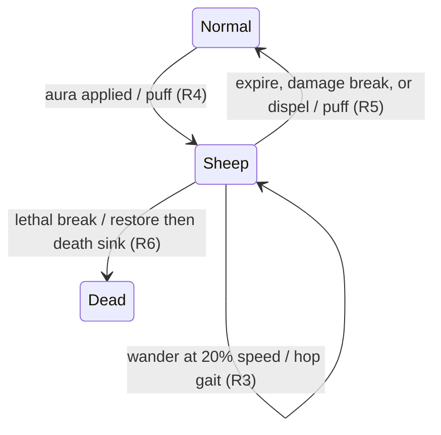
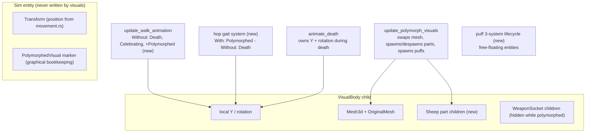

# Polymorph Signature Animation - Plan

## Goal Capsule

- **Objective:** Upgrade Polymorph's placeholder visual (a plain cuboid swap) into a signature animation — a primitives-composed sheep form with a hop gait and transform puffs — as the pilot for a tiered per-ability animation pass.
- **Product authority:** The Product Contract below, from the 2026-08-10 brainstorm dialogue. Product Contract unchanged by planning.
- **Execution profile:** Graphical-layer-only work; zero core-combat changes. Headless byte-identity is a hard gate at every step.
- **Stop conditions:** Any change that requires touching sim-side state (`Combatant`, `ActiveAuras`, sim-entity `Transform`) to make a visual work is out of contract — stop and surface it rather than absorbing it.
- **Open blockers:** None.

---

## Product Contract

### Summary

Replace Polymorph's cuboid stand-in with a sheep form built from Bevy primitives, give it a hop gait while it wanders, and add a transform puff at apply and break. The result is reviewed in the animation sandbox, and its cost informs whether and how to run the broader tiered animation walk across the ability list.

### Problem Frame

The game has ~70 abilities that mostly share generic visual treatments (school-colored casting orb, projectiles, floating combat text). The long-term intent is a tiered visual identity: a couple of signature abilities per class recognizable at a glance, lower tiers sharing a cheaper vocabulary of recolors and school variants, with WoW TBC's animation language as the reference grounding. Before committing to that walk, one signature needs to be built end-to-end to learn what it costs.

Polymorph is the pilot with a standing readability defect to fix: a polymorphed target today becomes a plain box, and both polymorphed and feared targets wander identically — nothing on screen distinguishes WoW's two most distinct crowd-control effects.

### Key Decisions

- **Pilot one signature before planning the full walk.** (session-settled: user-directed — chosen over starting a broader multi-ability pass: the walk's shape depends on what one bespoke signature actually costs.)
- **Tiered animation bar for the eventual walk.** (session-settled: user-directed — chosen over animating everything to one standard: too many abilities to all be memorable; signatures get bespoke recognizable animations, secondary tiers get recolors/shared vocabulary, WoW TBC's visual language grounds both.)
- **Polymorph over Fear or Mortal Strike as the pilot.** (session-settled: user-directed — chosen with deltas surfaced: smallest delta on existing rails, sandbox-reviewable today, and it repairs the polymorph/fear confusability; accepts that the pilot tests art cost more than new-machinery cost.)
- **Sheep composed from Bevy primitives, not a glTF asset.** (session-settled: user-approved — weapons already use glTF, so a modeled sheep was a real alternative; primitives keep the body aesthetic consistent and avoid opening an art-asset pipeline for bodies.)
- **Review loop is the animation sandbox.** Polymorph's 1.5s cast makes it a playable hard-cast entry today, and Mage-versus-dummy is the sandbox's default staging — no enabling work needed.

### Requirements

**Sheep form**

- R1. While the Polymorph aura is active, the victim's body renders as a sheep form composed from Bevy primitives (rounded body, head, ears, wool-white material) consistent with the game's capsule aesthetic — recognizable as WoW's polymorph at a glance from normal match camera distance.
- R2. Weapons remain hidden while polymorphed (preserving today's behavior).

**Gait**

- R3. While polymorphed, movement animates as a hop gait replacing the standard walk bob — distance-driven like the bob, so the 20%-speed wander reads as slow hopping and a stationary sheep holds still.

**Transitions**

- R4. Polymorph landing plays a brief transform puff on the victim.
- R5. Polymorph ending plays a transform puff as the body restores — and it must still read when the sheep lived under a second, since polymorph breaks on any damage.

**Integrity**

- R6. The original body and weapon visibility restore correctly on every exit path (expire, damage break, dispel), and death during polymorph plays the normal death sink on the restored capsule with no lingering sheep parts.
- R7. All of this is graphical-only: a headless run of any seed produces byte-identical output before and after.

Polymorph's visual lifecycle:

*Key Flows omitted: this is a single-actor visual state lifecycle; the diagram and Acceptance Examples cover every path.*

### Acceptance Examples

- AE1. **Covers R1-R4.** Given a match in progress, when Polymorph lands on a combatant, then a puff plays, the body becomes the sheep form, weapons disappear, and the victim hop-wanders at reduced speed.
- AE2. **Covers R5, R6.** Given a polymorphed combatant, when any damage hits it immediately after transform, then the break puff plays and the original body and weapons restore — even if the sheep existed for under a second.
- AE3. **Covers R6.** Given a polymorphed combatant, when the breaking blow is also lethal, then the death sink plays on the restored capsule and no sheep parts linger.
- AE4. **Covers R7.** Given any fixed seed, when the same headless config runs before and after this feature, then the match logs are byte-identical.

### Success Criteria

- Watching the sandbox (and then a live match), the user can tell a polymorphed target from a feared one without reading the HUD — the glance-recognizability bar the tiered walk is calibrated against.
- The pilot yields enough signal on per-signature effort for the user to decide the broader walk's shape.

### Scope Boundaries

- The broader animation walk — tier assignments and the per-class signature list — waits for the post-pilot assessment.
- Fear's terror treatment and the reusable aura-driven body-treatment machinery it would seed: deferred, strongest next candidate.
- Mortal Strike and instant-ability flourish wiring (core-side cosmetic markers): deferred.
- Sandbox Phase B (instant-ability playback seam): not needed for this pilot; remains separately tracked.
- No sound, and no changes to Polymorph's gameplay mechanics.
- One puff style covers apply and break alike: the sim does not distinguish damage-break from natural expiry anywhere the graphical layer can see, and adding that distinction would require new core-side plumbing.
- No minimum on-screen time for the sheep: a diminishing-returns-shortened polymorph (Polymorph shares the Incapacitates DR category with Freezing Trap) simply shows briefly; the puffs still mark both transitions.

### Dependencies / Assumptions

- The body-swap machinery, weapon-socket hiding, and polymorph wander all exist and stay untouched — verified: `update_polymorph_visuals` (src/states/play_match/rendering/effects.rs:687-718), socket hiding (effects.rs:3437-3451), wander at 20% base speed (src/states/play_match/combat_core/movement.rs:165-184).
- Polymorph is a hard cast (`cast_time: 1.5`, assets/config/abilities.ron:92) that breaks on any damage (abilities.ron:100), and is playable in the sandbox's default Mage-versus-dummy staging (src/states/animation_sandbox/playback.rs:122-164, src/states/animation_sandbox/mod.rs:372-378).
- The walk bob is distance-driven with no polymorph special-case (effects.rs:3001-3034), so the hop gait genuinely replaces it rather than layering on top.
- Bodies are primitive meshes while only weapons load glTF (src/states/play_match/mod.rs:1056-1060, 1151) — no body-model pipeline exists or is being introduced.
- Assumption: a primitives-composed sheep reads clearly at typical camera distance; the sandbox's camera presets are the check.

### Sources / Research

- Prior art establishing the animation conventions: docs/plans/2026-08-04-001-feat-attack-animations-plan.md, docs/plans/2026-08-05-001-feat-casting-animations-plan.md, docs/plans/2026-08-09-001-feat-animation-sandbox-plan.md, docs/plans/2026-05-21-001-feat-walking-animation-plan.md.
- Visual-effect lifecycle pattern: docs/solutions/implementation-patterns/adding-visual-effect-bevy.md.
- Byte-identity enforcement: tests/determinism_pin.rs; graphical-only registration convention in src/states/mod.rs.

---

## Planning Contract

### Key Technical Decisions

- **KTD1. Sheep body = existing single-mesh swap plus add-on part children.** The torso reuses today's swap path exactly — `update_polymorph_visuals` swaps the `VisualBody` child's `Mesh3d` and restores from `OriginalMesh` — while the head, ears, and any accent parts spawn as marker-tagged child entities under the `VisualBody` on transform and despawn on restore. Chosen over restructuring `OriginalMesh`/`PolymorphedVisual` into multi-part shapes: the singular restore path is proven, and add-on parts reduce restore correctness to "despawn everything carrying the marker", which stays exhaustive on every exit path by construction.
- **KTD2. Hop gait is its own system, mutually excluded by marker filters.** A new hop system runs `With<PolymorphedVisual>` and `Without<DeathAnimation>`; `update_walk_animation` gains `Without<PolymorphedVisual>`. Chosen over branching inside the walk bob: one-system-per-named-animation-state is the established idiom (death sink and victory bounce each own their state with `Without<>` on the others), and it leaves the shipped bob untouched. The hop drives its phase from distance traveled, mirroring the bob's idiom — the proven non-strobing approach (see the fixed-timestep strobe learning); never gate on "did the sim move this frame".
- **KTD3. Puffs spawn from the existing transition detection; no core-combat changes.** `update_polymorph_visuals` already detects apply and break frame-precisely (aura presence diffed against the `PolymorphedVisual` marker) — its two transition branches spawn one-shot puff entities there. The puff follows the `DispelBurst` template (spawn on `Added<T>` / update / cleanup three-system lifecycle, `AlphaMode::Add`, `try_insert`, `Without<>` on the second Transform query, `PlayMatchEntity` tag). Chosen over `CastEnding`-style core-side markers: those exist for state the graphical layer cannot recover; this state is fully recoverable, and staying graphical-only keeps byte-identity safe by construction.
- **KTD4. Sheep art stays in the primitive-mesh vocabulary.** (session-settled: user-approved — inherits the Product Contract's "primitives, not glTF" Key Decision: weapons already use glTF, so a modeled sheep was a real alternative; primitives keep bodies consistent and avoid a new asset pipeline.)
- **KTD5. All new systems register graphical-only, gated to include the sandbox.** The hop and puff systems register in `StatesPlugin::build()` (src/states/mod.rs) in the visual-effect blocks gated for both PlayMatch and AnimationSandbox scenes — the same gate the existing ~28 visual systems use. Never in `add_core_combat_systems`. Note for implementers: the sandbox module's doc comment references `add_sandbox_combat_systems`, which does not exist — the real mechanism is the shared `in_combat_scene` condition (src/states/mod.rs:63, 223).

### High-Level Technical Design

Transform-field ownership across the systems that touch a combatant's visuals — the mutual-exclusion structure U2 must preserve:

Exactly one system may write `VisualBody` local Y per frame; the marker filters are the arbitration. `animate_death` wins unconditionally (both gait systems carry `Without<DeathAnimation>`). The restore branch of `update_polymorph_visuals` must run even when `DeathAnimation` is present, so a lethal break still restores the capsule under the death sink (the acceptance case for death during polymorph).

### Implementation Constraints

- Visual systems write only `VisualBody`-child state, sheep-part children, or free-floating cosmetic entities — never the sim entity's `Transform` or any sim component. This is what makes byte-identity hold by construction (tests/determinism_pin.rs pins exact `MatchResult` fields per seed).
- Every new `pub fn` system under `src/states/play_match/` must be registered or `cargo test` fails via tests/registration_audit.rs — run it early, not at the end.
- Sandbox teardown clears auras on staged units (`clear_body_state`, src/states/animation_sandbox/playback.rs:410-430) and relies on the restore path to revert the body — sheep-part despawn must key off the same aura-gone detection so teardown leaves no orphans.

---

## Implementation Units

### U1. Sheep form: multi-part swap and restore

- **Goal:** The polymorphed body reads as a sheep — torso via the existing mesh swap, head/ears as add-on part children — restored exhaustively on every exit path.
- **Requirements:** R1, R2, R6. Implements KTD1, KTD4.
- **Dependencies:** None.
- **Files:** src/states/play_match/rendering/effects.rs (`update_polymorph_visuals`), src/states/play_match/components/visual.rs (sheep-part marker component), src/states/play_match/constants.rs if sizing constants land there.
- **Approach:** Swap the `VisualBody` mesh to a wool-white rounded torso (directional: flattened sphere/capsule within roughly the current cuboid footprint of 0.8 x 0.6 x 1.0 so collision-free visuals stay plausible). Spawn head + ear primitives as children of `VisualBody` tagged with a sheep-part marker; on the restore branch, despawn all marked children and restore `OriginalMesh` as today. Weapon-socket hiding (effects.rs:3437-3451) needs no change. Verify the restore branch is reachable when `DeathAnimation` is present (lethal break), and that pets — whose `Combatant` component puts them in this query — do not break if a polymorph aura ever lands on one.
- **Patterns to follow:** The existing swap/restore idiom in `update_polymorph_visuals`; `update_weapon_stealth_fade` (effects.rs:3733-3773) as the second reference for store-and-restore visual state.
- **Test scenarios:** Test expectation: none automated for appearance — no visual test harness exists. Behavioral gates: `cargo test` (registration audit + determinism pin must stay green); manual sandbox checks are enumerated in Verification.
- **Verification:** In the sandbox (Mage vs dummy, Polymorph entry): dummy becomes sheep with no weapons visible; loop the entry — repeated apply/clear cycles leave no accumulating orphan parts (teardown path); `cargo test` green.

### U2. Hop gait

- **Goal:** A polymorphed unit hops instead of bobbing, distance-driven, stationary sheep holds still.
- **Requirements:** R3. Implements KTD2.
- **Dependencies:** None (keys on the existing `PolymorphedVisual` marker; visually reviewed together with U1).
- **Files:** src/states/play_match/rendering/effects.rs (new hop system + `Without<PolymorphedVisual>` on `update_walk_animation`), src/states/mod.rs (registration).
- **Approach:** New system querying sim entities `With<PolymorphedVisual>`, `Without<DeathAnimation>`, writing the `VisualBody` child's local Y like the walk bob does. Phase advances from XZ distance traveled (mirror `update_walk_animation`'s accumulation, idle epsilon, and eased settle-to-rest); waveform is an arc train (directional: rectified-sine raised to a power for a hop-pause-hop feel, amplitude noticeably above the 0.10 walk bob so the 20%-speed wander reads as hopping). Do not gate on per-frame sim movement booleans — the distance-accumulation idiom is the strobe-safe path.
- **Patterns to follow:** `update_walk_animation` (effects.rs:3001-3034) for phase mechanics; the death-sink/victory-bounce `Without<>` mutual-exclusion idiom for arbitration.
- **Test scenarios:** Test expectation: none automated for appearance. Behavioral gates: `cargo test`; determinism pin proves the sim path untouched.
- **Verification:** Sandbox: polymorphed dummy hops while wandering, holds still when stationary; normal units still bob; a unit dying mid-polymorph sinks without the hop fighting the death animation; `cargo test` green.

### U3. Transform puffs

- **Goal:** A brief puff marks both the transform-in and the restore, readable even for sub-second sheep windows.
- **Requirements:** R4, R5. Implements KTD3.
- **Dependencies:** None (spawns from transition branches that exist today; visually reviewed together with U1).
- **Files:** src/states/play_match/rendering/effects.rs (puff component + spawn/update/cleanup systems, spawn calls in `update_polymorph_visuals`), src/states/play_match/components/visual.rs if the marker lives with its peers, src/states/mod.rs (registration).
- **Approach:** One-shot puff entity spawned at the victim's position from both transition branches of `update_polymorph_visuals` — same style for apply and break (Scope Boundaries). Follow the `DispelBurst` three-system template (effects.rs:1141-1218): `Added<T>` spawn attaching mesh/material via `try_insert`, per-frame expand-and-fade update off `Res<Time>` with `Without<>` on the second Transform query, lifetime cleanup; `AlphaMode::Add`; `PlayMatchEntity` tag; short lifetime so a DR-shortened polymorph still shows both puffs distinctly. Name the component after the shape (e.g. a puff/cloud name, not "PolymorphEffect").
- **Patterns to follow:** `DispelBurst` systems; `DispelRibbon` (effects.rs:1230+) as the secondary one-shot-transition reference.
- **Test scenarios:** Test expectation: none automated for appearance. Behavioral gates: `cargo test`.
- **Verification:** Sandbox: puff on transform-in; puff on restore when the entry clears; both visible on a rapid apply-break cycle; `cargo test` green.

---

## Verification Contract

| Gate | Command / procedure | Proves |
|---|---|---|
| Full test suite | `cargo test` | Registration audit (every new system registered), determinism pin (sim untouched), all existing probes stay green |
| Byte-identity spot check | `cargo run --release -- --headless /tmp/test.json` on a fixed config (include a Mage) before and after; diff the two match logs | AE4 / R7 directly, beyond the pinned seeds |
| Sandbox review | `cargo run --release` → Animation Sandbox → Polymorph vs dummy; use loop + slow-speed rungs and camera presets | AE1 (transform, weapons hidden, hop wander), teardown leaves no orphans |
| Live-match review | `cargo run --release` → any match with a Mage | AE2 (instant break restores), AE3 (lethal break: death sink on capsule), fear-vs-poly distinguishability (Success Criteria) |

---

## Definition of Done

- All requirements met, with each acceptance example demonstrated through its Verification Contract gate.
- `cargo test` green — registration audit and determinism pin included.
- Sandbox loop and teardown leave no orphaned sheep parts or stuck puffs after repeated cycles.
- The user has reviewed the sheep in the sandbox and judges it glance-recognizable as polymorph (the pilot's calibration signal for the broader walk).
- No abandoned experimental code (unused waveforms, dead part-spawning variants) remains in the diff.

---

## Risks & Dependencies

- **Death-frame ordering:** the restore-then-death-sink sequence (AE3) depends on the restore branch running for dying units; if aura clearing and death animation interleave badly in a frame, the sheep could sink instead of the capsule. Low blast radius — the repo research suggests the current swap already behaves coherently by accident — but verify explicitly in live-match review.
- **Pets:** `update_polymorph_visuals` covers pets (they carry `Combatant`); whether a polymorph can currently land on a pet is unverified. If it can, sheep parts sized for a standard capsule may look off on pet bodies — cosmetic only, note-and-defer if observed.
- **Short DR windows:** repeat polymorphs shrink under diminishing returns (shared Incapacitates category, src/states/play_match/components/auras.rs:512,543); puff lifetime must be short enough that apply and break puffs read as two events. Accepted per Scope Boundaries — no minimum-duration floor.

### Sources (plan-time research)

- Visual hierarchy and swap detail: src/states/play_match/mod.rs:1180-1255 (spawn of `VisualBody` + `OriginalMesh` + `WeaponSocket` children).
- Death sink: src/states/play_match/combat_core/death.rs:74-111 (`animate_death` writes `VisualBody` local Y + rotation).
- Sandbox scene gating and teardown: src/states/mod.rs:63,223 (`in_combat_scene` gates resolution systems into the sandbox scene, but movement runs under the AI-decision gate — PlayMatch only — so nothing moves in the sandbox on its own; the sandbox's staging system drives the dummy's motion for the Polymorph entry) and src/states/animation_sandbox/playback.rs:410-430, 528-545 (`clear_body_state` aura-clear restore; `sustain_staged_units` heals rather than damages, so staged polymorphs never insta-break).
- Institutional learnings applied: docs/solutions/implementation-patterns/adding-visual-effect-bevy.md, docs/solutions/implementation-patterns/fixed-timestep-visual-strobe.md, docs/solutions/implementation-patterns/cosmetic-marker-cross-mode-spawn-parity.md, docs/solutions/implementation-patterns/graphical-mode-missing-system-registration.md.
