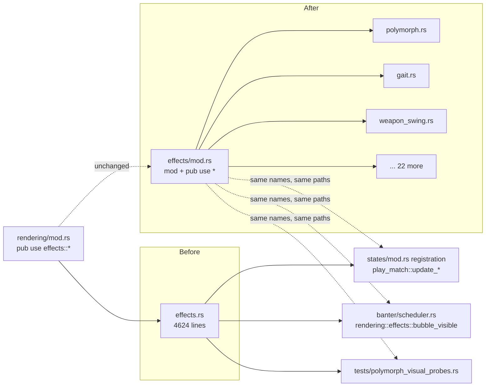

# refactor: Split `rendering/effects.rs` into per-effect submodules

## Summary

`src/states/play_match/rendering/effects.rs` has grown to **4,624 lines** holding ~25 unrelated visual-effect families. Split it into a `rendering/effects/` directory with one file per effect family (25 content files + a wiring `mod.rs`), preserving every public name and its module path so that **zero call sites, registration sites, or tests change**. This is a pure, behavior-preserving mechanical extraction — the standing prerequisite (flagged by review on PR #103) before the next signature animation (Fear) lands in this file.

**Product Contract preservation:** N/A — solo refactor, no upstream requirements doc. Scope is behavior-preserving code movement only.

---

## Problem Frame

The tiered per-ability animation walk resumes with **Fear** next, which seeds a reusable aura-driven CC body-treatment vocabulary (shake/tint/wisps) — machinery that will land right next to the polymorph/gait/puffs code. Review on PR #103 flagged, and the `signature-ability-animation-procedure.md` solution doc records as a **standing prerequisite**, that `effects.rs` must be split into per-effect submodules *before* the next signature lands in it. At 4.6k lines the file is hard to navigate and every new signature makes it worse.

This work is the prerequisite, not the animation. It changes no runtime behavior.

**Why it is safe to do mechanically (verified during planning):**

- **No `struct`/`enum`/component is defined in `effects.rs`** — all marker components already live in `components/visual.rs` (and siblings). The move is functions + `const`s + inline `#[cfg(test)]` blocks only.
- **Every private helper is used only within its own effect group** — grep for cross-group references to `swing_pose`, `build_tornado_mesh`, `advance_gait`, `apply_gait_offset`, `team_tint`, `casting_orb_anchor`, `arena_clipped_disc_mesh`, etc. returns nothing outside the file. Group boundaries are clean; no helper needs to be shared across two new files.
- **Only two module-path reference styles reach these items, both preserved by re-export** (see KTD1):
  1. The `crate::states::play_match::*` glob — used by *every* registration site in `src/states/mod.rs` (e.g. `play_match::update_polymorph_visuals`) and by `tests/polymorph_visual_probes.rs` (`use arenasim::states::play_match::{update_polymorph_visuals, update_sheep_hop}`).
  2. One explicit path: `banter/scheduler.rs:16` → `use super::super::rendering::effects::bubble_visible;`.
- **`effects.rs`'s top-of-file imports are all absolute (`crate::…`, `bevy::…`, `bevy_egui::…`)**, so each submodule reuses those import lines verbatim (trimmed to what it needs). **One in-body exception exists:** `render_speech_bubbles` (line ~300) takes `Res<super::emoji::EmojiIcons>`, a `super::`-relative path that resolves only because `super` = `rendering` inside today's `effects.rs`. When that function moves into `effects/speech_bubbles.rs`, `super` becomes `effects` and the path breaks — it must be rewritten to the absolute `crate::states::play_match::rendering::emoji::EmojiIcons`. This is the **one** required path edit (verified: it is the only non-test `super::` reference in the file); it is a relativity fix, not a behavior change, and U1 pre-authorizes it.
- These systems are **graphical-only**, registered exclusively in `src/states/mod.rs`. Headless registration (`systems.rs::add_core_combat_systems`) references the *unrelated* `play_match/effects/` combat-processing directory, not `rendering/effects.rs`. **No headless code is touched, so headless byte-identity is preserved by construction** (see KTD3).

---

## Requirements

- **R1.** Every `pub` item currently exported from `rendering/effects.rs` remains reachable at both `crate::states::play_match::<name>` (glob) and `crate::states::play_match::rendering::effects::<name>` (explicit path) after the split — no call site, registration, or test import changes.
- **R2.** `effects.rs` is split into per-effect submodules under `rendering/effects/`, one effect family per file (fine-grained granularity, decided in KTD2), with `effects/mod.rs` holding only module declarations and glob re-exports.
- **R3.** The three inline `#[cfg(test)]` blocks travel with the code they test (dispel-ribbon mesh, weapon-swing/cosmetic-arrows, casting-orbs) and continue to run and pass under `cargo test`. Note the dispel-ribbon test block is physically located at the *tail of the windfury range* but tests `build_dispel_ribbon_mesh`, so it belongs with `dispel_ribbon.rs` (U3), not `windfury.rs` — `windfury`'s `build_tornado_mesh` has no inline test.
- **R4.** `tests/registration_audit.rs` continues to discover every visual system in its new location and confirms it is registered — the audit passes.
- **R5.** `cargo build` (release) and the full `cargo test` suite pass, including `tests/polymorph_visual_probes.rs` and all relocated inline unit tests.
- **R6.** No behavior change: the change is a pure code move. No system logic, ordering, registration list, or data is edited.

---

## Key Technical Decisions

### KTD1. Preserve public names via a re-exporting `mod.rs` — change no call sites

`rendering/mod.rs` already does `pub mod effects;` and `pub use effects::*;` (lines 11 & 19). Converting the file `effects.rs` into the directory `effects/` with a `mod.rs` that declares each submodule and re-exports it (`mod polymorph; pub use polymorph::*;` …) keeps **both** the flattened glob path and the explicit `rendering::effects::<name>` path resolving unchanged. `rendering/mod.rs`, `play_match/mod.rs` (`pub use rendering::*` / the `play_match::*` flatten), `states/mod.rs` (all registration), `banter/scheduler.rs`, and `tests/` all keep working without edits.

*Rationale:* Rust resolves a module named `effects` identically whether it is `effects.rs` or `effects/mod.rs`. `pub use <sub>::*` in `mod.rs` flattens every submodule's public items back to the `effects::` namespace, so the two external reference styles (KTD notes in Problem Frame) are byte-for-byte compatible.

### KTD2. Fine-grained split — one effect family per file (~25 files)

*(session-settled: user-directed — chosen over moderate ~13-file grouping and coarse ~7-file grouping: maximum per-file readability, matches the `{polymorph, transform_puffs, gait}` naming already referenced in the solution docs, and gives Fear a clean CC-visual neighborhood. Accepts several small files, e.g. flame ~60, slow_zone ~56, pet ~25 lines.)*

The file→source-range map is fixed in the [Output Structure](#output-structure) and per-unit tables below.

### KTD3. Verification is compilation + existing tests + a graphical smoke — not a headless byte-identity diff

Because the moved systems are graphical-only and no headless-registered code is touched, a headless match diff would not exercise them and cannot prove the refactor. The meaningful gates are: the workspace compiles, `registration_audit` still finds and validates every system, `polymorph_visual_probes` and the three relocated inline test blocks pass, and a graphical smoke (animation sandbox, or a real match) confirms effects still render. Headless byte-identity holds trivially and is not the proof.

### KTD4. Per-file imports are the group's subset of the current preamble

`effects.rs`'s top imports are: `bevy::prelude::*`, `bevy::color::LinearRgba`, `bevy::render::mesh::Indices`, `bevy::render::render_asset::RenderAssetUsages`, `bevy::render::render_resource::PrimitiveTopology`, `bevy_egui::{egui, EguiContexts}`, and `crate::states::play_match::{abilities::SpellSchool, ability_config::AbilityDefinitions, arena_bounds::ArenaBounds, banter::vocab, components::*, map_config::ActiveMapGeometry}`, plus `crate::states::match_config::CharacterClass`. Each submodule gets `bevy::prelude::*` + `crate::states::play_match::components::*` (nearly universal) and adds only the extras it uses — `egui`/`EguiContexts` for the egui-drawn effects (floating text, speech bubbles), the `render::mesh`/`render_resource` trio only for the two mesh builders (`dispel_ribbon`, `windfury`), etc. Trim to silence unused-import warnings per file. **Exception:** `speech_bubbles.rs` must rewrite the in-body `super::emoji::EmojiIcons` parameter to the absolute `crate::states::play_match::rendering::emoji::EmojiIcons` (see Problem Frame) — the one place a moved item's own path, not just its imports, must change.

---

## Output Structure

```
src/states/play_match/rendering/
  mod.rs            # UNCHANGED — still `pub mod effects; pub use effects::*;`
  effects/
    mod.rs          # NEW — `mod <sub>; pub use <sub>::*;` for each, no logic
    floating_text.rs
    spell_impact.rs
    speech_bubbles.rs
    shield_bubbles.rs
    polymorph.rs        # sheep body swap (Fear neighborhood)
    transform_puffs.rs  # (Fear neighborhood)
    gait.rs             # walk bob + sheep hop (Fear neighborhood)
    flame.rs
    drain_life.rs
    affliction.rs       # UA glow, backlash, drip emitters
    healing_light.rs
    dispel_burst.rs
    dispel_ribbon.rs    # + inline test block (dispel_ribbon_mesh_tests)
    windfury.rs
    scream.rs
    berserk.rs
    death_coil.rs
    pet.rs
    traps.rs
    ice_block.rs
    slow_zone.rs
    movement_trails.rs  # disengage + charge trails
    totems.rs
    weapon_swing.rs     # swings, cosmetic arrows, stealth fade + inline test block
    casting_orbs.rs     # orbs, motes, cast-ending + inline test block
```

The tree is the expected shape; the per-unit `**Files**` lists are authoritative. The mechanic (fixed in U1): **rename `effects.rs` → `effects/mod.rs` first**, so the whole body lives in `mod.rs` as a single compilable module, then extract each group *out of* `mod.rs` into a sibling file batch by batch, adding `mod <x>; pub use <x>::*;` as you go. After U1 there is no file named `effects.rs` — the transitional home is `effects/mod.rs`, which shrinks to wiring-only by U6. (A `git mv` of `effects.rs`→`effects/mod.rs` preserves history for the rename; the per-group extractions are ordinary edits.)

---

## High-Level Technical Design

The change is a namespace-preserving fan-out. Nothing about the resolution of these names changes for any consumer:



**Source-range map** (1-indexed line ranges in the current `effects.rs`; each range includes the section's leading comment banner and trailing `const`s where present):

| Submodule | Source lines | Key items |
|---|---|---|
| `floating_text.rs` | ~21–199 | `update_floating_combat_text`, `render_floating_combat_text`, `cleanup_expired_floating_text` |
| `spell_impact.rs` | ~200–283 | `spawn_spell_impact_visuals`, `update_spell_impact_effects`, `cleanup_expired_spell_impacts` |
| `speech_bubbles.rs` | ~284–534 | `bubble_visible`, `render_speech_bubbles`, `update_speech_bubbles`, `BUBBLE_*`, `icon_rect_at`, `team_tint` |
| `shield_bubbles.rs` | ~535–687 | `update_shield_bubbles`, `follow_shield_bubbles` |
| `polymorph.rs` | ~688–919 | `SHEEP_*`, `update_polymorph_visuals`, `spawn_sheep_parts` |
| `transform_puffs.rs` | ~920–1056 | `PUFF_*`, `spawn_transform_puff`, `spawn_transform_puff_visuals`, `update_transform_puffs`, `cleanup_expired_transform_puffs` |
| `flame.rs` | ~1057–1116 | `update_flame_particles`, `spawn_flame_visuals` |
| `drain_life.rs` | ~1117–1336 | drain-life beams + drain particles spawn/update/cleanup |
| `healing_light.rs` | ~1337–1445 | `healing_light_colors`, `spawn_healing_light_visuals`, `update_healing_light_columns`, `cleanup_expired_healing_lights` |
| `dispel_burst.rs` | ~1446–1563 | `dispel_burst_colors`, `spawn_dispel_visuals`, `update_dispel_bursts`, `cleanup_expired_dispel_bursts` |
| `dispel_ribbon.rs` | ~1564–1758 **+ ~1923–2038** | `RIBBON_*`, `dispel_ribbon_colors`, `build_dispel_ribbon_mesh`, spawn/update/cleanup, **+ inline test block `dispel_ribbon_mesh_tests` (physically at ~1923–2038, sitting *after* the windfury code — non-contiguous)** |
| `windfury.rs` | ~1759–1922 | `WINDFURY_*`, `build_tornado_mesh`, spawn/update/cleanup (**no inline test**) |
| `scream.rs` | ~2039–2131 | `scream_burst_colors`, `spawn_scream_burst`, `update_scream_bursts`, `cleanup_expired_scream_bursts` |
| `berserk.rs` | ~2132–2306 | `BERSERK_*`, `berserk_glow_colors`, spawn/update/cleanup |
| `death_coil.rs` | ~2307–2405 | `death_coil_burst_colors`, spawn/update/cleanup |
| `pet.rs` | ~2406–2430 | `apply_pet_mesh_tilt` |
| `traps.rs` | ~2431–2619 | `trap_type_rgb`, `trap_type_emissive`, trap visuals/burst/launch |
| `ice_block.rs` | ~2620–2699 | `spawn_ice_block_visuals`, `update_ice_blocks`, `cleanup_ice_blocks` |
| `slow_zone.rs` | ~2700–2755 | `spawn_slow_zone_visuals`, `update_slow_zone_visuals` |
| `movement_trails.rs` | ~2756–2919 | disengage + charge trail spawn/update-cleanup |
| `affliction.rs` | ~2920–3296 | UA glow spawn/update/cleanup, backlash spawn/update/cleanup, `spawn_ua_glow_for_afflicted`, `drip_kind_for_aura`, `drip_jitter`, drip emitters/visuals |
| `gait.rs` | ~3297–3514 | `WALK_*`/`HOP_*`/`GAIT_*`, `advance_gait`, `apply_gait_offset`, `update_walk_animation`, `update_sheep_hop` |
| `totems.rs` | ~3515–3677 | `arena_clipped_disc_mesh`, `spawn_totem_visuals`, `update_totem_visuals` |
| `weapon_swing.rs` | ~3678–4233 | `SWING_*`/`COSMETIC_ARROW_*`, `swing_param`, `swing_pose`, `consume_swing_signals`, `animate_weapon_swings`, `update_cosmetic_arrows`, `update_weapon_stealth_fade`, **+ inline test block (~4056–4179)** |
| `casting_orbs.rs` | ~4234–4624 | `CASTING_ORB_*`, `GOLDEN_ANGLE`, `casting_orb_anchor`, orb + mote spawn/update, `consume_cast_ending_signals`, `cleanup_casting_orbs`, **+ inline test block (~4606–4624)** |

Line numbers are a starting guide — the implementer's real boundary is "the whole item plus its leading doc/section comment and adjacent `const`s," found by symbol, not by counting lines.

---

## Implementation Units

Units are batched so each is an atomic, independently-compiling commit. Within a batch, extract group-by-group and lean on the compiler. The pattern is identical for every file: cut the item(s) + their leading comments/consts (+ any inline test block) into the new file, add the trimmed import preamble (KTD4), add `mod <name>; pub use <name>::*;` to `effects/mod.rs`, `cargo build`.

**Execution note (all units):** This is a behavior-preserving move. Do not edit any function body, system signature, registration list, or `const` value. If a group seems to *need* an edit to compile, stop — that is a boundary error (a missed private helper or import), not a real code change. **The one sanctioned exception** is `render_speech_bubbles`'s `super::emoji::EmojiIcons` → absolute-path rewrite in U1 (KTD4); every other compile pressure is a boundary error to investigate, not edit around.

### U1. Create the `effects/` directory and move the text/UI + spell-impact group (canary batch)

**Goal:** Establish the `effects/mod.rs` re-export pattern and prove both reference styles still resolve, by moving the first four families.

**Requirements:** R1, R2, R6

**Dependencies:** none

**Files:**
- `src/states/play_match/rendering/effects.rs` → `src/states/play_match/rendering/effects/mod.rs` (rename via `git mv`; the renamed file becomes the transitional home holding the still-inline remainder plus the `mod`/`pub use` re-exports for this unit's files, and shrinks to wiring-only by U6 — after the rename no file named `effects.rs` remains)
- `src/states/play_match/rendering/effects/floating_text.rs` (new)
- `src/states/play_match/rendering/effects/spell_impact.rs` (new)
- `src/states/play_match/rendering/effects/speech_bubbles.rs` (new)
- `src/states/play_match/rendering/effects/shield_bubbles.rs` (new)
- `src/states/play_match/rendering/mod.rs` (verify unchanged: `pub mod effects; pub use effects::*;` resolves to the new directory)

**Approach:** Create `effects/` and `effects/mod.rs`. Because `effects.rs` and `effects/mod.rs` cannot both exist for the module `effects`, move the *remaining* (not-yet-split) body into `effects/mod.rs` as the transitional home OR keep `effects.rs` and add submodules as sibling files declared from within it — **choose the former**: rename `effects.rs` → `effects/mod.rs` first (so the whole remaining body lives in `mod.rs`), then extract groups out of `mod.rs` into sibling files one batch at a time, adding `mod <x>; pub use <x>::*;` as you go. This keeps a single compilable module at every step. After this unit, `mod.rs` contains the re-exports for the four moved files plus the still-inline remainder.

**Patterns to follow:** `rendering/mod.rs`'s own `mod x; pub use x::*;` block is the exact idiom to mirror in `effects/mod.rs`. `speech_bubbles.rs` needs the `bevy_egui::{egui, EguiContexts}` import; `floating_text.rs` likely also needs `egui`.

**Required path fix (pre-authorized — not a boundary error):** when moving `render_speech_bubbles` into `speech_bubbles.rs`, rewrite its `Res<super::emoji::EmojiIcons>` parameter to `Res<crate::states::play_match::rendering::emoji::EmojiIcons>`. `super::emoji` resolves in today's `effects.rs` (where `super` = `rendering`) but not from `effects/speech_bubbles.rs` (where `super` = `effects`). This is the single in-body path edit the split requires (KTD4); the resulting pre-fix compile error is expected, not the "stop and investigate" boundary error the execution note describes.

**Test scenarios:** Test expectation: none — pure move. Correctness proven by `cargo build` (release) succeeding and by grepping that `banter/scheduler.rs`'s `rendering::effects::bubble_visible` and the `states/mod.rs` registration names still resolve (build failure is the tripwire). This unit is the canary that validates KTD1 before the bulk move.

**Verification:** `cargo build --release` succeeds; `effects/mod.rs` re-exports the four new modules; no edits to `states/mod.rs` or `banter/scheduler.rs` were needed.

### U2. Move the signature-animation neighborhood (polymorph, transform_puffs, gait)

**Goal:** Isolate the three files the Fear work will sit beside, cleanly, with their probe coverage intact.

**Requirements:** R1, R2, R5, R6

**Dependencies:** U1

**Files:**
- `src/states/play_match/rendering/effects/polymorph.rs` (new)
- `src/states/play_match/rendering/effects/transform_puffs.rs` (new)
- `src/states/play_match/rendering/effects/gait.rs` (new)
- `src/states/play_match/rendering/effects/mod.rs` (modify — add three `mod`/`pub use`)
- `src/states/play_match/rendering/effects.rs` → `effects/mod.rs` (modify — remove the three ranges)
- `tests/polymorph_visual_probes.rs` (verify unchanged — imports resolve via the glob re-export)

**Approach:** Move `SHEEP_*` consts + `update_polymorph_visuals` + `spawn_sheep_parts` into `polymorph.rs`; `PUFF_*` + the four puff systems into `transform_puffs.rs`; `WALK_*`/`HOP_*`/`GAIT_*` + `advance_gait`/`apply_gait_offset`/`update_walk_animation`/`update_sheep_hop` into `gait.rs`. `advance_gait`/`apply_gait_offset` are shared by both `update_walk_animation` and `update_sheep_hop` and live entirely within `gait.rs` — no cross-file sharing.

**Patterns to follow:** The exit-path and marker-ownership contracts documented in `docs/solutions/implementation-patterns/aura-driven-visual-exit-paths.md` and `signature-ability-animation-procedure.md` are unaffected — do not touch the logic, only its location.

**Test scenarios:** Test expectation: none new — pure move. Regression gate: `cargo test --test polymorph_visual_probes` passes unchanged (it imports `update_polymorph_visuals`, `update_sheep_hop` via `arenasim::states::play_match::{…}`, which stays valid through the glob re-export).

**Verification:** `cargo build --release` + `cargo test --test polymorph_visual_probes` green; `tests/polymorph_visual_probes.rs` unedited.

### U3. Move the caster/DoT visual group (flame, drain_life, affliction, healing_light, dispel_burst, dispel_ribbon)

**Goal:** Extract the warlock/priest/shaman caster visuals, including the first mesh-builder.

**Requirements:** R1, R2, R6

**Dependencies:** U1

**Files:**
- `src/states/play_match/rendering/effects/flame.rs` (new)
- `src/states/play_match/rendering/effects/drain_life.rs` (new)
- `src/states/play_match/rendering/effects/affliction.rs` (new)
- `src/states/play_match/rendering/effects/healing_light.rs` (new)
- `src/states/play_match/rendering/effects/dispel_burst.rs` (new)
- `src/states/play_match/rendering/effects/dispel_ribbon.rs` (new — **also takes the `dispel_ribbon_mesh_tests` `#[cfg(test)]` block located at source ~1923–2038**, which sits physically after the windfury code but tests `build_dispel_ribbon_mesh`)
- `src/states/play_match/rendering/effects/mod.rs` (modify)
- `src/states/play_match/rendering/effects/mod.rs` transitional body (modify — remove the ranges)

**Approach:** Straight range moves per the source-range map. `dispel_ribbon.rs` is the first file needing the `bevy::render::mesh::Indices` / `RenderAssetUsages` / `PrimitiveTopology` imports (for `build_dispel_ribbon_mesh`). **Grab two non-contiguous ranges for `dispel_ribbon.rs`:** the main ~1564–1758 body *and* the `dispel_ribbon_mesh_tests` block at ~1923–2038 — the latter uses `use super::*;` to reach `build_dispel_ribbon_mesh`, so it must live in the same file, not in `windfury.rs` where it physically sits today. `affliction.rs` gathers all UA-glow, backlash, and drip systems plus the `drip_kind_for_aura`/`drip_jitter` private helpers.

**Test scenarios:**
- The relocated `dispel_ribbon_mesh_tests` block compiles and passes in `dispel_ribbon.rs` (it exercises `build_dispel_ribbon_mesh` vertex/index counts and rise geometry). Verify its test count is unchanged — moving it into the wrong file (or leaving it orphaned in the transitional `mod.rs` when the ~1564–1758 range is extracted) is the failure mode to catch.

**Verification:** `cargo build --release` succeeds after the batch.

### U4. Move the one-shot ability bursts (windfury, scream, berserk, death_coil)

**Goal:** Extract the burst/aura one-shots.

**Requirements:** R1, R2, R6

**Dependencies:** U1, and U3 (which claims the `dispel_ribbon_mesh_tests` block sitting at the tail of the windfury range — extract that block into `dispel_ribbon.rs` in U3 *before* or as part of moving the windfury body here, so it is not swept into `windfury.rs`)

**Files:**
- `src/states/play_match/rendering/effects/windfury.rs` (new — `WINDFURY_*` consts + `build_tornado_mesh` + the three systems; **no inline test** — `build_tornado_mesh` is untested; the block physically below it is the dispel-ribbon test, owned by U3)
- `src/states/play_match/rendering/effects/scream.rs` (new)
- `src/states/play_match/rendering/effects/berserk.rs` (new)
- `src/states/play_match/rendering/effects/death_coil.rs` (new)
- `src/states/play_match/rendering/effects/mod.rs` (modify)
- `src/states/play_match/rendering/effects/mod.rs` transitional body (modify)

**Approach:** `windfury.rs` takes the `WINDFURY_*` consts, `build_tornado_mesh`, and the three systems — source ~1759–1922 only, stopping *before* the `dispel_ribbon_mesh_tests` block (~1923). `windfury.rs` needs the `bevy::render::mesh`/`render_resource` import trio (second mesh builder). **Do not move the ~1923–2038 test block here** — it tests `build_dispel_ribbon_mesh` and belongs to `dispel_ribbon.rs` (U3); moving it into `windfury.rs` breaks its `use super::*;` resolution.

**Test scenarios:** Test expectation: none — pure move; `windfury` carries no inline test. Covered by the workspace build and the final-unit full-suite run.

**Verification:** `cargo build --release` succeeds; confirm the `dispel_ribbon_mesh_tests` block did **not** land in `windfury.rs` (grep the new file — it should contain no `#[cfg(test)]`).

### U5. Move the world/pet effects (pet, traps, ice_block, slow_zone, movement_trails, totems)

**Goal:** Extract the ground/world-anchored effects and the tiny pet-tilt system.

**Requirements:** R1, R2, R6

**Dependencies:** U1

**Files:**
- `src/states/play_match/rendering/effects/pet.rs` (new)
- `src/states/play_match/rendering/effects/traps.rs` (new)
- `src/states/play_match/rendering/effects/ice_block.rs` (new)
- `src/states/play_match/rendering/effects/slow_zone.rs` (new)
- `src/states/play_match/rendering/effects/movement_trails.rs` (new — disengage + charge trails)
- `src/states/play_match/rendering/effects/totems.rs` (new — `arena_clipped_disc_mesh` needs `ArenaBounds`)
- `src/states/play_match/rendering/effects/mod.rs` (modify)
- `src/states/play_match/rendering/effects/mod.rs` transitional body (modify)

**Approach:** Straight range moves. `totems.rs` needs `crate::states::play_match::arena_bounds::ArenaBounds` (for `arena_clipped_disc_mesh`). `traps.rs` keeps `trap_type_rgb`/`trap_type_emissive` private helpers alongside their systems.

**Test scenarios:** Test expectation: none — pure move.

**Verification:** `cargo build --release` succeeds.

### U6. Move weapon-swing and casting-orb groups — carries two inline test blocks — and delete the empty transitional body

**Goal:** Extract the two largest remaining groups (each with an inline test block) and finish by emptying `effects/mod.rs` down to pure wiring.

**Requirements:** R1, R2, R3, R6

**Dependencies:** U1, and U2–U5 completed (this unit removes the last inline content, so it goes last)

**Files:**
- `src/states/play_match/rendering/effects/weapon_swing.rs` (new — includes `#[cfg(test)]` block ~4056–4179)
- `src/states/play_match/rendering/effects/casting_orbs.rs` (new — includes `#[cfg(test)]` block ~4606–4624)
- `src/states/play_match/rendering/effects/mod.rs` (modify — after this move it contains **only** `mod`/`pub use` lines and the shared file-level doc comment, no logic)

**Approach:** `weapon_swing.rs` takes `SWING_*`/`COSMETIC_ARROW_*` consts, `swing_param`/`swing_pose` helpers, the swing/arrow/stealth-fade systems, and its inline test block. `casting_orbs.rs` takes `CASTING_ORB_*`/`GOLDEN_ANGLE` consts, `casting_orb_anchor`, the orb/mote systems, `consume_cast_ending_signals`, `cleanup_casting_orbs`, and its inline test block. After the move, confirm `effects/mod.rs` has no remaining `fn`/`const`/`struct` — only the module wiring.

**Test scenarios:**
- Both relocated `#[cfg(test)]` blocks compile and pass in their new homes; total test count across the suite equals the pre-refactor count (no test silently dropped).

**Verification:** `cargo build --release`; `effects/mod.rs` is wiring-only (grep it for `fn `/`const `/`struct ` → no matches beyond module decls).

### U7. Full verification and cleanup

**Goal:** Prove the split is behavior-preserving and complete.

**Requirements:** R3, R4, R5, R6

**Dependencies:** U1, U2, U3, U4, U5, U6

**Files:**
- (no new files) — verification over the whole change

**Approach:** Run the complete gate set. Confirm the audit still discovers the moved systems, all probes/inline tests pass, and a graphical smoke shows effects rendering. Fix any unused-import warnings introduced by the per-file import trimming.

**Test scenarios:**
- `cargo test` (full suite) passes — specifically `tests/registration_audit.rs` (R4: every moved `pub fn` taking a `SystemParam` is still discovered under `src/states/play_match/` and confirmed registered in `states/mod.rs`), `tests/polymorph_visual_probes.rs`, and the three relocated inline test modules.
- `cargo build --release` clean, ideally warning-free for the new files (trim leftover imports).
- **Mechanical body-identity proof (not a spot-check):** because `registration_audit` matches by name and the compiler only proves names bind, neither detects a copy-paste corruption inside a moved body that still type-checks (a transposed `const`, a dropped line, an altered literal). Prove zero body drift across all 25 families mechanically: concatenate the new `effects/*.rs` files (excluding each file's import preamble and the `effects/mod.rs` wiring), normalize whitespace, and diff against the same normalization of the original `effects.rs` (recoverable at the pre-refactor commit) with the top import block excluded. A pure move diffs to empty; investigate any non-empty hunk. This turns "a few functions look right" into a guarantee over every family, covering the ~22 effect families the graphical smoke does not eyeball.
- Graphical smoke (KTD3): launch the animation sandbox (or `cargo run --release --replay <config>`) and confirm at least the polymorph sheep + a puff + a casting orb still render — visuals are untestable in headless, so this is the eyeball gate that the move didn't drop a system from registration.
- Confirm `src/states/play_match/rendering/effects.rs` (the single file) no longer exists — only `effects/` remains.

**Verification:** Full `cargo test` green; `registration_audit` passes; the normalized body-identity diff is empty; graphical smoke shows effects; `effects.rs` file is gone.

---

## Scope Boundaries

**In scope:** Mechanical extraction of `rendering/effects.rs` into per-effect submodules; `effects/mod.rs` wiring; relocating the three inline test blocks; per-file import trimming.

**Explicitly not in scope (no behavior or API change):**
- Renaming any public system, component, or const.
- Editing any function body, system ordering, or registration list.
- Refactoring shared logic, deduping color helpers, or "while we're here" cleanups.

### Deferred to Follow-Up Work
- **Fear signature animation** — the reason this prerequisite exists; its own plan.
- **Splitting other large rendering files** (`team_frames.rs` ~38k bytes, `hud.rs` ~33k bytes) — not flagged, not blocking Fear; revisit only if they become a similar obstacle.
- **Extracting shared color/mesh helper vocabulary** across effects — several `*_colors` helpers are structurally similar but independent; consolidating them is a real (small) behavior-risk refactor, out of scope for a pure move.

---

## Risks & Mitigations

- **A system silently dropped from registration during the move.** The registration list in `states/mod.rs` is not edited, so a moved system stays registered *by name* — the risk is instead a `pub fn` that fails to re-export (typo in `mod.rs`). *Mitigation:* `cargo build` fails immediately (the name in `states/mod.rs` won't resolve), and `registration_audit` (U7) is the backstop. Per-batch builds localize any break.
- **An inline test block left behind or detached from its private helpers.** *Mitigation:* U4/U6 explicitly move each block with its group; U7 asserts total test count is unchanged.
- **`effects.rs`/`effects/mod.rs` both existing (module conflict).** *Mitigation:* U1's approach renames `effects.rs` → `effects/mod.rs` first, so exactly one module file exists at every step.
- **Unused-import warnings from over-broad per-file preambles.** *Mitigation:* trim per file (KTD4); U7 targets a warning-free build for the new files. Non-blocking cosmetic risk.

---

## Definition of Done

- `rendering/effects.rs` is replaced by `rendering/effects/` with 25 per-effect submodules + a wiring-only `mod.rs` (R2), and the single `effects.rs` file no longer exists.
- Every previously-public item resolves at both its glob and explicit `rendering::effects::` path; `states/mod.rs`, `banter/scheduler.rs`, and `tests/` are unedited (R1).
- The three inline test blocks live with their code and pass (R3).
- `cargo build --release` is clean and `cargo test` is fully green, including `registration_audit` (R4) and `polymorph_visual_probes` (R5).
- A graphical smoke confirms effects still render (KTD3).
- `git diff` contains only code movement — no logic changes (R6).

---

## Sources & Research

- Standing prerequisite recorded in `docs/solutions/implementation-patterns/signature-ability-animation-procedure.md` ("split `effects.rs` … before the next signature lands in it") and flagged by review on PR dwalker-va/arenasim-prototype#103.
- Codebase facts verified during planning: module wiring in `rendering/mod.rs` (lines 11, 19) and `play_match/mod.rs` (lines 42, 44, 74, 82); the two external reference styles (`states/mod.rs` glob registration; `banter/scheduler.rs:16`); test import in `tests/polymorph_visual_probes.rs:20`; three inline `#[cfg(test)]` blocks; no component/struct definitions in `effects.rs`; no cross-group private-helper references.
- Dual-registration architecture (why these systems live only in `states/mod.rs`): `tests/registration_audit.rs` and `docs/solutions/implementation-patterns/graphical-mode-missing-system-registration.md`.
