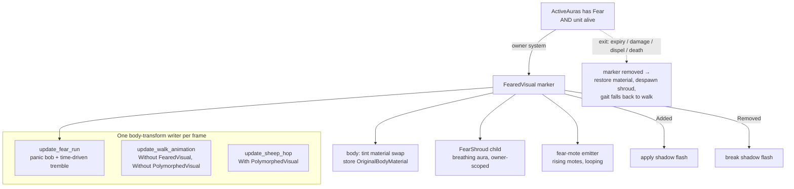

# Fear Signature Animation - Plan

## Goal Capsule

- **Objective:** Give Fear victims a bespoke, glance-recognizable terror animation — a trembling shadow-violet husk that runs in panic — the second entry in the tiered per-ability animation walk after the Polymorph pilot.
- **Product authority:** The Product Contract below, from the 2026-08-13 brainstorm dialogue. **Product Contract unchanged by planning.**
- **Execution profile:** Graphical-layer-only; zero core-combat changes. Headless byte-identity is a hard gate at every unit (these systems register only in `states/mod.rs`, never in `systems.rs`).
- **Stop conditions:** Any change that requires touching sim-side state (`Combatant`, `ActiveAuras`, sim-entity `Transform`, aura mechanics) to make a visual work is out of contract — stop and surface it.
- **Open blockers:** None.

---

## Product Contract

### Summary

While a unit is feared, its body becomes a terror-struck husk: drained to a trembling shadow-violet, wrapped in a breathing dark aura with fear-motes rising off it, sprinting full-speed in panic. It is built bespoke on the Polymorph signature-animation procedure (receiver-side, one marker owning the treatment, apply/break flash, all exit paths restored), keyed on the Fear aura so Death Coil's horror inherits it. Graphical-only; headless stays byte-identical.

### Problem Frame

The game's ~70 abilities mostly share generic visual treatments. The tiered animation walk gives a couple of signature abilities per class a look recognizable at a glance, with WoW TBC's animation language as the reference. Polymorph shipped first (PR #103) and proved the cost is roughly one signature per session; the `effects.rs` split (PR #106) then isolated the CC-visual neighborhood so the next signature lands cleanly beside it. Fear is the named next candidate. Today a feared unit just runs around as its normal capsule — nothing on screen says "terror," and Fear is one of WoW's most iconic crowd-control reads.

### Key Decisions

- **Build Fear bespoke; extract a reusable CC vocabulary later.** (session-settled: user-directed — chosen over a shared-helper seam and a full parameterized CC body-treatment system: one consumer doesn't justify the abstraction, and the pilot verdict was one signature ≈ one session. When the 2nd CC — stun/root — arrives, extract the vocabulary from the real overlap rather than a guessed one.)
- **Terror vocabulary = shadow shroud + tremble + rising motes.** (session-settled: user-directed — chosen over a wisp-forward/particle-led direction: heavy shadow reads clearest from arena distance; the swirling-wisp direction was dropped.)
- **Part-free treatment — no spawned limb primitives.** (session-settled: user-approved — the review sketch showed an arms-up panic posture; chosen over spawning flailing-limb children the way Polymorph spawns sheep legs/ears: the tint + tremble + gait + shroud carry the panic without the per-unit spawn/despawn machinery, and this is the main cost lever.)
- **Keyed on the Fear aura type, so Death Coil's horror gets the same terror look.** (session-settled: user-approved — the natural consequence of keying on the aura; accepted as thematically correct since horror is itself a terror effect.)

### Requirements

**Terror treatment (body)**

- R1. While a unit has the Fear aura, its body renders as a terror-struck husk: drained to a shadow-violet tint and darkened, wrapped in a soft dark aura that slowly breathes (pulses) — recognizable as WoW-style fear at a glance from normal match-camera distance.
- R2. The feared body trembles: a rapid, small, continuous vibration reading as raw panic, layered on top of its movement rather than replacing it.
- R3. A few shadow fear-motes rise off the feared unit and fade, on a loop, for the aura's duration.

**Gait**

- R4. While feared, movement animates as a fast panic run — distinct from both the normal walk bob and Polymorph's slow hop — matching Fear's full-speed flee.

**Transitions**

- R5. Fear landing plays a brief shadow flash on the victim as the treatment applies.
- R6. Fear ending plays a shadow flash as the body restores, and it must still read when the fear window was under a second (Fear breaks on any damage).

**Exit paths & coverage**

- R7. The treatment restores the unit's normal appearance on every exit path — natural expiry, damage break, dispel, and death. A unit killed while feared must not keep the treatment on its corpse.
- R8. The treatment is keyed on the Fear aura type, so Death Coil's horror (a Fear-type aura) receives the same terror look.

### Acceptance Examples

- AE1. **Covers R7.** A feared unit takes a killing blow while the aura is still active → the terror treatment is gone the frame death resolves, not lingering on the corpse until the aura would have expired.
- AE2. **Covers R6.** A feared unit is damaged 0.4s after Fear lands → the break flash still plays and reads as a distinct end event.
- AE3. **Covers R7.** Fear expires naturally at 8s with no damage → the body restores even though the aura may be removed outright at expiry.
- AE4. **Covers R8.** A unit under Death Coil's horror → shows the same terror treatment as a Fear victim.

### Success Criteria

- Watching a match (and the animation sandbox), the user can tell a feared unit from a polymorphed one and from a normal unit **without reading the HUD** — the glance-recognizability bar the tiered walk is calibrated against.
- Cost lands near the pilot's benchmark (~one signature per session), confirming the walk's per-signature budget for a machinery-heavier CC entry.

### Scope Boundaries

**Deferred for later**
- The reusable / parameterized CC body-treatment vocabulary (shared tint/shake/wisp/gait system). Extracted when the 2nd CC actually lands, from real overlap.
- Mortal Strike and later abilities in the tier walk.

**Outside this entry's identity**
- Any change to Fear's mechanics — full-speed wander, 8s duration, break-on-damage all stay exactly as they are. This is visual-only.
- Spawned limb / body-part primitives. Part-free by decision; the panic read comes from tint + tremble + motes + gait.
- Headless behavior — graphical-only, byte-identical, like the pilot.

### Outstanding Questions

**Deferred to Planning** — both resolved during planning (see Key Technical Decisions):
- ~~How the tremble (R2) composes with the panic-run gait (R4)~~ → resolved: the tremble is composed into the single panic-run gait system (KTD2).
- ~~Whether the shadow-shroud is a body-material swap plus a separate breathing sphere~~ → resolved: material tint (reusing `OriginalBodyMaterial`) + a separate owner-scoped breathing shroud child (KTD1).

### Sources & Research

- `docs/solutions/implementation-patterns/signature-ability-animation-procedure.md` — the 8-step signature procedure and the traps (marker as single source of truth, gait systems arbitrated by marker filters, transition effects follow the `DispelBurst` trio).
- `docs/solutions/implementation-patterns/aura-driven-visual-exit-paths.md` — the two exit-path traps behind R7: `ActiveAuras` is removed (not emptied) at expiry, and death preserves the aura on the corpse.
- `docs/solutions/implementation-patterns/animation-sandbox-cc-entry-gotchas.md` — sandbox staging for a CC entry (no sim movement, entry-duration hold, DR reset each frame).
- `docs/solutions/implementation-patterns/fixed-timestep-visual-strobe.md` — why the tremble must be time-driven and composed into the gait offset, never gated on "sim moved this frame."
- Current Fear mechanics: `AuraType::Fear` runs full-speed via `fear_direction` in `src/states/play_match/combat_core/movement.rs`; Fear is Shadow school (`assets/config/abilities.ron`); Death Coil applies a Fear-type horror that bypasses `FearImmunity` (`src/states/play_match/components/auras.rs`).
- Polymorph pilot to mirror: `update_polymorph_visuals` (`src/states/play_match/rendering/effects/polymorph.rs`), gait filters in `rendering/effects/gait.rs`, transition trio in `rendering/effects/transform_puffs.rs`, probes in `tests/polymorph_visual_probes.rs`.

---

## Planning Contract

**Product Contract preservation:** unchanged. Planning added the Key Technical Decisions, Implementation Units, Verification Contract, and Definition of Done below; it did not alter any R/AE ID or product decision.

The four Product-Contract Key Decisions are session-settled and carried into the technical decisions below by reference; the KTDs record only the *how* choices planning made.

---

## Key Technical Decisions

### KTD1. Body treatment = material tint (reuse `OriginalBodyMaterial`) + an owner-scoped breathing shroud child — no mesh swap, no spawned limb/body-part primitives

Fear tints; it does not reshape. The `VisualBody`'s material is swapped to a shadow-violet, darkened `StandardMaterial`, storing the displaced handle in the **existing** `OriginalBodyMaterial` component (the exact insert-at-apply / remove-at-restore lifecycle Polymorph already uses — reused, not duplicated). The breathing dark aura is a separate additive sphere spawned as a child of the body, tagged with an owner-carrying marker (`FearShroud { owner: Entity }`, mirroring `SheepPart`'s owner scoping) so restore despawns exactly this unit's shroud and two simultaneously-feared units never strip each other's. No `Mesh3d` swap and no spawned limb parts (instantiates the part-free Key Decision).

*Reuse-collision note (load-bearing — a unit CAN be both feared and polymorphed):* `OriginalBodyMaterial` is also used by Polymorph, and the two states co-exist — Fear (`DRCategory::Fears`) and Polymorph (`DRCategory::Incapacitates`) are different DR categories, so neither CC replaces the other (`auras.rs` removes only a same-category aura on apply); Fear deals no damage, so it lands on a polymorphed target without breaking the sheep; and `combat_core/movement.rs` already extracts both `fear_direction` and `polymorph_direction` in one frame. Therefore the fear body-treatment system **must carry `Without<PolymorphedVisual>` on its query** — the sheep look wins while polymorphed, mirroring the gait arbitration in KTD2. When Polymorph ends with Fear still active, the exclusion lifts and the fear system takes over the body on the next frame (it re-evaluates every frame). Transition-in is gated on the treatment marker's absence (insert `FearedVisual` when the aura is present and the marker is `is_none()`), exactly as Polymorph gates on `polymorphed_marker.is_none()` — **not** on `OriginalBodyMaterial.is_none()`.

### KTD2. The tremble composes into a single panic-run gait system; markers keep one body-transform writer per frame

Exactly one system may write the `VisualBody`'s transform per frame (the established last-writer-wins guard: `update_walk_animation` carries `Without<DeathAnimation>, Without<Celebrating>, Without<VisualBody>, Without<PolymorphedVisual>`; `update_sheep_hop` is `With<PolymorphedVisual>`). Fear adds `update_fear_run` (`With<FearedVisual>, Without<PolymorphedVisual>`) and `update_walk_animation` gains `Without<FearedVisual>`. The tremble (R2) is a small, **time-driven** jitter on the **body Y offset** — composed *inside* `update_fear_run` alongside the panic-run bob, so it rides the one axis `apply_gait_offset` already writes (`translation.y` only) and self-resets each frame the walk gait resumes, leaving no residual offset on restore. Never a second system touching the transform, and never gated on "sim moved this frame" (the fixed-timestep-strobe trap). `Without<PolymorphedVisual>` on `update_fear_run` makes the arbitration total when a unit carries both markers (a real state — see KTD1). *If a lateral (X/Z) shudder is later wanted for readability, `update_fear_run` must explicitly zero the body's X/Z on its transition-out branch and a probe must assert X/Z return to rest — Y-axis is the default precisely because the shared gait writer zeroes it for free.*

*(session-settled context: this resolves the brainstorm's deferred tremble question. Chosen over a separate tremble system — a second transform writer would race the gait for the body Y.)*

### KTD3. `FearedVisual` is the single source of truth; graphical-only, so headless stays byte-identical by construction

One marker, `FearedVisual`, gates the body treatment, the gait selection, the mote emitter, and the flash. The treatment-owning system reads `AuraType::Fear` off the sim entity's `ActiveAuras` (present and readable at render time, exactly like Polymorph) and inserts/removes `FearedVisual`; everything else reads the marker, never re-deriving from `ActiveAuras` (the drift trap). Because these systems register only in `states/mod.rs` (graphical), no headless-registered code changes — headless byte-identity holds by construction, no per-map gating needed. Keying on the aura type means Death Coil's horror (a Fear-type aura) is covered for free (R8).

### KTD4. Exit-path restore follows the two documented aura-visual traps verbatim

The treatment-owning system takes `Option<&ActiveAuras>` (not `&ActiveAuras` — required, or natural expiry silently never restores when the component is removed) and computes `is_active = combatant.is_alive() && auras.is_some_and(has Fear)` (death must count as an exit path, or the treatment sticks to the corpse until the aura ticks out). The restore branch runs with **no** `Without<DeathAnimation>` filter so the death sink and restore compose in the same frame. Every marker-keyed visual (shroud, gait, motes) reads `FearedVisual`, so all exit paths (expiry, damage-break, dispel, death) restore together.

---

## High-Level Technical Design

`FearedVisual` is inserted/removed by one owner system reading the Fear aura; every other Fear visual is a pure function of that marker. Gait arbitration keeps one writer on the body transform.

---

## Implementation Units

**Execution note (all units):** Mirror the Polymorph pilot's shapes in the sibling `effects/` submodules; every new `pub fn` system must be registered in `src/states/mod.rs` (the `registration_audit` test enforces this) and must NOT be added to `systems.rs`. Headless byte-identity is the standing gate.

### U1. `FearedVisual` marker + shadow-husk body treatment + exit-path restore

**Goal:** A feared unit's body tints to a breathing shadow-violet husk, and every exit path restores it. The core aura-driven treatment.

**Requirements:** R1, R7, R8 (KTD1, KTD3, KTD4)

**Dependencies:** none

**Files:**
- `src/states/play_match/components/visual.rs` (add `FearedVisual` unit marker + `FearShroud { owner: Entity }`)
- `src/states/play_match/rendering/effects/fear.rs` (new submodule: the treatment-owning system + shroud spawn/breathe/restore)
- `src/states/play_match/rendering/effects/mod.rs` (wire `mod fear; pub use fear::*;`)
- `src/states/mod.rs` (register the new systems, graphical-only)
- `tests/fear_visual_probes.rs` (new — restore-contract probes)

**Approach:** Mirror `update_polymorph_visuals` minus the mesh swap and sheep parts. The owner system joins the sim entity (`Combatant`, `Transform`, `Option<&ActiveAuras>`, `Option<&FearedVisual>`, `&Children`, filtered `Without<PolymorphedVisual>` so the sheep look wins while polymorphed — KTD1) against the `VisualBody` child; on transition-in (Fear aura present AND `FearedVisual` absent — the marker guard, not `OriginalBodyMaterial.is_none()`) it swaps the body material to a shadow-tinted `StandardMaterial`, stores the displaced handle in `OriginalBodyMaterial`, spawns a `FearShroud` additive sphere child that breathes (pulses scale/alpha over ~2s), and inserts `FearedVisual`. On transition-out it restores `OriginalBodyMaterial`, despawns owner-scoped `FearShroud` children, and removes `FearedVisual`. Follow KTD4 exactly for the `Option<&ActiveAuras>` + `is_alive()` gating and the no-`Without<DeathAnimation>` restore.

**Patterns to follow:** `update_polymorph_visuals` in `rendering/effects/polymorph.rs` (material swap lifecycle, exit-path gating, owner-scoped part despawn); `SheepPart` owner scoping in `components/visual.rs`; the shield-bubble breathing sphere in `rendering/effects/shield_bubbles.rs` for the aura pulse.

**Test scenarios** (in `tests/fear_visual_probes.rs`, mirroring `polymorph_visual_probes.rs`: `MinimalPlugins` + `AssetPlugin`, manual clock):
- Covers R1. A unit gains the Fear aura → `FearedVisual` is inserted and `OriginalBodyMaterial` stored within one tick.
- Covers AE3 / R7. Fear expires naturally (aura vec emptied → `ActiveAuras` **removed**) → `FearedVisual` removed, material restored, shroud despawned. (The component-removal trap — the probe must remove the whole component, not empty the vec.)
- Covers AE1 / R7. Unit killed while feared (aura still present on the corpse) → treatment restored the same frame `DeathAnimation` is present; shroud not left on the corpse.
- Covers R7. Damage-break and dispel exit paths each restore.
- Non-accumulation: fear → restore → fear again produces one shroud, one stored material (no leak across repeats).
- Owner scoping: two simultaneously-feared units, one restores → only its own `FearShroud` children despawn.
- Covers AE4 / R8. A unit under a Death-Coil-style Fear-type aura gets `FearedVisual`.
- Covers KTD1 (Fear+Polymorph co-hold). A polymorphed unit then gains Fear → no fear tint/shroud and no `FearedVisual` while `PolymorphedVisual` is present (sheep wins). When Polymorph ends with Fear still active → the fear treatment applies on the next frame, and the sheep's restore put back the true body material via `OriginalBodyMaterial` (no material leaked or crossed between the two systems).

**Verification:** `cargo test --test fear_visual_probes` green; `registration_audit` passes; no `systems.rs` change.

### U2. Panic-run gait with composed tremble

**Goal:** Feared units run with a fast, trembling panic gait distinct from the walk bob and the sheep hop.

**Requirements:** R2, R4 (KTD2)

**Dependencies:** U1 (needs `FearedVisual`)

**Files:**
- `src/states/play_match/rendering/effects/gait.rs` (add `update_fear_run`; add `Without<FearedVisual>` to `update_walk_animation`)
- `src/states/mod.rs` (register `update_fear_run`)
- `tests/fear_visual_probes.rs` (gait-arbitration assertions)

**Approach:** Add `update_fear_run` (`With<FearedVisual>, Without<PolymorphedVisual>`, plus the same `Without<VisualBody>` mover-query disjointness the other gaits use). It writes the body offset as a fast panic bob (higher cadence / amplitude than the walk bob, distance-driven like the others per `advance_gait`/`apply_gait_offset`) **plus** a small time-driven tremble on the **body Y offset** composed into the same write (Y-axis so it self-resets via the shared gait writer — KTD2; a lateral variant would need explicit X/Z zeroing on restore). Extend `update_walk_animation`'s filter tuple with `Without<FearedVisual>` so exactly one system writes the body transform for a feared unit.

**Execution note:** the tremble is the fixed-timestep-strobe trap surface — assert it advances on a pure time clock, not on sim displacement, so a stationary-but-feared unit still trembles.

**Patterns to follow:** `update_sheep_hop` and `update_walk_animation` in `gait.rs` (marker-filter arbitration, `advance_gait`/`apply_gait_offset` shared state); `fixed-timestep-visual-strobe.md`.

**Test scenarios:**
- Covers R4. A feared unit's body offset differs from both the walk bob and the sheep hop over a fixed window (distinct cadence/amplitude).
- Covers R2. A **stationary** feared unit still trembles (time-driven), proving the tremble isn't distance-gated.
- One-writer invariant: a unit with `FearedVisual` is excluded from `update_walk_animation`'s query; a unit with both `FearedVisual` and `PolymorphedVisual` (defensive) is driven only by the hop, not `update_fear_run`.
- Restore: once `FearedVisual` is removed, the body resumes the walk bob on a live baseline (no discontinuity).
- Tremble leaves no residual: after restore, the body's local transform is back at its rest baseline — the Y offset self-zeroes via the shared gait writer. (If a lateral tremble variant is chosen, this scenario must additionally assert body-local X/Z return to rest.)

**Verification:** gait probes green; visual check deferred to U5's sandbox entry.

### U3. Rising fear-motes emitter

**Goal:** A few shadow motes rise off a feared unit and fade, looping for the aura's duration.

**Requirements:** R3 (KTD3)

**Dependencies:** U1

**Files:**
- `src/states/play_match/rendering/effects/fear.rs` (mote emitter + mote update/cleanup)
- `src/states/mod.rs` (register the mote systems)

**Approach:** A per-feared-unit emitter (gated on `FearedVisual`) spawns rising shadow motes on an interval; a separate update floats + fades them; a cleanup despawns expired ones. Follow the affliction drip-emitter three-system shape. Motes are `PlayMatchEntity`-tagged, `AlphaMode::Add`, owner-independent (they're transient world particles, not attached parts, so they self-expire and need no owner-scoped despawn).

**Patterns to follow:** `spawn_drip_emitters_for_afflicted` / `update_drip_emitters` / `update_drips` in `rendering/effects/affliction.rs`; the general three-system effect lifecycle in `adding-visual-effect-bevy.md`.

**Test scenarios:**
- Covers R3. While `FearedVisual` is present, motes spawn on the expected interval and each expires after its lifetime (count stays bounded, not unbounded growth).
- When `FearedVisual` is removed, the emitter stops; in-flight motes finish their own lifetime and despawn (no orphans, no leak).
- Test expectation note: appearance is untestable; assert spawn cadence, lifetime bound, and emitter-stops-on-restore.

**Verification:** mote probes green; visual read confirmed in U5.

### U4. Apply / break shadow flash

**Goal:** A brief shadow flash on Fear apply and on Fear break, reading even for sub-second windows.

**Requirements:** R5, R6

**Dependencies:** U1

**Files:**
- `src/states/play_match/rendering/effects/fear.rs` (flash spawn on transition branches + update/cleanup, or a small dedicated trio)
- `src/states/mod.rs` (register)

**Approach:** Spawn a short shadow flash from the treatment-owning system's transition-in and transition-out branches (the state is readable there, so no core-side marker is needed and byte-identity holds by construction). Follow the `DispelBurst` / transform-puff trio template (spawn on transition / update / cleanup, `AlphaMode::Add`, `try_insert`, `PlayMatchEntity` tag). Keep the flash short (~0.4s, like the transform puff) so a Fear broken instantly still reads as a distinct end event.

**Patterns to follow:** the transform-puff trio in `rendering/effects/transform_puffs.rs` (spawned from the marker-owning system's transition branches); `spawn_dispel_visuals` in `rendering/effects/dispel_burst.rs`.

**Test scenarios:**
- Covers R5. Fear lands → an apply flash entity is spawned.
- Covers AE2 / R6. Fear breaks 0.4s after landing → a break flash still spawns (short enough to fire inside a sub-second window).
- Flashes self-expire (bounded lifetime, no accumulation across repeated fear cycles).

**Verification:** flash probes green.

### U5. Headless restore-probe harness completion + animation-sandbox Fear entry

**Goal:** Lock the full restore contract in probes and make Fear reviewable in the animation sandbox.

**Requirements:** R1–R8 (verification), Success Criteria

**Dependencies:** U1, U2, U3, U4

**Files:**
- `tests/fear_visual_probes.rs` (consolidate the cross-cutting restore/non-accumulation/owner-scoping assertions if not already covered per-unit)
- `src/states/animation_sandbox/playback.rs` (add the Fear entry: staging, hold, DR reset)

**Approach:** Ensure the probe file covers every exit path and owner scoping as one coherent contract. Add the Fear sandbox entry following the three CC-staging gotchas: (1) stage motion (Fear has a distance-driven gait, so the sandbox must walk the dummy — reuse the `circle_walk` staging the Polymorph entry added), (2) an entry-duration hold so the post-cast feared state is watchable (a `FEAR_HOLD_SECS` analog to `POLYMORPH_HOLD_SECS`), (3) reset the staged unit's `DRTracker` every frame so a looping Fear doesn't escalate to immunity and silently stop.

**Execution note:** review loop is the sandbox — the visual acceptance (feared vs polymorphed vs normal at a glance) is judged here, not in a probe.

**Patterns to follow:** `tests/polymorph_visual_probes.rs` (probe harness idiom); the Polymorph entry in `src/states/animation_sandbox/playback.rs` (`circle_walk`, `POLYMORPH_HOLD_SECS`, `DRTracker` reset in `sustain_staged_units`); `animation-sandbox-cc-entry-gotchas.md`.

**Test scenarios:**
- The sandbox Fear entry applies and holds the feared state across loops without escalating to DR immunity (the looping-CC gotcha).
- Full-suite `cargo test` stays green (existing probes + the new fear probes + `registration_audit`).
- Test expectation: the sandbox entry itself is a review tool, not a probe — its correctness is "the feared dummy is visible, trembling, shrouded, and gait-distinct (panic run, not the sheep hop) across loops," judged by eye.

**Verification:** `cargo test` green; launch the sandbox and confirm a feared unit is glance-distinct from a polymorphed sheep and a normal unit (Success Criteria).

---

## Verification Contract

- `cargo build --release` clean, no new warnings.
- `cargo test` fully green — specifically `tests/fear_visual_probes.rs` (all exit paths, non-accumulation, owner scoping, gait arbitration, mote/flash bounds) and `tests/registration_audit.rs` (every new system registered in `states/mod.rs`).
- Headless byte-identity: no change to any headless-registered code (`systems.rs` untouched); a headless match at a fixed seed is unchanged before/after.
- Graphical acceptance (the review gate): in the animation sandbox, a feared unit reads as a trembling shadow husk running in panic — distinct at a glance from a polymorphed sheep and a normal unit — and every exit path restores cleanly.

## Definition of Done

- Feared units render the full terror treatment (R1–R4): shadow-tint husk + breathing shroud + tremble + rising motes + panic-run gait, with apply/break flashes (R5, R6).
- All four exit paths restore the unit, including death (R7); the treatment covers Death Coil's horror (R8).
- `FearedVisual` is the single source of truth (KTD3); the tremble rides one body-transform writer on the Y axis (KTD2); the body treatment reuses `OriginalBodyMaterial` (guarded `Without<PolymorphedVisual>`) with no mesh swap or spawned limb/body-part primitives (KTD1).
- Probes pin the restore contract; the sandbox Fear entry exists for review.
- `cargo test` green including `registration_audit`; `systems.rs` unchanged; headless byte-identical.
