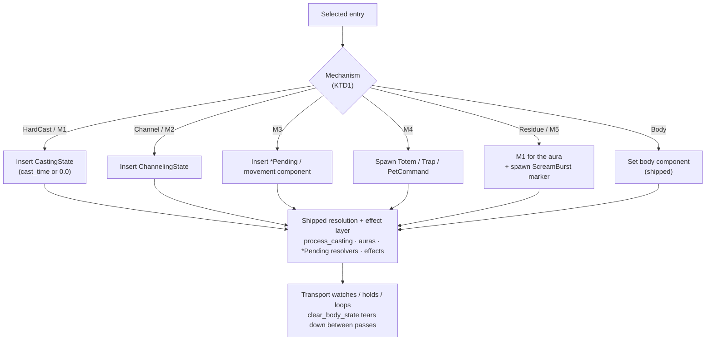

# feat: Instant-ability preview in the Animation Sandbox

## Goal Capsule

- **Objective:** Make every instant-cast ability (and the channels) playable in the Animation Sandbox, completing the coverage Phase A shipped for the 14 hard casts — **without touching simulation code.**
- **Product authority:** The parent plan's Product Contract (`docs/plans/2026-08-09-001-feat-animation-sandbox-plan.md`) and its **2026-08-15 Refresh amendment**, which this plan operationalizes. This is the amendment's reframed Phase B (U8′/U8a–e/U9′), carved into a focused implementation-ready plan.
- **Product Contract preservation:** unchanged. No R/AE IDs are altered; this plan enriches the parent's Phase B into implementation units. The carried-forward requirement subset appears under Product Contract below.
- **Execution profile:** Standard, seven units, concentrated in the sandbox module. No unit edits `class_ai/` or `combat_core/`; work lands in `src/states/animation_sandbox/` plus graphical-only registration in `StatesPlugin` (`src/states/mod.rs`) and a staged Hunter pet. Headless byte-identity therefore holds by construction; `determinism_pin` is a guard, not a risk. **Caveat (KTD6):** two effect families (the Charge/Disengage dash and pet-command dispatch + pet pursuit) are normally driven by AI-decision-gated systems that do **not** run in the sandbox, so they get small sandbox-owned drivers rather than relying on the shipped resolver.
- **Key premise (from the amendment):** an instant's *visual* is produced by a system the sandbox can already reach — `process_casting` (via a zero-duration `CastingState`), an aura/`*Pending` resolver (via a component insert), or an entity-driven effect (via a spawn) — so the balance-sensitive `apply_ability` seam the parent's original U8 feared is not required.
- **Open blockers:** None.

---

## Product Contract

Carried forward from the origin plan; see it for full text. Relevant IDs this plan advances:

- **R4** — Every ability the game defines is a playable entry, across all classes.
- **R16** — An entry plays through the same path a match uses, so its appearance cannot drift from its in-match appearance.
- **R17** — Abilities whose visuals depend on sustained state (an aura, an active cast/channel) play correctly, not only one-shot bursts.
- **R18** — Abilities whose visuals depend on a second unit play correctly when the dummy is on.
- **R19** — The dummy survives anything played at it; an entry can be replayed without resetting the scene.
- **R20** — The sandbox changes no simulation output; headless results stay byte-identical.

Acceptance examples this plan finally satisfies (the origin misfiled the first two under Phase A):

- **AE1** — Priest, dummy on, play Power Word: Shield → the shield bubble appears on the dummy and persists. *(PW:Shield is instant; unmet until this plan.)*
- **AE2** — Warlock, dummy on, play Drain Life → the beam connects and its particles travel for the channel's duration. *(Drain Life is a channel; unmet until this plan.)*
- **AE3** — Dummy off, play a relational ability → the sandbox makes the dependency evident rather than playing a silently incomplete visual.
- **AE5** — Replay a damaging ability many times → it plays identically; the dummy never dies.

---

## Planning Contract

### Key Technical Decisions

- **KTD1. Family is classified by application *mechanism*, not `cast_time`.** The shipped classifier (`entries_for_class`, `playback.rs:144`) is `cast_time > 0 ? HardCast : Instant`. That mislabels **channels** (Drain Life: `cast_time 0`, `channel_duration: Some`) and **CastingState-routed "instants"** (Shaman Frost Shock: `cast_time 0` but inserts a `CastingState` at `shaman.rs:330`) as un-playable instants. The keystone unit replaces the test with a per-ability mechanism tag that drives the start path. (session-settled: user-directed — instantiates the amendment's classifier-fix finding.)

- **KTD2. A small set of graphical-only trigger mechanisms covers the 56 instants (plus the one-ability residue in KTD3); no `class_ai/` or `combat_core/` changes.** (session-settled: user-approved — chosen over the parent's original `apply_ability` seam extraction across 8 class-AI files, which the amendment showed is unnecessary for *visual* fidelity and is "the most balance-sensitive code in the repo.")
  - **M1 — synthetic zero-duration `CastingState`** for single-target damage/aura/projectile instants. Faithful by R16's own standard: `process_casting` applies `def.applies_aura` via the *same* `AuraPending::from_ability(target, caster, def)` the inline paths use (verified `casting.rs:667`), plus damage/FCT/projectile-spawn/`CastEnding`. Same path the hard casts already use.
  - **M2 — `ChannelingState` insert** for channels (`ChannelingState` shape at `warlock.rs:819`).
  - **M3 — driving-component insert** for bespoke `*Pending` / movement instants, exactly like the shipped `DeathSink`/`VictoryBounce` body entries.
  - **M4 — entity spawn** for drops (totems, traps) and pet-command dispatch.

- **KTD3. The "residue" is a single ability.** A caster-centered cosmetic spawned by the inline AI path and *not* keyed on an aura is the only thing M1 cannot reproduce. Verification narrowed this to **Psychic Scream** alone: its `ScreamBurst` is spawned inline (`priest.rs:371`) and rendered on `Added<ScreamBurst>` (`rendering/effects/scream.rs:22`), so M1 (which applies the fear aura) will not trigger it. **Frost Nova reclassifies to M1** — it has no caster cosmetic (only a speech bubble, which is disabled match-chrome, plus the per-target root aura and damage). So the residue unit spawns one marker for one ability.

- **KTD4. Drift risk is bounded and accepted.** The original seam's sole advantage was single-source-of-truth. M1 routes through the real resolver (drift-free); M2/M3/M4 use a component/entity as the contract — the same bet the shipped body entries already make. Given the user wants full coverage and the seam is balance-sensitive, this is the deliberate trade. The seam remains available as a higher-fidelity, higher-cost future option if drift ever bites.

- **KTD5. Aura-applying entries need a general post-application hold and a target rule.** The shipped code special-cases `POLYMORPH_HOLD_SECS`/`FEAR_HOLD_SECS` in `entry_duration` because a CC's subject only exists *after* the cast resolves. M1 generalizes this: any aura-applying entry needs a watchable hold after application, and a **target-selection rule** — offensive/relational entries aim at the dummy, self/friendly buffs aim at the caster (applying a buff to the enemy dummy would misrepresent it). This subsumes the two hard-coded holds.

- **KTD6. Two effect families need sandbox-owned drivers, because their real drivers are AI-decision-gated *off* in the sandbox.** The sandbox runs combat *resolution* but not the AI-*decision* layer. Two systems sit on the decision gate — `move_to_target` (drives the `ChargingState`/`DisengagingState` dash transforms *and* pet pursuit) and `pet_ai_system` (the only consumer of `PetCommand`) — both registered `.run_if(decide)` where the graphical `decide = in_state(PlayMatch)` (`src/states/play_match/systems.rs`; documented in `docs/solutions/implementation-patterns/animation-sandbox-cc-entry-gotchas.md`). So Charge/Disengage (U4) and pet-command dispatch + pet pursuit (U5) would produce **nothing** if a unit only inserted the component. Each gets a small **sandbox-owned driver**, registered graphical-only in `StatesPlugin` exactly like the existing body-animation systems, that advances the dash transform / dispatches the queued `PetCommand` / walks the pet — reproducing only the trivial motion, never balance logic. This keeps `class_ai/` and `combat_core/` untouched and headless byte-identical (R20). *Rejected alternative:* widening `move_to_target`/`pet_ai_system` to `in_combat_scene` — it reuses the real logic but risks the decide-gated mover fighting `position_caster` for a targetless sandbox caster, and it edits simulation-system registration. The M3 `*Pending` resolvers (`process_divine_shield`, `process_berserker_rage`, `process_dispels`, `process_holy_shock_*`) are *not* decide-gated (Phase 1 core chain, `systems.rs:203`), so they run in the sandbox unchanged — this caveat is scoped to the two movement/pet families only.

### High-Level Technical Design

Entry → family classification → per-mechanism start path. Everything downstream of the start is the shipped resolution/effect layer, unchanged.

The "shipped resolution + effect layer" is not uniformly available in the sandbox: aura / casting / channeling / damage / `*Pending` / totem / trap resolvers run in both scenes, but the AI-decision-gated systems (`move_to_target`, `pet_ai_system`) run only in a real match — so the Charge/Disengage and pet-command paths route through **sandbox-owned drivers** instead (KTD6), not the shipped mover.

The seven units below map to the amendment's IDs: U1=U8′, U2=U8a, U3=U8b, U4=U8c, U5=U8d, U6=U8e, U7=U9′.

---

## Implementation Units

All units touch `src/states/animation_sandbox/playback.rs` unless noted, plus tests. `clear_body_state` (the between-pass teardown) and `entry_duration` (the pass length) are extended incrementally across units; each unit owns the teardown for the state it introduces.

### U1. Classify entries by application mechanism

- **Goal:** Every ability is tagged with how it starts, replacing the `cast_time`-only test. This is the keystone every later unit routes on.
- **Requirements:** R4; enables R17 for channels/instants. (amendment: U8′; KTD1)
- **Dependencies:** none
- **Files:** `src/states/animation_sandbox/playback.rs`, `tests/animation_sandbox_boot.rs`
- **Approach:** Replace the `EntryFamily` derivation in `entries_for_class` with a per-ability mechanism tag: `HardCast`, `Channel` (M2), `InstantCast` (M1), `InstantComponent` (M3), `InstantEntity` (M4), `InstantResidue` (M5), `Body`, or `Unsupported` (unimplemented abilities — Wind Shear, Earth Shock). Derive the tag from the ability's config (`channel_duration.is_some()` → Channel; projectile/`applies_aura`/damage single-target → InstantCast; the enumerated `*Pending`/movement set → InstantComponent; totems/traps/pet-commands → InstantEntity; Psychic Scream → InstantResidue) plus a small explicit table for the mechanism cases that config alone can't distinguish (e.g. Frost Shock routes HardCast-style even at `cast_time 0`). Keep the table in one place, commented with the mechanism rationale, so it's the single source the panel and `start_entry` both read.
- **Patterns to follow:** the existing `EntryFamily` enum and `is_playable()` in `playback.rs`.
- **Test scenarios:**
  - Drain Life classifies as `Channel`, not `InstantCast` (regression on the `cast_time`-only bug).
  - Shaman Frost Shock classifies as `HardCast`-style (playable), not an un-playable instant.
  - A self-buff instant (Ice Barrier), an offensive aura instant (Corruption), a totem, a trap, and Psychic Scream each classify into their expected mechanism.
  - Every `AbilityType` variant maps to exactly one tag; the only `Unsupported` variant is Wind Shear (defined as data in `abilities.ron` but with no AI application code). `Covers AE?` — no direct AE.
- **Verification:** `cargo test` green; the entry list reports the expected mechanism for a sampled ability per class.

### U2. Channel playback (M2)

- **Goal:** Channels play by inserting a `ChannelingState`, mirroring the hard-cast branch. Unlocks Drain Life / **AE2**.
- **Requirements:** R17, R18, AE2 (amendment: U8a)
- **Dependencies:** U1
- **Files:** `src/states/animation_sandbox/playback.rs`, `tests/animation_sandbox_boot.rs`
- **Approach:** Add a `Channel` arm to `start_entry` that inserts `ChannelingState` on the caster, targeting the dummy (falling back to self only if no dummy — but Drain Life is relational, so U7 disables it dummy-off). Read `channel_duration`/`channel_tick_interval` from the ability config, mirroring `warlock.rs:816`. `entry_duration` returns the channel duration (+ loop tail). `clear_body_state` already removes `ChannelingState` (`playback.rs:431`) — confirm it covers the sandbox-inserted one.
- **Test scenarios:**
  - Covers AE2. Selecting Drain Life inserts a `ChannelingState` on the caster targeting the dummy; `entry_duration` equals the channel duration plus the loop tail.
  - Stopping the entry removes the `ChannelingState`; a second pass re-inserts a fresh one (no accumulation).
  - Played with the dummy off, the entry does not start a channel with a self target that reads as a beam-to-nowhere (deferred to U7's dummy-off gate; here just assert no panic).
- **Verification:** in the sandbox, Drain Life shows the beam connecting caster→dummy for the channel's duration and loops.

### U3. CastingState-routable instant playback (M1)

- **Goal:** Single-target damage/aura/projectile instants play via a zero-duration `CastingState`. This is the largest coverage unit and unlocks **AE1**.
- **Requirements:** R4, R16, R17, R18, R19, AE1, AE5 (amendment: U8b; KTD2-M1, KTD5)
- **Dependencies:** U1
- **Files:** `src/states/animation_sandbox/playback.rs`, `tests/animation_sandbox_playback.rs` (new)
- **Approach:** Add an `InstantCast` arm to `start_entry` that inserts `CastingState::new(ability, target, 0.0)` — the hard-cast branch generalized to a 0.0 duration. Implement the **target rule** (KTD5): offensive/relational instants target the dummy; self/friendly buffs (Ice Barrier, Mage/Frost/Molten Armor, Arcane Intellect, Fortitude, Paladin Aura, seals) target the caster. Determine buff-vs-offensive from the ability config (aura applied to an ally/self vs. an enemy) with a small explicit table for ambiguous cases, shared with U7's relational classification. Generalize the `entry_duration` hold: replace the `POLYMORPH_HOLD_SECS`/`FEAR_HOLD_SECS` special-cases with a single post-application hold applied to any aura-applying entry (hard cast or M1), so a CC/DoT/buff whose subject appears after resolution stays watchable.
- **Patterns to follow:** the existing `HardCast` branch of `start_entry` (`playback.rs:357`); `process_casting`'s completion path (`combat_core/casting.rs:667`) is what resolves the effect.
- **Test scenarios:**
  - Covers AE1. Selecting Power Word: Shield inserts a 0.0-duration `CastingState`; after one `process_casting` tick the dummy carries the absorb aura and the shield bubble is present. *(The observed-run harness or a direct system tick, as in `tests/polymorph_visual_probes.rs`, proves the aura state.)*
  - An offensive aura instant (Corruption / Mortal Strike / Cheap Shot) applies its aura to the **dummy**; a self/friendly buff (Ice Barrier / Arcane Intellect) applies its aura to the **caster**, not the dummy.
  - A projectile instant (Arcane Shot) spawns a `Projectile` via the shared path; the bolt travels and the dummy takes the effect on impact.
  - Covers AE5. Replaying a damaging instant N times never kills the dummy (existing `sustain_staged_units`) and produces identical state each pass; no aura accumulation across passes.
  - The generalized hold gives a Polymorph/Fear pass the same watchable window it has today (regression on the retired `*_HOLD_SECS` constants).
  - No match chrome surfaces: an instant that spawns a `PlayMatchEntity` speech bubble via the shared path leaves no bubble/HUD visible (those render systems are not registered in the sandbox), and the entity is reclaimed by `clear_body_state`'s leftover sweep between passes.
- **Verification:** in the sandbox, a self-buff shows its visual on the caster; an offensive instant shows its aura/impact on the dummy; both loop and hold long enough to read.

### U4. Component-insert instant playback (M3)

- **Goal:** Bespoke `*Pending` and movement instants play by inserting their driving component, like the body entries.
- **Requirements:** R4, R16, R17 (amendment: U8c; KTD2-M3)
- **Dependencies:** U1
- **Files:** `src/states/animation_sandbox/playback.rs`, `tests/animation_sandbox_playback.rs`
- **Approach:** Add an `InstantComponent` arm to `start_entry` that inserts the ability's driving component with the fields its resolver expects. Two sub-cases:
  - **`*Pending` components** (resolvers run in the sandbox — Phase 1 core chain, *not* decide-gated): `DivineShieldPending`, `HolyShockHealPending`, `HolyShockDamagePending` (carry the caster's `spell_power`/crit snapshot — populate from the caster's `Combatant`), `BerserkerRagePending`, `DispelPending` (Purge / Cleanse / Dispel Magic — needs a target with a dispellable aura; stage one on the dummy or accept an empty dispel). Their existing resolvers produce the visual; the sandbox only inserts the component.
  - **Movement components `ChargingState` / `DisengagingState`** (KTD6): their real driver `move_to_target` is decide-gated off in the sandbox, so inserting the component alone yields **no dash**. Add a small **sandbox-owned dash-advance system** (registered graphical-only in `StatesPlugin`, or fold into `position_caster`) that advances the dash transform for the pass, then returns the caster home. Do not rely on the shipped mover.
  - Extend `clear_body_state` to strip every one of these components plus any aura they produce between passes.
- **Patterns to follow:** the `DeathSink`/`VictoryBounce` body arms of `start_entry` (`playback.rs:375`); the resolver systems keyed on each `*Pending` (`process_divine_shield`, `process_holy_shock_*`, `process_dispels`); `position_caster` for the sandbox-owned transform writer.
- **Test scenarios:**
  - Selecting Divine Shield inserts `DivineShieldPending`; its resolver produces the bubble and the immunity aura; stopping strips both.
  - Holy Shock (damage) inserts `HolyShockDamagePending` carrying the caster's spell-power/crit snapshot (not zero/default).
  - Charge inserts `ChargingState` and the **sandbox-owned dash system** moves the caster (asserting the transform advances even though `move_to_target` is not registered in the sandbox); the caster returns home on the next pass.
  - Every M3 entry, replayed twice, leaves no residual component or aura after `clear_body_state` (no accumulation).
- **Verification:** each M3 ability shows its effect (bubble, holy flash, dash) and cleanly resets between passes; Charge visibly dashes with no AI-decision systems registered.

### U5. Entity-spawn instant playback (M4), incl. pet staging

- **Goal:** Drops (totems, traps) and pet-command dispatches play. Requires a staged pet for the pet-command abilities.
- **Requirements:** R4, R18 (amendment: U8d; KTD2-M4)
- **Dependencies:** U1
- **Files:** `src/states/animation_sandbox/playback.rs`, `src/states/animation_sandbox/mod.rs` (pet staging), `tests/animation_sandbox_playback.rs`
- **Approach:** Add an `InstantEntity` arm to `start_entry`:
  - **Totems** — spawn the `Totem` entity at the caster's feet (mirror `try_totem`, `shaman.rs`), tagged `PlayMatchEntity` so the existing leftover sweep in `clear_body_state` reclaims it.
  - **Traps** — spawn `Trap` / `TrapLaunchProjectile` at a ground position in front of the caster (mirror `try_place_trap_at`, `hunter.rs:459`); same `PlayMatchEntity` teardown.
  - **Pet commands** (Spider Web, Boar Charge, Master's Call) — issue a `PetCommand` on the staged pet, then drive it with a **sandbox-owned pet driver** (KTD6). Two decide-gated systems are off in the sandbox: `pet_ai_system` (the only `PetCommand` consumer) and `move_to_target` (pet pursuit), so an inserted `PetCommand` would never dispatch and the pet would never move. Stage the Hunter's pet in `setup_sandbox`/`stage_units` when the caster is a Hunter (reuse the match pet-spawn path, tagged `SandboxEntity`), and add a graphical-only sandbox system that executes the queued `PetCommand`'s headline effect and positions the pet (mirroring `position_caster` for the caster). Pet auto-attack works unchanged — `combat_auto_attack` is a resolution system, not decide-gated.
- **Patterns to follow:** `try_totem` / `try_place_trap_at` / `try_dispatch_spider_web`; `pet_ai_system` (`class_ai/pet_ai.rs`) for what the command dispatch does; the combatant spawn path already used in `stage_units`; `position_caster` for the sandbox transform writer.
- **Test scenarios:**
  - Selecting a totem spawns exactly one `Totem` at the caster; stopping the entry despawns it (leftover sweep); replay spawns a fresh one.
  - Selecting Freezing Trap spawns a `Trap` on the ground ahead of the caster; it is gone after `clear_body_state`.
  - With a Hunter caster, a pet is staged; selecting Spider Web queues a `PetCommand` on the pet and the sandbox-owned driver executes its effect (asserting dispatch happens even though `pet_ai_system` is not registered in the sandbox).
  - Staging the pet and registering the sandbox-owned drivers leaves headless output unaffected — the pet is a `SandboxEntity` spawned only in `setup_sandbox`, and the drivers register graphical-only in `StatesPlugin`. `Covers R20` (guard).
- **Verification:** totems and traps appear and clear; the Hunter's pet is visible and its commanded abilities play with no AI-decision systems registered.

### U6. Residue: Psychic Scream caster cosmetic (M5)

- **Goal:** Psychic Scream — the one instant whose caster-centered cosmetic M1 can't reproduce — plays fully.
- **Requirements:** R4, R17 (amendment: U8e; KTD3)
- **Dependencies:** U3
- **Files:** `src/states/animation_sandbox/playback.rs`, `tests/animation_sandbox_playback.rs`
- **Approach:** Start Psychic Scream via M1 (the fear aura routes through `CastingState`/`process_casting` onto the dummy), and additionally spawn a `ScreamBurst` marker at the caster directly (the type lives in `components/visual.rs:298`; its visual fires on `Added<ScreamBurst>`). Extend `position_caster`'s Fear-family flee case to cover the scream'd dummy if the fear treatment needs the victim to move. `clear_body_state`'s leftover sweep reclaims the burst.
- **Test scenarios:**
  - Selecting Psychic Scream applies the fear aura to the dummy AND spawns a `ScreamBurst` at the caster (both present within the pass).
  - The `ScreamBurst` is gone after `clear_body_state`; replay spawns a fresh one.
- **Verification:** the scream shows both the caster burst and the fleeing/feared dummy, looped.

### U7. Registry unlock and dummy-off signalling

- **Goal:** All abilities are playable; a relational entry with the dummy off is legible rather than silently empty.
- **Requirements:** R4, R17, R18, AE3 (amendment: U9′)
- **Dependencies:** U2, U3, U4, U5, U6
- **Files:** `src/states/animation_sandbox/playback.rs`, `src/states/animation_sandbox/ui.rs`, `tests/animation_sandbox_boot.rs`
- **Approach:** Drop the not-yet-playable marking and the "Instant abilities are not playable yet" heading/tooltip from the panel (`ui.rs:469`). Mark entries the registry knows are **relational** (projectile, beam/channel, or an aura applied to an enemy) and disable them when the dummy is off, showing the reason on the entry — reuse the target-rule classification from U3. The `Unsupported` entry (Wind Shear — defined in `abilities.ron` but with no AI application code) stays listed and disabled with a "not yet implemented" reason so coverage stays honest. Leave self/buff entries playable dummy-off.
- **Patterns to follow:** the current disabled-row rendering in `ui.rs`.
- **Test scenarios:**
  - Covers AE3. A relational entry (Drain Life, Frostbolt, Corruption) with the dummy off is disabled and states why; a self-buff (Ice Barrier) stays enabled dummy-off.
  - With the dummy on, every playable ability across all classes starts without panicking (a boot-level loop over the registry).
  - `Unsupported` entries are listed but disabled with the implementation reason; no entry is left in the retired "not playable yet" state.
- **Verification:** the panel shows no "instant not playable" section; every ability plays with the dummy on; relational entries grey out with a reason when the dummy is off.

---

## Verification Contract

| Gate | Command | Applies to | Done signal |
|---|---|---|---|
| Byte-identity guard | `cargo test --test determinism_pin` | all units | Passes unchanged (no sim code touched) |
| Registration audit | `cargo test --test registration_audit` | U5 (pet staging) | Passes; no new unregistered systems |
| Sandbox boot | `cargo test --test animation_sandbox_boot` | U1, U2, U7 | Green |
| Playback unit tests | `cargo test --test animation_sandbox_playback` | U3, U4, U5, U6 | Green |
| Full suite | `cargo test` | all units | Green |
| Manual look | `cargo run --release` → Animation Sandbox | U2–U7 | Each ability plays, holds, loops, and resets |

---

## Definition of Done

- The classifier tags every ability by mechanism; Drain Life and Frost Shock are no longer mis-flagged as un-playable (U1).
- Every ability in `assets/config/abilities.ron` except the unimplemented Wind Shear plays on demand in the sandbox with the dummy on, under loop / pause / step / slow motion and all camera presets.
- AE1 (PW:Shield bubble), AE2 (Drain Life beam), AE3 (dummy-off signalling), and AE5 (replay without reset) all hold.
- No simulation file changes; `determinism_pin` and `registration_audit` pass; headless output is byte-identical to `main` (R20).
- No HUD, team frame, combat log, speech bubble, AI, or match clock is active in the sandbox.
- The panel no longer shows an "instants not playable yet" section.

---

## Scope Boundaries

### Deferred to Follow-Up Work

- The single-source-of-truth `apply_ability` seam (the parent's original U8). Only worth extracting if M3/M4 drift ever bites (KTD4).
- Implementing Wind Shear (Shaman) so it becomes previewable — it is defined as data but has no AI application code, a class-AI gap rather than a sandbox gap.

### Out of scope

- Any change to combat resolution, class AI, or balance.
- The deferred sandbox features already listed in the parent plan (contact-sheet gallery, `--preview` CLI flag, frame capture, snapshot regression baselines, in-sandbox parameter tuning).

---

## Sources & Research

- Origin plan + its 2026-08-15 Refresh amendment: `docs/plans/2026-08-09-001-feat-animation-sandbox-plan.md`.
- Per-class instant inventory (all 8 `class_ai/*.rs` files) and mechanism taxonomy, captured in the amendment's inventory table.
- Load-bearing verifications: `combat_core/casting.rs:667` (generic aura application), `rendering/effects/scream.rs:22` + `priest.rs:371` (ScreamBurst is inline, not aura-keyed), `components/combatant.rs` + `pets.rs` (M3 component definitions), Frost Nova has no caster cosmetic.
- Sandbox internals: `src/states/animation_sandbox/{mod,playback,ui}.rs`; solution docs `docs/solutions/implementation-patterns/animation-sandbox-cc-entry-gotchas.md` and `signature-ability-animation-procedure.md`.
