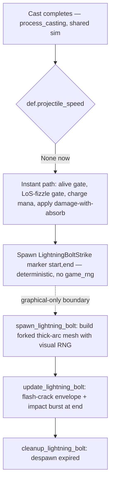

# Lightning Bolt Signature Animation - Plan

## Goal Capsule

- **Objective:** Make Shaman Lightning Bolt read as actual lightning — convert it from a slow traveling projectile into an instant strike, paired with a signature "thick nuke arc" flash-crack animation from caster to target.
- **Product authority:** dwalker.
- **Execution profile:** Standard software change. One shared-sim data edit, one sim/visual seam, one graphical-only effect module, plus a balance-validation sweep gate.
- **Open blockers:** None. One deferred choice (cast-time telegraph) is out of scope for v1; the balance change ships gated on the validation sweep in the Verification Contract.
- **Product Contract preservation:** Product Contract unchanged — planning enriched this artifact in place without altering any R-ID, Acceptance Example, or scope boundary.

---

## Product Contract

### Summary

Lightning Bolt becomes an instant-strike ability: when the 2.0s cast completes, damage lands immediately (Immolate-style, no projectile in flight). A new signature animation fires in the same instant — a thick, saturated, high-bloom forked bolt that snaps caster→target with a strong impact flash. Removing travel time is an accepted balance change, shipped only after a sweep confirms it moves the Shaman by a minor amount.

### Problem Frame

Lightning Bolt today is the same glowing sphere as Frostbolt and Shadowbolt — a `radius 0.3` ball tinted pale blue — that drifts across the arena at 40 units/sec after the cast, with no special impact effect. Nothing about its shape or motion says "electricity": it's a generic projectile with a blue coat of paint. For a class whose identity is elemental lightning, the marquee nuke should be the visual signature that Polymorph and Fear now are for their casters — and a slow-moving orb is the opposite of what lightning feels like.

### Key Decisions

- **Instant application over a traveling projectile** (session-settled: user-directed — chosen over keeping the projectile and only reskinning the visual: real lightning is instant, a synced flash-crack demands the damage land with the flash, and the removed in-flight dodge window is an accepted, expected-minor balance change).
- **"Thick nuke arc" visual style** (session-settled: user-directed — chosen via a visual probe over a clean single bolt, a plain forked bolt, and a twin-crackle strand: the heavier, saturated, high-bloom arc reads clearly at arena distance and carries the most impact).
- **Balance change validated, not assumed** (session-settled: user-approved — chosen over shipping the reliability buff unmeasured: the shift is expected minor, but the change ships gated on a sweep that confirms it).
- **Animation stays graphical-only** — it follows the established signature-animation pattern (Polymorph, Fear) and draws no sim RNG; only the delivery-mechanic change (R1) alters shared-sim outcomes (U2's marker spawn in `casting.rs` is byte-neutral).

### Requirements

**Delivery mechanic (shared sim)**

- R1. Lightning Bolt resolves instantly at cast completion instead of spawning a traveling projectile — the damage applies the moment the 2.0s cast finishes, subject to the existing alive and line-of-sight completion gates, with no in-flight travel phase.
- R2. Cast time (2.0s), range, damage, spell school (Nature), and mana cost stay unchanged; only the delivery method changes.
- R3. Mana is charged at the instant-effect application site on cast completion (consistent with the existing rule — cost is paid when the cast lands; a completion-time alive/LoS fizzle costs nothing).

**Signature animation (graphical-only)**

- R4. On cast completion, a signature lightning animation fires: a forked bolt snapping caster→target in the "thick nuke arc" style — heavier, saturated, high bloom.
- R5. The bolt renders as an instant flash-crack — it appears at full length spanning caster to target, flashes bright, then decays quickly; the flash and the damage fire together.
- R6. A strong impact flash/burst plays at the target on strike.
- R7. The bolt geometry regenerates each cast so no two strikes look identical (procedural jag plus branches). Exact branch/fork count and final color are in-engine tuning knobs, not fixed here.
- R8. The animation is graphical-only: it runs in the graphical client, draws no sim RNG, and is not registered in the headless systems path, so headless outcomes depend only on the mechanic change, not the visual.

### Acceptance Examples

- AE1. Covers R1, R3, R5. **Given** a Shaman finishes a Lightning Bolt cast with the target alive and in line of sight, **then** damage and mana cost both apply at that instant and the flash-crack plays simultaneously — no delayed hit.
- AE2. Covers R1. **Given** the target breaks line of sight (steps behind a pillar) *during* the 2.0s cast, **then** the cast fizzles at completion — no damage, no mana charged — exactly as a fizzled cast does today.
- AE3. Covers R1. **Given** the target is in line of sight at cast completion, **then** the damage lands immediately; there is no longer an in-flight window in which the target can dodge the bolt after the cast finishes. This is the behavioral difference from the old projectile.

### Success Criteria

- A post-change balance sweep shows the Shaman win-rate shift from removing in-flight counterplay is within noise / not significant. A significant shift is a signal to revisit the mechanic change, not to ship it unexamined.
- Headless match results for non-Shaman matchups remain byte-identical (the visual change touches no shared sim; only Shaman matches change, and only via R1).

### Scope Boundaries

- No change to Lightning Bolt's cast time, range, damage, school, or mana — delivery only.
- No audio: the "crack" is visual only (there is no audio system to hook).
- Lightning Bolt only — not Chain Lightning, Frost Shock, or other Shaman abilities.

#### Deferred to Follow-Up Work

- Cast-time telegraph — a crackle/charge-up building on the caster during the 2.0s cast before the strike. Strike-only for v1; the telegraph is an easy follow-up.
- Numeric rebalancing of Lightning Bolt — this work only *validates* the delivery change; a follow-up tune is separate work if the sweep shows a significant shift.

---

## Planning Contract

### Key Technical Decisions

- KTD1. Convert by data, not code: set `projectile_speed: None` on the RON entry. The completion loop in `src/states/play_match/combat_core/casting.rs` already branches on `def.projectile_speed` — `Some(_)` spawns a projectile (`casting.rs:327`), `None` falls through to the instant-effect path (`casting.rs:370+`) that runs the alive gate, the LoS-fizzle gate, charges mana at completion, and applies damage-with-absorb. No routing code changes. (session-settled: user-directed — chosen over keeping the projectile and reskinning the visual: instant delivery is the point; see R1. Feasibility confirmed by reading the instant path — it preserves the exact fizzle/mana semantics R3 requires.)
- KTD2. Visual geometry randomness must use a graphical-only RNG (a local `StdRng`/`thread_rng`), never the sim `game_rng`. Immolate's particle loop (`casting.rs:520+`) draws `game_rng` in the shared path; Lightning Bolt must **not** copy that — the bolt's jag/branch randomness lives in the graphical effect system so the sim RNG stream depends only on the mechanic change, keeping non-Shaman matches byte-identical (R8).
- KTD3. "Thick nuke arc" visual style — heavier core, saturated color, high bloom, strong impact burst (session-settled: user-directed — chosen via visual probe over clean/forked/twin-crackle; see R4).
- KTD4. Sim→visual seam is a deterministic marker component (`LightningBoltStrike { start, end }`) spawned in the shared damage block, mirroring how MindBlast spawns `SpellImpactEffect` (`casting.rs:506`) — but with no RNG draw, so the spawn is byte-neutral. `end` snapshots the target position at completion (the strike is instant, so the endpoint is fixed).
- KTD5. Keep the `projectile_visuals` field on the RON entry even though no projectile spawns: `cast_color()` (`src/states/play_match/ability_config.rs:550`) reads it to tint the in-hand cast orb during the 2.0s cast, so keeping it preserves the blue cast-orb look; add a code comment noting the field now only colors the cast orb.
- KTD6. Balance validated via a paired before/after sweep, not assumed (session-settled: user-approved — chosen over shipping unmeasured; see Success Criteria).

### High-Level Technical Design

The load-bearing design point is the boundary between the shared sim (must stay byte-identical except for the intended mechanic change) and the graphical-only visual (all randomness and rendering).

### Assumptions

- The instant path's existing dead-target and LoS behavior (`casting.rs:374-403`) is the desired fizzle semantics for Lightning Bolt — confirmed by reading the code, not assumed blindly.
- Final bolt color and branch count are tunable consts in the effect module, not pinned by this plan (R7).

---

## Implementation Units

### U1. Convert Lightning Bolt to instant application

- **Goal:** Remove the projectile so damage resolves at cast completion (R1, R2, R3).
- **Requirements:** R1, R2, R3; KTD1.
- **Dependencies:** none.
- **Files:** `assets/config/abilities.ron` (LightningBolt entry, lines ~1135-1152).
- **Approach:** Set `projectile_speed: None`. Keep `projectile_visuals` (KTD5) with a comment that it now only tints the cast orb. Leave cast time, range, damage fields, and `spell_school: Nature` unchanged. No Rust changes — the `None` branch at `casting.rs:370+` handles instant damage, gates, and mana. This is the only shared-sim change that alters outcomes; U2 also edits `casting.rs` to spawn a byte-neutral marker (no RNG draw), which changes no results.
- **Patterns to follow:** MindBlast (`abilities.ron:122`) — an instant, cast-timed, SpellPower direct-damage ability with no `projectile_speed`.
- **Test scenarios:**
  - Covers AE1. Headless Shaman-vs-target match: a completed Lightning Bolt cast applies damage at completion with **no** `Projectile` entity created for it.
  - Covers AE2. Target breaks LoS during the cast → cast fizzles at completion: no damage, no mana deducted.
  - Covers AE3. Target in LoS at completion → damage lands immediately; no post-cast in-flight window.
  - `cargo test` ability validation/config load passes with the edited entry.
- **Verification:** A headless Shaman match log shows Lightning Bolt damage events at cast-completion timestamps with no projectile-travel delay.

### U2. LightningBoltStrike marker and spawn trigger

- **Goal:** Deterministic sim→visual seam that fires the animation at the strike (R4 trigger, R8).
- **Requirements:** R4, R8; KTD2, KTD4.
- **Dependencies:** U1.
- **Files:** `src/states/play_match/components/visual.rs` (new `LightningBoltStrike { start: Vec3, end: Vec3 }` marker); `src/states/play_match/combat_core/casting.rs` (spawn in the `is_damage()` block).
- **Approach:** Add the marker component next to `SpellImpactEffect` (`visual.rs:31`). In the damage block, add `if ability == AbilityType::LightningBolt { commands.spawn((LightningBoltStrike { start: caster_pos, end: target_pos }, PlayMatchEntity)); }` alongside the existing MindBlast/Immolate spawns (`casting.rs:506-546`). Draw **no** `game_rng` here (contrast Immolate) — the spawn must be byte-neutral so only U1 changes sim behavior.
- **Patterns to follow:** MindBlast `SpellImpactEffect` spawn (`casting.rs:506-517`) — a bespoke per-ability visual marker with no RNG draw.
- **Test scenarios:**
  - Covers R8. Headless matches with **no** Shaman are byte-identical to pre-change (the marker only spawns for Lightning Bolt casts).
  - Headless Shaman match: a `LightningBoltStrike` entity is spawned per completed (landed) Lightning Bolt cast, and not on a fizzle.
- **Verification:** Non-Shaman headless outcomes at fixed seeds are unchanged pre/post this unit.

### U3. Lightning bolt visual effect module (thick nuke arc)

- **Goal:** Render the instant forked flash-crack with impact burst (R4, R5, R6, R7).
- **Requirements:** R4, R5, R6, R7; KTD2, KTD3.
- **Dependencies:** U2.
- **Files:** `src/states/play_match/rendering/effects/lightning_bolt.rs` (new spawn/update/cleanup trio); `src/states/play_match/rendering/effects/mod.rs` (`mod lightning_bolt; pub use lightning_bolt::*;`).
- **Approach:** Follow the established 3-system trio (`spell_impact.rs`). `spawn`: on `Added<LightningBoltStrike>`, generate a jagged forked polyline from `start` to `end` via midpoint displacement plus a few branches, using a graphical-only RNG (KTD2), and build the mesh in the "thick nuke arc" style — thick bright core plus a wider saturated glow pass, `AlphaMode::Add`, high emissive. `update`: drive a flash-crack envelope (bright hold ~2-3 frames, then quick decay over ~0.25-0.3s) fading emissive/alpha; spawn a strong impact burst at `end` — a bespoke bright white-blue burst. Do **not** reuse `SpellImpactEffect` as-is: it has no per-instance color and `spawn_spell_impact_visuals` hardcodes a purple/shadow base_color shared with MindBlast, so reuse would render a purple lightning burst. `cleanup`: despawn expired. Geometry regenerates every strike (R7). Branch count, color, thickness, and lifetime are named consts for in-engine tuning.
- **Patterns to follow:** `rendering/effects/spell_impact.rs` (trio shape, `Added<>` spawn, lifetime fade); `fear.rs` / `polymorph.rs` for multi-element signature effects. Memory conventions: `AlphaMode::Add`, `Res<Time>`, `try_insert`, shape-named components.
- **Test scenarios:** `Test expectation: none` — graphical-only, no behavioral change. Verified via the animation sandbox / graphical smoke (see Verification Contract), not unit tests.
- **Verification:** In the graphical client (or animation sandbox), a Shaman Lightning Bolt shows an instant forked thick-arc flash-crack with an impact burst, varying per cast, no traveling orb.

### U4. Register the visual systems (graphical-only)

- **Goal:** Wire the trio into graphical mode only, keeping headless byte-identical (R8).
- **Requirements:** R8; KTD2.
- **Dependencies:** U3.
- **Files:** `src/states/mod.rs` (visual-effect `.add_systems()` block, ~lines 364-409).
- **Approach:** Register `spawn_lightning_bolt` / `update_lightning_bolt` / `cleanup_lightning_bolt` in `StatesPlugin::build()` only (NOT `systems.rs`), gated `in_state(PlayMatch)` and ordered `.after(CombatSystemPhase::CombatResolution)` like the other visual effects. Add the three systems as a nested sub-tuple (like the existing fear sub-effects) — the `states/mod.rs` visual block is at Bevy's 20-item `.add_systems` tuple limit, so appending them flat will not compile. Register the `LightningBoltStrike` component if the project registers components. Do not add these to `add_core_combat_systems`.
- **Patterns to follow:** the existing spell_impact / polymorph / fear registration block in `states/mod.rs`; the dual-registration rule in `CLAUDE.md`.
- **Test scenarios:**
  - `tests/registration_audit.rs` passes (systems registered in the graphical path, not orphaned).
  - `cargo test` green.
- **Verification:** `cargo test` passes; the effect renders in graphical mode and never runs in headless.

### U5. Balance validation sweep

- **Goal:** Confirm the instant-delivery buff moves the Shaman by a minor amount (Success Criteria).
- **Requirements:** Success Criteria; KTD6.
- **Dependencies:** U1 (mechanic must be in place).
- **Files:** none (measurement; optionally record the CSV under `design-docs/balance/`).
- **Approach:** Run a paired before/after win-rate sweep on Shaman comps against a few representative opponents (include at least one melee trainer and one caster) at ~100 matches/cell, using the `balance-sweep` skill or `scripts/headtohead_sweep.py` with Wilson CIs / z-test. Compare Shaman win rate with the old projectile build vs the instant build. **Execution note:** this is a measurement gate, not code — report the delta and CI. Pass = shift within noise; a significant positive shift is flagged for a follow-up numeric tune (deferred), not silently shipped.
- **Test scenarios:** `Test expectation: none` — this unit *is* the measurement.
- **Verification:** A sweep result (delta + confidence interval) is recorded; the shift is within noise or the significant-shift flag is raised.

---

## Verification Contract

| Gate | Command / method | Applies to | Done signal |
|---|---|---|---|
| Build + unit/config tests | `cargo test` | U1, U2, U4 | Green, incl. `registration_audit` and ability/config validation |
| Headless non-Shaman byte-identity | Run fixed-seed headless matches with no Shaman, pre/post | U1, U2 | Match results bit-identical to pre-change |
| Instant-delivery behavior | Headless Shaman match + `--trace-mode on`; inspect Lightning Bolt casts | U1 | Damage at cast completion, no projectile; LoS-break-during-cast fizzles with no mana |
| Signature visual | Graphical client or animation sandbox | U3 | Instant forked thick-arc flash-crack + impact burst, varies per cast, no orb |
| Balance sweep | `balance-sweep` skill / `scripts/headtohead_sweep.py` (~100/cell) | U5 | Shaman shift within noise, or significant-shift flagged |

## Definition of Done

- Lightning Bolt is instant (no projectile); damage, mana, and fizzle semantics are preserved (R1-R3, AE1-AE3).
- The signature thick-arc flash-crack with impact burst renders, geometry varies per cast, and it is graphical-only (R4-R8).
- `cargo test` is green and the registration audit is satisfied.
- Non-Shaman headless matches are byte-identical at fixed seeds.
- The balance sweep has run and the Shaman shift is within noise (or a significant shift is explicitly flagged for follow-up).

---

## Sources & Research

- `assets/config/abilities.ron:1135` — LightningBolt entry (the `projectile_speed`/`projectile_visuals` fields U1 edits); `abilities.ron:122` MindBlast is the instant direct-damage template.
- `src/states/play_match/combat_core/casting.rs:327` — projectile-vs-instant branch on `def.projectile_speed`; `casting.rs:370-411` instant path (alive gate, LoS fizzle, mana-at-completion); `casting.rs:506-546` per-ability impact-visual spawns (MindBlast/Immolate) — the seam U2 extends.
- `src/states/play_match/ability_config.rs:550` — `cast_color()` reads `projectile_visuals` for the cast orb (KTD5).
- `src/states/play_match/rendering/effects/spell_impact.rs` — the spawn/update/cleanup trio pattern for U3; `rendering/effects/mod.rs` module registry; `fear.rs` / `polymorph.rs` prior signature effects.
- `src/states/mod.rs:364-409` — graphical-only visual-system registration block (U4); `tests/registration_audit.rs` enforces dual-registration.
- `scripts/headtohead_sweep.py`, `tests/camp_sweep.rs`, and the `balance-sweep` skill — paired win-rate measurement for U5.
